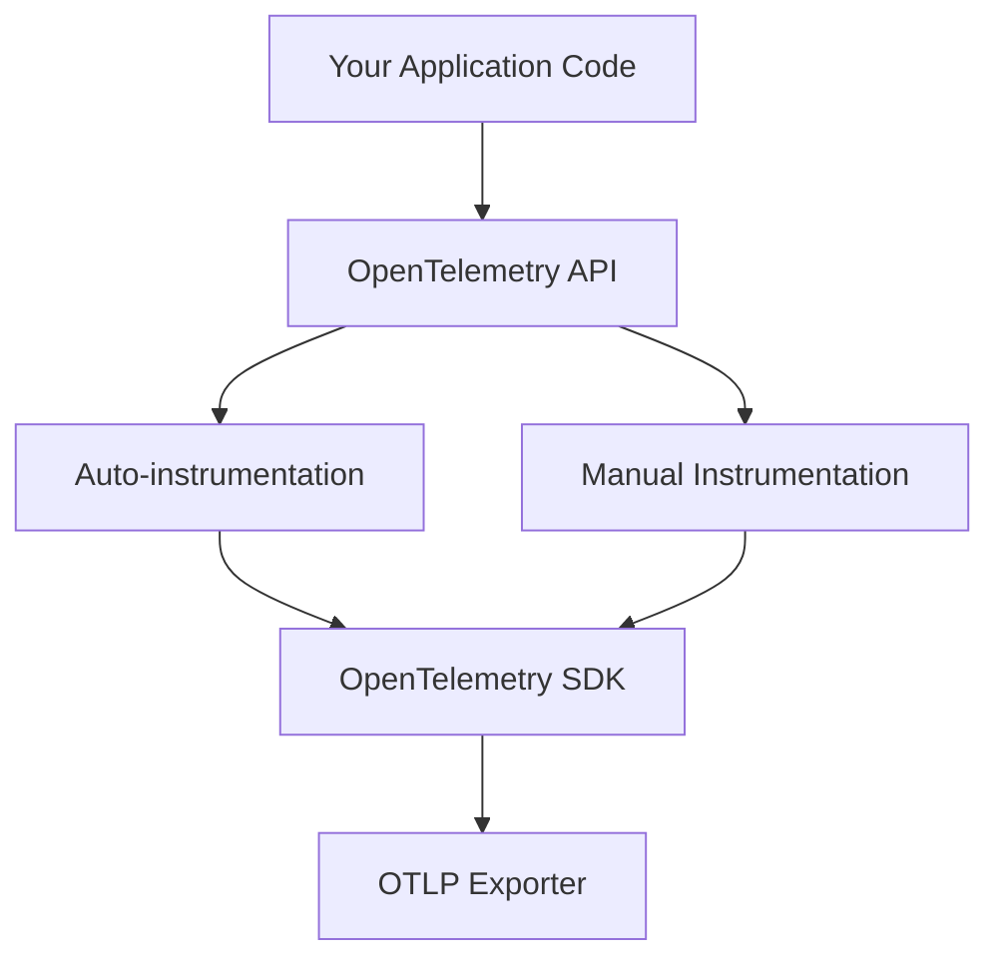

# How to Add Custom Spans and Attributes in Spring Boot with the OpenTelemetry API

Author: [nawazdhandala](https://www.github.com/nawazdhandala)

Tags: OpenTelemetry, Spring Boot, Custom Spans, Attributes, Java API

Description: Master the OpenTelemetry API to create custom spans and add attributes for detailed observability in Spring Boot applications.

While auto-instrumentation captures standard operations, custom spans and attributes provide the business context that makes traces truly valuable. This guide covers the OpenTelemetry API for manual instrumentation in Spring Boot applications.

## Understanding the Instrumentation Layers

OpenTelemetry provides two layers of instrumentation:



Auto-instrumentation handles framework-level operations, while manual instrumentation adds application-specific context.

## Dependencies Setup

Add the OpenTelemetry API to your `pom.xml`:

```xml
<dependencies>
    <!-- OpenTelemetry API for manual instrumentation -->
    <dependency>
        <groupId>io.opentelemetry</groupId>
        <artifactId>opentelemetry-api</artifactId>
        <version>1.33.0</version>
    </dependency>

    <!-- OpenTelemetry SDK (usually added via Java agent or starter) -->
    <dependency>
        <groupId>io.opentelemetry</groupId>
        <artifactId>opentelemetry-sdk</artifactId>
        <version>1.33.0</version>
    </dependency>

    <!-- Semantic conventions for standard attribute names -->
    <dependency>
        <groupId>io.opentelemetry.semconv</groupId>
        <artifactId>opentelemetry-semconv</artifactId>
        <version>1.23.1-alpha</version>
    </dependency>

    <!-- Spring Boot starter -->
    <dependency>
        <groupId>org.springframework.boot</groupId>
        <artifactId>spring-boot-starter-web</artifactId>
    </dependency>
</dependencies>
```

## Basic Span Creation

Access the `Tracer` instance to create spans:

```java
package com.example.service;

import io.opentelemetry.api.OpenTelemetry;
import io.opentelemetry.api.trace.Span;
import io.opentelemetry.api.trace.Tracer;
import io.opentelemetry.context.Context;
import io.opentelemetry.context.Scope;
import org.springframework.stereotype.Service;

@Service
public class OrderService {

    private final Tracer tracer;

    /**
     * Inject OpenTelemetry instance to get a tracer.
     * The tracer is scoped to this service's instrumentation library.
     */
    public OrderService(OpenTelemetry openTelemetry) {
        this.tracer = openTelemetry.getTracer(
            "com.example.service",  // Instrumentation library name
            "1.0.0"                  // Version
        );
    }

    /**
     * Creates a custom span for order processing.
     * The span is automatically linked to the current trace context.
     */
    public void processOrder(String orderId, String customerId) {
        // Create a new span
        Span span = tracer.spanBuilder("process_order")
            .startSpan();

        // Make the span current for this execution context
        try (Scope scope = span.makeCurrent()) {
            // Add attributes to provide context
            span.setAttribute("order.id", orderId);
            span.setAttribute("customer.id", customerId);

            // Your business logic here
            validateOrder(orderId);
            calculateTotal(orderId);
            confirmOrder(orderId);

        } catch (Exception e) {
            // Record exceptions on the span
            span.recordException(e);
            span.setStatus(io.opentelemetry.api.trace.StatusCode.ERROR,
                "Order processing failed");
            throw e;
        } finally {
            // Always end the span
            span.end();
        }
    }

    private void validateOrder(String orderId) {
        // Implementation
    }

    private void calculateTotal(String orderId) {
        // Implementation
    }

    private void confirmOrder(String orderId) {
        // Implementation
    }
}
```

## Adding Rich Attributes

Use semantic conventions and custom attributes to add meaningful context:

```java
package com.example.service;

import io.opentelemetry.api.common.AttributeKey;
import io.opentelemetry.api.common.Attributes;
import io.opentelemetry.api.trace.Span;
import io.opentelemetry.api.trace.Tracer;
import io.opentelemetry.context.Scope;
import io.opentelemetry.semconv.SemanticAttributes;
import org.springframework.stereotype.Service;

@Service
public class PaymentService {

    private final Tracer tracer;

    // Define custom attribute keys
    private static final AttributeKey<String> PAYMENT_METHOD =
        AttributeKey.stringKey("payment.method");
    private static final AttributeKey<Double> PAYMENT_AMOUNT =
        AttributeKey.doubleKey("payment.amount");
    private static final AttributeKey<String> CURRENCY =
        AttributeKey.stringKey("payment.currency");
    private static final AttributeKey<Boolean> FRAUD_CHECK_PASSED =
        AttributeKey.booleanKey("payment.fraud_check.passed");

    public PaymentService(io.opentelemetry.api.OpenTelemetry openTelemetry) {
        this.tracer = openTelemetry.getTracer("com.example.payment", "1.0.0");
    }

    public PaymentResult processPayment(PaymentRequest request) {
        Span span = tracer.spanBuilder("process_payment")
            .setSpanKind(io.opentelemetry.api.trace.SpanKind.INTERNAL)
            .startSpan();

        try (Scope scope = span.makeCurrent()) {
            // Add business-specific attributes
            span.setAttribute(PAYMENT_METHOD, request.getMethod());
            span.setAttribute(PAYMENT_AMOUNT, request.getAmount());
            span.setAttribute(CURRENCY, request.getCurrency());

            // Use semantic conventions for standard attributes
            span.setAttribute(SemanticAttributes.ENDUSER_ID,
                request.getCustomerId());

            // Add multiple attributes at once
            span.setAllAttributes(Attributes.builder()
                .put("payment.processor", "stripe")
                .put("payment.retry_count", 0)
                .put("payment.idempotency_key", request.getIdempotencyKey())
                .build()
            );

            // Run fraud check
            boolean fraudCheck = performFraudCheck(request);
            span.setAttribute(FRAUD_CHECK_PASSED, fraudCheck);

            if (!fraudCheck) {
                span.addEvent("fraud_detected", Attributes.builder()
                    .put("fraud.score", 0.95)
                    .put("fraud.reason", "unusual_location")
                    .build()
                );
                throw new FraudException("Fraud detected");
            }

            // Process payment
            PaymentResult result = chargePayment(request);

            // Add result attributes
            span.setAttribute("payment.transaction_id", result.getTransactionId());
            span.setAttribute("payment.status", result.getStatus().toString());

            return result;

        } catch (Exception e) {
            span.recordException(e);
            span.setStatus(io.opentelemetry.api.trace.StatusCode.ERROR);
            throw e;
        } finally {
            span.end();
        }
    }

    private boolean performFraudCheck(PaymentRequest request) {
        // Fraud detection logic
        return true;
    }

    private PaymentResult chargePayment(PaymentRequest request) {
        // Payment processing logic
        return new PaymentResult("txn_123", PaymentStatus.COMPLETED);
    }
}
```

## Nested Spans for Complex Operations

Create child spans to represent sub-operations:

```java
package com.example.service;

import io.opentelemetry.api.trace.Span;
import io.opentelemetry.api.trace.Tracer;
import io.opentelemetry.context.Context;
import io.opentelemetry.context.Scope;
import org.springframework.stereotype.Service;

import java.util.List;

@Service
public class InventoryService {

    private final Tracer tracer;

    public InventoryService(io.opentelemetry.api.OpenTelemetry openTelemetry) {
        this.tracer = openTelemetry.getTracer("com.example.inventory", "1.0.0");
    }

    /**
     * Parent operation that spawns multiple child spans.
     */
    public void reserveItems(String orderId, List<String> itemIds) {
        Span parentSpan = tracer.spanBuilder("reserve_items")
            .startSpan();

        try (Scope scope = parentSpan.makeCurrent()) {
            parentSpan.setAttribute("order.id", orderId);
            parentSpan.setAttribute("items.count", itemIds.size());

            // Child spans are automatically linked to the parent
            for (String itemId : itemIds) {
                reserveSingleItem(itemId, orderId);
            }

            parentSpan.addEvent("all_items_reserved");

        } finally {
            parentSpan.end();
        }
    }

    /**
     * Creates a child span for each item reservation.
     */
    private void reserveSingleItem(String itemId, String orderId) {
        // Child span is created within the parent's context
        Span childSpan = tracer.spanBuilder("reserve_item")
            .startSpan();

        try (Scope scope = childSpan.makeCurrent()) {
            childSpan.setAttribute("item.id", itemId);
            childSpan.setAttribute("order.id", orderId);

            // Simulate database operation
            checkAvailability(itemId);
            updateInventory(itemId);

        } finally {
            childSpan.end();
        }
    }

    /**
     * Creates an even deeper nested span.
     */
    private void checkAvailability(String itemId) {
        Span span = tracer.spanBuilder("check_availability")
            .setSpanKind(io.opentelemetry.api.trace.SpanKind.CLIENT)
            .startSpan();

        try (Scope scope = span.makeCurrent()) {
            span.setAttribute("item.id", itemId);

            // Database query
            int available = queryDatabase(itemId);
            span.setAttribute("item.available_quantity", available);

            if (available == 0) {
                span.addEvent("item_out_of_stock");
            }

        } finally {
            span.end();
        }
    }

    private void updateInventory(String itemId) {
        // Update logic
    }

    private int queryDatabase(String itemId) {
        return 10;
    }
}
```

## Adding Events to Spans

Events represent point-in-time occurrences within a span:

```java
package com.example.service;

import io.opentelemetry.api.common.Attributes;
import io.opentelemetry.api.trace.Span;
import io.opentelemetry.api.trace.Tracer;
import io.opentelemetry.context.Scope;
import org.springframework.stereotype.Service;

import java.time.Instant;
import java.util.concurrent.TimeUnit;

@Service
public class ShippingService {

    private final Tracer tracer;

    public ShippingService(io.opentelemetry.api.OpenTelemetry openTelemetry) {
        this.tracer = openTelemetry.getTracer("com.example.shipping", "1.0.0");
    }

    public void shipOrder(String orderId) {
        Span span = tracer.spanBuilder("ship_order")
            .startSpan();

        try (Scope scope = span.makeCurrent()) {
            span.setAttribute("order.id", orderId);

            // Add event when order is picked
            span.addEvent("order_picked", Attributes.builder()
                .put("warehouse.id", "WH-001")
                .put("picker.id", "EMP-123")
                .build()
            );

            Thread.sleep(100); // Simulate packing

            // Add event when order is packed
            span.addEvent("order_packed", Attributes.builder()
                .put("box.size", "medium")
                .put("weight.kg", 2.5)
                .build()
            );

            Thread.sleep(50); // Simulate label printing

            // Add event with explicit timestamp
            span.addEvent("shipping_label_printed",
                Attributes.builder()
                    .put("tracking.number", "TRK-" + orderId)
                    .put("carrier", "FedEx")
                    .build(),
                Instant.now().toEpochMilli(),
                TimeUnit.MILLISECONDS
            );

            // Add event when handed to carrier
            span.addEvent("handed_to_carrier");

            span.setStatus(io.opentelemetry.api.trace.StatusCode.OK);

        } catch (InterruptedException e) {
            Thread.currentThread().interrupt();
            span.recordException(e);
            span.setStatus(io.opentelemetry.api.trace.StatusCode.ERROR);
        } finally {
            span.end();
        }
    }
}
```

## Working with Current Span

Access and modify the current span without passing it explicitly:

```java
package com.example.controller;

import io.opentelemetry.api.trace.Span;
import io.opentelemetry.api.trace.StatusCode;
import org.springframework.web.bind.annotation.*;

@RestController
@RequestMapping("/api/products")
public class ProductController {

    private final ProductService productService;

    public ProductController(ProductService productService) {
        this.productService = productService;
    }

    @GetMapping("/{id}")
    public Product getProduct(@PathVariable String id) {
        // Get the current span (auto-instrumented by Spring Boot)
        Span currentSpan = Span.current();

        // Add custom attributes to the auto-instrumented span
        currentSpan.setAttribute("product.id", id);
        currentSpan.setAttribute("endpoint", "get_product");

        try {
            Product product = productService.findById(id);

            // Add attributes based on the result
            currentSpan.setAttribute("product.category", product.getCategory());
            currentSpan.setAttribute("product.in_stock", product.isInStock());

            return product;

        } catch (ProductNotFoundException e) {
            currentSpan.setStatus(StatusCode.ERROR, "Product not found");
            currentSpan.recordException(e);
            throw e;
        }
    }

    @PostMapping
    public Product createProduct(@RequestBody Product product) {
        Span currentSpan = Span.current();
        currentSpan.setAttribute("operation", "create_product");
        currentSpan.setAttribute("product.name", product.getName());

        // Add event for significant actions
        currentSpan.addEvent("validating_product_data");

        Product created = productService.create(product);

        currentSpan.addEvent("product_created");
        currentSpan.setAttribute("product.id", created.getId());

        return created;
    }
}
```

## Span Links for Async Operations

Link spans when operations are related but not in a parent-child relationship:

```java
package com.example.service;

import io.opentelemetry.api.trace.Span;
import io.opentelemetry.api.trace.SpanContext;
import io.opentelemetry.api.trace.Tracer;
import io.opentelemetry.context.Context;
import io.opentelemetry.context.Scope;
import org.springframework.scheduling.annotation.Async;
import org.springframework.stereotype.Service;

import java.util.concurrent.CompletableFuture;

@Service
public class NotificationService {

    private final Tracer tracer;

    public NotificationService(io.opentelemetry.api.OpenTelemetry openTelemetry) {
        this.tracer = openTelemetry.getTracer("com.example.notification", "1.0.0");
    }

    /**
     * Async operation that links back to the original span.
     */
    @Async
    public CompletableFuture<Void> sendNotificationAsync(
        String userId,
        String message,
        SpanContext originatingSpanContext
    ) {
        // Create a new span linked to the originating operation
        Span span = tracer.spanBuilder("send_notification_async")
            .addLink(originatingSpanContext)
            .startSpan();

        try (Scope scope = span.makeCurrent()) {
            span.setAttribute("user.id", userId);
            span.setAttribute("notification.type", "email");

            // Send notification
            Thread.sleep(200); // Simulate email sending

            span.addEvent("notification_sent");
            span.setStatus(io.opentelemetry.api.trace.StatusCode.OK);

            return CompletableFuture.completedFuture(null);

        } catch (Exception e) {
            span.recordException(e);
            span.setStatus(io.opentelemetry.api.trace.StatusCode.ERROR);
            return CompletableFuture.failedFuture(e);
        } finally {
            span.end();
        }
    }

    /**
     * Caller that triggers async notification.
     */
    public void notifyUser(String userId, String message) {
        Span span = tracer.spanBuilder("notify_user")
            .startSpan();

        try (Scope scope = span.makeCurrent()) {
            span.setAttribute("user.id", userId);

            // Capture current span context to link async operation
            SpanContext spanContext = span.getSpanContext();

            // Trigger async notification
            sendNotificationAsync(userId, message, spanContext);

            span.addEvent("async_notification_triggered");

        } finally {
            span.end();
        }
    }
}
```

## Best Practices for Custom Instrumentation

**Span Granularity:** Create spans for operations that take more than a few milliseconds and represent meaningful business or technical operations.

**Attribute Naming:** Use semantic conventions when available (see OpenTelemetry spec) and follow a consistent naming scheme for custom attributes.

**Error Handling:** Always record exceptions and set error status on spans when operations fail.

**Span Lifecycle:** Use try-with-resources or try-finally to ensure spans are ended, even when exceptions occur.

**Performance:** Span creation is lightweight, but avoid creating spans in tight loops or for trivial operations.

**Context Propagation:** The OpenTelemetry API automatically propagates context when using `makeCurrent()`, ensuring proper parent-child relationships.

Custom spans and attributes transform generic traces into rich narratives that tell the complete story of your application's behavior, making debugging and performance analysis significantly more effective.
