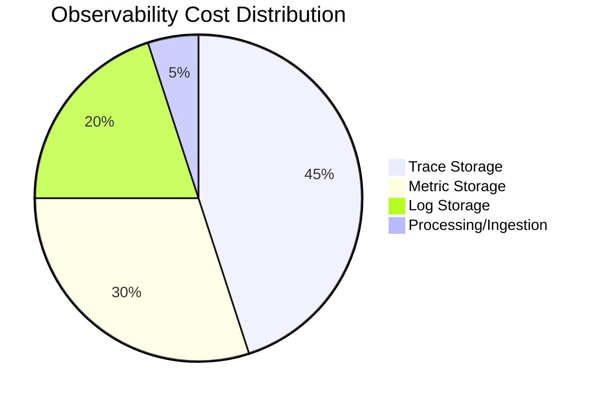

# How to Cut Observability Costs by 40% with OpenTelemetry Filtering and Sampling

Author: [nawazdhandala](https://www.github.com/nawazdhandala)

Tags: OpenTelemetry, Cost Optimization, Filtering, Sampling, Performance

Description: Reduce observability costs by 40% or more using OpenTelemetry's filtering and sampling capabilities. Learn practical configurations for traces, metrics, and logs with real-world examples.

Observability costs can quickly spiral out of control as your system scales. A typical production deployment generates millions of spans, metrics, and log entries daily, most of which provide little value. The key to cost-effective observability is intelligently filtering and sampling your telemetry data before it reaches expensive storage backends.

OpenTelemetry provides powerful filtering and sampling mechanisms that can reduce data volume by 40-70% while maintaining observability for critical issues. This guide shows you exactly how to implement these cost-saving strategies.

## Understanding the Cost Problem

Most observability costs follow this breakdown:



The problem is not the volume itself, but the lack of differentiation. Not all telemetry data is equally valuable:

- Health check requests provide little value but generate 30-50% of traces
- Debug-level logs rarely get queried but consume significant storage
- Metrics from internal services are less critical than customer-facing services
- Successful requests are less interesting than errors

Filtering and sampling allow you to keep the signal and drop the noise.

## Strategy 1: Trace Filtering at the Collector

The OpenTelemetry Collector's filter processor drops entire spans based on attributes, reducing ingestion volume immediately.

```yaml
# Collector configuration for trace filtering
receivers:
  otlp:
    protocols:
      grpc:
        endpoint: 0.0.0.0:4317
      http:
        endpoint: 0.0.0.0:4318

processors:
  # Filter processor to drop low-value traces
  filter/drop_health_checks:
    error_mode: ignore
    traces:
      span:
        # Drop health check endpoints
        - 'attributes["http.route"] == "/health"'
        - 'attributes["http.route"] == "/healthz"'
        - 'attributes["http.route"] == "/ready"'
        - 'attributes["http.route"] == "/alive"'
        - 'attributes["http.route"] == "/ping"'

  # Filter internal monitoring traffic
  filter/drop_internal:
    traces:
      span:
        - 'attributes["service.name"] == "prometheus"'
        - 'attributes["service.name"] == "grafana"'
        - 'attributes["http.user_agent"] matches ".*prometheus.*"'
        - 'attributes["http.user_agent"] matches ".*pingdom.*"'

  # Filter by status code (keep errors, sample success)
  filter/errors_only:
    traces:
      span:
        # Drop successful requests (2xx, 3xx status codes)
        # These will be sampled separately at lower rate
        - 'attributes["http.status_code"] >= 200 and attributes["http.status_code"] < 400'

  batch:
    timeout: 10s
    send_batch_size: 1024

exporters:
  otlp:
    endpoint: backend:4317

service:
  pipelines:
    traces:
      receivers: [otlp]
      processors: [filter/drop_health_checks, filter/drop_internal, batch]
      exporters: [otlp]
```

This configuration typically reduces trace volume by 30-40% by dropping low-value traffic.

## Strategy 2: Multi-Tier Sampling

Instead of applying a single sampling rate, use multiple tiers based on trace importance. This keeps all errors while aggressively sampling routine traffic.

```yaml
# Advanced multi-tier sampling configuration
processors:
  # Tail sampling makes intelligent decisions based on complete traces
  tail_sampling:
    # How long to wait for a complete trace before making decision
    decision_wait: 10s

    # Number of traces to keep in memory while waiting
    num_traces: 100000

    # Expected number of new traces per second
    expected_new_traces_per_sec: 1000

    # Sampling policies in order of evaluation
    policies:
      # Policy 1: Always keep errors (100% sampling)
      - name: errors-always
        type: status_code
        status_code:
          status_codes:
            - ERROR
            - UNSET  # Unset often indicates errors

      # Policy 2: Always keep slow requests (100% sampling)
      - name: slow-traces
        type: latency
        latency:
          threshold_ms: 1000  # Keep all requests over 1 second

      # Policy 3: Always keep specific services (100% sampling)
      - name: critical-services
        type: string_attribute
        string_attribute:
          key: service.name
          values:
            - payment-service
            - authentication-service
            - checkout-service

      # Policy 4: Sample by trace ID for consistent sampling
      # Keep 10% of remaining traces
      - name: probabilistic-sample
        type: probabilistic
        probabilistic:
          sampling_percentage: 10

      # Policy 5: Rate limiting - maximum traces per second
      - name: rate-limit
        type: rate_limiting
        rate_limiting:
          spans_per_second: 500

service:
  pipelines:
    traces:
      receivers: [otlp]
      processors: [tail_sampling, batch]
      exporters: [otlp]
```

This multi-tier approach ensures you never miss critical issues while dramatically reducing volume for routine operations.

## Strategy 3: Head Sampling at the SDK

Head sampling makes decisions early, before spans are even created. This is more efficient but less sophisticated than tail sampling.

```python
# Python SDK configuration with head sampling
from opentelemetry import trace
from opentelemetry.sdk.trace import TracerProvider
from opentelemetry.sdk.trace.sampling import (
    ParentBasedTraceIdRatioBased,
    TraceIdRatioBased,
    StaticSampler,
    Decision,
)
from opentelemetry.sdk.trace.export import BatchSpanProcessor
from opentelemetry.exporter.otlp.proto.grpc.trace_exporter import OTLPSpanExporter

# Custom sampler that combines multiple strategies
class CustomSampler(StaticSampler):
    def __init__(self, default_sampling_rate=0.1):
        self.default_sampling_rate = default_sampling_rate
        self.error_sampler = StaticSampler(Decision.RECORD_AND_SAMPLE)
        self.default_sampler = TraceIdRatioBased(default_sampling_rate)

    def should_sample(self, parent_context, trace_id, name, kind, attributes, links, trace_state):
        # Always sample errors
        if attributes and attributes.get("error"):
            return self.error_sampler.should_sample(
                parent_context, trace_id, name, kind, attributes, links, trace_state
            )

        # Always sample critical endpoints
        route = attributes.get("http.route", "") if attributes else ""
        if route in ["/api/payment", "/api/checkout", "/api/auth"]:
            return self.error_sampler.should_sample(
                parent_context, trace_id, name, kind, attributes, links, trace_state
            )

        # Drop health checks entirely
        if route in ["/health", "/healthz", "/ready", "/ping"]:
            return StaticSampler(Decision.DROP).should_sample(
                parent_context, trace_id, name, kind, attributes, links, trace_state
            )

        # Use default sampling for everything else
        return self.default_sampler.should_sample(
            parent_context, trace_id, name, kind, attributes, links, trace_state
        )

# Initialize tracer provider with custom sampler
provider = TracerProvider(
    sampler=ParentBasedTraceIdRatioBased(
        root=CustomSampler(default_sampling_rate=0.1)
    )
)

# Add span processor
provider.add_span_processor(
    BatchSpanProcessor(OTLPSpanExporter())
)

trace.set_tracer_provider(provider)
```

This SDK-level sampling prevents unnecessary span creation, reducing CPU and memory overhead.

## Strategy 4: Metric Filtering

Metrics can be filtered based on name patterns, attributes, or values:

```yaml
# Collector configuration for metric filtering
processors:
  # Filter metrics by name
  filter/drop_metrics:
    metrics:
      # Drop metrics matching these patterns
      exclude:
        match_type: regexp
        metric_names:
          # Drop internal runtime metrics
          - runtime\..*
          # Drop detailed GC metrics
          - jvm\.gc\..*\.time
          # Drop process metrics
          - process\..*

      # Alternative: include only specific metrics
      include:
        match_type: strict
        metric_names:
          - http.server.request.duration
          - http.server.request.count
          - db.client.operation.duration
          - redis.client.operation.duration

  # Filter metrics by attribute values
  filter/drop_by_attributes:
    metrics:
      datapoint:
        # Drop metrics from test environments
        - 'resource.attributes["deployment.environment"] == "test"'
        # Drop metrics from internal services
        - 'resource.attributes["service.name"] matches ".*-internal"'

  # Transform processor to remove high-cardinality attributes
  transform/reduce_cardinality:
    metric_statements:
      - context: datapoint
        statements:
          # Remove user-specific identifiers
          - delete_key(attributes, "user.id")
          - delete_key(attributes, "session.id")
          - delete_key(attributes, "request.id")

service:
  pipelines:
    metrics:
      receivers: [otlp]
      processors: [filter/drop_metrics, filter/drop_by_attributes, transform/reduce_cardinality, batch]
      exporters: [otlp]
```

## Strategy 5: Log Filtering

Logs often consume the most storage and provide the least value. Filter aggressively:

```yaml
# Collector configuration for log filtering
processors:
  # Filter logs by severity
  filter/drop_debug_logs:
    logs:
      # Only keep warning and above in production
      log_record:
        - 'severity_number < SEVERITY_NUMBER_WARN'

  # Filter logs by content
  filter/drop_noisy_logs:
    logs:
      log_record:
        # Drop health check logs
        - 'body matches ".*health.*check.*"'
        # Drop successful authentication logs
        - 'body matches ".*auth.*success.*"'
        # Drop routine database connection logs
        - 'body matches ".*connection.*pool.*"'

  # Filter logs by source
  filter/drop_by_source:
    logs:
      log_record:
        # Drop logs from internal monitoring
        - 'resource.attributes["service.name"] == "prometheus"'
        # Drop logs from specific components
        - 'attributes["component"] == "health_checker"'

  # Sampling for high-volume logs
  probabilistic_sampler:
    # Keep only 10% of remaining logs
    sampling_percentage: 10
    # Hash on trace_id to maintain trace consistency
    hash_seed: 22

service:
  pipelines:
    logs:
      receivers: [otlp]
      processors: [filter/drop_debug_logs, filter/drop_noisy_logs, filter/drop_by_source, probabilistic_sampler, batch]
      exporters: [otlp]
```

## Strategy 6: Combined Multi-Pipeline Approach

The most effective approach uses multiple pipelines with different filtering rules:

```yaml
# Advanced multi-pipeline configuration
receivers:
  otlp:
    protocols:
      grpc:
        endpoint: 0.0.0.0:4317

processors:
  # Batch processor for all pipelines
  batch:
    timeout: 10s
    send_batch_size: 1024

  # Processors for high-priority data (no filtering)
  tail_sampling/critical:
    decision_wait: 10s
    num_traces: 50000
    policies:
      - name: errors
        type: status_code
        status_code:
          status_codes: [ERROR]
      - name: critical-services
        type: string_attribute
        string_attribute:
          key: service.name
          values: [payment-service, auth-service]

  # Processors for normal priority data (moderate filtering)
  tail_sampling/normal:
    decision_wait: 5s
    num_traces: 50000
    policies:
      - name: sample-10-percent
        type: probabilistic
        probabilistic:
          sampling_percentage: 10

  # Processors for low priority data (aggressive filtering)
  tail_sampling/low:
    decision_wait: 5s
    num_traces: 50000
    policies:
      - name: sample-1-percent
        type: probabilistic
        probabilistic:
          sampling_percentage: 1

  # Router to split traffic
  routing:
    from_attribute: priority
    table:
      - value: critical
        exporters: [otlp/critical]
      - value: normal
        exporters: [otlp/normal]
      - value: low
        exporters: [otlp/low]

exporters:
  otlp/critical:
    endpoint: backend:4317
  otlp/normal:
    endpoint: backend:4317
  otlp/low:
    endpoint: backend:4317

service:
  pipelines:
    # Critical data pipeline (no sampling)
    traces/critical:
      receivers: [otlp]
      processors: [tail_sampling/critical, batch]
      exporters: [otlp/critical]

    # Normal data pipeline (10% sampling)
    traces/normal:
      receivers: [otlp]
      processors: [tail_sampling/normal, batch]
      exporters: [otlp/normal]

    # Low priority pipeline (1% sampling)
    traces/low:
      receivers: [otlp]
      processors: [tail_sampling/low, batch]
      exporters: [otlp/low]
```

## Real-World Case Study: E-Commerce Platform

An e-commerce company implemented filtering and sampling to reduce costs by 43%:

**Before Optimization**:
- 100M spans/day
- 500M metric data points/day
- 2TB logs/day
- $25,000/month observability cost

**After Optimization**:
- 35M spans/day (65% reduction)
- 200M metric data points/day (60% reduction)
- 800GB logs/day (60% reduction)
- $14,250/month observability cost (43% savings)

Their configuration:

```yaml
# Production configuration
processors:
  # Drop health checks (30% of traffic)
  filter/health:
    traces:
      span:
        - 'attributes["http.route"] matches "/(health|ready|alive)"'

  # Tail sampling with multiple tiers
  tail_sampling:
    decision_wait: 10s
    num_traces: 100000
    expected_new_traces_per_sec: 2000
    policies:
      # Tier 1: Always keep errors and slow requests (5% of traffic)
      - name: errors
        type: status_code
        status_code:
          status_codes: [ERROR]
      - name: slow
        type: latency
        latency:
          threshold_ms: 2000

      # Tier 2: Keep 50% of checkout flow (critical business path)
      - name: checkout
        type: and
        and:
          and_sub_policy:
            - type: string_attribute
              string_attribute:
                key: service.name
                values: [checkout-service, payment-service]
            - type: probabilistic
              probabilistic:
                sampling_percentage: 50

      # Tier 3: Keep 5% of remaining traffic
      - name: baseline
        type: probabilistic
        probabilistic:
          sampling_percentage: 5

  # Metric filtering
  filter/metrics:
    metrics:
      datapoint:
        - 'resource.attributes["deployment.environment"] == "staging"'
        - 'attributes["http.route"] matches "/(health|ready)"'

  # Log filtering
  filter/logs:
    logs:
      log_record:
        - 'severity_number < SEVERITY_NUMBER_INFO'
        - 'body matches ".*health.*check.*"'

  batch:
    timeout: 10s
    send_batch_size: 2048

service:
  pipelines:
    traces:
      receivers: [otlp]
      processors: [filter/health, tail_sampling, batch]
      exporters: [otlp]

    metrics:
      receivers: [otlp]
      processors: [filter/metrics, batch]
      exporters: [otlp]

    logs:
      receivers: [otlp]
      processors: [filter/logs, batch]
      exporters: [otlp]
```

## Monitoring Your Savings

Track the effectiveness of your filtering and sampling:

```yaml
# Add metrics to monitor data reduction
processors:
  # Count spans before filtering
  spanmetrics/before:
    metrics_exporter: prometheus
    dimensions:
      - name: service.name

  filter/your_filter:
    # ... your filter config

  # Count spans after filtering
  spanmetrics/after:
    metrics_exporter: prometheus
    dimensions:
      - name: service.name

# Calculate reduction percentage
# reduction = (before - after) / before * 100

# Monitor these key metrics
# - otelcol_processor_dropped_spans
# - otelcol_processor_dropped_metric_points
# - otelcol_processor_dropped_log_records
# - otelcol_exporter_sent_spans (compare to received)
```

## Best Practices

1. **Start with head sampling** - Configure SDK sampling before implementing collector filtering
2. **Always keep errors** - Never filter or sample error traces/logs
3. **Test in staging first** - Validate you're not losing critical data
4. **Monitor sampling rates** - Track what percentage of data is being kept
5. **Document your filters** - Explain why each filter exists
6. **Review quarterly** - Re-evaluate filters as your system evolves
7. **Use tail sampling for critical systems** - It's more accurate but more resource-intensive

## Common Pitfalls to Avoid

1. **Over-aggressive sampling** - Don't drop below 1% for normal traffic
2. **Forgetting parent-based sampling** - Maintain trace consistency
3. **Not handling distributed traces** - Use consistent trace ID hashing
4. **Filtering too early** - Use tail sampling when you need to see complete traces
5. **Ignoring resource overhead** - Tail sampling uses significant memory

## Related Resources

For more cost optimization strategies:
- https://oneuptime.com/blog/post/handle-high-cardinality-metrics-opentelemetry/view
- https://oneuptime.com/blog/post/delta-temporality-manage-cardinality-explosions/view
- https://oneuptime.com/blog/post/probabilistic-sampling-opentelemetry-cost-control/view
- https://oneuptime.com/blog/post/reduce-telemetry-data-volume-span-suppression/view

Filtering and sampling are essential tools for cost-effective observability. By implementing these strategies, you can dramatically reduce your observability costs while maintaining visibility into critical issues. The key is to be intentional about what data you collect and intelligent about how you sample it.
