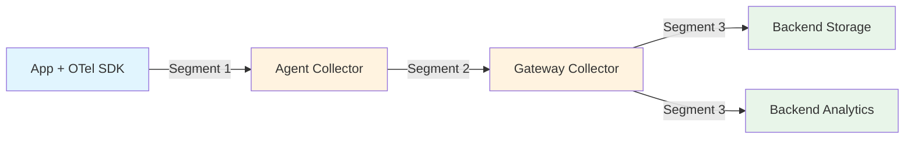
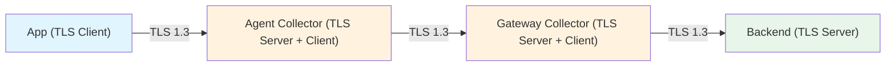

# How to Implement Data Encryption in Transit for OpenTelemetry Pipelines

Author: [nawazdhandala](https://www.github.com/nawazdhandala)

Tags: OpenTelemetry, Encryption, TLS, Security, Observability, Data Protection

Description: Learn how to encrypt telemetry data in transit across every segment of your OpenTelemetry pipeline, from SDK to collector to backend.

---

Telemetry data travels through multiple network hops before it reaches your dashboards. From the application SDK to the local collector agent, from the agent to a gateway collector, and from the gateway to the storage backend. Each hop is a potential interception point. If any of these connections transmit data in plaintext, an attacker with network access can read your traces, logs, and metrics. That means internal service architectures, database queries, error messages, and possibly user data are all exposed.

Encrypting data in transit with TLS is not optional for production deployments. This guide covers how to configure TLS at every segment of an OpenTelemetry pipeline.

## The Telemetry Data Path

Before configuring anything, let's map out where data flows and which connections need encryption.



Each arrow represents a network connection that must be encrypted:

- **Segment 1**: SDK to agent collector (usually on the same node, but still important)
- **Segment 2**: Agent collector to gateway collector (crosses network boundaries)
- **Segment 3**: Gateway collector to backend (often crosses cluster or cloud boundaries)

## Segment 1: SDK to Agent Collector

Most OpenTelemetry SDKs export data via OTLP over gRPC or HTTP. By default, many SDK configurations use plaintext. You need to explicitly enable TLS.

### Python SDK with TLS

The Python OTLP exporter accepts TLS configuration through environment variables or code.

```python
# Configure the Python OTel SDK to export traces over TLS
# The OTLP exporter will use the specified certificate to verify the collector
from opentelemetry import trace
from opentelemetry.sdk.trace import TracerProvider
from opentelemetry.sdk.trace.export import BatchSpanProcessor
from opentelemetry.exporter.otlp.proto.grpc.trace_exporter import OTLPSpanExporter

# Point to the collector's TLS endpoint and provide the CA certificate
# that signed the collector's server certificate
exporter = OTLPSpanExporter(
    endpoint="https://localhost:4317",
    credentials=None,  # Will use the certificate file below
    headers=None,
)

provider = TracerProvider()
provider.add_span_processor(BatchSpanProcessor(exporter))
trace.set_tracer_provider(provider)
```

You can also configure this entirely through environment variables, which is the preferred approach for containerized deployments.

```bash
# Environment variables for configuring TLS on the OTLP exporter
# Set these in your pod spec or docker-compose file
export OTEL_EXPORTER_OTLP_ENDPOINT="https://otel-agent:4317"
export OTEL_EXPORTER_OTLP_CERTIFICATE="/etc/ssl/certs/ca.crt"
export OTEL_EXPORTER_OTLP_PROTOCOL="grpc"
```

### Java SDK with TLS

For Java applications, set TLS properties through system properties or environment variables.

```bash
# Java system properties for TLS-enabled OTLP export
# Pass these as JVM arguments when starting your application
java -javaagent:opentelemetry-javaagent.jar \
  -Dotel.exporter.otlp.endpoint=https://otel-agent:4317 \
  -Dotel.exporter.otlp.certificate=/etc/ssl/certs/ca.crt \
  -jar myapp.jar
```

### Node.js SDK with TLS

Node.js requires you to load the certificate and pass it to the gRPC credentials.

```javascript
// Node.js OTLP exporter with TLS enabled
// Reads the CA certificate from disk and uses it to verify the collector
const { OTLPTraceExporter } = require("@opentelemetry/exporter-trace-otlp-grpc");
const grpc = require("@grpc/grpc-js");
const fs = require("fs");

// Load the CA certificate that signed the collector's server certificate
const caCert = fs.readFileSync("/etc/ssl/certs/ca.crt");

const exporter = new OTLPTraceExporter({
  url: "https://otel-agent:4317",
  credentials: grpc.credentials.createSsl(caCert),
});
```

## Segment 2: Agent Collector to Gateway Collector

This is the most critical segment to encrypt because it typically crosses network boundaries. The agent collector acts as a TLS client connecting to the gateway collector's TLS-enabled receiver.

Configure the agent collector's exporter with TLS.

```yaml
# Agent collector config: exports to gateway over TLS
# The agent verifies the gateway's certificate using the CA cert
receivers:
  otlp:
    protocols:
      grpc:
        endpoint: 0.0.0.0:4317

exporters:
  otlp/gateway:
    endpoint: otel-gateway.monitoring.svc.cluster.local:4317
    tls:
      # CA certificate to verify the gateway's server certificate
      ca_file: /etc/otel/certs/ca.crt
      # Do not skip verification in production
      insecure: false

processors:
  batch:
    timeout: 5s

service:
  pipelines:
    traces:
      receivers: [otlp]
      processors: [batch]
      exporters: [otlp/gateway]
    metrics:
      receivers: [otlp]
      processors: [batch]
      exporters: [otlp/gateway]
    logs:
      receivers: [otlp]
      processors: [batch]
      exporters: [otlp/gateway]
```

Configure the gateway collector's receiver to present a TLS certificate.

```yaml
# Gateway collector config: TLS-enabled receiver
# Presents its server certificate to connecting agent collectors
receivers:
  otlp:
    protocols:
      grpc:
        endpoint: 0.0.0.0:4317
        tls:
          # Server certificate and key for the gateway
          cert_file: /etc/otel/certs/server.crt
          key_file: /etc/otel/certs/server.key

      http:
        endpoint: 0.0.0.0:4318
        tls:
          cert_file: /etc/otel/certs/server.crt
          key_file: /etc/otel/certs/server.key

exporters:
  otlp/backend:
    endpoint: tempo.monitoring.svc.cluster.local:4317
    tls:
      ca_file: /etc/otel/certs/ca.crt

processors:
  batch:
    timeout: 10s
    send_batch_size: 2048

service:
  pipelines:
    traces:
      receivers: [otlp]
      processors: [batch]
      exporters: [otlp/backend]
```

## Segment 3: Gateway Collector to Backend

The gateway-to-backend segment often uses a different certificate chain, especially when the backend is a managed service. Many cloud observability backends provide their own TLS endpoints and expect you to use the system's default CA bundle.

### Exporting to a Managed Backend

For managed services like Grafana Cloud or similar hosted backends, the system's CA bundle usually covers their certificates.

```yaml
# Export to a managed backend using system CA certificates
# Most managed services use certificates from well-known CAs
exporters:
  otlp/managed:
    endpoint: otlp-gateway.your-provider.com:443
    tls:
      # Empty ca_file means use the system's default CA bundle
      insecure: false
    headers:
      # Authentication header required by the managed service
      Authorization: "Basic <base64-encoded-credentials>"
```

### Exporting to a Self-Hosted Backend

For self-hosted backends like Jaeger, Tempo, or ClickHouse, provide the specific CA certificate.

```yaml
# Export to a self-hosted Jaeger backend with TLS
exporters:
  otlp/jaeger:
    endpoint: jaeger.internal.company.com:4317
    tls:
      ca_file: /etc/otel/certs/internal-ca.crt
      # Optionally override the server name for certificate verification
      # Useful when the endpoint hostname differs from the certificate SAN
      server_name_override: jaeger.internal.company.com
```

## TLS Configuration for HTTP/Protobuf Transport

Not all deployments use gRPC. If your pipeline uses HTTP/protobuf transport, TLS configuration is similar but applied to HTTP endpoints.

```yaml
# Collector config for OTLP over HTTP with TLS
receivers:
  otlp:
    protocols:
      http:
        endpoint: 0.0.0.0:4318
        tls:
          cert_file: /etc/otel/certs/server.crt
          key_file: /etc/otel/certs/server.key

exporters:
  otlphttp/backend:
    endpoint: https://backend.monitoring.svc.cluster.local:4318
    tls:
      ca_file: /etc/otel/certs/ca.crt
```

## Minimum TLS Version and Cipher Suites

Do not allow outdated TLS versions. The collector supports configuring the minimum TLS version and allowed cipher suites.

```yaml
# Restrict TLS to version 1.3 and strong cipher suites only
# TLS 1.0 and 1.1 have known vulnerabilities and should never be used
receivers:
  otlp:
    protocols:
      grpc:
        endpoint: 0.0.0.0:4317
        tls:
          cert_file: /etc/otel/certs/server.crt
          key_file: /etc/otel/certs/server.key
          min_version: "1.3"
          cipher_suites:
            - TLS_AES_128_GCM_SHA256
            - TLS_AES_256_GCM_SHA384
            - TLS_CHACHA20_POLY1305_SHA256
```

## Verifying Encryption is Working

After configuring TLS, verify that connections are actually encrypted. Do not assume the config is correct just because data flows.

Use `openssl s_client` to test the collector's TLS endpoint.

```bash
# Test that the collector's gRPC endpoint is serving TLS
# This should show the certificate chain and confirm a successful handshake
openssl s_client -connect otel-gateway:4317 -servername otel-gateway \
  -CAfile /etc/otel/certs/ca.crt </dev/null

# Check the TLS version and cipher being used
openssl s_client -connect otel-gateway:4317 2>/dev/null | grep -E "Protocol|Cipher"
```

You can also check collector logs. When TLS is properly configured, the collector logs the TLS configuration at startup.

```bash
# Look for TLS-related log entries in the collector
# A successful setup will show the certificate being loaded
kubectl logs -n monitoring deployment/otel-gateway | grep -i tls
```

## Common Pitfalls

**Using `insecure: true` in production.** This flag disables TLS entirely. It is tempting to set it during development and forget to remove it. Use a separate config file for development and production.

**Certificate CN/SAN mismatch.** The hostname in the exporter endpoint must match the Subject Alternative Name in the server certificate. Kubernetes service DNS names like `service.namespace.svc.cluster.local` need to be in the SAN list.

**Forgetting to encrypt the HTTP endpoint.** The collector exposes both gRPC (port 4317) and HTTP (port 4318). If you only configure TLS on the gRPC receiver, the HTTP receiver remains in plaintext.

**Not encrypting internal collector-to-collector traffic.** In a multi-tier collector architecture, the agent-to-gateway segment is often overlooked because it is "internal." But internal traffic crosses nodes and sometimes availability zones. Encrypt it.

## Full Pipeline Encryption Summary



Every segment is encrypted. Every certificate is verified. No plaintext telemetry crosses the wire. That is the goal, and with the configurations above, it is entirely achievable. Start with the segments that cross network boundaries, then work inward until every connection is covered.
