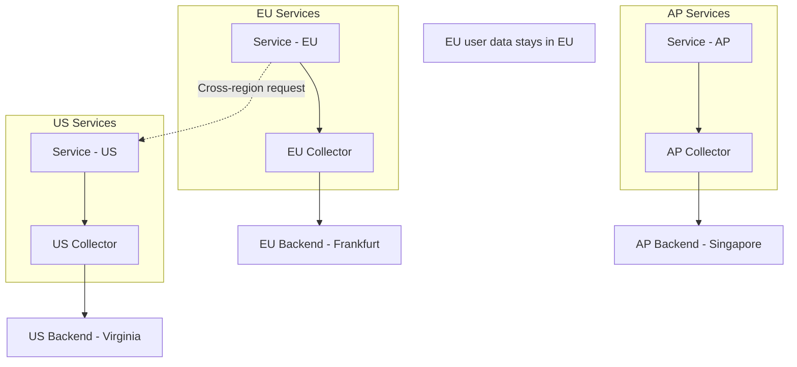

# How to Implement Data Residency Compliance with OpenTelemetry Routing

Author: [nawazdhandala](https://www.github.com/nawazdhandala)

Tags: OpenTelemetry, Data Residency, Compliance, GDPR, Routing, Privacy, Collector

Description: Learn how to configure OpenTelemetry to route telemetry data to region-specific backends for compliance with data residency regulations like GDPR and data sovereignty laws.

---

Data residency regulations require that certain data stays within specific geographic boundaries. The European Union's GDPR requires that personal data of EU residents is processed and stored within the EU (or in countries with adequate data protection). Similar regulations exist in Brazil (LGPD), Canada (PIPEDA), Australia, India, and many other jurisdictions. Telemetry data often contains personal identifiers like user IDs, IP addresses, and session tokens, which means it falls under these regulations.

If your OpenTelemetry pipeline sends all telemetry to a single global backend, you may be violating data residency requirements. The solution is to route telemetry data to region-specific backends based on the geographic origin of the data or the jurisdiction of the user it relates to. This post shows how to implement compliant telemetry routing with OpenTelemetry.

## Understanding the Requirement

Data residency compliance means different things depending on the regulation:

- **GDPR (EU):** Personal data of EU data subjects must be processed within the EU or in countries with an adequacy decision, unless specific safeguards are in place.
- **Data sovereignty laws:** Some countries require that data generated within their borders must be stored within their borders.
- **Industry regulations:** Healthcare (HIPAA), financial services, and government sectors may have additional data locality requirements.

For telemetry data, this translates to: spans, metrics, and logs containing user identifiers or generated by EU-serving infrastructure must be routed to EU-based storage.



## Tagging Telemetry with Residency Context

The first step is ensuring every piece of telemetry carries the information needed to make routing decisions. Add data residency attributes at the application level:

```python
# Add data residency context to telemetry.
# The data_region attribute determines where this data can be stored.
from opentelemetry import trace, context, baggage
from opentelemetry.baggage import set_baggage

def residency_middleware(request):
    """Middleware that sets data residency context based on the user's region."""
    # Determine the user's data residency region
    user_region = determine_user_region(request)

    # Set the residency region as a resource attribute on the current span
    span = trace.get_current_span()
    span.set_attribute("data.residency.region", user_region)
    span.set_attribute("data.residency.jurisdiction", get_jurisdiction(user_region))

    # Propagate the residency context to downstream services via baggage
    ctx = set_baggage("data.residency.region", user_region)
    return ctx

def determine_user_region(request):
    """Determine the data residency region for a request.

    This can be based on:
    - The user's account settings (preferred)
    - The user's IP geolocation (fallback)
    - The service's deployment region (default)
    """
    # Check user profile for explicit region setting
    user = get_authenticated_user(request)
    if user and user.data_region:
        return user.data_region

    # Fall back to IP geolocation
    client_ip = request.headers.get("X-Forwarded-For", request.remote_addr)
    geo = geolocate(client_ip)
    if geo and geo.country_code in EU_COUNTRY_CODES:
        return "eu"
    elif geo and geo.country_code == "US":
        return "us"

    # Default to the service's deployment region
    return os.getenv("DEPLOYMENT_REGION", "us")
```

For services that receive the residency context via baggage:

```python
# Extract data residency context from baggage in downstream services.
# This ensures the residency region follows the request across service boundaries.
from opentelemetry import trace, baggage

def extract_residency_context():
    """Extract and apply residency context from baggage."""
    region = baggage.get_baggage("data.residency.region")
    if region:
        span = trace.get_current_span()
        span.set_attribute("data.residency.region", region)
    return region
```

## Collector Routing Configuration

Configure the collector to route telemetry to the appropriate regional backend based on the residency attribute:

```yaml
# collector-routing-config.yaml
# Routes telemetry to region-specific backends based on data residency attributes.
receivers:
  otlp:
    protocols:
      grpc:
        endpoint: 0.0.0.0:4317
      http:
        endpoint: 0.0.0.0:4318

processors:
  memory_limiter:
    check_interval: 1s
    limit_mib: 4096

  batch/eu:
    timeout: 5s
    send_batch_size: 512

  batch/us:
    timeout: 5s
    send_batch_size: 512

  batch/ap:
    timeout: 5s
    send_batch_size: 512

# Routing connector directs data to the correct pipeline
connectors:
  routing:
    default_pipelines: [traces/us]
    table:
      # Route EU data to EU backend
      - statement: route() where attributes["data.residency.region"] == "eu"
        pipelines: [traces/eu]
      # Route AP data to AP backend
      - statement: route() where attributes["data.residency.region"] == "ap"
        pipelines: [traces/ap]
      # Route US data (and default) to US backend
      - statement: route() where attributes["data.residency.region"] == "us"
        pipelines: [traces/us]

exporters:
  otlphttp/eu:
    endpoint: https://eu.oneuptime.com/otlp
    # EU backend is in Frankfurt
    headers:
      X-Data-Region: "eu"
    tls:
      cert_file: /etc/otel/certs/client.crt
      key_file: /etc/otel/certs/client.key

  otlphttp/us:
    endpoint: https://us.oneuptime.com/otlp
    headers:
      X-Data-Region: "us"
    tls:
      cert_file: /etc/otel/certs/client.crt
      key_file: /etc/otel/certs/client.key

  otlphttp/ap:
    endpoint: https://ap.oneuptime.com/otlp
    headers:
      X-Data-Region: "ap"
    tls:
      cert_file: /etc/otel/certs/client.crt
      key_file: /etc/otel/certs/client.key

service:
  pipelines:
    # Input pipeline receives all telemetry and routes it
    traces/input:
      receivers: [otlp]
      processors: [memory_limiter]
      exporters: [routing]

    # EU pipeline
    traces/eu:
      receivers: [routing]
      processors: [batch/eu]
      exporters: [otlphttp/eu]

    # US pipeline
    traces/us:
      receivers: [routing]
      processors: [batch/us]
      exporters: [otlphttp/us]

    # AP pipeline
    traces/ap:
      receivers: [routing]
      processors: [batch/ap]
      exporters: [otlphttp/ap]
```

## Handling Cross-Region Traces

When a trace spans multiple regions (for example, a US frontend service calls an EU backend service), the spans belong to the same trace but must be stored in different regions. This creates a challenge for trace viewing.

### Option 1: Store Metadata Globally, Details Regionally

Keep a lightweight trace index globally that stores trace ID, service name, region, and duration. Store the full span details only in the appropriate region:

```yaml
# Route full trace data regionally but send lightweight metadata globally.
# This enables cross-region trace discovery without violating residency rules.
processors:
  # Strip PII for the global index
  attributes/strip-for-global:
    actions:
      - key: user.id
        action: delete
      - key: client.address
        action: delete
      - key: http.request.header.cookie
        action: delete
      # Keep only structural attributes
      - pattern: "^(?!(service\\.|http\\.request\\.method|http\\.response\\.status_code|span\\.))"
        action: delete

exporters:
  otlphttp/global-index:
    endpoint: https://global-index.oneuptime.com/otlp
    headers:
      X-Index-Only: "true"

service:
  pipelines:
    # Full data goes to the regional backend
    traces/regional:
      receivers: [routing]
      processors: [batch/regional]
      exporters: [otlphttp/regional]

    # Stripped metadata goes to the global index
    traces/global-index:
      receivers: [otlp]
      processors: [attributes/strip-for-global, batch/global]
      exporters: [otlphttp/global-index]
```

### Option 2: Trace Links

Store a reference link in each regional backend that points to the other region's backend for the continuation of the trace:

```python
# Add trace link information to spans that cross region boundaries.
# This lets operators follow the trace across regions manually.
from opentelemetry import trace

def add_cross_region_link(span, target_region, target_trace_id):
    """Add an attribute indicating the trace continues in another region."""
    span.set_attribute("trace.cross_region.target", target_region)
    span.set_attribute("trace.cross_region.trace_id", target_trace_id)
    span.set_attribute("trace.cross_region.link",
        f"https://{target_region}.oneuptime.com/traces/{target_trace_id}")
```

## PII Stripping for Non-Compliant Regions

If telemetry must flow to a region that does not meet residency requirements (for example, a global monitoring dashboard), strip all PII first:

```yaml
# Processor that strips all PII before sending to a non-compliant destination.
# The resulting data is safe to store anywhere.
processors:
  transform/strip-pii:
    trace_statements:
      - context: span
        statements:
          # Remove user identifiers
          - delete_key(attributes, "user.id")
          - delete_key(attributes, "user.email")
          - delete_key(attributes, "session.id")
          - delete_key(attributes, "client.address")

          # Hash any remaining potentially identifying attributes
          - set(attributes["http.request.header.x-forwarded-for"], "REDACTED")
            where attributes["http.request.header.x-forwarded-for"] != nil

          # Keep the residency region for routing verification
          # but remove the specific user attribution
```

## Compliance Verification

Build automated checks to verify that data is being routed correctly:

```python
# compliance_verification.py
# Verifies that telemetry data with EU residency tags
# is only stored in EU backends.

def verify_data_residency():
    """Check that data residency routing is working correctly."""
    violations = []

    # Query each regional backend
    for region, backend in REGIONAL_BACKENDS.items():
        traces = backend.query_recent_traces(limit=1000)

        for trace_data in traces:
            for span in trace_data.spans:
                data_region = span.attributes.get("data.residency.region")

                # If the span has a residency tag, it must match the backend region
                if data_region and data_region != region:
                    violations.append({
                        "trace_id": trace_data.trace_id,
                        "span_id": span.span_id,
                        "expected_region": data_region,
                        "actual_region": region,
                        "service": span.resource.get("service.name"),
                    })

    if violations:
        print(f"COMPLIANCE VIOLATION: {len(violations)} spans in wrong region")
        for v in violations:
            print(f"  Trace {v['trace_id']}: expected {v['expected_region']}, "
                  f"found in {v['actual_region']} (service: {v['service']})")
        return False

    print("Data residency compliance: PASSED")
    return True
```

## Default Deny Policy

For maximum compliance, implement a default deny policy where telemetry without a residency tag is not exported:

```yaml
# Default deny: telemetry without a residency tag is dropped.
# This prevents accidental data leakage when residency context is missing.
processors:
  filter/require-residency:
    traces:
      span:
        # Drop spans that do not have a residency region set
        - 'attributes["data.residency.region"] == nil'

  # Log dropped spans for debugging
  transform/log-drops:
    trace_statements:
      - context: span
        statements:
          - set(attributes["governance.status"], "missing-residency-tag")
            where attributes["data.residency.region"] == nil
```

## Conclusion

Data residency compliance with OpenTelemetry requires a combination of proper tagging at the application layer and intelligent routing at the collector layer. By embedding residency context into telemetry at the point of collection, propagating it across service boundaries via baggage, and routing to region-specific backends at the collector, you can maintain full observability while meeting regulatory requirements. The key is to treat residency as a first-class attribute in your telemetry pipeline, not as an afterthought. Automated compliance verification ensures that routing rules are working correctly, and a default deny policy prevents data from ending up in the wrong place when residency context is missing.
