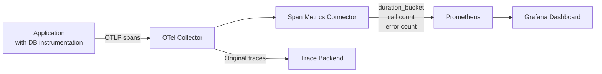

# How to Build a Database Performance Dashboard from OpenTelemetry SQL Span Metrics

Author: [nawazdhandala](https://www.github.com/nawazdhandala)

Tags: OpenTelemetry, Database, SQL, Performance

Description: Create a database performance dashboard by extracting metrics from OpenTelemetry SQL spans including query latency and throughput.

Database queries are often the biggest contributor to application latency. When a service slows down, the first question is usually "is it the database?" OpenTelemetry auto-instrumentation libraries capture detailed span data for SQL operations, including query type, database name, and duration. By converting these spans into metrics using the Span Metrics Connector, you get queryable time-series data that powers a focused database performance dashboard.

## How SQL Spans Work in OpenTelemetry

OpenTelemetry semantic conventions define standard attributes for database spans. When you instrument a service with an auto-instrumentation library (for Python, Java, Go, .NET, etc.), each SQL query generates a span with attributes like:

- `db.system` - The database engine (postgresql, mysql, etc.)
- `db.name` - The database name
- `db.operation` - The SQL operation (SELECT, INSERT, UPDATE, DELETE)
- `db.statement` - The full or sanitized SQL statement
- `server.address` - The database host

These spans have precise timing, which means you can derive latency distributions, throughput rates, and error rates per query type.

## Span Metrics Connector Configuration

The Span Metrics Connector sits inside the OpenTelemetry Collector and generates metrics from incoming spans. You configure it to extract specific attributes as metric dimensions.

```yaml
# otel-collector-config.yaml
# Connector that derives metrics from span data
connectors:
  spanmetrics:
    # Create histogram buckets suited for database query latency
    histogram:
      explicit:
        buckets: [1ms, 5ms, 10ms, 25ms, 50ms, 100ms, 250ms, 500ms, 1s, 5s]
    # Extract these span attributes as metric labels
    dimensions:
      - name: db.system
      - name: db.name
      - name: db.operation
      - name: server.address
    # Only process spans that represent database calls
    # Filter by span kind = CLIENT and db.system attribute exists
    dimensions_cache_size: 1000

receivers:
  otlp:
    protocols:
      grpc:
        endpoint: "0.0.0.0:4317"

exporters:
  prometheusremotewrite:
    endpoint: "http://prometheus:9090/api/v1/write"

service:
  pipelines:
    # Traces come in and also feed into the spanmetrics connector
    traces:
      receivers: [otlp]
      exporters: [spanmetrics]
    # The spanmetrics connector produces metrics that get exported
    metrics:
      receivers: [spanmetrics]
      exporters: [prometheusremotewrite]
```

## Data Flow

The pipeline works by reading trace data and producing metrics, without altering the original traces.



## Dashboard Queries

With the span metrics in Prometheus, you can build the following panels.

**Query Throughput by Operation** - Shows SELECT, INSERT, UPDATE, DELETE rates over time:

```promql
# Queries per second broken down by SQL operation type
sum by (db_operation) (
  rate(duration_milliseconds_count{db_system!=""}[5m])
)
```

**P95 Latency by Database** - Identifies which database is slowest:

```promql
# 95th percentile query latency per database
histogram_quantile(0.95,
  sum by (le, db_name) (
    rate(duration_milliseconds_bucket{db_system!=""}[5m])
  )
)
```

**Slow Query Rate** - Count of queries exceeding a latency threshold (e.g., 500ms):

```promql
# Percentage of queries slower than 500ms
(
  1 - (
    sum by (db_name) (rate(duration_milliseconds_bucket{le="500", db_system!=""}[5m]))
    /
    sum by (db_name) (rate(duration_milliseconds_count{db_system!=""}[5m]))
  )
) * 100
```

**Error Rate by Database** - Tracks failed queries:

```promql
# Database error rate as a percentage
sum by (db_name) (rate(duration_milliseconds_count{status_code="STATUS_CODE_ERROR", db_system!=""}[5m]))
/
sum by (db_name) (rate(duration_milliseconds_count{db_system!=""}[5m]))
* 100
```

**Top Callers** - Which services make the most database calls:

```promql
# Top 5 services by database query volume
topk(5,
  sum by (service_name) (
    rate(duration_milliseconds_count{db_system!=""}[5m])
  )
)
```

## Sanitizing SQL Statements

If you want to group metrics by query pattern (e.g., all SELECT queries on the `users` table), you need to sanitize the `db.statement` attribute to remove literal values. The `transform` processor can help.

```yaml
# Add this processor to normalize SQL statements before spanmetrics
processors:
  transform:
    trace_statements:
      - context: span
        statements:
          # Replace numeric literals with ?
          - replace_pattern(attributes["db.statement"], "[0-9]+", "?")
          # Replace quoted string literals with ?
          - replace_pattern(attributes["db.statement"], "'[^']*'", "?")
```

## Dashboard Layout

Structure the dashboard in four rows:

1. **Overview** - Total query throughput, overall error rate, average latency gauges
2. **Latency Analysis** - P50/P95/P99 latency by database, latency heatmap over time
3. **Throughput Breakdown** - Queries by operation type, queries by database, top calling services
4. **Errors and Slow Queries** - Error rate trends, slow query counts, error breakdown by database

This approach gives you database performance visibility without installing any database-specific monitoring agent. Every service that uses OpenTelemetry auto-instrumentation automatically contributes to the dashboard, making it a low-effort way to track database health across your entire fleet.
