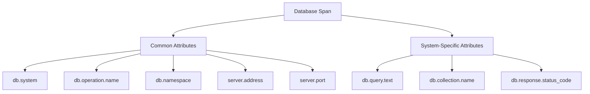

# How to Use Database Semantic Conventions for Consistent Query Tracing

Author: [nawazdhandala](https://www.github.com/nawazdhandala)

Tags: OpenTelemetry, Database, Semantic Conventions, Tracing, SQL, MongoDB, Redis, Query Performance

Description: Learn how to apply OpenTelemetry database semantic conventions to trace SQL, NoSQL, and cache operations consistently across services, enabling reliable query performance analysis and debugging.

---

Database calls are usually the slowest part of any request. When something is slow in production, the first question is almost always "which query is taking so long?" OpenTelemetry's database semantic conventions give you a standard way to capture that information, regardless of whether you are using PostgreSQL, MongoDB, Redis, or any other data store.

This guide covers how to apply database semantic conventions to your instrumentation so that every database span carries the same set of meaningful attributes.

## The Problem Without Conventions

Without standardized naming, database telemetry gets messy fast. Consider three different services, each written by different developers:

```
# Service A (Python + PostgreSQL)
db_type: "postgres"
query: "SELECT * FROM users WHERE id = $1"
database: "myapp_prod"

# Service B (Node.js + MongoDB)
database_system: "mongo"
operation: "find"
collection: "orders"

# Service C (Java + Redis)
cache_type: "redis"
command: "GET"
key_prefix: "session:"
```

Trying to build a single dashboard that shows "slowest database operations across all services" is nearly impossible with this kind of inconsistency. The semantic conventions solve this by defining a common vocabulary.

## Core Database Attributes

The OpenTelemetry database semantic conventions define a set of attributes that apply to all database systems, plus system-specific attributes for particular databases.



The `db.system` attribute is the foundation. It identifies which database technology is being used and determines which additional attributes are relevant.

## SQL Database Instrumentation in Python

Let us start with a practical example of tracing PostgreSQL queries in a Python application.

```python
# db_tracing.py - PostgreSQL instrumentation with semantic conventions
from opentelemetry import trace
from opentelemetry.instrumentation.psycopg2 import Psycopg2Instrumentor
from opentelemetry.sdk.trace import TracerProvider
from opentelemetry.sdk.trace.export import BatchSpanProcessor
from opentelemetry.exporter.otlp.proto.grpc.trace_exporter import OTLPSpanExporter
from opentelemetry.sdk.resources import Resource

# Configure the tracer provider
resource = Resource.create({
    "service.name": "user-service",
    "service.version": "3.2.0",
})

provider = TracerProvider(resource=resource)
provider.add_span_processor(
    BatchSpanProcessor(OTLPSpanExporter(endpoint="otel-collector:4317"))
)
trace.set_tracer_provider(provider)

# Auto-instrument psycopg2 - this applies database semantic conventions
# to every query executed through psycopg2 connections
Psycopg2Instrumentor().instrument(
    enable_commenter=True,  # Adds trace context as SQL comments
)
```

The `Psycopg2Instrumentor` automatically creates spans for every query and populates them with the correct semantic convention attributes. It sets `db.system` to `"postgresql"`, captures the `db.query.text`, identifies the `db.namespace` (database name), and records the server connection details.

For manual instrumentation or cases where you need additional control, here is how to create database spans by hand.

```python
# manual_db_span.py - Manual database span creation with full semantic conventions
import psycopg2
from opentelemetry import trace

tracer = trace.get_tracer("user-service.db")

def get_user_by_email(email: str) -> dict:
    # Build the query with parameterized inputs
    query = "SELECT id, name, email, created_at FROM users WHERE email = %s"

    # Create a span with all required database semantic convention attributes
    with tracer.start_as_current_span(
        name="SELECT users",
        kind=trace.SpanKind.CLIENT,
        attributes={
            "db.system": "postgresql",
            "db.namespace": "app_production",
            "db.operation.name": "SELECT",
            "db.collection.name": "users",
            "db.query.text": query,
            "server.address": "db-primary.internal",
            "server.port": 5432,
        },
    ) as span:
        conn = psycopg2.connect(
            host="db-primary.internal",
            port=5432,
            dbname="app_production",
        )
        cursor = conn.cursor()

        try:
            cursor.execute(query, (email,))
            result = cursor.fetchone()

            # Record how many rows came back
            span.set_attribute("db.response.returned_rows", 1 if result else 0)
            return result
        except Exception as e:
            span.set_status(trace.Status(trace.StatusCode.ERROR, str(e)))
            span.record_exception(e)
            raise
        finally:
            cursor.close()
            conn.close()
```

The span name follows the convention of `{db.operation.name} {db.collection.name}`, which gives you something like "SELECT users" or "INSERT orders". This is low-cardinality and immediately tells you what the operation is doing without looking at the full query text.

## MongoDB Instrumentation in Node.js

NoSQL databases have their own set of conventions. MongoDB operations use `db.collection.name` instead of table names and `db.operation.name` maps to MongoDB commands like `find`, `insert`, `update`, and `aggregate`.

```javascript
// mongo-tracing.js - MongoDB instrumentation with semantic conventions
const { NodeSDK } = require('@opentelemetry/sdk-node');
const { MongoDBInstrumentation } = require('@opentelemetry/instrumentation-mongodb');
const { OTLPTraceExporter } = require('@opentelemetry/exporter-trace-otlp-http');
const { Resource } = require('@opentelemetry/resources');

const sdk = new NodeSDK({
  resource: new Resource({
    'service.name': 'catalog-service',
    'service.version': '1.7.0',
  }),
  traceExporter: new OTLPTraceExporter({
    url: 'https://otel-collector.example.com/v1/traces',
  }),
  instrumentations: [
    new MongoDBInstrumentation({
      // Enhance spans with additional query details
      enhancedDatabaseReporting: true,
    }),
  ],
});

sdk.start();
```

The MongoDB instrumentation automatically sets `db.system` to `"mongodb"`, captures `db.collection.name`, `db.operation.name`, and `db.namespace`. With `enhancedDatabaseReporting` enabled, the query filter is also captured in the span.

For manual MongoDB spans, here is the pattern.

```javascript
// manual-mongo-span.js - Manual MongoDB span with semantic conventions
const { trace, SpanKind } = require('@opentelemetry/api');

const tracer = trace.getTracer('catalog-service.db');

async function findProductsByCategory(category) {
  // Span name follows the pattern: {operation} {collection}
  const span = tracer.startSpan('find products', {
    kind: SpanKind.CLIENT,
    attributes: {
      'db.system': 'mongodb',
      'db.namespace': 'catalog_db',
      'db.collection.name': 'products',
      'db.operation.name': 'find',
      'server.address': 'mongo-primary.internal',
      'server.port': 27017,
      // Capture the query filter for debugging
      'db.query.text': JSON.stringify({ category: category, active: true }),
    },
  });

  try {
    const db = client.db('catalog_db');
    const results = await db
      .collection('products')
      .find({ category, active: true })
      .toArray();

    span.setAttribute('db.response.returned_rows', results.length);
    return results;
  } catch (error) {
    span.setStatus({ code: 2, message: error.message });
    span.recordException(error);
    throw error;
  } finally {
    span.end();
  }
}
```

The structure is the same as the SQL example. The `db.system` attribute changes, and the query details are different, but the core attributes remain consistent.

## Redis and Cache Operations

Redis operations are typically much faster than SQL or document queries, but they still benefit from tracing, especially when you have cache misses that trigger downstream database calls.

```python
# redis_tracing.py - Redis instrumentation with semantic conventions
from opentelemetry import trace
from opentelemetry.instrumentation.redis import RedisInstrumentor

# Auto-instrument all redis-py operations
RedisInstrumentor().instrument()

# Manual Redis span example
tracer = trace.get_tracer("session-service.cache")

def get_session(session_id: str) -> dict:
    """Look up a session in Redis with proper semantic conventions."""
    with tracer.start_as_current_span(
        name="GET session_cache",
        kind=trace.SpanKind.CLIENT,
        attributes={
            "db.system": "redis",
            "db.namespace": "0",           # Redis database index
            "db.operation.name": "GET",
            "db.query.text": "GET session:{session_id}",
            "server.address": "redis-primary.internal",
            "server.port": 6379,
        },
    ) as span:
        result = redis_client.get(f"session:{session_id}")

        # Record cache hit or miss as a custom attribute
        span.set_attribute("app.cache.hit", result is not None)

        if result is None:
            span.set_attribute("app.cache.miss_reason", "key_not_found")

        return result
```

For Redis, the `db.namespace` attribute corresponds to the database index number. The `db.operation.name` maps directly to the Redis command being executed. Adding custom attributes like `app.cache.hit` gives you the ability to track cache hit rates directly from your traces.

## Sanitizing Query Text

One of the most important considerations with database semantic conventions is handling the `db.query.text` attribute safely. You should never record actual parameter values in your spans because they might contain personally identifiable information or security-sensitive data.

```python
# query_sanitizer.py - Sanitize SQL queries before recording them
import re

def sanitize_sql(query: str) -> str:
    """Replace literal values with placeholders to prevent PII leakage."""
    # Replace string literals
    sanitized = re.sub(r"'[^']*'", "'?'", query)
    # Replace numeric literals
    sanitized = re.sub(r"\b\d+\b", "?", sanitized)
    return sanitized

# Usage in span creation
original_query = "SELECT * FROM users WHERE email = 'alice@example.com' AND age > 25"
safe_query = sanitize_sql(original_query)
# Result: "SELECT * FROM users WHERE email = '?' AND age > ?"

span.set_attribute("db.query.text", safe_query)
```

Most auto-instrumentation libraries handle this sanitization by default. They record the parameterized query template rather than the query with interpolated values. But if you are doing manual instrumentation, make sure you sanitize before recording.

## Building Dashboards from Database Telemetry

With consistent database semantic conventions in place, you can build powerful dashboards that work across all your services and database systems.

```sql
-- Slowest database operations across all services and database types
SELECT
    db.system,
    db.operation.name,
    db.collection.name,
    resource.service.name,
    avg(duration_ms) as avg_latency_ms,
    p99(duration_ms) as p99_latency_ms,
    count(*) as operation_count
FROM spans
WHERE db.system IS NOT NULL
GROUP BY db.system, db.operation.name, db.collection.name, resource.service.name
ORDER BY p99_latency_ms DESC
LIMIT 20;

-- Database error rates by system and operation
SELECT
    db.system,
    db.operation.name,
    count(*) as total,
    countIf(status_code = 'ERROR') as errors,
    round(errors / total * 100, 2) as error_rate
FROM spans
WHERE db.system IS NOT NULL
GROUP BY db.system, db.operation.name
HAVING error_rate > 1
ORDER BY error_rate DESC;
```

These queries work because every service follows the same conventions. You do not need to know which programming language a service is written in or which ORM it uses. The attributes are the same everywhere.

## Span Name Best Practices

Getting span names right is crucial for database spans. Here are the rules to follow:

```
# Good span names (low cardinality, descriptive)
SELECT users
INSERT orders
find products
GET session_cache
HGET user_preferences

# Bad span names (high cardinality, includes values)
SELECT * FROM users WHERE id = 42
find products where category = "electronics"
GET session:abc123def456
```

The span name should consist of the operation and the target table or collection. Never include query parameters, filter values, or specific keys. Those details belong in span attributes where they can be properly indexed and queried.

## Wrapping Up

Database semantic conventions turn your query traces from scattered, inconsistent metadata into a unified view of how your applications interact with data stores. The core pattern is the same regardless of the database system: set `db.system`, `db.operation.name`, `db.collection.name`, `db.namespace`, and the server connection attributes. Layer on system-specific details as needed, sanitize sensitive data in queries, and keep span names low-cardinality.

Start with auto-instrumentation for your database drivers, verify the attributes are correct, and extend with custom attributes where your team needs additional context. Once every service follows the same conventions, answering questions like "which queries are slowest" or "which database operations are failing" becomes a single query away.
