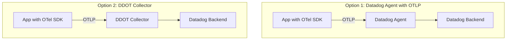
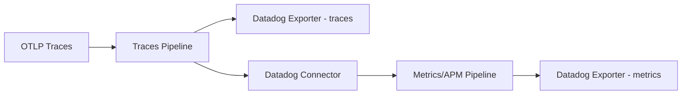

# How to Use Datadog Distribution (DDOT) of OpenTelemetry Collector

Author: [nawazdhandala](https://www.github.com/nawazdhandala)

Tags: OpenTelemetry, Datadog, DDOT, Observability, Monitoring, APM

Description: Learn how to deploy and configure the Datadog Distribution of OpenTelemetry Collector to send traces, metrics, and logs to Datadog.

---

Datadog has its own distribution of the OpenTelemetry Collector, sometimes referred to as DDOT. It is built on the upstream collector but includes the Datadog exporter and connector components, along with configuration defaults that map well to Datadog's data model. This gives you the ability to use standard OpenTelemetry instrumentation while sending data to Datadog without running the Datadog Agent.

That said, Datadog also supports receiving OTLP data through the standard Datadog Agent. So you have options. Let's walk through how DDOT works and when to use each approach.

## Two Ways to Send OTel Data to Datadog

Before we dig into DDOT, it helps to understand the two main approaches:



**Option 1** uses the standard Datadog Agent with OTLP ingestion enabled. This is simpler if you already run the Datadog Agent for infrastructure monitoring.

**Option 2** uses the DDOT Collector, which is a pure OpenTelemetry Collector with Datadog components baked in. This is better if you want to stay fully in the OTel ecosystem.

## Installing DDOT

### Using Docker

Pull and run the DDOT Collector container:

```bash
# Run the Datadog Distribution of the OTel Collector
docker run -d \
  --name ddot-collector \
  -e DD_API_KEY=your-datadog-api-key \
  -e DD_SITE=datadoghq.com \
  -p 4317:4317 \
  -p 4318:4318 \
  -v ./ddot-config.yaml:/etc/otelcol/config.yaml \
  datadog/opentelemetry-collector-contrib:latest \
  --config /etc/otelcol/config.yaml
```

### On Kubernetes with Helm

Deploy DDOT on Kubernetes using the Datadog Helm chart:

```bash
# Add the Datadog Helm repository
helm repo add datadog https://helm.datadoghq.com
helm repo update

# Install DDOT Collector
helm install ddot datadog/opentelemetry-collector \
  --namespace monitoring \
  --create-namespace \
  --set datadog.apiKey=your-datadog-api-key \
  --set datadog.site=datadoghq.com
```

### Using the Binary

Download and run the binary directly:

```bash
# Download the DDOT Collector binary for Linux
curl -L -o ddot-collector \
  https://github.com/DataDog/datadog-otel-collector/releases/latest/download/ddot-collector-linux-amd64

chmod +x ddot-collector

# Run with your config
./ddot-collector --config ddot-config.yaml
```

## Basic DDOT Configuration

Here is a configuration that sends traces, metrics, and logs to Datadog:

```yaml
# DDOT Collector configuration
# Sends all signal types to Datadog

receivers:
  # Accept OTLP from instrumented applications
  otlp:
    protocols:
      grpc:
        endpoint: 0.0.0.0:4317
      http:
        endpoint: 0.0.0.0:4318

processors:
  # Batch data before sending to Datadog
  batch:
    timeout: 10s
    send_batch_size: 1000

  # Add resource attributes for better Datadog tagging
  resource:
    attributes:
      - key: deployment.environment
        value: production
        action: upsert

  # Limit memory to prevent OOM in constrained environments
  memory_limiter:
    check_interval: 1s
    limit_mib: 512
    spike_limit_mib: 128

connectors:
  # The Datadog connector computes APM stats from traces
  # This is required for Datadog APM to show accurate metrics
  datadog/connector:
    traces:
      compute_stats_by_span_kind: true
      compute_top_level_by_span_kind: true
      peer_tags_aggregation: true

exporters:
  # Send traces and metrics to Datadog
  datadog:
    api:
      key: "${DD_API_KEY}"
      site: "${DD_SITE}"
    traces:
      span_name_as_resource_name: true
    metrics:
      histograms:
        mode: distributions
      sums:
        cumulative_monotonic_mode: to_delta

service:
  pipelines:
    traces:
      receivers: [otlp]
      processors: [memory_limiter, resource, batch]
      # Export traces and also feed them to the Datadog connector
      exporters: [datadog, datadog/connector]
    # This pipeline receives computed APM metrics from the connector
    metrics/apm:
      receivers: [datadog/connector]
      processors: [batch]
      exporters: [datadog]
    metrics:
      receivers: [otlp]
      processors: [memory_limiter, resource, batch]
      exporters: [datadog]
    logs:
      receivers: [otlp]
      processors: [memory_limiter, resource, batch]
      exporters: [datadog]
```

## Understanding the Datadog Connector

The Datadog connector is a critical component in DDOT. It sits between the traces pipeline and a metrics pipeline, computing APM statistics (like request rate, error rate, and latency percentiles) from your trace data.

Without the connector, Datadog APM would not show these computed metrics, and the APM UI would be incomplete.



## Host Metrics Collection

To replace the Datadog Agent's infrastructure monitoring, add host metrics collection:

```yaml
receivers:
  # Collect system-level metrics
  hostmetrics:
    collection_interval: 15s
    scrapers:
      cpu:
        metrics:
          system.cpu.utilization:
            enabled: true
      memory:
        metrics:
          system.memory.utilization:
            enabled: true
      disk:
      network:
      filesystem:
      load:
      paging:
      processes:

  # Collect Docker container metrics
  docker_stats:
    endpoint: unix:///var/run/docker.sock
    collection_interval: 15s

processors:
  # Map OTel resource attributes to Datadog tags
  # Datadog expects specific tag formats
  resource/datadog:
    attributes:
      - key: host.name
        from_attribute: host.name
        action: upsert
      - key: service.name
        from_attribute: service.name
        action: upsert

exporters:
  datadog:
    api:
      key: "${DD_API_KEY}"
      site: "${DD_SITE}"
    host_metadata:
      enabled: true
      hostname_source: config_or_system

service:
  pipelines:
    metrics:
      receivers: [hostmetrics, docker_stats]
      processors: [resource/datadog, batch]
      exporters: [datadog]
```

## Kubernetes Deployment

Full Kubernetes DaemonSet for DDOT:

```yaml
# ddot-configmap.yaml
apiVersion: v1
kind: ConfigMap
metadata:
  name: ddot-config
  namespace: monitoring
data:
  config.yaml: |
    receivers:
      otlp:
        protocols:
          grpc:
            endpoint: 0.0.0.0:4317
          http:
            endpoint: 0.0.0.0:4318

      # Scrape kubelet for node and pod metrics
      kubeletstats:
        collection_interval: 30s
        auth_type: serviceAccount
        endpoint: "https://${env:NODE_NAME}:10250"
        insecure_skip_verify: true

    processors:
      batch:
        timeout: 10s
      memory_limiter:
        check_interval: 5s
        limit_mib: 400
      k8sattributes:
        extract:
          metadata:
            - k8s.pod.name
            - k8s.namespace.name
            - k8s.deployment.name
            - k8s.node.name

    connectors:
      datadog/connector:
        traces:
          compute_stats_by_span_kind: true

    exporters:
      datadog:
        api:
          key: "${env:DD_API_KEY}"
          site: datadoghq.com
        traces:
          span_name_as_resource_name: true

    service:
      pipelines:
        traces:
          receivers: [otlp]
          processors: [memory_limiter, k8sattributes, batch]
          exporters: [datadog, datadog/connector]
        metrics/apm:
          receivers: [datadog/connector]
          processors: [batch]
          exporters: [datadog]
        metrics:
          receivers: [otlp, kubeletstats]
          processors: [memory_limiter, k8sattributes, batch]
          exporters: [datadog]
        logs:
          receivers: [otlp]
          processors: [memory_limiter, k8sattributes, batch]
          exporters: [datadog]
---
apiVersion: apps/v1
kind: DaemonSet
metadata:
  name: ddot-collector
  namespace: monitoring
spec:
  selector:
    matchLabels:
      app: ddot-collector
  template:
    metadata:
      labels:
        app: ddot-collector
    spec:
      serviceAccountName: ddot-collector
      containers:
        - name: collector
          image: datadog/opentelemetry-collector-contrib:latest
          args: ["--config", "/conf/config.yaml"]
          env:
            - name: DD_API_KEY
              valueFrom:
                secretKeyRef:
                  name: datadog-secret
                  key: api-key
            - name: NODE_NAME
              valueFrom:
                fieldRef:
                  fieldPath: spec.nodeName
          ports:
            - containerPort: 4317
            - containerPort: 4318
          volumeMounts:
            - name: config
              mountPath: /conf
          resources:
            requests:
              cpu: 200m
              memory: 256Mi
            limits:
              cpu: 500m
              memory: 512Mi
      volumes:
        - name: config
          configMap:
            name: ddot-config
```

## DDOT vs Datadog Agent with OTLP

The Datadog Agent can also receive OTLP data. Here is how the two compare:

| Feature | DDOT Collector | Datadog Agent + OTLP |
|---------|---------------|---------------------|
| Infrastructure monitoring | Manual config | Built-in |
| APM stats computation | Via connector | Automatic |
| Live processes | Not included | Built-in |
| Network monitoring | Not included | Built-in |
| Config language | OTel YAML | Datadog YAML |
| Multi-backend export | Easy | Not supported |
| OTel ecosystem | Full compatibility | OTLP receiver only |

## When to Use DDOT

Choose DDOT when:

- You want to use standard OTel configuration and tooling
- You need to send data to Datadog and other backends simultaneously
- You are standardizing on OTel across your organization
- You do not need Datadog-specific features like NPM or Live Processes

## When to Use the Datadog Agent Instead

Stick with the Datadog Agent when:

- You need full Datadog feature set (NPM, Live Processes, Runtime Metrics)
- You already have the Datadog Agent deployed
- You want a simpler setup with less configuration
- You do not need multi-backend export

Both paths get your OTel data into Datadog. DDOT keeps you closer to the OTel ecosystem, while the Datadog Agent gives you more Datadog-specific features out of the box.
