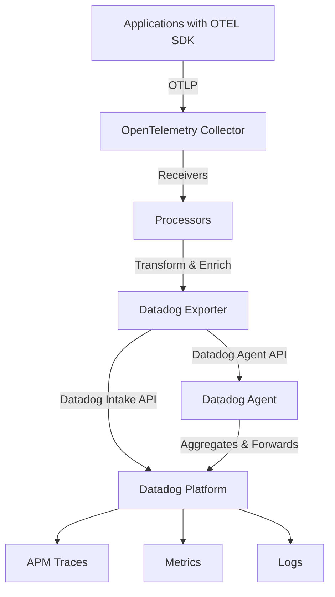

# How to Configure the Datadog Exporter in the OpenTelemetry Collector

Author: [nawazdhandala](https://www.github.com/nawazdhandala)

Tags: OpenTelemetry, Collector, Exporters, Datadog, APM, Observability, Monitoring

Description: Step-by-step guide to configuring the Datadog exporter in OpenTelemetry Collector, enabling seamless integration between OpenTelemetry instrumentation and Datadog monitoring platform.

The Datadog exporter bridges OpenTelemetry instrumentation with the Datadog monitoring platform, allowing you to leverage OpenTelemetry's vendor-neutral instrumentation while maintaining your existing Datadog workflows and dashboards. This integration is particularly valuable for organizations transitioning to OpenTelemetry or those wanting to maintain flexibility in their observability tooling.

## Why Use OpenTelemetry with Datadog

Combining OpenTelemetry with Datadog offers several strategic advantages:

- **Vendor neutrality**: Instrument once with OpenTelemetry, maintain flexibility to add or change backends
- **Standardized instrumentation**: Use community-maintained OpenTelemetry libraries instead of vendor-specific agents
- **Unified telemetry**: Correlate traces, metrics, and logs through a single collection pipeline
- **Cost optimization**: Process and filter data before sending to Datadog, reducing ingestion costs
- **Hybrid deployments**: Send the same data to multiple backends for migration or redundancy

## Architecture Overview

The Datadog exporter translates OpenTelemetry data formats into Datadog's native protocols:



## Prerequisites

Before configuring the Datadog exporter, you need:

- OpenTelemetry Collector Contrib distribution (version 0.88.0 or later)
- Datadog account and API key
- Datadog site identifier (e.g., datadoghq.com, datadoghq.eu)
- Network connectivity to Datadog's intake endpoints

## Basic Configuration

Here is a minimal configuration that sends traces to Datadog:

```yaml
# Basic Datadog exporter configuration
exporters:
  datadog:
    # Datadog API key (required)
    api:
      key: ${DD_API_KEY}

    # Datadog site (default: datadoghq.com)
    site: datadoghq.com

receivers:
  otlp:
    protocols:
      grpc:
        endpoint: 0.0.0.0:4317
      http:
        endpoint: 0.0.0.0:4318

processors:
  batch:
    timeout: 10s
    send_batch_size: 100

service:
  pipelines:
    traces:
      receivers: [otlp]
      processors: [batch]
      exporters: [datadog]
```

This configuration sends trace data to Datadog's US site. The API key should be provided via environment variable for security.

## Complete Multi-Signal Configuration

Configure the exporter to handle traces, metrics, and logs:

```yaml
exporters:
  datadog:
    # API configuration
    api:
      key: ${DD_API_KEY}
      site: datadoghq.com

      # Fail on invalid API key (default: false)
      fail_on_invalid_key: true

    # Hostname and tags
    hostname: ${HOSTNAME}

    # Global tags applied to all telemetry
    tags:
      - env:production
      - region:us-east-1
      - team:platform

    # Trace configuration
    traces:
      # Endpoint for trace data (optional, auto-determined from site)
      endpoint: https://trace.agent.datadoghq.com

      # Ignore specific resources
      ignore_resources:
        - GET /health
        - GET /metrics

      # Span name remapping rules
      span_name_remappings:
        instrumentation.library.name: "library"
        http.method: "method"

      # Span name as resource name (default: false)
      span_name_as_resource_name: false

      # Compute stats for traces
      compute_stats_by_span_kind: true

      # Peer tags for service dependencies
      peer_tags_aggregation: true

      # Peer tags to use for service mapping
      peer_tags:
        - peer.service
        - db.instance
        - db.system

    # Metrics configuration
    metrics:
      # Endpoint for metrics
      endpoint: https://api.datadoghq.com

      # Enable delta temporality for cumulative metrics
      delta_ttl: 3600

      # Histogram configuration
      histograms:
        mode: distributions
        send_aggregation_metrics: true

      # Summary configuration
      summaries:
        mode: gauges

    # Logs configuration (if sending logs)
    logs:
      # Endpoint for logs
      endpoint: https://http-intake.logs.datadoghq.com

receivers:
  otlp:
    protocols:
      grpc:
        endpoint: 0.0.0.0:4317
      http:
        endpoint: 0.0.0.0:4318

processors:
  batch:
    timeout: 10s
    send_batch_size: 100
    send_batch_max_size: 1000

  # Add resource attributes
  resource:
    attributes:
      - key: deployment.environment
        value: production
        action: insert

service:
  pipelines:
    traces:
      receivers: [otlp]
      processors: [resource, batch]
      exporters: [datadog]

    metrics:
      receivers: [otlp]
      processors: [resource, batch]
      exporters: [datadog]

    logs:
      receivers: [otlp]
      processors: [resource, batch]
      exporters: [datadog]
```

## Using the Datadog Agent as a Proxy

For better performance and reliability, route telemetry through the Datadog Agent:

```yaml
exporters:
  datadog:
    # API key still required for validation
    api:
      key: ${DD_API_KEY}

    # Datadog Agent configuration
    traces:
      # Send traces to local Datadog Agent
      endpoint: http://localhost:8126

    metrics:
      # Send metrics to Datadog Agent
      endpoint: http://localhost:8125

      # Use DogStatsD protocol
      resource_attributes_as_tags: true

    # Agent handles forwarding to Datadog platform
    hostname: ${HOSTNAME}

    tags:
      - env:production
      - service:api

receivers:
  otlp:
    protocols:
      grpc:
        endpoint: 0.0.0.0:4317

processors:
  batch:
    timeout: 10s
    send_batch_size: 100

service:
  pipelines:
    traces:
      receivers: [otlp]
      processors: [batch]
      exporters: [datadog]
```

This approach provides benefits:

- **Local buffering**: Agent buffers data during network issues
- **Reduced egress**: Single connection from Agent to Datadog
- **Additional processing**: Agent can enrich data with host metadata
- **Simplified networking**: Collector only needs to reach localhost

## Service Name Mapping

Map OpenTelemetry service names to Datadog services:

```yaml
processors:
  # Transform processor for service name mapping
  transform:
    trace_statements:
      - context: resource
        statements:
          # Map OpenTelemetry service.name to Datadog service
          - set(attributes["service.name"], "api-gateway") where attributes["service.name"] == "gateway"
          - set(attributes["service.name"], "user-service") where attributes["service.name"] == "users"

exporters:
  datadog:
    api:
      key: ${DD_API_KEY}
      site: datadoghq.com

    hostname: ${HOSTNAME}

service:
  pipelines:
    traces:
      receivers: [otlp]
      processors: [transform, batch]
      exporters: [datadog]
```

## Attribute Mapping for Unified Service Tagging

Ensure proper tagging for Datadog's Unified Service Tagging:

```yaml
processors:
  # Resource detection for cloud metadata
  resourcedetection:
    detectors: [env, system, docker, ec2, ecs]
    timeout: 5s

  # Attributes processor for Datadog tagging
  attributes:
    actions:
      # Map deployment.environment to env tag
      - key: env
        from_attribute: deployment.environment
        action: insert

      # Map service.version to version tag
      - key: version
        from_attribute: service.version
        action: insert

      # Map service.name to service tag
      - key: service
        from_attribute: service.name
        action: insert

exporters:
  datadog:
    api:
      key: ${DD_API_KEY}
      site: datadoghq.com

    # Extract resource attributes as tags
    traces:
      resource_attributes_as_tags: true

    hostname: ${HOSTNAME}

service:
  pipelines:
    traces:
      receivers: [otlp]
      processors: [resourcedetection, attributes, batch]
      exporters: [datadog]
```

This configuration ensures your traces appear correctly in Datadog with proper service, environment, and version tags.

## Advanced Sampling Configuration

Implement intelligent sampling to control data volume and costs:

```yaml
processors:
  # Probabilistic sampler
  probabilistic_sampler:
    # Sample 10% of traces
    sampling_percentage: 10

  # Tail sampling for intelligent decisions
  tail_sampling:
    # Decision wait time
    decision_wait: 10s

    # Number of traces to keep in memory
    num_traces: 50000

    # Sampling policies
    policies:
      # Always sample errors
      - name: errors
        type: status_code
        status_code:
          status_codes: [ERROR]

      # Sample slow requests (> 1 second)
      - name: slow-traces
        type: latency
        latency:
          threshold_ms: 1000

      # Probabilistic sampling for normal traces
      - name: probabilistic
        type: probabilistic
        probabilistic:
          sampling_percentage: 5

      # Always sample specific services
      - name: critical-services
        type: string_attribute
        string_attribute:
          key: service.name
          values:
            - payment-service
            - authentication-service

exporters:
  datadog:
    api:
      key: ${DD_API_KEY}
      site: datadoghq.com

    hostname: ${HOSTNAME}

service:
  pipelines:
    traces:
      receivers: [otlp]
      processors: [tail_sampling, batch]
      exporters: [datadog]
```

## Complete Production Configuration

A comprehensive production-ready configuration with all best practices:

```yaml
extensions:
  health_check:
    endpoint: 0.0.0.0:13133

  pprof:
    endpoint: localhost:1777

receivers:
  otlp:
    protocols:
      grpc:
        endpoint: 0.0.0.0:4317
        max_recv_msg_size_mib: 32
      http:
        endpoint: 0.0.0.0:4318

processors:
  # Memory protection
  memory_limiter:
    check_interval: 1s
    limit_mib: 2048
    spike_limit_mib: 512

  # Cloud resource detection
  resourcedetection:
    detectors: [env, system, docker, ec2, ecs]
    timeout: 5s
    override: false

  # Datadog-specific attributes
  attributes:
    actions:
      - key: env
        from_attribute: deployment.environment
        action: upsert
      - key: service
        from_attribute: service.name
        action: upsert
      - key: version
        from_attribute: service.version
        action: upsert

  # Batch for efficiency
  batch:
    timeout: 10s
    send_batch_size: 100
    send_batch_max_size: 1000

  # Filter out health checks
  filter:
    traces:
      span:
        - 'attributes["http.target"] == "/health"'
        - 'attributes["http.target"] == "/ready"'
        - 'attributes["http.target"] == "/live"'

exporters:
  datadog:
    api:
      key: ${DD_API_KEY}
      site: datadoghq.com
      fail_on_invalid_key: true

    hostname: ${HOSTNAME}

    tags:
      - env:production
      - cluster:primary
      - collector.version:v0.88.0

    traces:
      endpoint: https://trace.agent.datadoghq.com

      ignore_resources:
        - GET /health
        - GET /metrics
        - GET /ready
        - GET /live

      span_name_as_resource_name: false
      compute_stats_by_span_kind: true
      peer_tags_aggregation: true

      peer_tags:
        - peer.service
        - db.instance
        - db.system
        - messaging.system
        - rpc.service

      resource_attributes_as_tags: true

    metrics:
      endpoint: https://api.datadoghq.com

      resource_attributes_as_tags: true

      histograms:
        mode: distributions
        send_aggregation_metrics: false

      summaries:
        mode: gauges

      delta_ttl: 3600

    logs:
      endpoint: https://http-intake.logs.datadoghq.com

    # Retry configuration
    retry_on_failure:
      enabled: true
      initial_interval: 5s
      max_interval: 30s
      max_elapsed_time: 300s

    # Queue configuration
    sending_queue:
      enabled: true
      num_consumers: 10
      queue_size: 1000

service:
  extensions: [health_check, pprof]

  telemetry:
    logs:
      level: info
      output_paths:
        - /var/log/otel-collector.log
        - stdout

    metrics:
      level: detailed
      address: 0.0.0.0:8888

  pipelines:
    traces:
      receivers: [otlp]
      processors: [memory_limiter, resourcedetection, attributes, filter, batch]
      exporters: [datadog]

    metrics:
      receivers: [otlp]
      processors: [memory_limiter, resourcedetection, attributes, batch]
      exporters: [datadog]

    logs:
      receivers: [otlp]
      processors: [memory_limiter, resourcedetection, attributes, batch]
      exporters: [datadog]
```

## Regional Configuration

Configure the exporter for different Datadog regions:

```yaml
# US1 (default)
exporters:
  datadog/us1:
    api:
      key: ${DD_API_KEY}
      site: datadoghq.com

# US3
exporters:
  datadog/us3:
    api:
      key: ${DD_API_KEY}
      site: us3.datadoghq.com

# US5
exporters:
  datadog/us5:
    api:
      key: ${DD_API_KEY}
      site: us5.datadoghq.com

# EU
exporters:
  datadog/eu:
    api:
      key: ${DD_API_KEY}
      site: datadoghq.eu

# AP1
exporters:
  datadog/ap1:
    api:
      key: ${DD_API_KEY}
      site: ap1.datadoghq.com

# US1-FED (Government)
exporters:
  datadog/gov:
    api:
      key: ${DD_API_KEY}
      site: ddog-gov.com
```

## Dual Exporting for Migration

Send data to both Datadog and another backend during migration:

```yaml
exporters:
  datadog:
    api:
      key: ${DD_API_KEY}
      site: datadoghq.com

  otlp:
    endpoint: other-backend.example.com:4317
    tls:
      insecure: false

service:
  pipelines:
    traces:
      receivers: [otlp]
      processors: [batch]
      # Send to both exporters
      exporters: [datadog, otlp]
```

## Monitoring and Troubleshooting

Monitor the exporter using metrics exposed on port 8888:

- `otelcol_exporter_sent_spans`: Spans successfully sent to Datadog
- `otelcol_exporter_send_failed_spans`: Failed span exports
- `otelcol_exporter_queue_size`: Current export queue size

Common issues and solutions:

**401 Unauthorized**: Verify API key is correct and has proper permissions

**429 Rate Limited**: Reduce batch size or implement sampling to lower data volume

**Traces not appearing**: Check service name mapping and ensure traces have required attributes

**High memory usage**: Reduce `tail_sampling.num_traces` or batch sizes

## Verifying Data in Datadog

After configuration, verify data is flowing:

1. Navigate to APM > Traces in Datadog
2. Check for services matching your `service.name` attributes
3. Verify traces show proper resource names and tags
4. Check Metrics Explorer for custom metrics
5. Review Logs Explorer for log data

## Cost Optimization Tips

Reduce Datadog ingestion costs with these strategies:

- **Implement sampling**: Use tail sampling to keep only valuable traces
- **Filter health checks**: Remove noisy, low-value endpoints
- **Aggregate metrics**: Use Collector processors to pre-aggregate before export
- **Set retention**: Configure appropriate retention policies in Datadog
- **Use host tags efficiently**: Avoid high-cardinality tags that increase metric costs

## Conclusion

The Datadog exporter enables you to modernize your instrumentation with OpenTelemetry while maintaining integration with Datadog's comprehensive monitoring platform. This configuration provides flexibility to process and transform telemetry data before it reaches Datadog, offering better control over costs and data quality.

By centralizing telemetry collection in the OpenTelemetry Collector, you gain the ability to route data to multiple backends, apply sophisticated processing, and maintain vendor independence while still leveraging Datadog's powerful analysis and visualization capabilities.

For information about other cloud exporters, check out our guides on the [AWS X-Ray exporter](https://oneuptime.com/blog/post/2026-02-06-aws-xray-exporter-opentelemetry-collector/view) and [AWS CloudWatch Logs exporter](https://oneuptime.com/blog/post/2026-02-06-aws-cloudwatch-logs-exporter-opentelemetry-collector/view).
