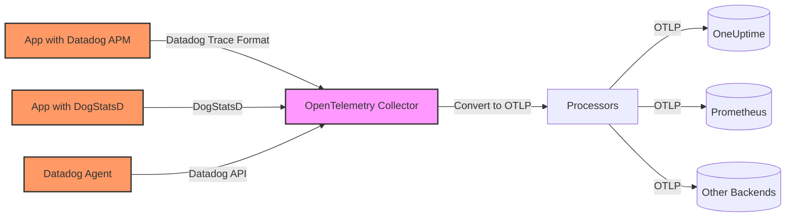
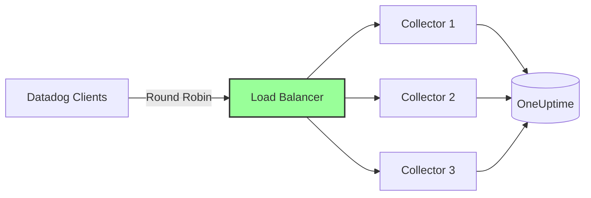

# How to Configure the Datadog Receiver in the OpenTelemetry Collector

Author: [nawazdhandala](https://www.github.com/nawazdhandala)

Tags: OpenTelemetry, Collector, Datadog, Migration, Metrics, Traces, APM

Description: Complete guide to configuring the Datadog receiver in OpenTelemetry Collector for seamless migration from Datadog agents while maintaining compatibility with existing instrumentation.

---

The Datadog receiver in the OpenTelemetry Collector enables you to accept telemetry data from Datadog agents and APM libraries, then route it to any backend that supports OpenTelemetry. This receiver is particularly valuable when migrating from Datadog to open-source or vendor-neutral observability solutions, as it allows you to preserve your existing instrumentation while switching backends.

If you're looking to break free from Datadog's pricing model or want to centralize telemetry from multiple sources, the Datadog receiver provides a smooth transition path without requiring immediate code changes across your entire infrastructure.

---

## What is the Datadog Receiver?

The Datadog receiver is an OpenTelemetry Collector component that implements the Datadog Agent API, allowing it to accept traces, metrics, and logs in Datadog's native formats. It translates this data into OpenTelemetry's data model, making it available for processing by standard OpenTelemetry processors and export to any OTLP-compatible backend.

The receiver supports multiple Datadog protocols:
- **APM traces** via the Datadog trace agent API
- **StatsD metrics** for application metrics
- **DogStatsD** extensions for tags and distribution metrics
- **Datadog metrics API** for custom metrics

**Key benefits:**

- Migrate from Datadog without changing application code
- Use OpenTelemetry's ecosystem while keeping Datadog instrumentation
- Run Datadog agents alongside OpenTelemetry-native instrumentation
- Compare Datadog and alternative backends side-by-side during evaluation
- Eliminate per-host agent licensing costs

---

## Architecture Overview

The Datadog receiver acts as a drop-in replacement for the Datadog Agent backend. Your applications continue to use Datadog's client libraries, but instead of sending data to Datadog's SaaS, they send to your OpenTelemetry Collector:



This architecture allows you to maintain Datadog instrumentation while gaining the flexibility of OpenTelemetry's vendor-neutral ecosystem. You can route data to multiple backends, apply custom processing, and avoid vendor lock-in.

---

## Prerequisites

Before configuring the Datadog receiver, ensure you have:

1. **OpenTelemetry Collector** version 0.80.0 or later with the Datadog receiver component
2. **Applications instrumented with Datadog libraries** (dd-trace-py, dd-trace-java, dd-trace-js, etc.)
3. **Network connectivity** from your applications to the Collector
4. **Understanding of your current Datadog configuration** (agent endpoints, ports, API keys)

---

## Basic Configuration

The Datadog receiver requires configuring endpoints for the different Datadog protocols. Here's a minimal working configuration:

```yaml
# RECEIVERS: Define how telemetry enters the Collector
receivers:
  # Datadog receiver implements multiple Datadog Agent APIs
  datadog:
    # Endpoint for APM traces (Datadog trace agent API)
    endpoint: 0.0.0.0:8126

    # Read API key from environment (not sent to Datadog, but validated for compatibility)
    read_metadata_tags: true

# EXPORTERS: Define where telemetry is sent
exporters:
  # Export traces and metrics to OneUptime
  otlphttp:
    endpoint: https://oneuptime.com/otlp
    headers:
      x-oneuptime-token: ${ONEUPTIME_TOKEN}

# SERVICE: Wire receivers to exporters
service:
  pipelines:
    # Traces pipeline: receive from Datadog APM, export to OneUptime
    traces:
      receivers: [datadog]
      exporters: [otlphttp]

    # Metrics pipeline: receive from DogStatsD, export to OneUptime
    metrics:
      receivers: [datadog]
      exporters: [otlphttp]
```

**Configuration breakdown:**

- `endpoint`: The address and port where the receiver listens for Datadog APM traces (default Datadog agent port is 8126)
- `read_metadata_tags`: When enabled, the receiver reads Datadog agent metadata tags from the request and attaches them as resource attributes

---

## Comprehensive Configuration with All Protocols

In a production environment, you'll want to enable all Datadog protocols and configure proper processing. Here's a complete configuration:

```yaml
receivers:
  datadog:
    # APM traces endpoint (Datadog trace agent API)
    endpoint: 0.0.0.0:8126

    # Enable reading Datadog metadata tags from trace payloads
    read_metadata_tags: true

    # StatsD/DogStatsD metrics endpoint
    statsd:
      endpoint: 0.0.0.0:8125
      aggregation_interval: 60s
      enable_metric_type: true

      # Parse DogStatsD tags (key:value pairs)
      parse_dogstatsd_tags: true

      # Timer histogram configuration
      timer_histogram_mapping:
        - statsd_type: "timing"
          observer_type: "gauge"
        - statsd_type: "histogram"
          observer_type: "distribution"

processors:
  # Protect Collector from memory exhaustion
  memory_limiter:
    limit_mib: 1024
    spike_limit_mib: 256
    check_interval: 2s

  # Batch telemetry to reduce network overhead
  batch:
    send_batch_max_size: 2048
    timeout: 10s

  # Add resource attributes to identify the source
  resource:
    attributes:
      - key: deployment.environment
        value: production
        action: upsert
      - key: telemetry.source
        value: datadog-migration
        action: upsert

  # Transform Datadog-specific attributes to OpenTelemetry semantic conventions
  attributes/normalize:
    actions:
      # Map Datadog service name to OpenTelemetry service name
      - key: service
        action: upsert
        from_attribute: service.name

      # Convert Datadog env tag to standard semantic convention
      - key: env
        action: upsert
        from_attribute: deployment.environment

exporters:
  # Export to OneUptime with retry configuration
  otlphttp:
    endpoint: https://oneuptime.com/otlp
    headers:
      x-oneuptime-token: ${ONEUPTIME_TOKEN}
    retry_on_failure:
      enabled: true
      initial_interval: 5s
      max_interval: 30s
      max_elapsed_time: 300s
    timeout: 30s
    compression: gzip

  # Debug exporter for troubleshooting (logs telemetry to console)
  debug:
    verbosity: detailed

service:
  # Enable telemetry for the Collector itself
  telemetry:
    logs:
      level: info
    metrics:
      address: localhost:8888

  pipelines:
    # Traces pipeline with full processing
    traces:
      receivers: [datadog]
      processors: [memory_limiter, resource, attributes/normalize, batch]
      exporters: [otlphttp]

    # Metrics pipeline with processing
    metrics:
      receivers: [datadog]
      processors: [memory_limiter, resource, batch]
      exporters: [otlphttp]
```

**Key processing steps:**

1. **Memory limiter** prevents the Collector from consuming excessive memory under load
2. **Resource processor** adds identifying attributes to all telemetry
3. **Attributes processor** normalizes Datadog-specific field names to OpenTelemetry semantic conventions
4. **Batch processor** groups telemetry into batches for efficient export

---

## Configuring Applications to Use the Collector

After setting up the receiver, point your Datadog-instrumented applications to the Collector instead of the Datadog Agent or SaaS endpoint.

**Python (ddtrace):**

```python
# Before: Sending to Datadog Agent on localhost
# No configuration needed - ddtrace defaults to localhost:8126

# After: Sending to OpenTelemetry Collector
import os
os.environ['DD_AGENT_HOST'] = 'otel-collector.example.com'
os.environ['DD_TRACE_AGENT_PORT'] = '8126'

from ddtrace import tracer
# Your application code remains unchanged
```

**Java (dd-trace-java):**

```bash
# Before: JVM arguments for Datadog Agent
java -javaagent:dd-java-agent.jar \
  -Ddd.service=my-service \
  -Ddd.env=production \
  -jar myapp.jar

# After: Point to OpenTelemetry Collector
java -javaagent:dd-java-agent.jar \
  -Ddd.service=my-service \
  -Ddd.env=production \
  -Ddd.agent.host=otel-collector.example.com \
  -Ddd.agent.port=8126 \
  -jar myapp.jar
```

**Node.js (dd-trace-js):**

```javascript
// Before: Default Datadog configuration
const tracer = require('dd-trace').init();

// After: Point to OpenTelemetry Collector
const tracer = require('dd-trace').init({
  hostname: 'otel-collector.example.com',
  port: 8126
});

// Your application code remains unchanged
```

**Environment variables (works for all languages):**

```bash
# Set these environment variables to redirect Datadog instrumentation
export DD_AGENT_HOST=otel-collector.example.com
export DD_TRACE_AGENT_PORT=8126
export DD_DOGSTATSD_PORT=8125
```

---

## DogStatsD Configuration

DogStatsD is Datadog's extension of StatsD that supports tags and additional metric types. The Datadog receiver fully supports DogStatsD format.

**Application code example (Python):**

```python
from datadog import initialize, statsd

# Initialize DogStatsD client pointing to Collector
initialize(
    statsd_host='otel-collector.example.com',
    statsd_port=8125
)

# Send metrics with tags
statsd.increment('api.requests', tags=['endpoint:/users', 'method:GET'])
statsd.histogram('api.latency', 245, tags=['endpoint:/users'])
statsd.gauge('database.connections', 42, tags=['pool:primary'])
```

**Collector configuration for DogStatsD:**

```yaml
receivers:
  datadog:
    statsd:
      endpoint: 0.0.0.0:8125
      aggregation_interval: 60s

      # Enable DogStatsD tag parsing
      parse_dogstatsd_tags: true

      # Enable extended metric types
      enable_metric_type: true

      # Timer histogram configuration
      timer_histogram_mapping:
        - statsd_type: "timing"
          observer_type: "summary"
        - statsd_type: "histogram"
          observer_type: "distribution"
```

The receiver parses DogStatsD tags (formatted as `key:value`) and converts them to OpenTelemetry metric attributes, preserving the rich metadata that DogStatsD provides.

---

## Migration Strategies

When migrating from Datadog to OpenTelemetry, you have several strategic approaches:

**1. Big Bang Migration:**

Replace all Datadog Agent endpoints with the OpenTelemetry Collector in one deployment:

```yaml
# Single Collector configuration accepting all Datadog traffic
receivers:
  datadog:
    endpoint: 0.0.0.0:8126
    statsd:
      endpoint: 0.0.0.0:8125

exporters:
  otlphttp:
    endpoint: https://oneuptime.com/otlp
    headers:
      x-oneuptime-token: ${ONEUPTIME_TOKEN}

service:
  pipelines:
    traces:
      receivers: [datadog]
      exporters: [otlphttp]
    metrics:
      receivers: [datadog]
      exporters: [otlphttp]
```

**2. Gradual Migration with Dual Export:**

Send data to both Datadog and your new backend during the transition:

```yaml
receivers:
  datadog:
    endpoint: 0.0.0.0:8126
    statsd:
      endpoint: 0.0.0.0:8125

exporters:
  # Continue sending to Datadog during migration
  datadog:
    api:
      key: ${DATADOG_API_KEY}

  # Start sending to OneUptime
  otlphttp:
    endpoint: https://oneuptime.com/otlp
    headers:
      x-oneuptime-token: ${ONEUPTIME_TOKEN}

service:
  pipelines:
    traces:
      receivers: [datadog]
      exporters: [datadog, otlphttp]  # Dual export
    metrics:
      receivers: [datadog]
      exporters: [datadog, otlphttp]  # Dual export
```

This approach allows you to compare data quality and validate your new setup before fully cutting over.

**3. Service-by-Service Migration:**

Use routing processors to migrate services incrementally:

```yaml
receivers:
  datadog:
    endpoint: 0.0.0.0:8126

processors:
  # Filter for migrated services
  filter/migrated:
    traces:
      include:
        match_type: regexp
        resource_attributes:
          - key: service.name
            value: "^(service-a|service-b)$"

  # Filter for services still on Datadog
  filter/datadog:
    traces:
      exclude:
        match_type: regexp
        resource_attributes:
          - key: service.name
            value: "^(service-a|service-b)$"

exporters:
  datadog:
    api:
      key: ${DATADOG_API_KEY}

  otlphttp:
    endpoint: https://oneuptime.com/otlp
    headers:
      x-oneuptime-token: ${ONEUPTIME_TOKEN}

service:
  pipelines:
    # Migrated services go to OneUptime
    traces/migrated:
      receivers: [datadog]
      processors: [filter/migrated, batch]
      exporters: [otlphttp]

    # Other services stay on Datadog
    traces/datadog:
      receivers: [datadog]
      processors: [filter/datadog, batch]
      exporters: [datadog]
```

---

## Data Transformation and Semantic Conventions

The Datadog receiver automatically converts Datadog-specific data formats to OpenTelemetry standards, but you may want additional transformations.

**Trace transformation example:**

```yaml
processors:
  # Transform Datadog span names to OpenTelemetry conventions
  transform:
    trace_statements:
      - context: span
        statements:
          # Datadog uses 'resource' for operation name; OTel uses 'name'
          - set(name, resource)

          # Normalize HTTP method attribute
          - set(attributes["http.request.method"], attributes["http.method"])
          - delete_key(attributes, "http.method")

          # Add span kind if not present
          - set(kind, SPAN_KIND_SERVER) where attributes["span.type"] == "web"

exporters:
  otlphttp:
    endpoint: https://oneuptime.com/otlp
    headers:
      x-oneuptime-token: ${ONEUPTIME_TOKEN}

service:
  pipelines:
    traces:
      receivers: [datadog]
      processors: [transform, batch]
      exporters: [otlphttp]
```

This transformation ensures that your telemetry adheres to OpenTelemetry semantic conventions, improving compatibility with OpenTelemetry-native tools and backends.

---

## Monitoring the Migration

During migration, monitor both the Collector and your applications to ensure data flows correctly.

**Collector metrics to watch:**

Enable Prometheus metrics on the Collector to track receiver performance:

```yaml
exporters:
  prometheus:
    endpoint: 0.0.0.0:8889

service:
  telemetry:
    metrics:
      address: localhost:8888

  pipelines:
    metrics/internal:
      receivers: [prometheus]
      exporters: [prometheus]
```

**Key metrics:**

- `otelcol_receiver_accepted_spans`: Traces successfully received from Datadog clients
- `otelcol_receiver_refused_spans`: Traces rejected (indicates configuration issues)
- `otelcol_receiver_accepted_metric_points`: Metrics successfully received from DogStatsD
- `otelcol_exporter_send_failed_spans`: Traces that failed to export to backends

**Application health checks:**

Ensure your Datadog-instrumented applications can reach the Collector:

```bash
# Test APM endpoint connectivity
curl -v http://otel-collector.example.com:8126/info

# Test StatsD endpoint (send a test metric)
echo "test.metric:1|c" | nc -u -w1 otel-collector.example.com 8125
```

---

## Performance and Scaling

The Datadog receiver can handle high throughput, but proper configuration is essential for production workloads.

**Tuning for high volume:**

```yaml
receivers:
  datadog:
    endpoint: 0.0.0.0:8126

    statsd:
      endpoint: 0.0.0.0:8125
      # Reduce aggregation interval for more frequent exports
      aggregation_interval: 30s

processors:
  # Increase memory limit for high-volume environments
  memory_limiter:
    limit_mib: 2048
    spike_limit_mib: 512
    check_interval: 1s

  # Larger batch sizes for better throughput
  batch:
    send_batch_max_size: 4096
    timeout: 5s

exporters:
  otlphttp:
    endpoint: https://oneuptime.com/otlp
    headers:
      x-oneuptime-token: ${ONEUPTIME_TOKEN}
    # Increase concurrency for faster exports
    sending_queue:
      num_consumers: 10
      queue_size: 5000
```

**Horizontal scaling:**

For very high volumes, deploy multiple Collector instances behind a load balancer:



Configure your applications to use the load balancer endpoint, and the load balancer will distribute traffic across multiple Collectors.

---

## Troubleshooting Common Issues

**1. Traces not appearing in backend:**

Check Collector logs for export errors:

```bash
# View Collector logs
docker logs otel-collector 2>&1 | grep -i error

# Look for export failures
docker logs otel-collector 2>&1 | grep -i "failed to export"
```

**2. Missing tags or attributes:**

Enable debug logging to see raw data:

```yaml
service:
  telemetry:
    logs:
      level: debug

exporters:
  debug:
    verbosity: detailed
```

**3. High memory usage:**

Reduce batch sizes and enable memory limiting:

```yaml
processors:
  memory_limiter:
    limit_mib: 512
    spike_limit_mib: 128
    check_interval: 1s

  batch:
    send_batch_max_size: 1024
    timeout: 10s
```

**4. Connection refused errors from applications:**

Verify the Collector is listening on the correct interface:

```bash
# Check if Collector is listening on port 8126
netstat -an | grep 8126

# Test connectivity from application host
telnet otel-collector.example.com 8126
```

---

## Cost Considerations

One primary driver for migrating from Datadog is cost reduction. The Datadog receiver enables you to maintain your existing instrumentation while eliminating Datadog's per-host, per-metric, and per-span pricing.

**Cost optimization strategies:**

1. **Sampling:** Apply tail sampling to reduce span volume while keeping errors and slow requests:

```yaml
processors:
  tail_sampling:
    decision_wait: 10s
    num_traces: 10000
    policies:
      - name: errors
        type: status_code
        status_code:
          status_codes: [ERROR]
      - name: slow
        type: latency
        latency:
          threshold_ms: 500
      - name: sample-success
        type: probabilistic
        probabilistic:
          sampling_percentage: 10

service:
  pipelines:
    traces:
      receivers: [datadog]
      processors: [tail_sampling, batch]
      exporters: [otlphttp]
```

2. **Filtering:** Drop high-volume, low-value metrics:

```yaml
processors:
  filter:
    metrics:
      exclude:
        match_type: regexp
        metric_names:
          - "^system\\..*"  # Drop system metrics if not needed
```

3. **Aggregation:** Pre-aggregate metrics before export to reduce data points:

```yaml
receivers:
  datadog:
    statsd:
      aggregation_interval: 60s  # Aggregate for 60 seconds before exporting
```

---

## Integration with OneUptime

OneUptime provides native OpenTelemetry support, making it an ideal destination for migrated Datadog telemetry:

```yaml
exporters:
  otlphttp:
    endpoint: https://oneuptime.com/otlp
    headers:
      x-oneuptime-token: ${ONEUPTIME_TOKEN}
    compression: gzip

service:
  pipelines:
    traces:
      receivers: [datadog]
      processors: [batch]
      exporters: [otlphttp]

    metrics:
      receivers: [datadog]
      processors: [batch]
      exporters: [otlphttp]
```

Once data flows into OneUptime, you gain access to:
- Distributed tracing with service maps
- Metrics dashboards and alerting
- Log correlation with traces and metrics
- Cost-effective storage without per-host pricing
- Full data ownership and retention control

---

## Related Topics

For more information on OpenTelemetry Collector configuration and migration strategies:

- [OpenTelemetry Collector: What It Is, When You Need It, and When You Don't](https://oneuptime.com/blog/post/2025-09-18-what-is-opentelemetry-collector-and-why-use-one/view)
- [How to Configure the Cloudflare Receiver in the OpenTelemetry Collector](https://oneuptime.com/blog/post/2026-02-06-cloudflare-receiver-opentelemetry-collector/view)
- [How to Reduce Noise in OpenTelemetry](https://oneuptime.com/blog/post/2025-08-25-how-to-reduce-noise-in-opentelemetry/view)
- [10 Best Datadog Alternatives in 2026](https://oneuptime.com/blog/post/datadog-alternatives-2026/view)

---

## Conclusion

The Datadog receiver provides a practical migration path from Datadog to OpenTelemetry-based observability. By accepting Datadog's native formats and converting them to OpenTelemetry standards, it allows you to preserve existing instrumentation while gaining the benefits of vendor neutrality, cost control, and ecosystem flexibility.

Whether you're conducting a gradual migration or an immediate cutover, the Datadog receiver minimizes risk by allowing applications to remain unchanged. Configure proper processing and batching, monitor the Collector's performance, and route your telemetry to cost-effective backends like OneUptime.

This approach delivers the observability you need without the constraints of vendor lock-in or unpredictable pricing escalation.
