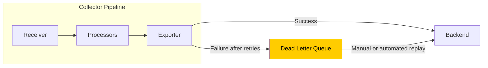
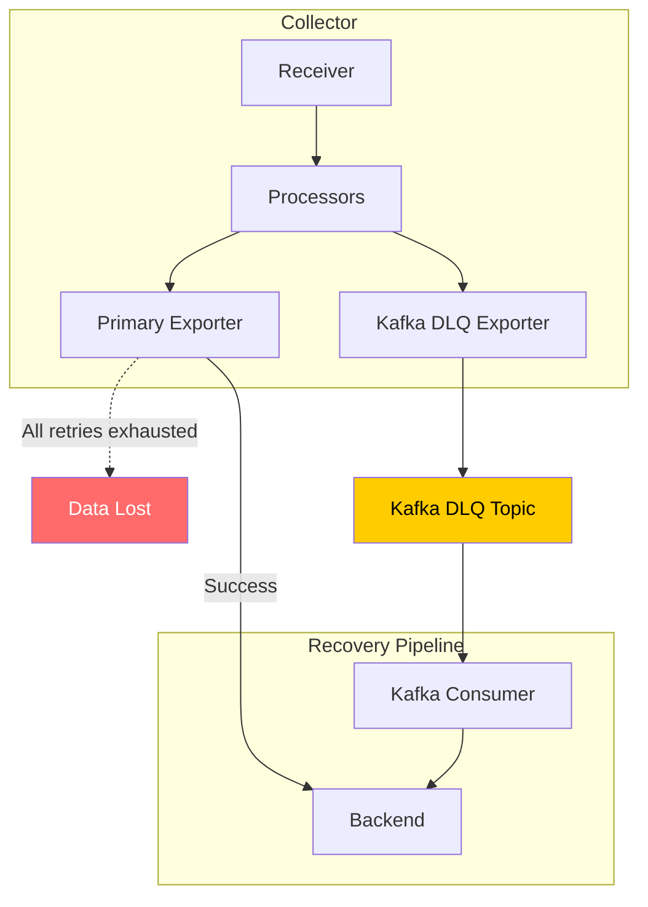
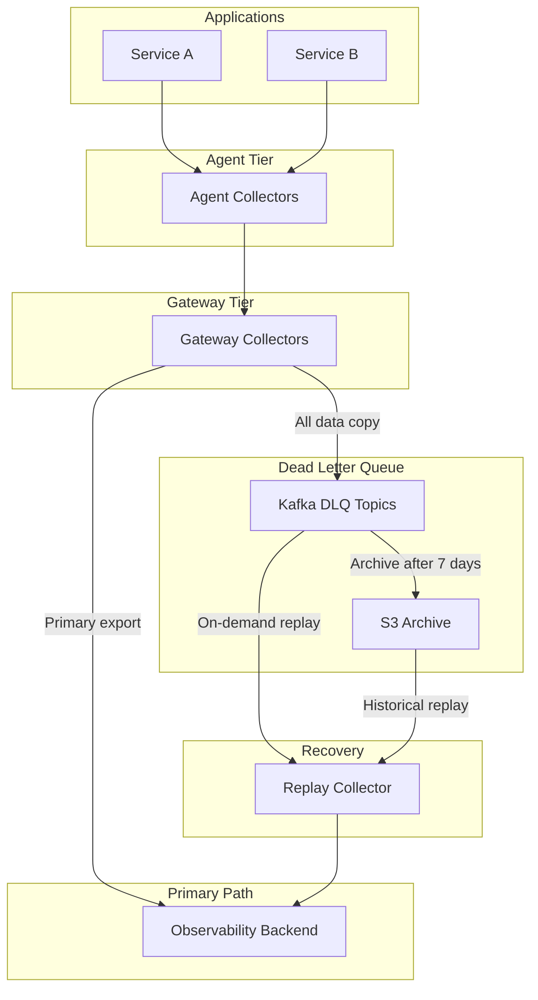

# How to Configure Dead Letter Queues for Failed OpenTelemetry Exports

Author: [nawazdhandala](https://www.github.com/nawazdhandala)

Tags: OpenTelemetry, Dead Letter Queue, Export Failures, Data Recovery, Reliability

Description: Learn how to set up dead letter queues for OpenTelemetry export failures so you never permanently lose telemetry data, with file-based, Kafka, and S3 implementations.

---

When an OpenTelemetry export fails after all retries are exhausted, the data is gone. The sending queue drops the batch, the exporter moves on, and you have a gap in your telemetry. Dead letter queues (DLQs) catch these failed exports and store them somewhere safe so you can investigate and replay them later.

This guide shows you how to build dead letter queue patterns into your OpenTelemetry pipeline, from simple file-based approaches to production-grade Kafka and S3 implementations.

## Why You Need a Dead Letter Queue

The retry mechanism in the OpenTelemetry Collector is good, but it has limits. Once `max_elapsed_time` passes, the batch is dropped. During a prolonged backend outage, even a persistent sending queue will eventually fill up and start dropping the oldest batches.

A DLQ captures these dropped batches so you can:

- **Investigate failures**: Understand why exports are failing by examining the actual data.
- **Replay data**: After the backend recovers, replay the DLQ data to fill in gaps.
- **Audit compliance**: Some industries require that telemetry data is never permanently lost.



## File-Based Dead Letter Queue

The simplest DLQ writes failed exports to local files. This works well for single-collector deployments and is easy to set up.

The idea is to use the fan-out capability of the collector pipeline. You send data to both your primary exporter and a file exporter. The file exporter acts as your DLQ, but you only want it to receive data that the primary exporter failed to deliver.

Since the collector does not have a native "on-failure-route-to" mechanism, we use a different approach: a separate pipeline that writes everything to a file, combined with aggressive rotation to keep disk usage manageable.

```yaml
# collector-config-with-file-dlq.yaml
receivers:
  otlp:
    protocols:
      grpc:
        endpoint: 0.0.0.0:4317

processors:
  memory_limiter:
    check_interval: 1s
    limit_mib: 1536
    spike_limit_mib: 384

  batch:
    send_batch_size: 1024
    timeout: 5s

exporters:
  # Primary exporter to your backend
  otlp/primary:
    endpoint: backend.observability.svc:4317
    retry_on_failure:
      enabled: true
      initial_interval: 5s
      max_interval: 60s
      max_elapsed_time: 300s
    sending_queue:
      enabled: true
      queue_size: 5000
      storage: file_storage/primary

  # File-based DLQ exporter
  # This writes all data to local files as a safety net
  # The files can be replayed if the primary exporter loses data
  file/dlq:
    path: /var/lib/otel/dlq/traces.jsonl
    rotation:
      # Rotate files at 100 MB
      max_megabytes: 100
      # Keep rotated files for 7 days
      max_days: 7
      # Keep a maximum of 50 backup files (5 GB total)
      max_backups: 50
    # Use JSON format so the data is human-readable and
    # can be replayed with standard tools
    format: json

extensions:
  file_storage/primary:
    directory: /var/lib/otel/queue/primary

service:
  extensions: [file_storage/primary]
  pipelines:
    # Primary pipeline to the backend
    traces:
      receivers: [otlp]
      processors: [memory_limiter, batch]
      exporters: [otlp/primary, file/dlq]
```

To replay data from the file DLQ, you can use a separate collector instance that reads from the files:

```yaml
# replay-collector-config.yaml
# Run this collector to replay DLQ data back to the backend
receivers:
  # Use the filelog receiver to read the DLQ files
  filelog:
    include:
      - /var/lib/otel/dlq/traces*.jsonl
    start_at: beginning
    # Do not delete files after reading -- that is a manual step
    # after you verify the replay was successful

exporters:
  otlp:
    endpoint: backend.observability.svc:4317
    retry_on_failure:
      enabled: true
      initial_interval: 10s
      max_interval: 120s
    sending_queue:
      enabled: true
      # Use fewer consumers during replay to avoid
      # overwhelming the backend
      num_consumers: 3
      queue_size: 1000

service:
  pipelines:
    logs:
      receivers: [filelog]
      exporters: [otlp]
```

## Kafka-Based Dead Letter Queue

For production environments, Kafka is a much better DLQ than local files. It provides durability, replication, and the ability to replay data without running a special collector.



The Kafka DLQ exporter writes every batch to Kafka. This gives you a complete copy of all telemetry, not just the failed exports. You can use this for replay, auditing, or feeding data to a secondary analysis system.

```yaml
# collector-config-with-kafka-dlq.yaml
receivers:
  otlp:
    protocols:
      grpc:
        endpoint: 0.0.0.0:4317

processors:
  memory_limiter:
    check_interval: 1s
    limit_mib: 2048
    spike_limit_mib: 512

  batch:
    send_batch_size: 1024
    timeout: 5s

exporters:
  # Primary exporter
  otlp/primary:
    endpoint: backend.observability.svc:4317
    retry_on_failure:
      enabled: true
      initial_interval: 5s
      max_interval: 60s
      max_elapsed_time: 300s
    sending_queue:
      enabled: true
      queue_size: 5000
      storage: file_storage

  # Kafka DLQ exporter
  # Writes all telemetry to a Kafka topic as a durable backup
  kafka/dlq:
    brokers:
      - kafka-1.kafka.svc:9092
      - kafka-2.kafka.svc:9092
      - kafka-3.kafka.svc:9092
    topic: otel-dlq-traces
    encoding: otlp_proto
    producer:
      # Use snappy compression to reduce Kafka storage
      compression: snappy
      # Wait for all replicas to acknowledge for durability
      required_acks: -1
      max_message_bytes: 10000000
    # The DLQ exporter should have its own retry and queue
    # so failures here do not affect the primary exporter
    retry_on_failure:
      enabled: true
      initial_interval: 1s
      max_interval: 30s
    sending_queue:
      enabled: true
      queue_size: 2000

extensions:
  file_storage:
    directory: /var/lib/otel/queue

service:
  extensions: [file_storage]
  pipelines:
    traces:
      receivers: [otlp]
      processors: [memory_limiter, batch]
      # Send to both primary and DLQ
      exporters: [otlp/primary, kafka/dlq]
```

Set up the Kafka DLQ topic with long retention:

```bash
# Create the DLQ topic with 7-day retention
# Long retention gives you plenty of time to investigate
# and replay failed data
kafka-topics.sh --create \
  --bootstrap-server kafka-1.kafka.svc:9092 \
  --topic otel-dlq-traces \
  --partitions 6 \
  --replication-factor 3 \
  --config retention.ms=604800000 \
  --config retention.bytes=107374182400

# Create DLQ topics for metrics and logs as well
kafka-topics.sh --create \
  --bootstrap-server kafka-1.kafka.svc:9092 \
  --topic otel-dlq-metrics \
  --partitions 6 \
  --replication-factor 3 \
  --config retention.ms=604800000

kafka-topics.sh --create \
  --bootstrap-server kafka-1.kafka.svc:9092 \
  --topic otel-dlq-logs \
  --partitions 6 \
  --replication-factor 3 \
  --config retention.ms=604800000
```

## S3-Based Dead Letter Queue

For long-term archival, writing failed exports to S3 (or any S3-compatible storage) gives you virtually unlimited retention at low cost.

```yaml
# collector-config-with-s3-dlq.yaml
exporters:
  # Primary exporter
  otlp/primary:
    endpoint: backend.observability.svc:4317
    retry_on_failure:
      enabled: true
      initial_interval: 5s
      max_interval: 60s
      max_elapsed_time: 300s
    sending_queue:
      enabled: true
      queue_size: 5000

  # S3 DLQ exporter using the AWS S3 exporter
  awss3/dlq:
    s3uploader:
      region: us-east-1
      # Use a dedicated bucket for DLQ data
      s3_bucket: otel-dead-letter-queue
      # Organize by date for easy browsing and lifecycle policies
      s3_prefix: "traces/"
      # Partition by date
      s3_partition: minute
      # Use gzip compression to reduce storage costs
      compression: gzip
      # Buffer data for 5 minutes before uploading
      # This reduces the number of S3 PUT requests
      file_prefix: "dlq-"

    # Marshal as OTLP proto for efficient storage and
    # easy replay with another collector
    marshaler: otlp_proto

service:
  pipelines:
    traces:
      receivers: [otlp]
      processors: [memory_limiter, batch]
      exporters: [otlp/primary, awss3/dlq]
```

Set up S3 lifecycle policies to manage costs:

```json
{
  "Rules": [
    {
      "ID": "TransitionToGlacier",
      "Status": "Enabled",
      "Filter": {
        "Prefix": "traces/"
      },
      "Transitions": [
        {
          "Days": 30,
          "StorageClass": "GLACIER"
        }
      ],
      "Expiration": {
        "Days": 365
      }
    }
  ]
}
```

## Replaying Data from a DLQ

The replay process depends on your DLQ backend. Here is how to replay from each:

### Replaying from Kafka

```yaml
# kafka-replay-collector.yaml
# Dedicated collector for replaying DLQ data
receivers:
  kafka:
    brokers:
      - kafka-1.kafka.svc:9092
    topic: otel-dlq-traces
    group_id: otel-dlq-replay
    encoding: otlp_proto
    # Start from the specific offset where the outage began
    # Use "earliest" to replay everything, or set specific offsets
    initial_offset: earliest

processors:
  # Rate limit the replay to avoid overwhelming the backend
  # that just recovered
  rate_limiting:
    spans_per_second: 10000

  batch:
    send_batch_size: 512
    timeout: 5s

exporters:
  otlp:
    endpoint: backend.observability.svc:4317
    timeout: 30s
    retry_on_failure:
      enabled: true
      initial_interval: 10s
      max_interval: 120s
    sending_queue:
      enabled: true
      num_consumers: 3
      queue_size: 500

service:
  pipelines:
    traces:
      receivers: [kafka]
      processors: [rate_limiting, batch]
      exporters: [otlp]
```

### Replaying from S3

```bash
#!/bin/bash
# replay-from-s3.sh
# Downloads DLQ data from S3 and replays it through a collector

BUCKET="otel-dead-letter-queue"
PREFIX="traces/"
START_DATE="2026-02-06"
END_DATE="2026-02-07"
LOCAL_DIR="/tmp/dlq-replay"
COLLECTOR_ENDPOINT="localhost:4317"

# Download the DLQ files for the outage period
echo "Downloading DLQ data from S3..."
mkdir -p "$LOCAL_DIR"
aws s3 sync "s3://$BUCKET/$PREFIX" "$LOCAL_DIR" \
  --exclude "*" \
  --include "*${START_DATE}*" \
  --include "*${END_DATE}*"

# Count the files to replay
FILE_COUNT=$(find "$LOCAL_DIR" -name "*.gz" | wc -l)
echo "Found $FILE_COUNT files to replay"

# Start a replay collector that reads from the downloaded files
# and sends to the backend
echo "Starting replay..."
# Use telemetrygen or a custom tool to send the OTLP proto files
# back through the pipeline
for file in "$LOCAL_DIR"/*.gz; do
  echo "Replaying: $file"
  gunzip -c "$file" | \
    otel-replay-tool --endpoint="$COLLECTOR_ENDPOINT" --input=-
  # Add a small delay between files to avoid overwhelming the backend
  sleep 1
done

echo "Replay complete"
```

## Monitoring Your Dead Letter Queue

Track the health of your DLQ to make sure it is working and to know when you need to replay data:

```promql
# Rate of data flowing to the DLQ exporter
# Any non-zero sustained rate means primary exports are failing
rate(otelcol_exporter_sent_spans{exporter="kafka/dlq"}[5m])

# DLQ exporter failures -- if the DLQ itself is failing,
# you have a serious problem
rate(otelcol_exporter_send_failed_spans{exporter="kafka/dlq"}[5m])

# Kafka DLQ topic size (consumer lag)
# This tells you how much unreplayed data is in the DLQ
kafka_consumer_group_lag{topic="otel-dlq-traces", group="otel-dlq-replay"}
```

Alert when the DLQ is accumulating data:

```yaml
groups:
  - name: dlq-alerts
    rules:
      - alert: DLQAccumulatingData
        expr: >
          increase(otelcol_exporter_sent_spans{exporter=~".*dlq.*"}[1h]) > 0
          and
          rate(otelcol_exporter_send_failed_spans{exporter="otlp/primary"}[5m]) > 0
        for: 15m
        labels:
          severity: warning
        annotations:
          summary: "DLQ is accumulating data due to primary export failures"
          description: "The primary exporter is failing and data is accumulating in the dead letter queue. Investigate the primary backend and plan a DLQ replay."

      - alert: DLQExporterFailing
        expr: rate(otelcol_exporter_send_failed_spans{exporter=~".*dlq.*"}[5m]) > 0
        for: 5m
        labels:
          severity: critical
        annotations:
          summary: "Dead letter queue exporter is failing"
          description: "Both the primary exporter and the DLQ exporter are failing. Telemetry data is being permanently lost."
```

## Complete DLQ Architecture

Here is the full picture of how a DLQ fits into a production pipeline:



## Wrapping Up

Dead letter queues are your insurance policy against permanent telemetry data loss. The simplest approach is a file-based DLQ on the collector's local disk. For production, use Kafka for its durability and replay capabilities, and add S3 for long-term archival. The key is to always have a secondary destination for your telemetry data, monitor the DLQ for accumulation, and have a tested replay procedure ready to go. When your primary backend goes down for two hours at 3 AM, you will be glad you set this up.
