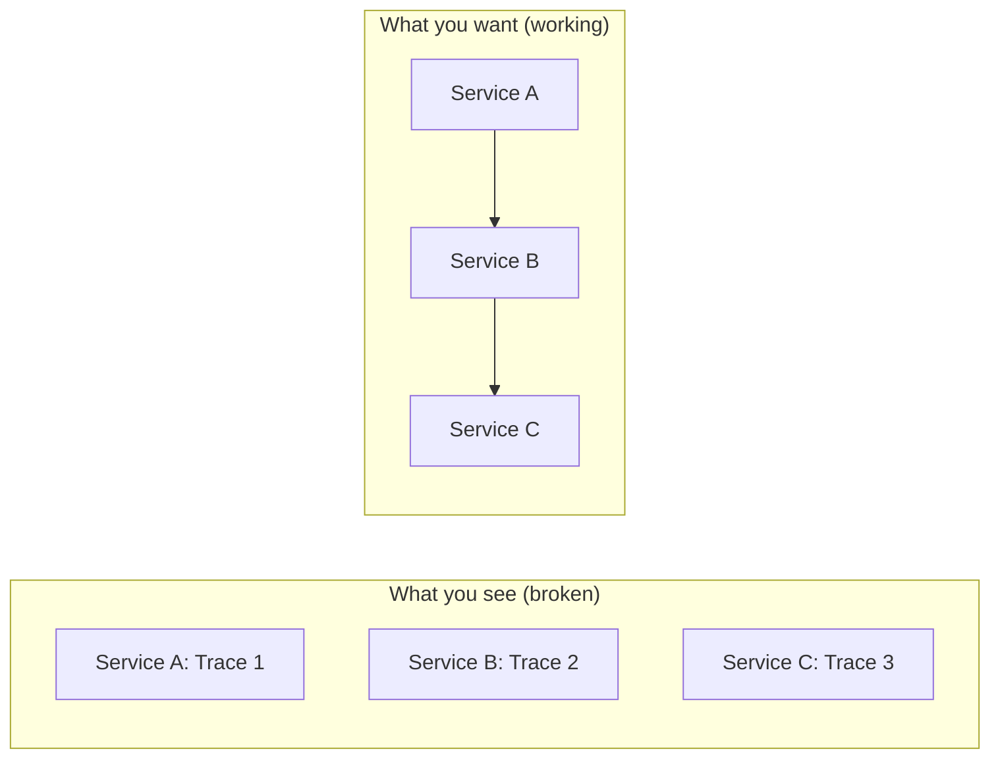

# How to Debug Broken Context Propagation in Distributed Systems

Author: [nawazdhandala](https://www.github.com/nawazdhandala)

Tags: OpenTelemetry, Context Propagation, Debugging, Distributed Tracing, Troubleshooting, Observability

Description: A practical guide to diagnosing and fixing broken OpenTelemetry context propagation in distributed systems with real debugging techniques.

---

You have instrumented your services with OpenTelemetry. Spans are being created. Data is flowing to your backend. But when you look at your traces, they are fragmented. Instead of one trace showing the full journey of a request across services, you see a bunch of disconnected single-service traces. Each service starts its own root span. The trace IDs do not match across service boundaries.

This is broken context propagation, and it is probably the single most common issue teams face when rolling out distributed tracing. The good news is that there is a systematic way to diagnose and fix it. This guide walks you through the debugging process from symptoms to solutions.

## Recognizing the Symptoms

Before you can fix the problem, you need to confirm that context propagation is actually what is broken. Here are the telltale signs:

**Symptom 1: Every service has its own root span.** When you search for traces, you see many short traces (one or two spans each) instead of long traces that span multiple services. Each service generates its own trace ID.

**Symptom 2: Trace IDs change at service boundaries.** If you log the trace ID on both sides of a service call, the IDs are different. Service A logs trace ID `abc123` on the outgoing request, but Service B logs trace ID `def456` for the incoming request.

**Symptom 3: Spans have no parent.** Consumer spans, downstream service spans, or async worker spans all show `parentSpanId: null` or `parentSpanId: 0000000000000000`.



## Step 1: Verify Header Injection

The first thing to check is whether the calling service is actually injecting trace context headers into outgoing requests. The W3C Trace Context standard uses two headers: `traceparent` and `tracestate`.

Add debug logging to your HTTP client to see what headers are being sent:

```python
# debug_injection.py - Log outgoing headers to verify injection
import logging
import requests
from opentelemetry import trace

logger = logging.getLogger(__name__)
tracer = trace.get_tracer(__name__)

def call_downstream_service(url: str, payload: dict):
    with tracer.start_as_current_span("call-downstream") as span:
        # Log the current span context
        ctx = span.get_span_context()
        logger.info(
            f"Current span - trace_id: {format(ctx.trace_id, '032x')}, "
            f"span_id: {format(ctx.span_id, '016x')}"
        )

        response = requests.get(url, json=payload)

        # Log the actual headers that were sent
        # requests stores prepared request headers
        logger.info(f"Request headers sent: {response.request.headers}")

        # Check specifically for traceparent
        traceparent = response.request.headers.get("traceparent")
        if traceparent:
            logger.info(f"traceparent header present: {traceparent}")
        else:
            logger.warning("WARNING: No traceparent header in outgoing request!")

        return response
```

If the `traceparent` header is missing from outgoing requests, the problem is on the injection side. Common causes include:

- The HTTP client library is not instrumented. For Python `requests`, you need `opentelemetry-instrumentation-requests` installed and activated.
- The propagator is not configured. Check that `W3CTraceContextTextMapPropagator` is set as the global propagator.
- There is no active span when the request is made. If the call happens outside a span context, there is nothing to propagate.

```python
# check_propagator_config.py - Verify propagator setup
from opentelemetry.propagate import get_global_textmap

# This should print the configured propagator
propagator = get_global_textmap()
print(f"Global propagator: {type(propagator).__name__}")
# Expected: CompositePropagator or W3CTraceContextTextMapPropagator
# If this shows NoOpTextMapPropagator, propagation is disabled
```

## Step 2: Verify Header Extraction

If headers are being sent correctly, the next place to check is the receiving service. Is it extracting the trace context from incoming request headers?

```python
# debug_extraction.py - Log incoming headers to verify extraction
from flask import Flask, request
from opentelemetry import trace
import logging

logger = logging.getLogger(__name__)
app = Flask(__name__)

@app.before_request
def log_trace_headers():
    """Log incoming trace context headers for debugging."""
    traceparent = request.headers.get("traceparent")
    tracestate = request.headers.get("tracestate")

    logger.info(f"Incoming traceparent: {traceparent}")
    logger.info(f"Incoming tracestate: {tracestate}")

    # Also log the current span to see if extraction worked
    current_span = trace.get_current_span()
    ctx = current_span.get_span_context()
    logger.info(
        f"Active span - trace_id: {format(ctx.trace_id, '032x')}, "
        f"span_id: {format(ctx.span_id, '016x')}, "
        f"is_valid: {ctx.is_valid}"
    )

    # Compare: the trace_id from traceparent should match the active span's trace_id
    if traceparent:
        incoming_trace_id = traceparent.split("-")[1]
        active_trace_id = format(ctx.trace_id, "032x")
        if incoming_trace_id == active_trace_id:
            logger.info("Context propagation is WORKING")
        else:
            logger.warning(
                f"Context propagation BROKEN: incoming={incoming_trace_id}, "
                f"active={active_trace_id}"
            )
```

If the headers arrive but the trace IDs do not match, the extraction is failing. Check these common causes:

- The server framework instrumentation is missing or not initialized. For Flask, you need `opentelemetry-instrumentation-flask`.
- There is a reverse proxy or middleware stripping the headers before they reach your application.
- The propagator formats do not match. If the sender uses W3C format but the receiver expects B3 format (or vice versa), extraction will silently fail.

## Step 3: Check for Middleware and Proxy Interference

API gateways, load balancers, reverse proxies, and middleware layers can all strip or modify trace context headers. This is one of the most common causes of broken propagation in production.

```bash
# Use curl to verify headers pass through your infrastructure
# Send a request with a known traceparent and check if it arrives

# First, test directly against the service (bypassing proxy)
curl -v -H "traceparent: 00-11111111111111111111111111111111-2222222222222222-01" \
  http://service-b:8080/api/test 2>&1 | grep -i traceparent

# Then test through your proxy/gateway
curl -v -H "traceparent: 00-11111111111111111111111111111111-2222222222222222-01" \
  http://gateway:8080/api/test 2>&1 | grep -i traceparent
```

If the direct call works but the proxy call does not, you have found your culprit. Common infrastructure that strips headers:

- **Nginx**: Does not forward custom headers by default in some configurations. Add `proxy_pass_request_headers on;` or explicitly pass the headers.
- **AWS ALB/API Gateway**: Some configurations filter non-standard headers.
- **Service meshes**: Istio and Linkerd have their own trace context handling that can interfere with application-level propagation.

## Step 4: Verify Propagator Format Matching

A subtle but common problem is propagator format mismatch. Service A sends context in W3C format, but Service B is configured to read B3 format. Both services think they are doing propagation correctly, but they are speaking different protocols.

```python
# check_propagator_formats.py - Verify both services use the same format
from opentelemetry.propagate import get_global_textmap

propagator = get_global_textmap()
print(f"Propagator type: {type(propagator).__name__}")

# If using CompositePropagator, check what formats it includes
if hasattr(propagator, "_propagators"):
    for p in propagator._propagators:
        print(f"  - {type(p).__name__}")
```

The fix is to make sure all services agree on the propagation format. The safest approach is to configure a composite propagator that supports multiple formats:

```python
# configure_composite_propagator.py
from opentelemetry.propagate import set_global_textmap
from opentelemetry.propagators.composite import CompositePropagator
from opentelemetry.trace.propagation import TraceContextTextMapPropagator
from opentelemetry.propagators.b3 import B3MultiFormat

# Support both W3C and B3 formats for maximum compatibility
set_global_textmap(
    CompositePropagator([
        TraceContextTextMapPropagator(),  # W3C Trace Context
        B3MultiFormat(),                   # Zipkin B3 multi-header
    ])
)
```

You can also configure this through environment variables without code changes:

```bash
# Set propagators via environment variable
export OTEL_PROPAGATORS=tracecontext,b3multi
```

## Step 5: Check for Context Loss in Async Code

If synchronous service-to-service calls work fine but async operations break, the problem is likely context loss across async boundaries. This is covered in detail in our post on async context propagation, but here is a quick diagnostic:

```python
# diagnose_async_context.py - Check if context survives async boundaries
import asyncio
from opentelemetry import trace, context

tracer = trace.get_tracer(__name__)

async def check_context_in_async():
    with tracer.start_as_current_span("parent-span") as parent:
        parent_trace_id = format(parent.get_span_context().trace_id, "032x")
        print(f"Parent trace_id: {parent_trace_id}")

        # Check context after await
        await asyncio.sleep(0.1)

        current = trace.get_current_span()
        current_trace_id = format(current.get_span_context().trace_id, "032x")
        print(f"After await trace_id: {current_trace_id}")

        if parent_trace_id == current_trace_id:
            print("Async context propagation is WORKING")
        else:
            print("Async context propagation is BROKEN")
            print("Check your context manager configuration")
```

## Step 6: Use the OpenTelemetry Collector as a Diagnostic Tool

The OpenTelemetry Collector can help you see exactly what trace data your services are sending. Enable the logging exporter at debug level to see every span:

```yaml
# collector-debug.yaml
receivers:
  otlp:
    protocols:
      grpc:
        endpoint: 0.0.0.0:4317
      http:
        endpoint: 0.0.0.0:4318

exporters:
  # Debug exporter logs every span to stdout
  debug:
    verbosity: detailed

  # Your normal exporter
  otlp:
    endpoint: backend:4317

service:
  pipelines:
    traces:
      receivers: [otlp]
      exporters: [debug, otlp]
```

With verbose logging enabled, you can see the trace ID, parent span ID, and all attributes of every span. Look for spans from different services that should share a trace ID but do not.

## A Systematic Debugging Checklist

When you encounter broken context propagation, work through this checklist in order:

1. **Is the propagator configured?** Check `OTEL_PROPAGATORS` env var or programmatic setup on both sides.
2. **Is the HTTP client instrumented?** The client library needs an instrumentation package to inject headers automatically.
3. **Is the HTTP server instrumented?** The server framework needs an instrumentation package to extract headers automatically.
4. **Are headers reaching the server?** Log incoming headers to confirm nothing is stripping them.
5. **Do propagator formats match?** Both sides must agree on W3C, B3, or another format.
6. **Is there a proxy in the middle?** Test with and without infrastructure to isolate the problem.
7. **Is context surviving async boundaries?** Check for thread pools, goroutines, or promise chains that lose context.
8. **Are spans being created within the correct context?** A span created outside of an active context will be a root span.

## Building a Propagation Health Check

For ongoing monitoring, consider adding a propagation health check endpoint that you can probe from upstream services:

```python
# propagation_healthcheck.py
from flask import Flask, request, jsonify
from opentelemetry import trace

app = Flask(__name__)

@app.route("/debug/propagation")
def propagation_check():
    """Endpoint that reports whether trace context was received."""
    incoming_traceparent = request.headers.get("traceparent", "none")

    current_span = trace.get_current_span()
    ctx = current_span.get_span_context()

    return jsonify({
        "incoming_traceparent": incoming_traceparent,
        "active_trace_id": format(ctx.trace_id, "032x"),
        "active_span_id": format(ctx.span_id, "016x"),
        "context_valid": ctx.is_valid,
        "propagation_working": (
            incoming_traceparent != "none"
            and incoming_traceparent.split("-")[1] == format(ctx.trace_id, "032x")
        ),
    })
```

Call this endpoint from another service with a known traceparent, and you get an instant answer about whether propagation is working through your entire stack.

## Wrapping Up

Debugging context propagation is methodical work. Start by confirming what is being sent, then what is being received, then what is happening in between. Most problems fall into a few categories: missing instrumentation, misconfigured propagators, infrastructure stripping headers, or context loss across async boundaries. By working through the checklist systematically, you can usually identify and fix the problem in minutes rather than hours.
