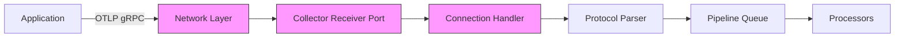

# How to Debug Collector Receiver Connection Drops

Author: [nawazdhandala](https://www.github.com/nawazdhandala)

Tags: OpenTelemetry, Collector, Troubleshooting, Receivers, Network, Debugging

Description: Step-by-step guide to diagnosing and fixing connection drops in OpenTelemetry Collector receivers with practical debugging techniques and configuration solutions.

Connection drops in OpenTelemetry Collector receivers cause gaps in your observability data, leading to incomplete traces, missing metrics, and lost logs. When applications can't reliably send telemetry to the collector, you lose visibility exactly when you need it most. This guide provides systematic approaches to identify and resolve receiver connection issues.

## Understanding Receiver Connection Architecture

The OpenTelemetry Collector receivers accept telemetry data through various protocols. Understanding the connection flow helps identify where failures occur.



Connection drops can happen at any point in this chain. The network layer, port binding, connection handling, and backpressure from downstream components all play a role.

## Common Symptoms of Connection Drops

Before debugging, recognize these telltale signs:

- Applications log "connection refused" or "connection reset" errors
- Intermittent gaps in traces or metrics in your backend
- Receiver metrics show declining connection counts
- High retry rates in application instrumentation
- Increased latency in telemetry delivery

## Diagnostic Strategy

### Step 1: Verify Network Connectivity

Start with basic network validation to rule out infrastructure issues.

```bash
# From the application pod, test connectivity to collector
kubectl exec -it <app-pod> -n <namespace> -- sh

# Test DNS resolution
nslookup otel-collector.observability.svc.cluster.local

# Test port connectivity for OTLP gRPC (4317)
nc -zv otel-collector.observability.svc.cluster.local 4317

# Test port connectivity for OTLP HTTP (4318)
nc -zv otel-collector.observability.svc.cluster.local 4318

# Check if collector endpoints are reachable
curl -v http://otel-collector.observability.svc.cluster.local:4318/v1/traces
```

If basic connectivity works but connections still drop, the issue lies deeper in the collector configuration or resource constraints.

### Step 2: Enable Detailed Receiver Logging

Configure the collector to log receiver-level details.

```yaml
# otel-collector-config.yaml
receivers:
  otlp:
    protocols:
      grpc:
        endpoint: 0.0.0.0:4317
        # Configure transport settings
        transport: tcp
        # Maximum message size (default 4MB)
        max_recv_msg_size_mib: 4
        # Maximum concurrent streams per connection
        max_concurrent_streams: 100
        # Connection timeout
        read_buffer_size: 524288
        write_buffer_size: 524288

        # Keep-alive settings to detect dead connections
        keepalive:
          # Send keepalive pings every 30 seconds
          server_parameters:
            max_connection_idle: 60s
            max_connection_age: 120s
            max_connection_age_grace: 20s
            time: 30s
            timeout: 10s
          # Require clients to send keepalive pings
          enforcement_policy:
            min_time: 10s
            permit_without_stream: true

      http:
        endpoint: 0.0.0.0:4318
        # CORS settings for browser-based clients
        cors:
          allowed_origins:
          - "https://*.example.com"
          allowed_headers:
          - "*"
          max_age: 7200

service:
  telemetry:
    logs:
      # Enable debug logging for receivers
      level: debug
      # Include detailed caller information
      development: true
      # Add sampling to reduce log volume in production
      sampling:
        enabled: true
        # Log first 100 messages then 1 in 100
        initial: 100
        thereafter: 100

    # Enable internal metrics from the collector itself
    metrics:
      level: detailed
      # Expose metrics on port 8888
      address: 0.0.0.0:8888

  pipelines:
    traces:
      receivers: [otlp]
      processors: [batch]
      exporters: [logging, otlp]
```

Deploy this configuration and watch logs for receiver connection events:

```bash
# Monitor collector logs in real-time
kubectl logs -f deployment/otel-collector -n observability | grep -E "receiver|connection|error"

# Filter for specific connection errors
kubectl logs deployment/otel-collector -n observability --since=10m | grep -i "refused\|reset\|timeout\|closed"
```

### Step 3: Examine Receiver Metrics

The collector exposes internal metrics that reveal connection health.

```yaml
# prometheus-scrape-config.yaml
scrape_configs:
- job_name: 'otel-collector'
  scrape_interval: 15s
  static_configs:
  - targets: ['otel-collector.observability.svc.cluster.local:8888']

  # Relabel to add collector instance
  relabel_configs:
  - source_labels: [__address__]
    target_label: instance
    regex: '([^:]+).*'
    replacement: '${1}'
```

Key metrics to monitor for receiver health:

```promql
# Number of accepted connections (should be stable or growing)
otelcol_receiver_accepted_spans

# Number of refused connections (should be zero or very low)
otelcol_receiver_refused_spans

# Receiver processing errors
rate(otelcol_receiver_refused_spans[5m])

# Connection count per receiver
otelcol_receiver_accepted_connections

# Data received rate
rate(otelcol_receiver_accepted_spans[1m])
```

Create alerts for connection issues:

```yaml
# prometheus-alerts.yaml
groups:
- name: otel-collector-receivers
  interval: 30s
  rules:
  # Alert when receivers start refusing connections
  - alert: CollectorReceiverRefusingConnections
    expr: rate(otelcol_receiver_refused_spans[5m]) > 0
    for: 2m
    labels:
      severity: warning
      component: otel-collector
    annotations:
      summary: "Collector receiver refusing connections"
      description: "Collector {{ $labels.instance }} receiver is refusing {{ $value }} spans per second"

  # Alert when no data is being received
  - alert: CollectorReceiverNoData
    expr: rate(otelcol_receiver_accepted_spans[5m]) == 0
    for: 5m
    labels:
      severity: critical
      component: otel-collector
    annotations:
      summary: "Collector receiver not receiving data"
      description: "Collector {{ $labels.instance }} has not received any spans in 5 minutes"
```

## Common Root Causes and Solutions

### 1. Connection Limits Reached

Kubernetes and the collector both impose connection limits. When limits are reached, new connections fail.

```yaml
# deployment.yaml
apiVersion: apps/v1
kind: Deployment
metadata:
  name: otel-collector
  namespace: observability
spec:
  replicas: 3
  selector:
    matchLabels:
      app: otel-collector
  template:
    metadata:
      labels:
        app: otel-collector
    spec:
      containers:
      - name: otel-collector
        image: otel/opentelemetry-collector-contrib:0.93.0

        # Increase file descriptor limit for more connections
        securityContext:
          # Allow increasing nofile limit
          capabilities:
            add:
            - SYS_RESOURCE

        # Configure resource limits to handle connection load
        resources:
          requests:
            cpu: 1000m
            memory: 1Gi
          limits:
            cpu: 2000m
            memory: 2Gi

        # Set ulimits for the container
        env:
        - name: GOMEMLIMIT
          value: "1800MiB"

      # Configure pod to increase connection limits
      initContainers:
      - name: increase-limits
        image: busybox:1.36
        command:
        - sh
        - -c
        - |
          # Increase system connection limits
          sysctl -w net.core.somaxconn=4096
          sysctl -w net.ipv4.tcp_max_syn_backlog=4096
        securityContext:
          privileged: true
```

### 2. Backpressure from Pipeline

When downstream processors or exporters slow down, receivers must buffer data. Once buffers fill, receivers start dropping connections.

```yaml
# otel-collector-config.yaml
receivers:
  otlp:
    protocols:
      grpc:
        endpoint: 0.0.0.0:4317
        # Increase message size for bursty traffic
        max_recv_msg_size_mib: 8

processors:
  # Add memory limiter FIRST to prevent OOM
  memory_limiter:
    check_interval: 1s
    # Refuse new data at 1.8GB
    limit_mib: 1800
    # Start dropping at 1.6GB
    spike_limit_mib: 400

  # Batch processor to reduce export frequency
  batch:
    timeout: 10s
    send_batch_size: 8192
    send_batch_max_size: 16384

  # Add queued retry for failed exports
  queued_retry:
    # Number of retries before dropping
    num_retries: 5
    # Queue size per pipeline
    queue_size: 10000

exporters:
  otlp:
    endpoint: "backend.observability.svc.cluster.local:4317"
    # Configure sending queue to buffer during exporter issues
    sending_queue:
      enabled: true
      # Larger queue to absorb bursts
      queue_size: 10000
      # More consumers for parallel sends
      num_consumers: 20

    # Shorter timeout to fail fast and retry
    timeout: 10s

service:
  pipelines:
    traces:
      # Order matters: memory_limiter should be first
      receivers: [otlp]
      processors: [memory_limiter, batch, queued_retry]
      exporters: [otlp, logging]
```

Monitor queue depth to detect backpressure:

```promql
# Queue utilization (should stay below 80%)
otelcol_exporter_queue_size / otelcol_exporter_queue_capacity

# Failed send attempts (should be zero)
rate(otelcol_exporter_send_failed_spans[5m])
```

### 3. Keep-Alive Configuration Mismatch

Mismatched keep-alive settings between clients and receivers cause premature connection termination.

```yaml
# otel-collector-config.yaml
receivers:
  otlp:
    protocols:
      grpc:
        endpoint: 0.0.0.0:4317

        # Configure keep-alive to match client expectations
        keepalive:
          server_parameters:
            # Close idle connections after 5 minutes
            max_connection_idle: 300s
            # Force connection closure after 30 minutes (prevents memory leaks)
            max_connection_age: 1800s
            # Grace period for active RPCs during age closure
            max_connection_age_grace: 30s
            # Send keep-alive pings every 60 seconds
            time: 60s
            # Wait 20 seconds for ping acknowledgment
            timeout: 20s

          enforcement_policy:
            # Minimum time between client pings
            min_time: 30s
            # Allow keep-alive pings even without active streams
            permit_without_stream: true
```

Configure client applications to match these settings:

```go
// Example Go client configuration
import (
    "go.opentelemetry.io/otel/exporters/otlp/otlptrace/otlptracegrpc"
    "google.golang.org/grpc"
    "google.golang.org/grpc/keepalive"
    "time"
)

func setupTraceExporter(ctx context.Context) (*otlptracegrpc.Exporter, error) {
    // Configure keep-alive parameters to match collector
    keepaliveParams := keepalive.ClientParameters{
        Time:                60 * time.Second, // Send ping every 60s
        Timeout:             20 * time.Second, // Wait 20s for ping ack
        PermitWithoutStream: true,             // Send pings even without active streams
    }

    return otlptracegrpc.New(
        ctx,
        otlptracegrpc.WithEndpoint("otel-collector.observability.svc.cluster.local:4317"),
        otlptracegrpc.WithInsecure(),
        otlptracegrpc.WithDialOption(
            grpc.WithKeepaliveParams(keepaliveParams),
        ),
        // Retry configuration for connection failures
        otlptracegrpc.WithRetry(otlptracegrpc.RetryConfig{
            Enabled:         true,
            InitialInterval: 1 * time.Second,
            MaxInterval:     30 * time.Second,
            MaxElapsedTime:  300 * time.Second,
        }),
    )
}
```

### 4. Service Mesh Interference

Service meshes like Istio inject sidecars that proxy connections, introducing additional points of failure.

```yaml
# deployment-with-istio.yaml
apiVersion: apps/v1
kind: Deployment
metadata:
  name: otel-collector
  namespace: observability
spec:
  template:
    metadata:
      labels:
        app: otel-collector
      annotations:
        # Exclude health check port from mesh
        traffic.sidecar.istio.io/excludeInboundPorts: "13133"
        # Exclude metrics port from mesh
        traffic.sidecar.istio.io/excludeOutboundPorts: "8888"
        # Increase proxy connection limits
        proxy.istio.io/config: |
          concurrency: 4
          connectionTimeout: 30s
          drainDuration: 45s
    spec:
      containers:
      - name: otel-collector
        image: otel/opentelemetry-collector-contrib:0.93.0
        ports:
        - containerPort: 4317
          name: otlp-grpc
          protocol: TCP
        - containerPort: 4318
          name: otlp-http
          protocol: TCP
        - containerPort: 13133
          name: health
          protocol: TCP
```

Create a DestinationRule to configure connection pooling:

```yaml
# istio-destination-rule.yaml
apiVersion: networking.istio.io/v1beta1
kind: DestinationRule
metadata:
  name: otel-collector
  namespace: observability
spec:
  host: otel-collector.observability.svc.cluster.local
  trafficPolicy:
    connectionPool:
      tcp:
        # Maximum connections per backend
        maxConnections: 1000
        # TCP keep-alive time
        tcpKeepalive:
          time: 60s
          interval: 10s
          probes: 3

      http:
        # Maximum requests per connection
        http2MaxRequests: 1000
        # Maximum pending requests
        maxRequestsPerConnection: 100
        # Maximum concurrent requests
        maxRetries: 3

    # Load balancing policy
    loadBalancer:
      simple: LEAST_REQUEST
```

### 5. Load Balancer Connection Tracking

Kubernetes Service load balancers maintain connection tracking tables that can overflow.

```yaml
# service.yaml
apiVersion: v1
kind: Service
metadata:
  name: otel-collector
  namespace: observability
  annotations:
    # Increase connection tracking timeout (cloud-specific)
    service.beta.kubernetes.io/aws-load-balancer-connection-idle-timeout: "300"
    # Use IP mode for better connection distribution
    service.beta.kubernetes.io/aws-load-balancer-target-group-attributes: "preserve_client_ip.enabled=true"
spec:
  type: ClusterIP
  # Use session affinity to reduce connection churn
  sessionAffinity: ClientIP
  sessionAffinityConfig:
    clientIP:
      timeoutSeconds: 300

  ports:
  - name: otlp-grpc
    port: 4317
    targetPort: 4317
    protocol: TCP
  - name: otlp-http
    port: 4318
    targetPort: 4318
    protocol: TCP

  selector:
    app: otel-collector
```

For high-connection scenarios, use headless service with client-side load balancing:

```yaml
# headless-service.yaml
apiVersion: v1
kind: Service
metadata:
  name: otel-collector-headless
  namespace: observability
spec:
  # Headless service returns pod IPs directly
  clusterIP: None
  publishNotReadyAddresses: false

  ports:
  - name: otlp-grpc
    port: 4317
    targetPort: 4317
    protocol: TCP

  selector:
    app: otel-collector
```

Configure clients to use DNS-based load balancing:

```go
// Example client-side load balancing in Go
import (
    "go.opentelemetry.io/otel/exporters/otlp/otlptrace/otlptracegrpc"
    "google.golang.org/grpc"
)

func setupTraceExporter(ctx context.Context) (*otlptracegrpc.Exporter, error) {
    return otlptracegrpc.New(
        ctx,
        // Use headless service for direct pod connections
        otlptracegrpc.WithEndpoint("otel-collector-headless.observability.svc.cluster.local:4317"),
        otlptracegrpc.WithInsecure(),
        // Enable client-side round-robin load balancing
        otlptracegrpc.WithDialOption(
            grpc.WithDefaultServiceConfig(`{"loadBalancingPolicy":"round_robin"}`),
        ),
    )
}
```

## Advanced Debugging Techniques

### Connection Tracing with eBPF

Use eBPF tools to trace TCP connections without modifying the collector.

```bash
# Install bpftrace on a node
kubectl debug node/<node-name> -it --image=ubuntu:22.04

# In the debug pod, install bpftrace
apt-get update && apt-get install -y bpftrace

# Trace TCP connections to port 4317
bpftrace -e 'kprobe:tcp_connect {
  printf("Connection from %s to port %d\n", comm, args->dport);
} kprobe:tcp_close {
  printf("Connection closed from %s\n", comm);
}'

# Monitor connection resets
bpftrace -e 'tracepoint:tcp:tcp_reset {
  printf("TCP reset: %s:%d -> %s:%d\n",
    ntop(args->saddr), args->sport,
    ntop(args->daddr), args->dport);
}'
```

### Packet Capture Analysis

Capture network packets to analyze connection patterns.

```bash
# Run tcpdump in the collector pod
kubectl exec -it deployment/otel-collector -n observability -- sh

# Capture OTLP gRPC traffic
tcpdump -i any -n port 4317 -w /tmp/capture.pcap

# Download capture file for analysis
kubectl cp observability/otel-collector-<pod-id>:/tmp/capture.pcap ./capture.pcap

# Analyze with tshark (Wireshark CLI)
tshark -r capture.pcap -Y "tcp.flags.reset==1" -T fields -e frame.time -e ip.src -e ip.dst
```

### Synthetic Connection Testing

Create a synthetic test client to isolate receiver issues.

```go
// connection-tester.go
package main

import (
    "context"
    "fmt"
    "log"
    "time"

    "go.opentelemetry.io/otel/exporters/otlp/otlptrace/otlptracegrpc"
    "go.opentelemetry.io/otel/sdk/trace"
)

func main() {
    ctx := context.Background()

    // Create exporter with detailed logging
    exporter, err := otlptracegrpc.New(
        ctx,
        otlptracegrpc.WithEndpoint("otel-collector.observability.svc.cluster.local:4317"),
        otlptracegrpc.WithInsecure(),
    )
    if err != nil {
        log.Fatalf("Failed to create exporter: %v", err)
    }
    defer exporter.Shutdown(ctx)

    // Create trace provider
    tp := trace.NewTracerProvider(
        trace.WithBatcher(exporter),
    )
    defer tp.Shutdown(ctx)

    // Send test spans every 5 seconds
    tracer := tp.Tracer("connection-tester")
    ticker := time.NewTicker(5 * time.Second)
    defer ticker.Stop()

    connectionAttempt := 0
    for range ticker.C {
        connectionAttempt++

        _, span := tracer.Start(ctx, fmt.Sprintf("test-span-%d", connectionAttempt))
        span.End()

        log.Printf("Sent test span %d", connectionAttempt)
    }
}
```

Build and deploy this tester:

```yaml
# connection-tester-deployment.yaml
apiVersion: apps/v1
kind: Deployment
metadata:
  name: otel-connection-tester
  namespace: observability
spec:
  replicas: 1
  selector:
    matchLabels:
      app: connection-tester
  template:
    metadata:
      labels:
        app: connection-tester
    spec:
      containers:
      - name: tester
        image: your-registry/connection-tester:latest
        resources:
          requests:
            cpu: 100m
            memory: 128Mi
```

## Monitoring and Alerting

Set up comprehensive monitoring for receiver health:

```yaml
# grafana-dashboard.json (excerpt)
{
  "dashboard": {
    "title": "OpenTelemetry Collector Receivers",
    "panels": [
      {
        "title": "Receiver Accepted Rate",
        "targets": [
          {
            "expr": "rate(otelcol_receiver_accepted_spans[5m])"
          }
        ]
      },
      {
        "title": "Receiver Refused Rate",
        "targets": [
          {
            "expr": "rate(otelcol_receiver_refused_spans[5m])"
          }
        ]
      },
      {
        "title": "Active Connections",
        "targets": [
          {
            "expr": "otelcol_receiver_accepted_connections"
          }
        ]
      },
      {
        "title": "Connection Errors by Type",
        "targets": [
          {
            "expr": "sum by (error_type) (rate(otelcol_receiver_errors[5m]))"
          }
        ]
      }
    ]
  }
}
```

## Prevention Best Practices

1. **Configure appropriate timeouts** at all layers: client, load balancer, and receiver
2. **Use keep-alive settings** consistently across clients and receivers
3. **Monitor connection metrics** proactively and alert on anomalies
4. **Scale receivers horizontally** before connection limits are reached
5. **Implement backpressure handling** in pipelines to prevent receiver overload
6. **Test connection resilience** with synthetic tests and chaos engineering
7. **Document network topology** including service meshes and load balancers

## Related Resources

For more troubleshooting guidance on OpenTelemetry Collector issues:

- [How to Fix Collector Slow Startup in Kubernetes](https://oneuptime.com/blog/post/2026-02-06-fix-collector-slow-startup-kubernetes/view)
- [How to Monitor Collector Queue Depth and Backpressure](https://oneuptime.com/blog/post/2026-02-06-monitor-collector-queue-depth-backpressure/view)
- [How to Fix Collector Exporter Timeout Errors](https://oneuptime.com/blog/post/2026-02-06-fix-collector-exporter-timeout-errors/view)

Connection drops in OpenTelemetry Collector receivers stem from various sources: network issues, configuration mismatches, resource constraints, or downstream backpressure. By systematically diagnosing the problem using logs, metrics, and network analysis, you can identify the root cause and implement targeted fixes that ensure reliable telemetry collection.
