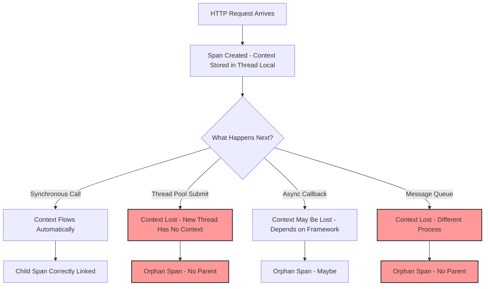
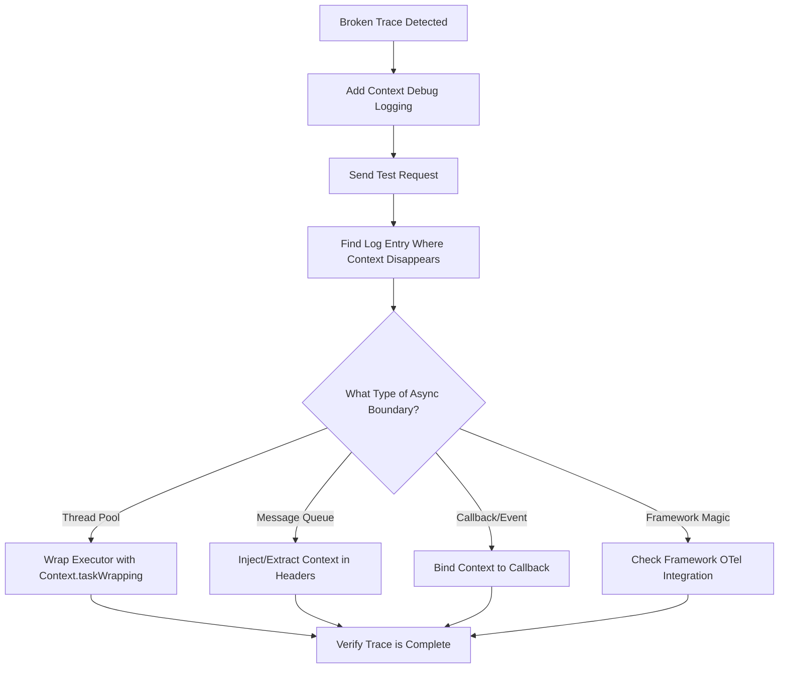

# How to Debug Context Propagation in Asynchronous Applications

Author: [nawazdhandala](https://www.github.com/nawazdhandala)

Tags: OpenTelemetry, Context Propagation, Async, Distributed Tracing, Debugging, Python, Java, Node.js

Description: A practical guide to diagnosing and fixing broken trace context propagation in async code, including thread pools, message queues, and reactive frameworks.

---

One of the most frustrating problems in distributed tracing is when your traces break apart. You expect a single trace spanning multiple services and async operations, but instead you get disconnected fragments. Requests enter a thread pool or message queue and come out the other side with no parent span. Your trace view shows orphan spans floating in space instead of a clean tree.

This almost always comes down to context propagation failing somewhere in your async code. This guide covers how to find where context is being lost and how to fix it.

## How OpenTelemetry Context Propagation Works

OpenTelemetry stores the current span and trace context in a context object. In synchronous code, this context flows naturally through the call stack. But when you hand work off to another thread, a message queue, or an async callback, the context does not automatically follow.



The core issue is that OpenTelemetry stores context in thread-local storage (or the language equivalent). When execution moves to a different thread, that storage is empty.

## Identifying Broken Context: The Symptoms

Before diving into fixes, here is how to confirm that context propagation is actually the problem.

Check your traces for these patterns:

1. **Multiple root spans for a single request** - If one HTTP request produces two or more traces instead of one, context was lost somewhere.
2. **Spans with no parent but they should have one** - An orphan span for a database query that clearly belongs to an HTTP handler.
3. **Trace IDs changing mid-request** - The HTTP handler has one trace ID and the background worker has a different one.

You can verify this programmatically by logging trace context at key points:

```java
// ContextDebugger.java
// Utility class to log the current trace context at any point in your code
// Use this to find exactly where context disappears
import io.opentelemetry.api.trace.Span;
import io.opentelemetry.api.trace.SpanContext;
import org.slf4j.Logger;
import org.slf4j.LoggerFactory;

public class ContextDebugger {

    private static final Logger log = LoggerFactory.getLogger(ContextDebugger.class);

    public static void logContext(String location) {
        // Get the current span from thread-local context
        Span current = Span.current();
        SpanContext ctx = current.getSpanContext();

        if (ctx.isValid()) {
            // Context is present - trace will be connected
            log.info("[{}] TraceID={} SpanID={} Sampled={}",
                    location,
                    ctx.getTraceId(),
                    ctx.getSpanId(),
                    ctx.isSampled());
        } else {
            // Context is missing - this is where the break happens
            log.warn("[{}] NO VALID CONTEXT - trace will be broken here", location);
        }
    }
}
```

Sprinkle calls to `ContextDebugger.logContext()` around your async boundaries to find exactly where context disappears:

```java
// OrderController.java
// Demonstrates adding debug logging before and after an async boundary
public class OrderController {

    public void handleOrder(OrderRequest request) {
        ContextDebugger.logContext("before-thread-pool-submit");

        // This is where context typically gets lost
        executorService.submit(() -> {
            ContextDebugger.logContext("inside-thread-pool-task");
            processOrder(request);
        });
    }
}
```

If the log shows a valid trace ID before the submit but "NO VALID CONTEXT" inside the task, you have found your break point.

## Fix 1: Wrapping Executors in Java

The most common context loss in Java happens when using `ExecutorService` or `CompletableFuture`. The fix is to wrap your executor so that it captures and restores context:

```java
// ContextPropagatingExecutor.java
// Wraps any ExecutorService to automatically propagate OpenTelemetry context
// Every task submitted to this executor will run with the context
// that was active when the task was submitted
import io.opentelemetry.context.Context;
import java.util.concurrent.ExecutorService;
import java.util.concurrent.Executors;

public class ContextPropagatingExecutor {

    public static ExecutorService wrap(ExecutorService delegate) {
        // Context.taskWrapping creates a wrapper that captures current context
        // at submit time and restores it when the task runs
        return Context.taskWrapping(delegate);
    }

    // Usage example
    public static void main(String[] args) {
        // Create a regular thread pool
        ExecutorService rawExecutor = Executors.newFixedThreadPool(10);

        // Wrap it with context propagation
        ExecutorService contextAwareExecutor = wrap(rawExecutor);

        // Now all tasks submitted to contextAwareExecutor will carry
        // the trace context from the submitting thread
        contextAwareExecutor.submit(() -> {
            // Span.current() will return the correct parent span here
            System.out.println("Task running with propagated context");
        });
    }
}
```

For `CompletableFuture`, you need to be more explicit because it uses `ForkJoinPool.commonPool()` by default:

```java
// AsyncOrderProcessor.java
// Shows how to propagate context through CompletableFuture chains
import io.opentelemetry.context.Context;
import java.util.concurrent.CompletableFuture;
import java.util.concurrent.ExecutorService;

public class AsyncOrderProcessor {

    private final ExecutorService executor;

    public AsyncOrderProcessor(ExecutorService rawExecutor) {
        // Wrap the executor once at construction time
        this.executor = Context.taskWrapping(rawExecutor);
    }

    public CompletableFuture<Order> processAsync(OrderRequest request) {
        // Use the wrapped executor for all async operations
        // Context propagates through the entire chain
        return CompletableFuture
                .supplyAsync(() -> validateOrder(request), executor)
                .thenApplyAsync(validated -> chargePayment(validated), executor)
                .thenApplyAsync(charged -> fulfillOrder(charged), executor);
    }

    // Each of these methods will have access to the parent trace context
    private OrderRequest validateOrder(OrderRequest request) { /* ... */ return request; }
    private OrderRequest chargePayment(OrderRequest request) { /* ... */ return request; }
    private Order fulfillOrder(OrderRequest request) { /* ... */ return new Order(); }
}
```

## Fix 2: Context Propagation in Python Async Code

Python's `asyncio` has its own set of context propagation challenges. The OpenTelemetry Python SDK uses `contextvars`, which do propagate through `await` calls but not through raw thread pools:

```python
# context_debug.py
# Demonstrates where context works and where it breaks in Python async code
import asyncio
from opentelemetry import trace
from opentelemetry.context import get_current

tracer = trace.get_tracer("debug-tracer")

async def handle_request():
    with tracer.start_as_current_span("handle_request") as span:
        print(f"Handler trace_id: {span.get_span_context().trace_id:#034x}")

        # This works - await preserves contextvars
        result = await fetch_data()

        # This also works - asyncio.create_task copies contextvars
        task = asyncio.create_task(background_work())
        await task

async def fetch_data():
    # Context is available here because await preserves contextvars
    current_span = trace.get_current_span()
    print(f"fetch_data trace_id: {current_span.get_span_context().trace_id:#034x}")
    return {"data": "value"}

async def background_work():
    # Context is available here because create_task copies context
    current_span = trace.get_current_span()
    print(f"background_work trace_id: {current_span.get_span_context().trace_id:#034x}")
```

The problem arises when you use `loop.run_in_executor()` or `concurrent.futures`:

```python
# broken_context.py
# This code LOSES context because run_in_executor uses a thread pool
import asyncio
from concurrent.futures import ThreadPoolExecutor
from opentelemetry import trace, context

tracer = trace.get_tracer("debug-tracer")
thread_pool = ThreadPoolExecutor(max_workers=4)

async def handle_request():
    with tracer.start_as_current_span("handle_request"):
        # BAD: context is lost when crossing into the thread pool
        loop = asyncio.get_event_loop()
        result = await loop.run_in_executor(thread_pool, blocking_io_call)
        return result

def blocking_io_call():
    # trace.get_current_span() returns INVALID span here
    # because this runs in a different thread with no context
    current = trace.get_current_span()
    print(f"Valid: {current.get_span_context().is_valid}")  # prints False
    return "result"
```

The fix is to manually capture and restore context:

```python
# fixed_context.py
# Properly propagate context into thread pool executors
import asyncio
from concurrent.futures import ThreadPoolExecutor
from opentelemetry import trace, context
from functools import partial

tracer = trace.get_tracer("debug-tracer")
thread_pool = ThreadPoolExecutor(max_workers=4)

def with_context(ctx, fn, *args, **kwargs):
    """Wrapper that restores OpenTelemetry context in a worker thread."""
    # Attach the captured context to this thread
    token = context.attach(ctx)
    try:
        return fn(*args, **kwargs)
    finally:
        # Detach to clean up after ourselves
        context.detach(token)

async def handle_request():
    with tracer.start_as_current_span("handle_request"):
        # Capture the current context before crossing the async boundary
        ctx = context.get_current()

        loop = asyncio.get_event_loop()
        # Pass the captured context into the thread pool
        result = await loop.run_in_executor(
            thread_pool,
            partial(with_context, ctx, blocking_io_call)
        )
        return result

def blocking_io_call():
    # Now trace.get_current_span() returns the correct parent span
    current = trace.get_current_span()
    print(f"Valid: {current.get_span_context().is_valid}")  # prints True
    return "result"
```

## Fix 3: Context Propagation in Node.js

Node.js uses `AsyncLocalStorage` under the hood for OpenTelemetry context. Most async patterns work automatically, but certain patterns break context:

```javascript
// broken-context.js
// Demonstrates where context breaks in Node.js
const { trace } = require('@opentelemetry/api');

const tracer = trace.getTracer('debug-tracer');

function handleRequest(req, res) {
    tracer.startActiveSpan('handleRequest', (span) => {
        // Context works here
        console.log('handler:', trace.getActiveSpan()?.spanContext().traceId);

        // BAD: setTimeout can lose context depending on the setup
        // If AsyncLocalStorage is not properly initialized, this breaks
        setTimeout(() => {
            console.log('timeout:', trace.getActiveSpan()?.spanContext().traceId);
            // May print undefined if context was lost
        }, 100);

        // BAD: Event emitters can lose context
        eventEmitter.on('data', (data) => {
            console.log('event:', trace.getActiveSpan()?.spanContext().traceId);
            // Often undefined because event listeners lose async context
        });

        span.end();
    });
}
```

The fix for Node.js involves making sure you use `context.with()` for any callback-based patterns:

```javascript
// fixed-context.js
// Properly propagate context through callbacks and event emitters
const { trace, context } = require('@opentelemetry/api');

const tracer = trace.getTracer('debug-tracer');

function handleRequest(req, res) {
    tracer.startActiveSpan('handleRequest', (span) => {
        // Capture the active context
        const activeContext = context.active();

        // GOOD: Wrap the setTimeout callback with the captured context
        setTimeout(
            context.bind(activeContext, () => {
                console.log('timeout:', trace.getActiveSpan()?.spanContext().traceId);
                // Now correctly prints the trace ID
            }),
            100
        );

        // GOOD: Bind event listener to the current context
        eventEmitter.on('data',
            context.bind(activeContext, (data) => {
                console.log('event:', trace.getActiveSpan()?.spanContext().traceId);
                // Now correctly prints the trace ID
            })
        );

        span.end();
    });
}
```

## Fix 4: Context Propagation Across Message Queues

When work crosses process boundaries through message queues like Kafka or RabbitMQ, you need to explicitly inject and extract context from message headers:

```java
// KafkaProducerWithContext.java
// Injects trace context into Kafka message headers so the consumer
// can continue the trace
import io.opentelemetry.api.GlobalOpenTelemetry;
import io.opentelemetry.context.Context;
import io.opentelemetry.context.propagation.TextMapSetter;
import org.apache.kafka.clients.producer.ProducerRecord;
import org.apache.kafka.common.header.Headers;

public class KafkaProducerWithContext {

    // TextMapSetter tells the propagator how to write into Kafka headers
    private static final TextMapSetter<Headers> SETTER =
            (carrier, key, value) -> carrier.add(key, value.getBytes());

    public void sendMessage(String topic, String key, String value) {
        ProducerRecord<String, String> record =
                new ProducerRecord<>(topic, key, value);

        // Inject the current trace context into message headers
        // This writes traceparent and tracestate headers
        GlobalOpenTelemetry.getPropagators()
                .getTextMapPropagator()
                .inject(Context.current(), record.headers(), SETTER);

        producer.send(record);
    }
}
```

```java
// KafkaConsumerWithContext.java
// Extracts trace context from Kafka message headers so the consumer
// creates child spans under the producer's trace
import io.opentelemetry.api.GlobalOpenTelemetry;
import io.opentelemetry.api.trace.Span;
import io.opentelemetry.api.trace.Tracer;
import io.opentelemetry.context.Context;
import io.opentelemetry.context.Scope;
import io.opentelemetry.context.propagation.TextMapGetter;
import org.apache.kafka.clients.consumer.ConsumerRecord;
import org.apache.kafka.common.header.Header;
import org.apache.kafka.common.header.Headers;

public class KafkaConsumerWithContext {

    private static final Tracer tracer =
            GlobalOpenTelemetry.getTracer("kafka-consumer");

    // TextMapGetter tells the propagator how to read from Kafka headers
    private static final TextMapGetter<Headers> GETTER = new TextMapGetter<>() {
        @Override
        public Iterable<String> keys(Headers carrier) {
            List<String> keys = new ArrayList<>();
            carrier.forEach(header -> keys.add(header.key()));
            return keys;
        }

        @Override
        public String get(Headers carrier, String key) {
            Header header = carrier.lastHeader(key);
            return header != null ? new String(header.value()) : null;
        }
    };

    public void processMessage(ConsumerRecord<String, String> record) {
        // Extract the trace context from message headers
        Context extractedContext = GlobalOpenTelemetry.getPropagators()
                .getTextMapPropagator()
                .extract(Context.current(), record.headers(), GETTER);

        // Create a new span as a child of the extracted context
        Span span = tracer.spanBuilder("process-message")
                .setParent(extractedContext)
                .startSpan();

        // Make this span the current span for downstream operations
        try (Scope scope = span.makeCurrent()) {
            handleMessage(record.value());
        } finally {
            span.end();
        }
    }
}
```

## A Systematic Debugging Approach

When you encounter broken traces, follow this process:

1. **Add context debug logging** at every async boundary in the request path
2. **Run a single test request** and check the logs for where the trace ID disappears
3. **Identify the async pattern** at the break point (thread pool, message queue, callback)
4. **Apply the appropriate fix** from the patterns above
5. **Verify** by running the test request again and checking that the trace is complete



The most important thing to remember is that context propagation is not magic. It is data being passed from one execution context to another. Whenever that handoff happens implicitly (through a framework) or explicitly (through your code), you need to make sure the trace context comes along for the ride.
