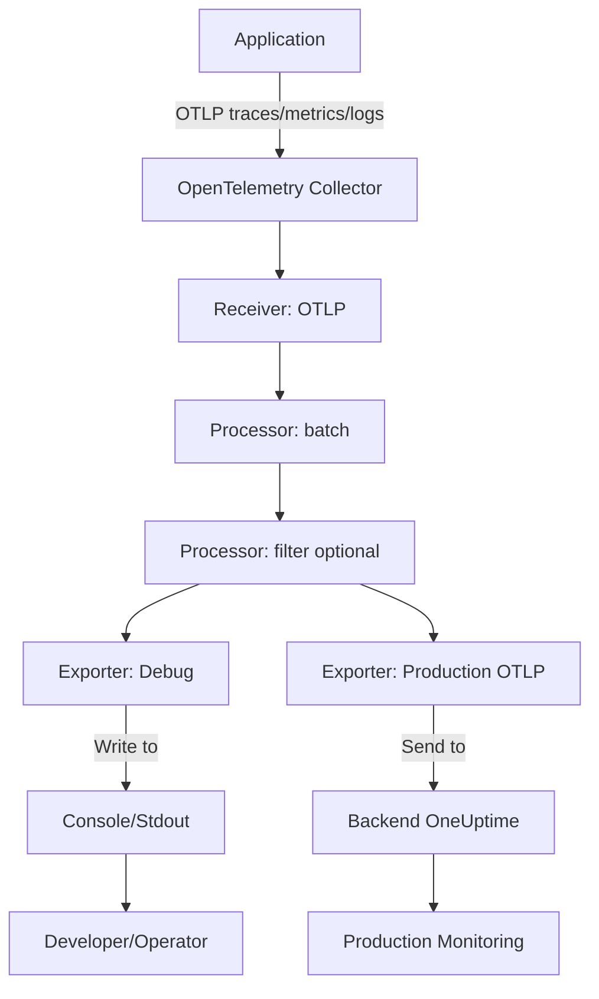

# How to Configure the Debug Exporter in the OpenTelemetry Collector

Author: [nawazdhandala](https://www.github.com/nawazdhandala)

Tags: OpenTelemetry, Collector, Exporters, Debug, Troubleshooting, Development

Description: A practical guide to configuring the Debug exporter in OpenTelemetry Collector for troubleshooting telemetry pipelines, with examples of logging verbosity levels, sampling strategies, and debugging patterns for development and production environments.

---

The Debug exporter is the simplest but most valuable exporter in the OpenTelemetry Collector toolkit. It writes telemetry data (traces, metrics, and logs) directly to the Collector's standard output, making it indispensable for troubleshooting pipeline issues, validating instrumentation, and debugging configuration problems.

Unlike production exporters that send data to external systems, the Debug exporter simply prints telemetry to the console in a human-readable format. This makes it perfect for development, testing, and initial setup phases, though it can also be used carefully in production for targeted debugging.

This guide covers everything from basic setup to advanced filtering, sampling strategies, and best practices for using the Debug exporter effectively.

---

## Why Use the Debug Exporter?

The Debug exporter serves several critical use cases:

**Pipeline validation**: Verify that telemetry actually reaches the Collector and flows through processors correctly.

**Instrumentation testing**: Check that your application is generating the expected spans, metrics, and logs before sending to production backends.

**Configuration debugging**: Test processor transformations, filtering rules, and sampling logic without affecting production data.

**Format inspection**: See the exact structure of telemetry data to understand attribute names, resource labels, and metric types.

**Development environments**: Use it as the only exporter during local development to avoid sending test data to production backends.

**Production troubleshooting**: Temporarily enable it (with sampling) to diagnose issues without deploying code changes.

---

## Basic Configuration

Here is the simplest Debug exporter configuration:

```yaml
# receivers configuration (how telemetry enters the Collector)
receivers:
  otlp:
    protocols:
      grpc:        # Accept OTLP over gRPC from instrumented apps
      http:        # Accept OTLP over HTTP from instrumented apps

# exporters configuration (output telemetry to console)
exporters:
  debug:
    verbosity: detailed  # Options: basic, normal, detailed

# service pipelines (wire receivers to exporters)
service:
  pipelines:
    traces:
      receivers: [otlp]
      exporters: [debug]

    metrics:
      receivers: [otlp]
      exporters: [debug]

    logs:
      receivers: [otlp]
      exporters: [debug]
```

After starting the Collector with this configuration, all telemetry will be printed to the console as it arrives.

---

## Verbosity Levels

The Debug exporter supports three verbosity levels that control how much information is displayed:

### Basic Verbosity

Shows only essential information (count of items received):

```yaml
exporters:
  debug:
    verbosity: basic
```

Example output:

```
2026-02-06T10:15:30.123Z info TracesExporter {"kind": "exporter", "data_type": "traces", "name": "debug", "resource spans": 1, "spans": 5}
2026-02-06T10:15:31.456Z info MetricsExporter {"kind": "exporter", "data_type": "metrics", "name": "debug", "resource metrics": 1, "metrics": 12, "data points": 48}
```

Best for: Quick verification that telemetry is flowing.

### Normal Verbosity (Default)

Shows summary information for each telemetry item:

```yaml
exporters:
  debug:
    verbosity: normal
```

Example output for traces:

```
ResourceSpans #0
Resource SchemaURL: https://opentelemetry.io/schemas/1.17.0
Resource attributes:
     -> service.name: Str(payment-api)
     -> service.version: Str(1.2.3)
     -> deployment.environment: Str(production)
ScopeSpans #0
ScopeSpans SchemaURL:
InstrumentationScope opentelemetry.instrumentation.fastapi 0.38b0
Span #0
    Trace ID       : a1b2c3d4e5f6g7h8i9j0k1l2m3n4o5p6
    Parent ID      : q7r8s9t0u1v2w3x4
    ID             : y5z6a7b8c9d0e1f2
    Name           : POST /api/payment
    Kind           : Server
    Start time     : 2026-02-06 10:15:30.123456 +0000 UTC
    End time       : 2026-02-06 10:15:30.234567 +0000 UTC
    Status code    : Ok
    Status message :
Attributes:
     -> http.method: Str(POST)
     -> http.route: Str(/api/payment)
     -> http.status_code: Int(200)
```

Best for: Understanding span structure and attributes during development.

### Detailed Verbosity

Shows complete information including all attributes, events, and links:

```yaml
exporters:
  debug:
    verbosity: detailed
```

Example output includes everything from normal plus:

```
Events:
SpanEvent #0
     -> Name: exception
     -> Timestamp: 2026-02-06 10:15:30.150000 +0000 UTC
     -> Attributes:
          -> exception.type: Str(ValueError)
          -> exception.message: Str(Invalid payment amount)
          -> exception.stacktrace: Str(Traceback...)

Links:
SpanLink #0
     -> Trace ID: x1y2z3a4b5c6d7e8f9g0h1i2j3k4l5m6
     -> Span ID: n7o8p9q0r1s2t3u4
     -> Attributes:
          -> link.description: Str(Related payment request)
```

Best for: Deep debugging of complex traces with events and links.

---

## Output Formats

Control how telemetry data is serialized:

```yaml
exporters:
  debug:
    verbosity: detailed

    # Output format options
    sampling_initial: 5       # Print first 5 items at startup
    sampling_thereafter: 1    # Then print every 1st item (no sampling)
```

The `sampling_*` parameters control output volume in high-throughput scenarios (covered in detail below).

---

## Development Configuration

For local development, use the Debug exporter as the primary (or only) exporter:

```yaml
receivers:
  otlp:
    protocols:
      grpc:
        endpoint: 0.0.0.0:4317
      http:
        endpoint: 0.0.0.0:4318

processors:
  # No processors needed for basic debugging
  batch:
    timeout: 1s  # Very short timeout for immediate output

exporters:
  debug:
    verbosity: detailed  # Maximum detail during development

service:
  # Enable debug logging for the Collector itself
  telemetry:
    logs:
      level: info  # Or debug for even more verbose output

  pipelines:
    traces:
      receivers: [otlp]
      processors: [batch]
      exporters: [debug]

    metrics:
      receivers: [otlp]
      processors: [batch]
      exporters: [debug]

    logs:
      receivers: [otlp]
      processors: [batch]
      exporters: [debug]
```

This configuration provides immediate feedback as telemetry arrives, making it easy to see the results of instrumentation changes.

---

## Testing Processor Logic

Use the Debug exporter to verify that processors transform data correctly:

```yaml
receivers:
  otlp:
    protocols:
      grpc:

processors:
  # Transform attributes
  attributes:
    actions:
      - key: sensitive.password
        action: delete
      - key: environment
        value: "staging"
        action: insert

  # Filter spans
  filter:
    spans:
      exclude:
        match_type: strict
        span_names:
          - "/health"
          - "/metrics"

  # Sample traces
  probabilistic_sampler:
    sampling_percentage: 10  # Keep 10% of traces

exporters:
  debug:
    verbosity: detailed

service:
  pipelines:
    traces:
      receivers: [otlp]
      processors: [attributes, filter, probabilistic_sampler]
      exporters: [debug]
```

Run test traffic through the pipeline and examine the Debug output to verify:

- Sensitive attributes are removed
- Environment attribute is added
- Health check spans are filtered out
- Only 10% of spans appear (sampling works)

This workflow is much faster than deploying to production and checking backend data.

---

## Sampling Debug Output

In high-throughput environments, printing every telemetry item floods the console. Use sampling to reduce output volume:

```yaml
exporters:
  debug:
    verbosity: normal

    # Print first 10 items at startup (for immediate feedback)
    sampling_initial: 10

    # After initial burst, print every 100th item
    sampling_thereafter: 100
```

This configuration gives you a quick sample at startup to verify data flow, then reduces output to 1% for ongoing monitoring.

For production debugging, use aggressive sampling:

```yaml
exporters:
  debug:
    verbosity: basic
    sampling_initial: 5
    sampling_thereafter: 1000  # Print only 0.1% of telemetry
```

---

## Dual Export Pattern

Send telemetry to both production backends and Debug output for troubleshooting:

```yaml
receivers:
  otlp:
    protocols:
      grpc:

processors:
  batch:
    timeout: 10s

exporters:
  # Production exporter
  otlphttp:
    endpoint: https://oneuptime.com/otlp
    headers:
      x-oneuptime-token: "${ONEUPTIME_TOKEN}"

  # Debug exporter for troubleshooting
  debug:
    verbosity: normal
    sampling_initial: 5
    sampling_thereafter: 100  # Only print 1% to avoid console spam

service:
  pipelines:
    traces:
      receivers: [otlp]
      processors: [batch]
      exporters: [otlphttp, debug]  # Send to both exporters
```

This pattern is useful during:

- Initial production deployment (verify data is correct before relying on it)
- Troubleshooting issues (see what the Collector is sending)
- Testing new processors (compare before/after transformation)

**Warning**: In high-volume production environments, even sampled Debug output can impact performance. Use sparingly and disable once debugging is complete.

---

## Filtering Debug Output

Combine the Debug exporter with processors to print only specific telemetry:

### Debug Only Error Traces

```yaml
processors:
  # Filter to only spans with errors
  filter/errors_only:
    error_mode: ignore  # Don't fail pipeline if filter has issues
    traces:
      span:
        - 'status.code == STATUS_CODE_ERROR'

exporters:
  debug:
    verbosity: detailed

service:
  pipelines:
    traces:
      receivers: [otlp]
      processors: [filter/errors_only]
      exporters: [debug]
```

Now only error spans are printed, making it easy to spot problems.

### Debug Specific Services

```yaml
processors:
  # Only debug telemetry from payment service
  filter/payment_only:
    traces:
      span:
        - 'resource.attributes["service.name"] == "payment-api"'

exporters:
  debug:
    verbosity: detailed

service:
  pipelines:
    traces:
      receivers: [otlp]
      processors: [filter/payment_only]
      exporters: [debug]
```

### Debug High-Latency Spans

```yaml
processors:
  # Only debug spans slower than 1 second
  filter/slow_only:
    traces:
      span:
        - 'duration_millis > 1000'

exporters:
  debug:
    verbosity: detailed

service:
  pipelines:
    traces:
      receivers: [otlp]
      processors: [filter/slow_only]
      exporters: [debug]
```

This is particularly useful for identifying performance issues without sifting through thousands of normal spans.

---

## Production Debugging Pattern

For production environments, use this pattern to enable Debug output safely:

```yaml
receivers:
  otlp:
    protocols:
      grpc:

processors:
  batch:
    timeout: 10s

  # Only debug if DEBUG_ENABLED env var is set
  filter/debug_conditional:
    error_mode: ignore
    traces:
      span:
        # Use attribute matching to control debug output
        - 'attributes["debug.enabled"] == "true"'

exporters:
  # Production exporter (always active)
  otlphttp:
    endpoint: https://oneuptime.com/otlp
    headers:
      x-oneuptime-token: "${ONEUPTIME_TOKEN}"

  # Debug exporter (only outputs filtered spans)
  debug:
    verbosity: normal
    sampling_initial: 10
    sampling_thereafter: 100

service:
  pipelines:
    # Main production pipeline
    traces/production:
      receivers: [otlp]
      processors: [batch]
      exporters: [otlphttp]

    # Debug pipeline (filtered subset)
    traces/debug:
      receivers: [otlp]
      processors: [filter/debug_conditional]
      exporters: [debug]
```

To enable debugging, add a `debug.enabled` attribute to specific spans in your application code:

```python
# Python example
from opentelemetry import trace

tracer = trace.get_tracer(__name__)

with tracer.start_as_current_span("payment_processing") as span:
    # Enable debug output for this span
    span.set_attribute("debug.enabled", "true")

    # Your business logic here
    process_payment()
```

This approach gives you surgical control over what gets debugged without redeploying the Collector.

---

## Data Flow Visualization

Here is how telemetry flows through a typical debugging setup:



The Debug exporter runs in parallel with production exporters, allowing you to troubleshoot without disrupting normal operations.

---

## Troubleshooting Common Issues

### No Output Appears

**Problem**: Collector runs but Debug exporter produces no output.

**Solution**:
- Verify the Debug exporter is listed in the pipeline configuration
- Check that telemetry is actually reaching the Collector (test with a sample app)
- Look for processor filters that might be dropping all data
- Ensure sampling settings are not too aggressive (set `sampling_thereafter: 1`)

### Output is Truncated

**Problem**: Telemetry appears cut off or incomplete.

**Solution**:
- Check if your terminal or log aggregator has line length limits
- Some container runtimes truncate very long log lines
- Consider using `verbosity: normal` instead of `detailed` to reduce output size
- Redirect output to a file for full capture:

```bash
./otelcol-contrib --config=config.yaml 2>&1 | tee debug-output.log
```

### Too Much Output

**Problem**: Console floods with telemetry, making it hard to read.

**Solution**:
- Reduce verbosity level (`basic` instead of `detailed`)
- Increase sampling (`sampling_thereafter: 100` or higher)
- Add processor filters to print only specific telemetry
- Use dual pipelines (separate debug pipeline with filters)

### Performance Impact

**Problem**: Collector performance degrades with Debug exporter enabled.

**Solution**:
- Debug exporter is synchronous and blocks on output
- Use aggressive sampling to reduce writes
- Avoid `verbosity: detailed` in high-throughput scenarios
- Consider using File exporter instead for high-volume debugging

---

## Debug vs File Exporter

The Debug and File exporters serve similar purposes but with different trade-offs:

| Feature | Debug Exporter | File Exporter |
|---------|---------------|---------------|
| Output destination | Console (stdout) | File on disk |
| Performance impact | Higher (blocking writes) | Lower (buffered writes) |
| Setup complexity | None | Requires file path configuration |
| Log aggregation | Easy (stdout captured by default) | Requires file collection setup |
| Data persistence | No (lost on restart) | Yes (survives restarts) |
| Best for | Development, quick debugging | Production debugging, archival |

For production debugging, consider using the [File exporter](https://oneuptime.com/blog/post/2026-02-06-file-exporter-opentelemetry-collector/view) instead, as it has lower performance impact and allows post-mortem analysis.

---

## Environment-Specific Configuration

Use environment variables to control Debug exporter behavior across environments:

```yaml
exporters:
  debug:
    # Use env var to control verbosity (default to basic)
    verbosity: ${DEBUG_VERBOSITY:-basic}

    # Sample aggressively in production, not at all in dev
    sampling_thereafter: ${DEBUG_SAMPLING:-1}

service:
  pipelines:
    traces:
      receivers: [otlp]
      exporters:
        # Only include debug exporter if DEBUG_ENABLED is true
        # This requires conditional logic in deployment scripts
        - otlphttp
```

Set environment variables per environment:

```bash
# Development
export DEBUG_VERBOSITY=detailed
export DEBUG_SAMPLING=1

# Staging
export DEBUG_VERBOSITY=normal
export DEBUG_SAMPLING=10

# Production
export DEBUG_VERBOSITY=basic
export DEBUG_SAMPLING=1000
```

---

## Best Practices

**Development**: Use `verbosity: detailed` and no sampling to see everything.

**Testing**: Use `verbosity: normal` with light sampling (`sampling_thereafter: 10`) to verify data without overwhelming output.

**Production**: Only enable temporarily for troubleshooting with `verbosity: basic` and heavy sampling (`sampling_thereafter: 1000` or more).

**Performance**: Never use Debug exporter in high-throughput production without aggressive sampling. Consider File exporter instead.

**Security**: Be aware that Debug output may contain sensitive data. Ensure console logs are properly secured if they contain PII or credentials.

**Automation**: Redirect Debug output to files in CI/CD pipelines for automated validation of instrumentation:

```bash
# Run Collector with debug output and check for expected spans
./otelcol-contrib --config=debug-config.yaml 2>&1 | tee /tmp/debug.log

# Validate output
grep "POST /api/payment" /tmp/debug.log || exit 1
```

---

## Related Resources

- [What is the OpenTelemetry Collector and Why Use One?](https://oneuptime.com/blog/post/2025-09-18-what-is-opentelemetry-collector-and-why-use-one/view)
- [How to Configure the File Exporter in the OpenTelemetry Collector](https://oneuptime.com/blog/post/2026-02-06-file-exporter-opentelemetry-collector/view)
- [How to Configure the OTLP HTTP Exporter in the OpenTelemetry Collector](https://oneuptime.com/blog/post/2026-02-06-otlp-http-exporter-opentelemetry-collector/view)

---

## Summary

The Debug exporter is an essential tool for OpenTelemetry Collector development and troubleshooting. Key takeaways:

- Use it liberally during development and testing
- Control verbosity based on what you need to see
- Sample aggressively in production environments
- Combine with processors for targeted debugging
- Consider File exporter for high-volume production debugging
- Disable or remove it once issues are resolved
- Be mindful of sensitive data in console output

The Debug exporter is simple but powerful. It should be the first exporter you configure when setting up a new Collector and the first tool you reach for when troubleshooting pipeline issues.

For a production-ready observability platform that eliminates the need for constant debugging, check out [OneUptime](https://oneuptime.com).
