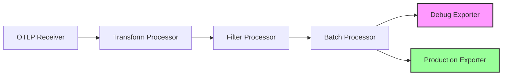

# How to Use the Debug Exporter to Troubleshoot Collector Pipelines

Author: [nawazdhandala](https://www.github.com/nawazdhandala)

Tags: OpenTelemetry, Collector, Troubleshooting, Debug Exporter, Pipelines, Configuration

Description: Learn how to leverage the OpenTelemetry Debug Exporter to troubleshoot and validate your collector pipelines with practical examples and configuration patterns.

The OpenTelemetry Collector Debug Exporter is an essential tool for troubleshooting data flow through your telemetry pipelines. It allows you to inspect telemetry data as it moves through the collector, helping you identify issues with data transformation, filtering, or routing before data reaches production backends.

## Understanding the Debug Exporter

The Debug Exporter writes telemetry data to the collector's standard output or logs. Unlike production exporters that send data to external systems, the debug exporter displays data locally, making it perfect for development, testing, and troubleshooting scenarios.

The exporter supports three verbosity levels: `basic`, `normal`, and `detailed`. Each level provides different amounts of information about your telemetry data.

## Basic Configuration

Here's a simple configuration to add the debug exporter to your collector pipeline:

```yaml
# Basic debug exporter configuration
# This configuration outputs telemetry data to stdout
exporters:
  debug:
    # Verbosity level: basic, normal, or detailed
    verbosity: normal
    # Whether to sample output (useful for high-volume data)
    sampling_initial: 5
    sampling_thereafter: 200

receivers:
  otlp:
    protocols:
      grpc:
        endpoint: 0.0.0.0:4317
      http:
        endpoint: 0.0.0.0:4318

processors:
  batch:
    timeout: 10s
    send_batch_size: 100

service:
  pipelines:
    traces:
      receivers: [otlp]
      processors: [batch]
      exporters: [debug]
    metrics:
      receivers: [otlp]
      processors: [batch]
      exporters: [debug]
    logs:
      receivers: [otlp]
      processors: [batch]
      exporters: [debug]
```

The configuration above sets up the debug exporter for all three signal types. The `sampling_initial` and `sampling_thereafter` parameters help manage output volume in high-throughput environments.

## Verbosity Levels Explained

Each verbosity level serves different troubleshooting needs:

**Basic verbosity** shows minimal information, including counts of data points received:

```yaml
exporters:
  debug:
    verbosity: basic
```

This outputs simple statistics like "Traces received: 10" without detailed content.

**Normal verbosity** includes resource attributes and basic telemetry information:

```yaml
exporters:
  debug:
    verbosity: normal
```

This shows resource attributes, span names, metric names, and log messages with key metadata.

**Detailed verbosity** provides complete telemetry payloads including all attributes:

```yaml
exporters:
  debug:
    verbosity: detailed
```

This outputs the full data structure, useful for inspecting attribute transformations or data completeness.

## Troubleshooting Pipeline Data Flow

The debug exporter excels at validating data flow through pipeline stages. Consider this troubleshooting scenario where you need to verify that a processor is correctly filtering spans:

```yaml
# Configuration to troubleshoot span filtering
receivers:
  otlp:
    protocols:
      grpc:
        endpoint: 0.0.0.0:4317

processors:
  # Filter processor that removes health check spans
  filter:
    traces:
      span:
        - 'attributes["http.target"] == "/health"'

  batch:
    timeout: 10s

exporters:
  # Debug exporter before filtering
  debug/before:
    verbosity: normal

  # Debug exporter after filtering
  debug/after:
    verbosity: normal

  # Production exporter
  otlp:
    endpoint: backend.example.com:4317

service:
  pipelines:
    # Pipeline to see data before filtering
    traces/before:
      receivers: [otlp]
      processors: []
      exporters: [debug/before]

    # Pipeline to see data after filtering
    traces/after:
      receivers: [otlp]
      processors: [filter, batch]
      exporters: [debug/after, otlp]
```

This configuration uses two debug exporters to compare data before and after the filter processor. You can verify that health check spans are correctly removed by comparing the outputs.

## Validating Attribute Transformations

The debug exporter is invaluable for verifying attribute processors. Here's how to troubleshoot attribute modifications:

```yaml
processors:
  # Transform processor to modify attributes
  transform:
    trace_statements:
      - context: span
        statements:
          - set(attributes["environment"], "production")
          - set(attributes["service.namespace"], resource.attributes["deployment.environment"])

  # Attributes processor for additional modifications
  attributes:
    actions:
      - key: http.method
        action: upsert
        value: REDACTED
        from_attribute: http.method.original
      - key: sensitive_data
        action: delete

exporters:
  debug:
    verbosity: detailed

service:
  pipelines:
    traces:
      receivers: [otlp]
      processors: [transform, attributes]
      exporters: [debug]
```

Run test traffic through this pipeline and examine the debug output to verify that attributes are transformed correctly. The detailed verbosity level shows all attribute modifications.

## Debugging Multi-Pipeline Configurations

Complex collector deployments often use multiple pipelines with different processing chains. The debug exporter helps validate each pipeline independently:

```yaml
receivers:
  otlp:
    protocols:
      http:
        endpoint: 0.0.0.0:4318

processors:
  # Processor for high-priority services
  filter/high_priority:
    traces:
      span:
        - 'resource.attributes["service.tier"] == "critical"'

  # Processor for standard services
  filter/standard:
    traces:
      span:
        - 'resource.attributes["service.tier"] != "critical"'

  batch/fast:
    timeout: 1s
    send_batch_size: 50

  batch/standard:
    timeout: 10s
    send_batch_size: 500

exporters:
  debug/high_priority:
    verbosity: normal

  debug/standard:
    verbosity: normal

  otlp/high_priority:
    endpoint: critical-backend.example.com:4317

  otlp/standard:
    endpoint: standard-backend.example.com:4317

service:
  pipelines:
    # Pipeline for critical services
    traces/high_priority:
      receivers: [otlp]
      processors: [filter/high_priority, batch/fast]
      exporters: [debug/high_priority, otlp/high_priority]

    # Pipeline for standard services
    traces/standard:
      receivers: [otlp]
      processors: [filter/standard, batch/standard]
      exporters: [debug/standard, otlp/standard]
```

This configuration routes traces to different backends based on service tier. The debug exporters let you verify that filtering logic correctly separates high-priority from standard traffic.

## Sampling Output for High-Volume Environments

When dealing with high telemetry volumes, the debug exporter's sampling configuration prevents output overload:

```yaml
exporters:
  debug:
    verbosity: normal
    # Output first 10 items
    sampling_initial: 10
    # Then output every 1000th item
    sampling_thereafter: 1000
```

This configuration displays the first 10 telemetry items in full, then shows every 1000th item afterward. This approach provides insight into data flow without overwhelming your logs.

## Visualizing Pipeline Flow

Understanding how data flows through your collector configuration helps with troubleshooting:



The diagram shows a typical pipeline with the debug exporter running alongside the production exporter. This parallel configuration allows troubleshooting without disrupting production data flow.

## Comparing Debug Output with Backend Data

A powerful troubleshooting technique involves comparing debug exporter output with data arriving at your backend. If they differ, the issue likely lies in network transport or backend processing:

```yaml
exporters:
  debug:
    verbosity: detailed

  otlp:
    endpoint: backend.example.com:4317
    # Enable detailed logging for comparison
    tls:
      insecure: false
    retry_on_failure:
      enabled: true
    sending_queue:
      enabled: true
      num_consumers: 10

service:
  pipelines:
    traces:
      receivers: [otlp]
      processors: [batch]
      exporters: [debug, otlp]

  # Enable telemetry for internal metrics
  telemetry:
    logs:
      level: debug
```

Run test traffic and compare the debug exporter output with what appears in your backend. Discrepancies indicate issues with the OTLP exporter configuration, network connectivity, or backend ingestion.

## Debugging Connector Pipelines

The OpenTelemetry Collector supports connectors that link pipelines together. The debug exporter helps validate data passing between connected pipelines:

```yaml
receivers:
  otlp:
    protocols:
      grpc:
        endpoint: 0.0.0.0:4317

processors:
  batch:
    timeout: 5s

connectors:
  spanmetrics:
    dimensions:
      - name: http.method
      - name: http.status_code

exporters:
  debug/traces:
    verbosity: normal

  debug/metrics:
    verbosity: normal

service:
  pipelines:
    # Trace pipeline that generates metrics
    traces:
      receivers: [otlp]
      processors: [batch]
      exporters: [spanmetrics, debug/traces]

    # Metrics pipeline receiving generated metrics
    metrics:
      receivers: [spanmetrics]
      processors: [batch]
      exporters: [debug/metrics]
```

This configuration uses the spanmetrics connector to generate metrics from traces. The debug exporters on both pipelines let you verify that traces are processed correctly and that the expected metrics are generated.

## Best Practices

When using the debug exporter for troubleshooting, follow these practices:

**Remove debug exporters from production**: The debug exporter adds overhead and can expose sensitive data in logs. Use it only in development and staging environments.

**Start with normal verbosity**: Begin troubleshooting with normal verbosity. Only switch to detailed when you need to inspect specific attributes or payloads.

**Use sampling for high volumes**: Configure sampling parameters to prevent log overflow in high-throughput scenarios.

**Create temporary pipelines**: When troubleshooting, create separate debug pipelines alongside production pipelines to avoid impacting production data flow.

**Combine with internal metrics**: Use the debug exporter together with collector internal metrics for comprehensive troubleshooting. Learn more about internal logs at https://oneuptime.com/blog/post/2026-02-06-read-interpret-collector-internal-logs/view.

## Troubleshooting Common Issues

If the debug exporter doesn't show expected output, check these common issues:

**No output appears**: Verify that the pipeline is correctly configured and that data is reaching the receiver. Check that the debug exporter is listed in the service pipeline configuration.

**Partial data shown**: Check your sampling configuration. High sampling rates may skip the data you want to see.

**Performance degradation**: The detailed verbosity level adds significant overhead. Use normal or basic verbosity for high-volume pipelines.

**Sensitive data exposure**: The debug exporter outputs data to logs, which may be collected by log aggregation systems. Ensure that sensitive data is redacted by processors before reaching the debug exporter.

## Advanced Use Cases

For complex troubleshooting scenarios, combine the debug exporter with other collector features:

```yaml
receivers:
  otlp:
    protocols:
      grpc:
        endpoint: 0.0.0.0:4317

processors:
  # Probabilistic sampling for testing
  probabilistic_sampler:
    sampling_percentage: 10

  batch:
    timeout: 10s

exporters:
  debug:
    verbosity: normal

extensions:
  # Enable zPages for live metrics
  zpages:
    endpoint: 0.0.0.0:55679

  # Enable pprof for performance profiling
  pprof:
    endpoint: 0.0.0.0:1777

service:
  extensions: [zpages, pprof]
  pipelines:
    traces:
      receivers: [otlp]
      processors: [probabilistic_sampler, batch]
      exporters: [debug]

  telemetry:
    logs:
      level: debug
    metrics:
      address: 0.0.0.0:8888
```

This configuration combines the debug exporter with zPages and pprof extensions for comprehensive troubleshooting. You can correlate debug output with live metrics and performance profiles. For more on these tools, see https://oneuptime.com/blog/post/2026-02-06-zpages-live-debugging-collector/view and https://oneuptime.com/blog/post/2026-02-06-profile-collector-pprof-extension/view.

## Conclusion

The OpenTelemetry Debug Exporter is a fundamental troubleshooting tool for collector pipelines. It provides visibility into data flow, helps validate processor configurations, and enables comparison between different pipeline stages. By understanding verbosity levels, sampling options, and integration with other troubleshooting tools, you can efficiently diagnose and resolve collector pipeline issues.

For issues related to collector startup or memory problems, refer to https://oneuptime.com/blog/post/2026-02-06-troubleshoot-collector-startup-failures/view and https://oneuptime.com/blog/post/2026-02-06-troubleshoot-memory-issues-oom-kills-collector/view respectively.
