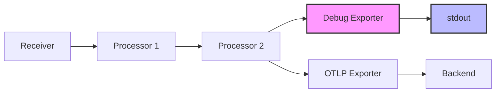

# How to Use the Debug Exporter to Troubleshoot Pipelines Locally

Author: [nawazdhandala](https://www.github.com/nawazdhandala)

Tags: OpenTelemetry, Debug Exporter, Collector, Troubleshooting, Local Development, Pipelines

Description: Learn how to use the OpenTelemetry Collector debug exporter to inspect telemetry data, troubleshoot pipeline issues, and validate configurations locally.

---

You have configured your OpenTelemetry Collector with receivers, processors, and exporters. You start the collector, send some traces or metrics, and nothing shows up in your backend. What went wrong? Is the receiver not accepting data? Is a processor dropping it? Is the exporter failing silently?

The debug exporter answers all of these questions by printing telemetry data directly to the collector's standard output. It is the simplest and most effective tool for understanding what is happening inside your pipeline, and it requires almost no setup.

## What the Debug Exporter Does

The debug exporter (formerly known as the logging exporter) writes telemetry data to stdout in a human-readable format. Every span, metric data point, and log record that reaches the exporter gets printed with its full content, including resource attributes, scope information, and individual data fields.

This serves two purposes. First, it confirms that data is actually flowing through your pipeline. If you see output, your receiver and processors are working. If you see nothing, the problem is upstream. Second, it shows you the exact shape of your data after processing, which is invaluable for verifying that processors are transforming data the way you intended.



The diagram above shows a typical setup during development. The debug exporter runs alongside your production exporter. Data flows through the full pipeline and gets printed to stdout while also being sent to your backend. Once you have confirmed everything works, you remove the debug exporter from the pipeline.

## Basic Configuration

Adding the debug exporter to your collector configuration takes three lines.

```yaml
# collector-config.yaml
receivers:
  otlp:
    protocols:
      grpc:
        endpoint: 0.0.0.0:4317
      http:
        endpoint: 0.0.0.0:4318

processors:
  batch:
    timeout: 5s
    send_batch_size: 100

exporters:
  # The debug exporter prints telemetry to stdout
  debug:
    # verbosity controls how much detail is printed
    # "basic" shows a summary, "normal" shows more, "detailed" shows everything
    verbosity: detailed

  otlp:
    endpoint: backend.example.com:4317
    tls:
      insecure: false

service:
  pipelines:
    traces:
      receivers: [otlp]
      processors: [batch]
      # Include debug alongside your production exporter
      exporters: [debug, otlp]

    metrics:
      receivers: [otlp]
      processors: [batch]
      exporters: [debug, otlp]

    logs:
      receivers: [otlp]
      processors: [batch]
      exporters: [debug, otlp]
```

The `verbosity` setting controls the level of detail in the output. Let's look at what each level shows.

## Understanding Verbosity Levels

### Basic Verbosity

The `basic` level gives you a count of items received, which is useful for confirming data flow without flooding your terminal.

```yaml
exporters:
  debug:
    # Minimal output, just counts
    verbosity: basic
```

Output looks like this:

```
2026-02-06T10:15:30.123Z    info    TracesExporter    {"#spans": 5}
2026-02-06T10:15:35.456Z    info    MetricsExporter   {"#metrics": 12}
2026-02-06T10:15:40.789Z    info    LogsExporter      {"#logs": 3}
```

This tells you that data is arriving and passing through the pipeline. It does not tell you what that data contains.

### Normal Verbosity

The `normal` level adds resource and scope information, plus a summary of each telemetry item.

```yaml
exporters:
  debug:
    # Shows resource info and span/metric summaries
    verbosity: normal
```

Output includes the resource attributes and span names:

```
2026-02-06T10:15:30.123Z    info    TracesExporter
    Resource:
        service.name: payment-service
        service.version: 1.4.2
    ScopeSpans:
        Scope: payment-processor
        Span: process_payment (trace_id: abc123, span_id: def456)
        Span: validate_card (trace_id: abc123, span_id: ghi789)
```

### Detailed Verbosity

The `detailed` level prints everything. Every attribute, every event, every link, every data point. This is what you want when you need to verify the exact contents of your telemetry.

```yaml
exporters:
  debug:
    # Full telemetry content, including all attributes and events
    verbosity: detailed
```

The output for a single span looks something like this:

```
2026-02-06T10:15:30.123Z    info    TracesExporter
    Resource:
        service.name: Str(payment-service)
        service.version: Str(1.4.2)
        host.name: Str(dev-laptop)
    ScopeSpans:
        Scope: payment-processor (version: 1.0.0)
        Span #0
            Trace ID:       abc123def456789
            Span ID:        aabbccddee
            Parent Span ID: 1122334455
            Name:           process_payment
            Kind:           Server
            Start time:     2026-02-06 10:15:29.100
            End time:       2026-02-06 10:15:30.050
            Status:         Ok
            Attributes:
                payment.amount: Double(49.99)
                payment.currency: Str(USD)
                payment.method: Str(credit_card)
            Events:
                Event #0: payment.authorized
                    Timestamp: 2026-02-06 10:15:29.500
                    Attributes:
                        auth_code: Str(AUTH-12345)
```

This level of detail is extremely helpful when debugging attribute processors, span name transforms, or any pipeline configuration that modifies data.

## Common Troubleshooting Scenarios

### Scenario 1: No Data Reaching the Backend

Your backend shows no traces, and you are not sure if the problem is the collector, the SDK, or the network.

```yaml
# Step 1: Add debug exporter with basic verbosity
exporters:
  debug:
    verbosity: basic

service:
  pipelines:
    traces:
      receivers: [otlp]
      processors: [batch]
      # Only use debug exporter to isolate the issue
      exporters: [debug]
```

If the debug exporter prints span counts, your receiver is working and the problem is with the production exporter or the network between the collector and backend. If nothing prints, the problem is upstream in the SDK or network between the application and collector.

### Scenario 2: Missing Attributes After Processing

You added an attributes processor to enrich spans, but the expected attributes are not showing up in your backend.

```yaml
processors:
  # Processor that should add environment attribute
  attributes:
    actions:
      - key: deployment.environment
        value: staging
        action: upsert

  batch:
    timeout: 5s

exporters:
  debug:
    # Use detailed to see all attributes on each span
    verbosity: detailed

service:
  pipelines:
    traces:
      receivers: [otlp]
      # Order matters: attributes processor runs before batch
      processors: [attributes, batch]
      exporters: [debug]
```

Check the debug output for the `deployment.environment` attribute. If it is present in the debug output but missing in your backend, the issue is with the backend exporter or the backend itself. If it is missing from the debug output, your processor configuration has a problem.

### Scenario 3: Verifying Filter Processor Behavior

You configured a filter processor to drop health check spans, but you are not sure it is working correctly.

```yaml
processors:
  filter:
    traces:
      span:
        - 'name == "health_check"'
        - 'name == "readiness_probe"'

exporters:
  debug:
    verbosity: normal

service:
  pipelines:
    traces:
      receivers: [otlp]
      processors: [filter]
      exporters: [debug]
```

Send some traffic that includes both health checks and real requests. The debug output should only show real request spans. If health check spans still appear, your filter expression is not matching correctly.

## Using Debug Exporter with Sampling Decisions

When debugging sampling issues, the debug exporter shows you exactly which spans survive the sampling decision.

```yaml
processors:
  # Tail-based sampling that keeps error traces and samples 10% of others
  tail_sampling:
    decision_wait: 10s
    policies:
      - name: keep-errors
        type: status_code
        status_code:
          status_codes: [ERROR]
      - name: sample-rest
        type: probabilistic
        probabilistic:
          sampling_percentage: 10

exporters:
  debug:
    verbosity: normal

service:
  pipelines:
    traces:
      receivers: [otlp]
      processors: [tail_sampling]
      exporters: [debug]
```

Send a known mix of successful and error traces. The debug output should show all error traces and approximately 10% of successful ones. This is much faster than waiting for data to appear in a backend dashboard.

## Controlling Output Volume

On a busy pipeline, the debug exporter with detailed verbosity can generate enormous amounts of output. There are several ways to manage this.

Reduce the verbosity level. Use `basic` for high-volume pipelines and only switch to `detailed` when investigating a specific issue.

Add the debug exporter to a separate pipeline that only receives a subset of data:

```yaml
service:
  pipelines:
    # Production pipeline without debug output
    traces/production:
      receivers: [otlp]
      processors: [batch]
      exporters: [otlp]

    # Debug pipeline with a filter to limit volume
    traces/debug:
      receivers: [otlp]
      processors: [filter/debug-only, batch]
      exporters: [debug]
```

Use a filter processor in the debug pipeline to only pass through spans from a specific service or with a specific attribute. This lets you focus on exactly the data you care about without drowning in noise from other services.

## The Debug Exporter in Development Workflows

The debug exporter is not just for troubleshooting problems. It is a valuable development tool. When you are writing new instrumentation or modifying processor configurations, running the collector locally with the debug exporter gives you instant feedback.

A productive local development loop looks like this:

1. Edit your collector configuration
2. Restart the collector
3. Send test traffic (using curl, a test script, or telemetrygen)
4. Check the debug output to verify the result
5. Repeat until the output matches your expectations
6. Remove the debug exporter and deploy

This cycle is much faster than deploying to a staging environment and checking a backend UI.

## Wrapping Up

The debug exporter is the first tool you should reach for when troubleshooting OpenTelemetry Collector pipelines. It requires minimal configuration, produces immediate output, and works with traces, metrics, and logs. By printing telemetry data to stdout, it removes all the variables between your pipeline and a remote backend, letting you focus on whether your configuration actually does what you think it does. Keep it in your development configs and add it to production configs temporarily when investigating issues. It is the printf debugging of the observability world, and it works just as well.
