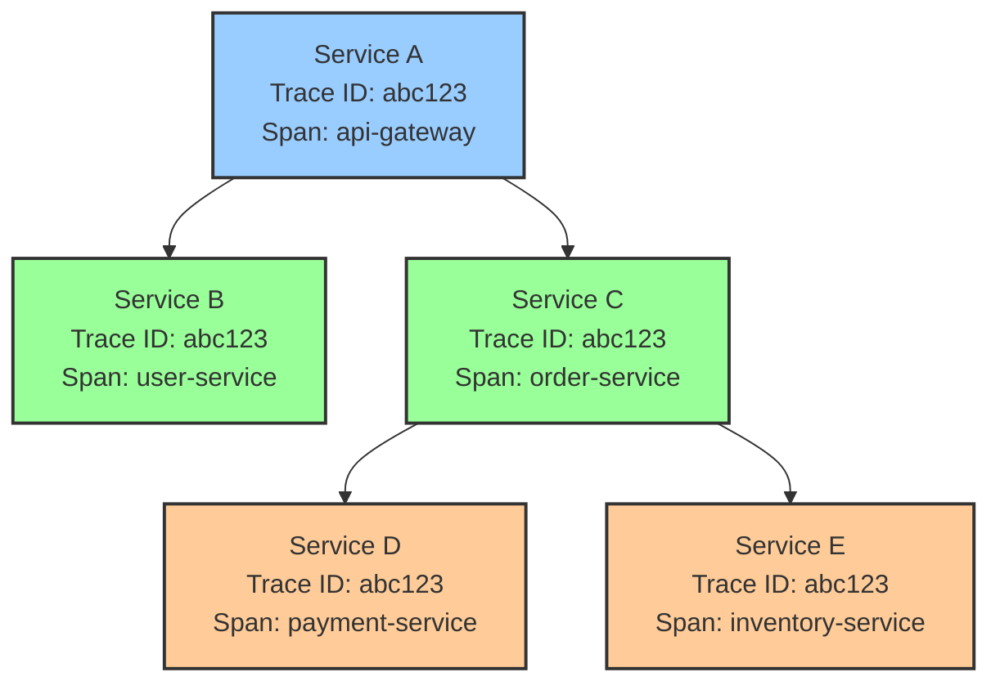
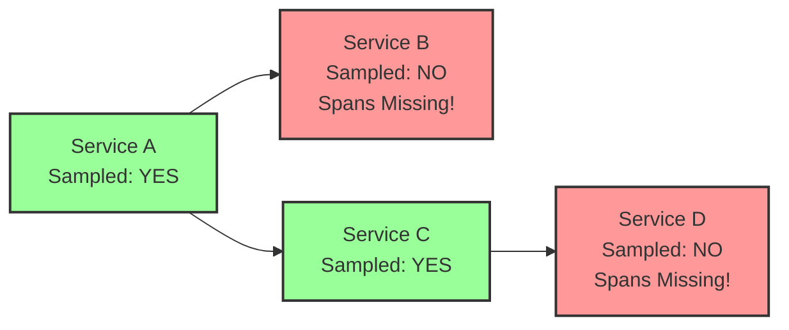

# How to Debug Missing Spans in OpenTelemetry Distributed Traces

Author: [nawazdhandala](https://www.github.com/nawazdhandala)

Tags: OpenTelemetry, Tracing, Distributed Traces, Missing Spans, Debugging, Observability

Description: Learn how to find and fix missing spans in OpenTelemetry distributed traces with practical debugging techniques for context propagation, sampling, and instrumentation gaps.

You open a distributed trace in your observability backend and something looks off. The trace shows your API gateway calling a downstream service, but the spans from that service are nowhere to be found. The trace has gaps, orphaned spans, or entire service calls that should be there but are not. Missing spans in distributed traces break the whole point of distributed tracing, which is seeing the full picture of a request as it moves through your system.

This guide covers the most common reasons spans go missing in distributed traces and how to fix each one.

## How Distributed Traces Are Assembled

A distributed trace is a collection of spans from multiple services, linked together by a shared trace ID. Each service receives the trace context from the incoming request, creates its own spans, and passes the context to the next service.



If any service in this chain fails to propagate the trace context or fails to export its spans, those spans will be missing from the assembled trace.

## Cause 1: Broken Context Propagation

The most common reason for missing spans is that trace context is not being propagated between services. When Service A calls Service B, the trace ID and parent span ID must travel in HTTP headers (or the equivalent for your transport protocol). If those headers are missing, Service B starts a brand new trace instead of continuing the existing one.

Check whether your HTTP client is injecting trace headers:

```python
# Python: verify W3C traceparent header is being sent
import requests
from opentelemetry import trace
from opentelemetry.propagate import inject

tracer = trace.get_tracer("context.debug")

with tracer.start_as_current_span("outgoing-call"):
    headers = {}
    # inject() adds traceparent and tracestate headers
    inject(headers)
    print("Propagated headers:", headers)
    # Expected output:
    # {'traceparent': '00-abc123...-def456...-01', 'tracestate': ''}

    response = requests.get("http://service-b:8080/api/data", headers=headers)
```

The `inject()` function writes trace context into the headers dictionary. If you are using a library that makes HTTP calls internally (like an SDK for a cloud service), that library may not automatically propagate context. You need to either use an OpenTelemetry instrumentation library for that client or manually inject headers.

For Java applications:

```java
// Java: verify context propagation in HTTP client
import io.opentelemetry.api.GlobalOpenTelemetry;
import io.opentelemetry.context.propagation.TextMapSetter;
import java.net.HttpURLConnection;
import java.net.URL;

// TextMapSetter tells the propagator how to set headers
TextMapSetter<HttpURLConnection> setter =
    (carrier, key, value) -> carrier.setRequestProperty(key, value);

URL url = new URL("http://service-b:8080/api/data");
HttpURLConnection connection = (HttpURLConnection) url.openConnection();

// Inject current trace context into the outgoing request headers
GlobalOpenTelemetry.getPropagators()
    .getTextMapPropagator()
    .inject(io.opentelemetry.context.Context.current(), connection, setter);

// Verify headers were set
// Should show "traceparent" header with trace ID
System.out.println("traceparent: " + connection.getRequestProperty("traceparent"));
```

On the receiving side, the server must extract the context from incoming headers:

```python
# Python: extract context from incoming request (Flask example)
from flask import Flask, request
from opentelemetry.propagate import extract
from opentelemetry import trace

app = Flask(__name__)
tracer = trace.get_tracer("service-b")

@app.route("/api/data")
def handle_request():
    # Extract trace context from incoming request headers
    context = extract(request.headers)

    # Start a new span as a child of the extracted context
    with tracer.start_as_current_span("handle-data", context=context) as span:
        # This span now shares the trace ID from Service A
        span.set_attribute("service", "service-b")
        return "OK"
```

If you are using auto-instrumentation libraries (like `opentelemetry-instrumentation-flask`), context extraction happens automatically. But if you have custom middleware or a framework that is not instrumented, you need to do this manually.

## Cause 2: Mismatched Propagation Formats

Different systems use different header formats for context propagation. W3C Trace Context uses `traceparent`, while B3 (from Zipkin) uses `X-B3-TraceId` and related headers. If Service A sends W3C headers and Service B only reads B3 headers, the context is lost.

Configure the SDK to support multiple propagation formats:

```python
# Python: configure multiple propagators
from opentelemetry import propagate
from opentelemetry.propagators.composite import CompositePropagator
from opentelemetry.propagators.b3 import B3MultiFormat
from opentelemetry.propagate import set_global_textmap
from opentelemetry.propagators.textmap import TraceContextTextMapPropagator

# Support both W3C and B3 propagation formats
# This ensures context works with services using either format
composite_propagator = CompositePropagator([
    TraceContextTextMapPropagator(),  # W3C traceparent
    B3MultiFormat(),                   # Zipkin B3 headers
])

set_global_textmap(composite_propagator)
```

You can also set this via environment variable:

```bash
# Support both W3C and B3 propagation via environment variable
export OTEL_PROPAGATORS=tracecontext,b3multi
```

This is especially important in mixed environments where some services use Zipkin instrumentation and others use OpenTelemetry.

## Cause 3: Inconsistent Sampling Decisions

In a distributed trace, the sampling decision should be made once at the head of the trace and then respected by all downstream services. If each service makes its own independent sampling decision, some services will sample the trace while others drop it, resulting in incomplete traces.



The fix is to use the `ParentBased` sampler, which respects the sampling decision from the parent span:

```python
# Python: use ParentBased sampler to respect upstream decisions
from opentelemetry.sdk.trace import TracerProvider
from opentelemetry.sdk.trace.sampling import ParentBasedTraceIdRatio

# ParentBasedTraceIdRatio does two things:
# 1. If a parent span exists, it uses the parent's sampling decision
# 2. If there is no parent (root span), it applies ratio-based sampling
sampler = ParentBasedTraceIdRatio(0.1)  # 10% for root spans

provider = TracerProvider(sampler=sampler)
```

```bash
# Set ParentBased sampler via environment variable
export OTEL_TRACES_SAMPLER=parentbased_traceidratio
export OTEL_TRACES_SAMPLER_ARG=0.1
```

With this configuration, once Service A decides to sample a trace, all downstream services will also sample it, keeping the trace complete.

## Cause 4: Missing Instrumentation Libraries

Auto-instrumentation covers popular frameworks and libraries, but it does not cover everything. If your service uses a custom HTTP client, a message queue library, or an internal RPC framework, those calls may not create spans automatically.

Check what instrumentations are active:

```python
# Python: list installed instrumentations
import pkg_resources

# Find all installed OpenTelemetry instrumentation packages
otel_packages = [
    pkg.key for pkg in pkg_resources.working_set
    if pkg.key.startswith("opentelemetry-instrumentation")
]
print("Installed instrumentations:", otel_packages)
```

If a library you depend on is not in the list, install the corresponding instrumentation package:

```bash
# Install specific instrumentation libraries
pip install opentelemetry-instrumentation-requests
pip install opentelemetry-instrumentation-flask
pip install opentelemetry-instrumentation-sqlalchemy
pip install opentelemetry-instrumentation-redis

# Or use the auto-instrumentor to detect and instrument everything
opentelemetry-instrument python app.py
```

For libraries without an auto-instrumentation package, create manual spans:

```python
# Manual instrumentation for a custom internal client
from opentelemetry import trace, context
from opentelemetry.propagate import inject

tracer = trace.get_tracer("custom.client")

def call_internal_service(service_url, payload):
    # Create a span for this outgoing call
    with tracer.start_as_current_span(
        "internal-service-call",
        kind=trace.SpanKind.CLIENT,
    ) as span:
        span.set_attribute("peer.service", service_url)
        span.set_attribute("request.size", len(payload))

        # Manually inject context into headers
        headers = {"Content-Type": "application/json"}
        inject(headers)

        # Make the actual call using your custom client
        response = custom_http_client.post(service_url, headers=headers, data=payload)

        span.set_attribute("response.status", response.status_code)
        return response
```

This ensures that even custom libraries produce spans and propagate context correctly.

## Cause 5: Async Operations Losing Context

Asynchronous operations are a notorious source of missing spans. When you spawn a background task, a thread pool worker, or a callback, the trace context may not travel with it.

```python
# Problem: context is lost when using thread pool
import concurrent.futures
from opentelemetry import trace, context

tracer = trace.get_tracer("async.debug")

def process_item(item):
    # This span will NOT be linked to the parent trace
    # because the thread does not inherit the trace context
    with tracer.start_as_current_span("process-item"):
        return do_work(item)

with tracer.start_as_current_span("batch-process"):
    with concurrent.futures.ThreadPoolExecutor() as executor:
        # Context is not propagated to worker threads automatically
        futures = [executor.submit(process_item, item) for item in items]
```

The fix is to capture the context and pass it explicitly:

```python
# Fix: propagate context to worker threads explicitly
import concurrent.futures
from opentelemetry import trace, context

tracer = trace.get_tracer("async.debug")

def process_item_with_context(item, ctx):
    # Attach the parent context in this thread
    token = context.attach(ctx)
    try:
        with tracer.start_as_current_span("process-item"):
            return do_work(item)
    finally:
        # Detach the context when done
        context.detach(token)

with tracer.start_as_current_span("batch-process"):
    # Capture the current context before dispatching
    ctx = context.get_current()

    with concurrent.futures.ThreadPoolExecutor() as executor:
        # Pass context along with each task
        futures = [
            executor.submit(process_item_with_context, item, ctx)
            for item in items
        ]
```

By capturing `context.get_current()` and attaching it in the worker thread, spans created inside the worker become children of the parent span.

## Cause 6: Spans Exported to Different Backends

If different services export to different collector instances or different backends, the trace will appear fragmented. Each backend only has part of the trace.

```yaml
# Collector configuration: fan out to multiple backends
# This ensures all backends receive all traces
receivers:
  otlp:
    protocols:
      grpc:
        endpoint: 0.0.0.0:4317

exporters:
  # Primary backend
  otlp/primary:
    endpoint: primary-backend.example.com:4317
  # Secondary backend
  otlp/secondary:
    endpoint: secondary-backend.example.com:4317

processors:
  batch:
    timeout: 5s

service:
  pipelines:
    traces:
      receivers: [otlp]
      processors: [batch]
      # Send to both backends to avoid fragmented traces
      exporters: [otlp/primary, otlp/secondary]
```

Make sure all services in a distributed trace export to the same backend, or configure the collector to fan out traces to all backends that need them.

## Cause 7: Timing and Flush Issues

Spans that are created but never flushed before the process exits will be lost. This is common in serverless functions, short-lived batch jobs, and CLI tools.

```python
# Problem: spans lost because the process exits before flushing
from opentelemetry.sdk.trace import TracerProvider
from opentelemetry.sdk.trace.export import BatchSpanProcessor
from opentelemetry.exporter.otlp.proto.grpc.trace_exporter import OTLPSpanExporter

provider = TracerProvider()
# BatchSpanProcessor buffers spans and sends them periodically
provider.add_span_processor(BatchSpanProcessor(OTLPSpanExporter()))
trace.set_tracer_provider(provider)

tracer = trace.get_tracer("batch-job")
with tracer.start_as_current_span("batch-job-main"):
    run_batch_job()

# Fix: force flush before exiting
# This sends all buffered spans immediately
provider.force_flush(timeout_millis=30000)

# For graceful shutdown, call shutdown() which also flushes
provider.shutdown()
```

In serverless environments, always call `force_flush()` at the end of each invocation. The `BatchSpanProcessor` has a default schedule delay of 5 seconds, and if your function exits before that window, spans will be lost.

## Debugging Workflow Summary

When you find missing spans in a trace, work through these checks:

1. Verify both the calling and called services are instrumented and exporting spans.
2. Confirm trace context headers (traceparent) appear in requests between services.
3. Check that all services use the same propagation format (W3C, B3, or both).
4. Verify sampling is ParentBased so downstream services honor the head decision.
5. Look for async operations, thread pools, or callbacks that might lose context.
6. Make sure all services export to the same backend.
7. Add `force_flush()` calls in short-lived processes.

By working through these causes systematically, you can close the gaps in your distributed traces and get the full end-to-end visibility that OpenTelemetry is designed to provide.

## Conclusion

Missing spans in distributed traces usually come down to one of a few predictable problems: broken context propagation, mismatched propagation formats, inconsistent sampling, uninstrumented libraries, lost async context, fragmented backends, or unflushed buffers. Each of these has a straightforward fix. The key is knowing where to look, and the debugging workflow above gives you a reliable checklist to follow every time a trace has gaps.
