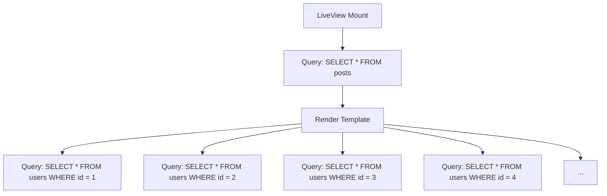
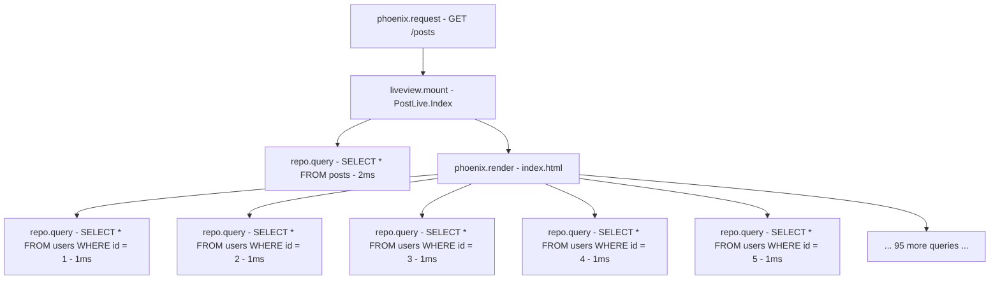
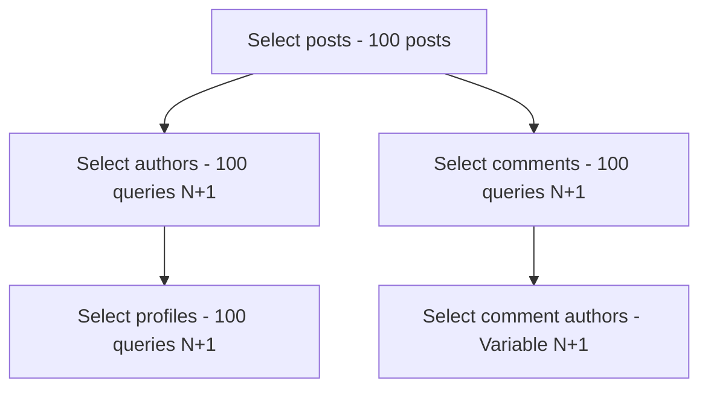

# How to Debug N+1 Queries in Phoenix LiveView with OpenTelemetry

Author: [nawazdhandala](https://www.github.com/nawazdhandala)

Tags: OpenTelemetry, Elixir, Phoenix, LiveView, N+1, Performance

Description: Use OpenTelemetry traces to identify and fix N+1 query problems in Phoenix LiveView applications through practical examples and debugging techniques.

N+1 queries are one of the most common performance problems in web applications. They occur when code executes one query to fetch a collection, then N additional queries to fetch related data for each item in the collection. In Phoenix LiveView, where real-time updates and interactive interfaces are common, N+1 queries can severely impact user experience. OpenTelemetry traces make these problems immediately visible by showing the query patterns and timing.

This guide demonstrates how to use OpenTelemetry to identify, analyze, and fix N+1 query problems in LiveView applications.

## Understanding N+1 Queries in LiveView

LiveView applications are particularly susceptible to N+1 problems because:

**Dynamic Rendering**: LiveView re-renders templates on state changes. If your template iterates over records and calls helpers that load related data for each row, you trigger queries on every render.

**Event Handlers**: Handle functions often load data without preloading associations or related values needed by render helpers, causing N+1 queries when rendering the updated state.

**Multiple Clients**: With many concurrent users, N+1 problems multiply, creating database load that grows linearly with connection count.

Here's a typical N+1 pattern:


```mermaid
graph TD
    A[LiveView Mount] --> B[Query: SELECT * FROM posts]
    B --> C[Render Template]
    C --> D[Query: SELECT * FROM users WHERE id = 1]
    C --> E[Query: SELECT * FROM users WHERE id = 2]
    C --> F[Query: SELECT * FROM users WHERE id = 3]
    C --> G[Query: SELECT * FROM users WHERE id = 4]
    C --> H[...]
```

With OpenTelemetry instrumentation in place, this pattern becomes immediately visible in traces.

## Setting Up LiveView Tracing

Before debugging N+1 queries, ensure both Phoenix and Ecto instrumentation are configured (covered in previous posts). Add custom instrumentation for LiveView lifecycle events:

```elixir
defmodule MyAppWeb.LiveTracing do
  require OpenTelemetry.Tracer

  def trace_mount(module, socket, fun) do
    OpenTelemetry.Tracer.with_span "#{inspect(module)}.mount" do
      OpenTelemetry.Tracer.set_attributes(%{
        "liveview.module" => inspect(module),
        "liveview.action" => to_string(socket.assigns[:live_action] || "")
      })

      fun.()
    end
  end
end
```

Use this helper in your LiveViews to create spans around `mount/3`, and use the `handle_event/3` wrapper shown later for event handlers.

## Example N+1 Problem

Consider a blog post listing LiveView with N+1 queries:

```elixir
defmodule MyAppWeb.PostLive.Index do
  use MyAppWeb, :live_view

  alias MyApp.Blog

  @impl true
  def mount(_params, _session, socket) do
    MyAppWeb.LiveTracing.trace_mount(__MODULE__, socket, fn ->
      # Fetch posts WITHOUT preloading the author association
      posts = Blog.list_posts()

      {:ok, assign(socket, posts: posts)}
    end)
  end

  @impl true
  def handle_event("refresh", _params, socket) do
    # Reload posts on refresh
    posts = Blog.list_posts()

    {:noreply, assign(socket, posts: posts)}
  end
end
```

The template renders post authors:

```heex
<div class="posts">
  <%= for post <- @posts do %>
    <article>
      <h2><%= post.title %></h2>
      <!-- This calls a helper that queries for EACH post -->
      <p class="author">By <%= Blog.author_name(post.author_id) %></p>
      <div class="content"><%= post.excerpt %></div>
    </article>
  <% end %>
</div>
```

The `Blog.list_posts/0` function:

```elixir
defmodule MyApp.Blog do
  alias MyApp.Repo
  alias MyApp.Blog.Post

  # Returns posts WITHOUT author preloaded
  def list_posts do
    Repo.all(Post)
  end

  def author_name(author_id) do
    Repo.get!(MyApp.Accounts.User, author_id).name
  end
end
```

The `Post` schema defines the association:

```elixir
defmodule MyApp.Blog.Post do
  use Ecto.Schema

  schema "posts" do
    field :title, :string
    field :excerpt, :string
    field :content, :string

    # Association to author
    belongs_to :author, MyApp.Accounts.User

    timestamps()
  end
end
```

When the template renders, calling `Blog.author_name/1` for each row triggers a database query for each post. Ecto does not lazy-load associations; accessing an unloaded association such as `post.author.name` would raise because the association contains `%Ecto.Association.NotLoaded{}`.

## Identifying N+1 in Traces

With OpenTelemetry instrumentation, the N+1 problem creates a distinctive trace pattern. Here's what you see:


```mermaid
graph TD
    A[phoenix.request - GET /posts] --> B[liveview.mount - PostLive.Index]
    B --> C[repo.query - SELECT * FROM posts - 2ms]
    B --> D[phoenix.render - index.html]
    D --> E[repo.query - SELECT * FROM users WHERE id = 1 - 1ms]
    D --> F[repo.query - SELECT * FROM users WHERE id = 2 - 1ms]
    D --> G[repo.query - SELECT * FROM users WHERE id = 3 - 1ms]
    D --> H[repo.query - SELECT * FROM users WHERE id = 4 - 1ms]
    D --> I[repo.query - SELECT * FROM users WHERE id = 5 - 1ms]
    D --> J[... 95 more queries ...]
```

Key indicators of N+1 problems in traces:

**Query Repetition**: Many identical queries with different parameter values executing in sequence during render.

**Linear Growth**: The number of queries scales with the collection size. 10 posts trigger 11 queries (1 for posts + 10 for authors), 100 posts trigger 101 queries.

**Render Span Duration**: The render span duration is disproportionately long compared to individual query times because of query quantity, not individual query slowness.

**Query Pattern**: SELECT queries following the pattern `SELECT * FROM related_table WHERE id = ?` occurring multiple times within a single request.

## Analyzing the Trace

When you examine the trace in your observability platform, look for these attributes in the Ecto spans. If you use `opentelemetry_ecto`, SQL statements are only included when the `:db_statement` option is enabled or configured with a sanitizer function:

```text
Span: my_app.repo.query
Duration: 1.2ms
Attributes:
  db.system: postgresql
  db.statement: SELECT u0."id", u0."name", u0."email" FROM "users" AS u0 WHERE (u0."id" = $1)
  db.operation: SELECT
  db.query_time: 800µs
  db.queue_time: 400µs
```

When this span appears 100 times within a single request with different id values, you've found your N+1 problem. The total time might be 120ms (100 queries × 1.2ms), which significantly impacts page load time.

## Fixing with Preloading

The solution is preloading associations in the initial query:

```elixir
defmodule MyApp.Blog do
  alias MyApp.Repo
  alias MyApp.Blog.Post

  # Preload author association to avoid N+1
  def list_posts do
    Post
    |> Repo.all()
    |> Repo.preload(:author)
  end
end
```

Then render the preloaded association:

```heex
<p class="author">By <%= post.author.name %></p>
```

After this change, the trace shows a different pattern:

```mermaid
graph TD
    A[phoenix.request - GET /posts] --> B[liveview.mount - PostLive.Index]
    B --> C[repo.query - SELECT * FROM posts - 2ms]
    B --> D[repo.query - SELECT * FROM users WHERE id IN (...) - 1ms]
    B --> E[phoenix.render - index.html - 5ms]
```

Now you have exactly 2 queries regardless of post count:
1. Fetch all posts
2. Fetch all authors in one query using IN clause

The render span shows no child database query spans, confirming the N+1 is resolved.

## Multiple Association Levels

N+1 problems often span multiple association levels:

```elixir
# Template calling helpers that load nested data

<%= for post <- @posts do %>
  <h2><%= post.title %></h2>
  <p>By <%= Blog.author_name(post.author_id) %></p>
  <!-- Load author's profile - another N+1 layer -->
  " />
  <!-- Load post comments - another N+1 layer -->
  <div class="comments">
    <%= for comment <- Blog.comments_for_post(post.id) do %>
      <p><%= comment.body %></p>
      <!-- Load comment author - yet another N+1 layer -->
      <span>- <%= Blog.author_name(comment.author_id) %></span>
    <% end %>
  </div>
<% end %>
```

This creates a cascade of N+1 queries visible in traces:


```mermaid
graph TD
    A[Select posts - 100 posts] --> B[Select authors - 100 queries N+1]
    B --> C[Select profiles - 100 queries N+1]
    A --> D[Select comments - 100 queries N+1]
    D --> E[Select comment authors - Variable N+1]
```

The trace might show 300+ individual query spans. The solution is nested preloading:

```elixir
def list_posts_with_details do
  Post
  |> Repo.all()
  |> Repo.preload([
    # Preload author and nested profile
    author: :profile,
    # Preload comments and their authors
    comments: :author
  ])
end
```

After the fix, traces show just 5 queries total:
1. SELECT posts
2. SELECT authors for posts (IN clause)
3. SELECT profiles for authors (IN clause)
4. SELECT comments for posts (IN clause)
5. SELECT authors for comments (IN clause)

The point is that the query count is constant regardless of collection sizes.

## LiveView Event Handlers

N+1 problems frequently occur in event handlers that reload data:

```elixir
defmodule MyAppWeb.PostLive.Index do
  use MyAppWeb, :live_view

  @impl true
  def handle_event("filter_by_tag", %{"tag" => tag}, socket) do
    # This might have N+1 if posts_by_tag doesn't preload
    posts = Blog.posts_by_tag(tag)

    {:noreply, assign(socket, posts: posts, current_tag: tag)}
  end

  @impl true
  def handle_event("load_more", _params, socket) do
    # Appending more posts - ensure preloading here too
    current_posts = socket.assigns.posts
    offset = length(current_posts)

    more_posts = Blog.list_posts(offset: offset, limit: 20)

    {:noreply, assign(socket, posts: current_posts ++ more_posts)}
  end
end
```

Traces will show N+1 patterns during the event handler execution. Wrap handlers with custom spans to make them easier to identify:

```elixir
@impl true
def handle_event(event_name, params, socket) do
  require OpenTelemetry.Tracer

  OpenTelemetry.Tracer.with_span "liveview.handle_event.#{event_name}" do
    OpenTelemetry.Tracer.set_attributes(%{
      "liveview.event" => event_name,
      "liveview.params" => inspect(params)
    })

    do_handle_event(event_name, params, socket)
  end
end

defp do_handle_event("filter_by_tag", %{"tag" => tag}, socket) do
  posts = Blog.posts_by_tag(tag)  # Ensure this preloads associations
  {:noreply, assign(socket, posts: posts)}
end
```

The custom span groups all queries from the event handler, making N+1 patterns obvious in the trace visualization.

## Detecting N+1 in Development

Add a development-only check that alerts you to N+1 patterns:

```elixir
# In config/dev.exs
if Mix.env() == :dev do
  defmodule MyApp.N1Detector do
    def setup do
      # Attach a Telemetry handler that counts queries in the current process
      :telemetry.attach_many(
        "n1-detector",
        [
          [:my_app, :repo, :query],
          [:phoenix, :endpoint, :stop]
        ],
        &__MODULE__.handle_event/4,
        %{}
      )
    end

    def handle_event([:my_app, :repo, :query], _measurements, metadata, _config) do
      # Track query patterns
      query_pattern =
        metadata.query
        |> String.replace(~r/\$\d+/, "?")  # Normalize parameters

      updated_queries = [query_pattern | Process.get(:n1_detector_queries, [])]
      Process.put(:n1_detector_queries, updated_queries)

      # Check for repeated patterns
      query_counts = Enum.frequencies(updated_queries)

      Enum.each(query_counts, fn {pattern, count} ->
        if count > 10 do
          IO.warn("""
          Potential N+1 detected!
          Query executed #{count} times:
          #{pattern}
          """)
        end
      end)
    end

    def handle_event([:phoenix, :endpoint, :stop], _measurements, _metadata, _config) do
      # Reset query counter after request completes
      Process.delete(:n1_detector_queries)
    end
  end

  MyApp.N1Detector.setup()
end
```

This prints warnings during development when query patterns repeat more than a threshold, helping catch N+1 problems before they reach production.

## Using Query Aggregation

For complex scenarios where preloading isn't sufficient, use query aggregation:

```elixir
import Ecto.Query

# Instead of loading all comments and rendering count
def list_posts_with_comment_counts do
  from(p in Post,
    left_join: c in assoc(p, :comments),
    group_by: p.id,
    # Use aggregation to get count without loading comments
    select: %{post: p, comment_count: count(c.id)}
  )
  |> Repo.all()
end
```

This generates a single query with a JOIN and GROUP BY, avoiding the need to load all comments when you only need the count. Traces show one query instead of N+1.

## Optimizing LiveView Updates

LiveView's granular updates can minimize the impact of N+1 when you can't avoid multiple queries:

```elixir
# Use async assigns for data that can load progressively
@impl true
def mount(_params, _session, socket) do
  socket =
    socket
    # Load posts immediately
    |> assign(:posts, Blog.list_posts())
    # Load author details asynchronously
    |> assign_async(:author_details, fn ->
      {:ok, %{author_details: Blog.load_author_details()}}
    end)

  {:ok, socket}
end
```

This pattern loads critical data first and progressively enhances the page, spreading query load over time. Traces show the async operations as separate spans.

## Monitoring Production

Set up alerts based on trace data to detect N+1 problems in production:

**Query Count Per Request**: Alert when a single request generates more than a threshold of database queries (e.g., 20 queries).

**Duplicate Query Patterns**: Monitor for repeated identical query patterns within request traces.

**Render Duration**: Alert when render spans exceed expected durations, indicating possible N+1 problems.

**Database Time Percentage**: Calculate the percentage of request time spent in database queries. High percentages (>50%) often indicate N+1 issues.

## Conclusion

OpenTelemetry makes N+1 query problems immediately visible through distributed traces. The distinctive pattern of repeated queries during render operations stands out in trace visualizations, and the detailed span attributes provide all the information needed to fix the issue.

By combining OpenTelemetry instrumentation with proper association preloading and async data loading in LiveView, you can build high-performance real-time applications that scale efficiently. The next step is adding custom instrumentation for Phoenix Channels and other real-time features.
