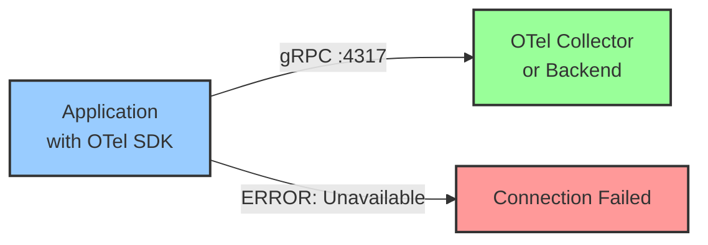
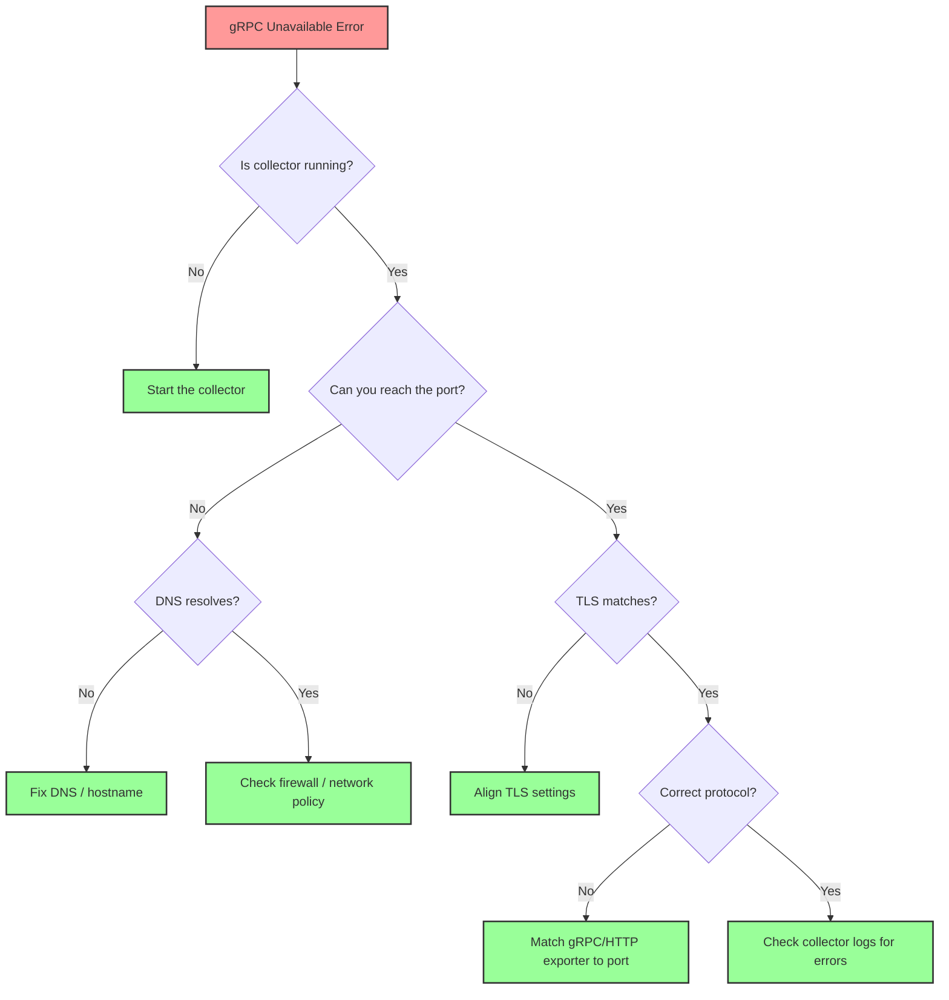

# How to Debug OpenTelemetry gRPC 'Unavailable' Connection Errors

Author: [nawazdhandala](https://www.github.com/nawazdhandala)

Tags: OpenTelemetry, gRPC, Debugging, Connection Errors, OTLP, Collector, Networking, Troubleshooting

Description: Learn how to diagnose and resolve the common gRPC 'Unavailable' connection error when sending OpenTelemetry telemetry data to collectors and backends.

---

If you have worked with OpenTelemetry for any real amount of time, you have probably run into the dreaded gRPC "Unavailable" error. It shows up in your application logs as something like `rpc error: code = Unavailable desc = connection error` and it means your SDK cannot reach the collector or backend over gRPC. This is one of the most common issues people hit when setting up OpenTelemetry pipelines, and the root cause can be anything from a wrong port number to a TLS mismatch.

In this post, we will walk through the most frequent causes of this error, how to systematically diagnose each one, and the fixes that will get your telemetry flowing again.

## Understanding the Error

The gRPC "Unavailable" status code (code 14) is a catch-all that means the client could not reach the server. It covers a wide range of underlying problems: DNS resolution failures, TCP connection refusals, TLS handshake failures, proxy misconfigurations, and more.

A typical error message looks like this in your application logs:

```
Export trace span failed: rpc error: code = Unavailable desc = connection error:
desc = "transport: Error while dialing: dial tcp 127.0.0.1:4317: connect: connection refused"
```

The error can also appear in slightly different forms depending on the SDK language:

```python
# Python SDK error output
WARNING:opentelemetry.exporter.otlp.proto.grpc.exporter:Failed to export batch
code: 14
details: "failed to connect to all addresses; last error: UNAVAILABLE: ipv4:127.0.0.1:4317: Connection refused"
```

```javascript
// Node.js SDK error output
// Error exporting spans: 14 UNAVAILABLE: No connection established
// at Object.callErrorFromStatus (@grpc/grpc-js/src/call.js:31:26)
```

The flow of telemetry data that gets interrupted looks like this:



## Cause 1: The Collector Is Not Running

This sounds obvious, but it is the most common cause. The collector process might have crashed, might not have started yet, or might be running in a different container or pod than you expect.

Start by verifying the collector is actually running and listening on the expected port:

```bash
# Check if anything is listening on the gRPC port (default 4317)
netstat -tlnp | grep 4317

# Or use ss on modern Linux systems
ss -tlnp | grep 4317

# For Docker environments, check the container is running
docker ps | grep otel-collector

# For Kubernetes, check the pod status
kubectl get pods -n observability -l app=otel-collector
```

If the collector is running but not listening on the expected port, check its configuration:

```yaml
# Collector config: verify the receiver endpoint is correct
receivers:
  otlp:
    protocols:
      grpc:
        # Make sure this matches what your SDK is targeting
        endpoint: 0.0.0.0:4317
```

The `0.0.0.0` binding means the collector listens on all interfaces. If you see `127.0.0.1:4317` instead, the collector only accepts connections from localhost, which will fail if your application runs in a different container or pod.

## Cause 2: Wrong Endpoint Configuration in the SDK

A mismatch between what the SDK is configured to send to and where the collector is actually listening is extremely common. This happens a lot when people copy example configurations without adjusting them.

Here is how to verify and fix the endpoint in different SDKs:

```python
# Python: Check the endpoint configuration
from opentelemetry.exporter.otlp.proto.grpc.trace_exporter import OTLPSpanExporter

# Wrong: using HTTP port for gRPC
# exporter = OTLPSpanExporter(endpoint="http://collector:4318")

# Correct: gRPC uses port 4317, and the scheme should match
exporter = OTLPSpanExporter(
    endpoint="http://collector:4317",  # gRPC default port
    insecure=True  # Set to True when not using TLS
)
```

```javascript
// Node.js: Check the endpoint configuration
const { OTLPTraceExporter } = require('@opentelemetry/exporter-trace-otlp-grpc');

// Wrong: including a path or using the HTTP port
// const exporter = new OTLPTraceExporter({ url: 'http://collector:4318/v1/traces' });

// Correct: gRPC endpoint without path
const exporter = new OTLPTraceExporter({
    url: 'http://collector:4317'  // gRPC default port, no path needed
});
```

```go
// Go: Check the endpoint configuration
import "go.opentelemetry.io/otel/exporters/otlp/otlptrace/otlptracegrpc"

// Correct: gRPC exporter with proper endpoint
exporter, err := otlptracegrpc.New(ctx,
    otlptracegrpc.WithEndpoint("collector:4317"),  // host:port only
    otlptracegrpc.WithInsecure(),  // Skip TLS for local development
)
```

Remember that OTLP over gRPC uses port 4317 by default, while OTLP over HTTP uses port 4318. Mixing these up is one of the most frequent mistakes.

## Cause 3: TLS and Security Mismatches

If the collector expects TLS but your SDK is sending plaintext (or vice versa), you will get an "Unavailable" error. The connection gets rejected during the handshake before any data can flow.

```yaml
# Collector configured WITH TLS
receivers:
  otlp:
    protocols:
      grpc:
        endpoint: 0.0.0.0:4317
        tls:
          cert_file: /etc/otel/server.crt
          key_file: /etc/otel/server.key
```

If your collector is configured like this, your SDK must use TLS too:

```python
# Python: Configure TLS to match the collector
from opentelemetry.exporter.otlp.proto.grpc.trace_exporter import OTLPSpanExporter

# When collector uses TLS, do NOT set insecure=True
exporter = OTLPSpanExporter(
    endpoint="https://collector:4317",
    # If using a custom CA certificate
    credentials=ssl_channel_credentials(
        root_certificates=open('/path/to/ca.crt', 'rb').read()
    )
)
```

For local development, the simplest fix is to disable TLS on the collector side:

```yaml
# Collector WITHOUT TLS (local development only)
receivers:
  otlp:
    protocols:
      grpc:
        endpoint: 0.0.0.0:4317
        # No TLS section means plaintext
```

And then set insecure mode in your SDK:

```bash
# Environment variable approach works across all SDKs
export OTEL_EXPORTER_OTLP_INSECURE=true
export OTEL_EXPORTER_OTLP_ENDPOINT=http://localhost:4317
```

## Cause 4: DNS Resolution Failures in Docker and Kubernetes

In containerized environments, DNS resolution is a common source of "Unavailable" errors. Your application might not be able to resolve the collector hostname.

```bash
# Test DNS resolution from within a container
docker exec -it my-app-container nslookup otel-collector

# In Kubernetes, test from a debug pod
kubectl run -it --rm debug --image=busybox -- nslookup otel-collector.observability.svc.cluster.local
```

In Docker Compose, services can reach each other by service name, but only if they share a network:

```yaml
# docker-compose.yml: Both services must be on the same network
version: '3.8'
services:
  app:
    build: .
    environment:
      # Use the service name as the hostname
      - OTEL_EXPORTER_OTLP_ENDPOINT=http://otel-collector:4317
    depends_on:
      - otel-collector
    networks:
      - app-network

  otel-collector:
    image: otel/opentelemetry-collector-contrib:latest
    ports:
      - "4317:4317"
    networks:
      - app-network

networks:
  app-network:
    driver: bridge
```

In Kubernetes, you need the fully qualified service name if the application and collector are in different namespaces:

```python
# Python: Full Kubernetes service DNS name
exporter = OTLPSpanExporter(
    # Format: <service>.<namespace>.svc.cluster.local:<port>
    endpoint="http://otel-collector.observability.svc.cluster.local:4317",
    insecure=True
)
```

## Cause 5: Firewall and Network Policy Blocking

Even when DNS resolves correctly and the collector is running, network policies or firewalls might block the connection.

```bash
# Test TCP connectivity from the application to the collector
# Using netcat (nc)
nc -zv collector-host 4317

# Using curl (works even for gRPC port testing)
curl -v telnet://collector-host:4317

# In Kubernetes, check for NetworkPolicy restrictions
kubectl get networkpolicies -n observability
```

If you are running in Kubernetes with network policies, you may need to explicitly allow traffic on port 4317:

```yaml
# Kubernetes NetworkPolicy allowing gRPC traffic to collector
apiVersion: networking.k8s.io/v1
kind: NetworkPolicy
metadata:
  name: allow-otlp-grpc
  namespace: observability
spec:
  podSelector:
    matchLabels:
      app: otel-collector
  ingress:
    - from:
        # Allow from all namespaces with the app label
        - namespaceSelector:
            matchLabels:
              send-telemetry: "true"
      ports:
        - protocol: TCP
          port: 4317
```

## Cause 6: gRPC vs HTTP Protocol Confusion

OpenTelemetry supports both gRPC and HTTP transports for OTLP. Using the wrong exporter library for the protocol your collector expects is a subtle but common mistake.

```python
# WRONG: Using gRPC exporter to connect to HTTP endpoint
from opentelemetry.exporter.otlp.proto.grpc.trace_exporter import OTLPSpanExporter
exporter = OTLPSpanExporter(endpoint="http://collector:4318")  # 4318 is HTTP!

# CORRECT option 1: Use gRPC exporter with gRPC port
from opentelemetry.exporter.otlp.proto.grpc.trace_exporter import OTLPSpanExporter
exporter = OTLPSpanExporter(endpoint="http://collector:4317", insecure=True)

# CORRECT option 2: Use HTTP exporter with HTTP port
from opentelemetry.exporter.otlp.proto.http.trace_exporter import OTLPSpanExporter
exporter = OTLPSpanExporter(endpoint="http://collector:4318/v1/traces")
```

Note that the HTTP exporter requires a path (`/v1/traces`, `/v1/metrics`, `/v1/logs`) while the gRPC exporter does not.

## Systematic Debugging Checklist

When you hit the "Unavailable" error, work through this checklist in order:



## Enabling Debug Logging for More Clues

If the checklist does not reveal the issue, enable debug logging in your SDK to get more detailed error information:

```bash
# Environment variable to enable debug logging (works for most SDKs)
export OTEL_LOG_LEVEL=debug

# For Python specifically
export OTEL_PYTHON_LOG_LEVEL=debug

# For the collector itself
# In config.yaml:
```

```yaml
# Collector debug logging configuration
service:
  telemetry:
    logs:
      level: debug
      encoding: console
```

The debug logs will show you the exact connection attempts, DNS lookups, TLS handshakes, and error details that help pinpoint the root cause.

## Conclusion

The gRPC "Unavailable" error in OpenTelemetry almost always comes down to one of six problems: the collector is not running, the endpoint is misconfigured, there is a TLS mismatch, DNS cannot resolve the hostname, a firewall is blocking traffic, or you are mixing up gRPC and HTTP protocols. By working through these causes systematically, you can resolve the issue quickly and get your telemetry pipeline back on track. Start with the simple things first (is the collector actually running?) and work your way toward the more subtle causes (TLS and protocol mismatches) to save yourself debugging time.
