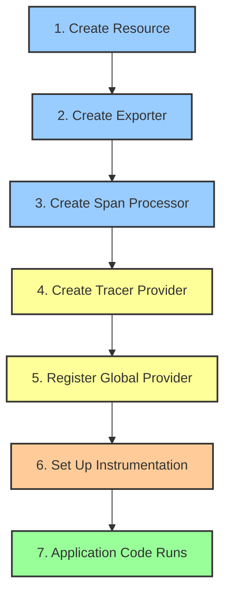

# How to Debug OpenTelemetry SDK Initialization Order Issues

Author: [nawazdhandala](https://www.github.com/nawazdhandala)

Tags: OpenTelemetry, SDK, Initialization, Debugging, Tracing, Configuration, Python, Node.js, Java

Description: Learn how to identify and fix OpenTelemetry SDK initialization order issues that cause missing traces, silent failures, and incomplete telemetry data in your applications.

---

One of the trickiest problems with OpenTelemetry is getting the initialization order right. The SDK has several components that depend on each other, and if you set them up in the wrong order, things break silently. Your application runs fine, but traces are missing, spans get dropped, or instrumentation just does nothing. There is no crash, no error message, just missing data.

This post explains why initialization order matters, what the correct sequence is, and how to debug the subtle failures that happen when you get it wrong.

## Why Order Matters

The OpenTelemetry SDK has a layered architecture. At the bottom is the API layer, which your application code and instrumentation libraries call. On top of that is the SDK layer, which implements the actual tracing, metrics, and logging logic. The SDK layer must be initialized before any instrumentation code runs, or the API calls will use a no-op implementation that silently discards everything.



If step 5 (registering the global provider) happens after step 7 (application code starts creating spans), those early spans go to the no-op provider and are lost forever. This is the single most common initialization order bug.

## The Correct Initialization Sequence

Here is the full correct sequence in Python, covering all the pieces:

```python
# tracing_setup.py: Complete initialization in the correct order
import atexit
from opentelemetry import trace
from opentelemetry.sdk.trace import TracerProvider
from opentelemetry.sdk.trace.export import BatchSpanProcessor
from opentelemetry.sdk.resources import Resource
from opentelemetry.exporter.otlp.proto.grpc.trace_exporter import OTLPSpanExporter

def init_telemetry():
    # Step 1: Create the resource (describes this service)
    resource = Resource.create({
        "service.name": "payment-service",
        "service.version": "1.4.2",
        "deployment.environment": "production"
    })

    # Step 2: Create the exporter (where to send data)
    exporter = OTLPSpanExporter(
        endpoint="http://collector:4317",
        insecure=True
    )

    # Step 3: Create the span processor (how to batch and send)
    processor = BatchSpanProcessor(exporter)

    # Step 4: Create the tracer provider (ties it all together)
    provider = TracerProvider(
        resource=resource
    )
    provider.add_span_processor(processor)

    # Step 5: Register as the global provider
    # THIS MUST HAPPEN BEFORE ANY INSTRUMENTATION OR APPLICATION CODE
    trace.set_tracer_provider(provider)

    # Step 6: Set up shutdown hook to flush remaining spans
    atexit.register(lambda: provider.shutdown())

    return provider
```

And then in your application entry point:

```python
# main.py: Initialize telemetry BEFORE anything else
from tracing_setup import init_telemetry

# FIRST: Initialize OpenTelemetry
init_telemetry()

# SECOND: Import and set up instrumentation
from opentelemetry.instrumentation.flask import FlaskInstrumentor
from opentelemetry.instrumentation.requests import RequestsInstrumentor

FlaskInstrumentor().instrument()
RequestsInstrumentor().instrument()

# THIRD: Import and start the application
from app import create_app
app = create_app()
app.run()
```

The critical point is that `init_telemetry()` must run before you import any module that creates spans at import time or before instrumentation libraries are initialized.

## Common Mistake 1: Late Provider Registration

The most common mistake is initializing the provider too late, after instrumentation or application code has already started:

```python
# BUG: Application starts before the provider is registered
from flask import Flask
from opentelemetry.instrumentation.flask import FlaskInstrumentor

app = Flask(__name__)

# Flask is already created and routes are being defined
@app.route('/pay')
def process_payment():
    return "ok"

# FlaskInstrumentor patches Flask, but the global provider is still no-op
FlaskInstrumentor().instrument_app(app)

# NOW we set up the provider, but it is too late
# FlaskInstrumentor already grabbed a reference to the no-op provider
from opentelemetry import trace
from opentelemetry.sdk.trace import TracerProvider
provider = TracerProvider()
trace.set_tracer_provider(provider)
```

```python
# FIX: Set up the provider FIRST, then instrument, then create the app
from opentelemetry import trace
from opentelemetry.sdk.trace import TracerProvider
from opentelemetry.sdk.trace.export import BatchSpanProcessor
from opentelemetry.exporter.otlp.proto.grpc.trace_exporter import OTLPSpanExporter

# Step 1: Provider setup
provider = TracerProvider()
provider.add_span_processor(BatchSpanProcessor(OTLPSpanExporter(
    endpoint="http://collector:4317",
    insecure=True
)))
trace.set_tracer_provider(provider)

# Step 2: Instrumentation
from opentelemetry.instrumentation.flask import FlaskInstrumentor
FlaskInstrumentor().instrument()

# Step 3: Application
from flask import Flask
app = Flask(__name__)

@app.route('/pay')
def process_payment():
    return "ok"
```

## Common Mistake 2: Module-Level Tracer Acquisition

Another frequent issue is acquiring a tracer at module level before the provider is set up:

```python
# utils.py: Tracer acquired at import time
from opentelemetry import trace

# This runs when the module is imported
# If the provider is not set up yet, this gets a no-op tracer
tracer = trace.get_tracer("payment-service")

def process_payment(amount):
    # This span will be a no-op if the module was imported
    # before the provider was registered
    with tracer.start_as_current_span("process-payment") as span:
        span.set_attribute("payment.amount", amount)
        return do_payment(amount)
```

This is tricky because it depends on import order. If `utils.py` gets imported before your initialization code runs, the tracer is a no-op.

There are two fixes. The first is to make the tracer lazy:

```python
# utils.py: FIX option 1 - Lazy tracer acquisition
from opentelemetry import trace

def get_tracer():
    # Get the tracer at call time, not import time
    return trace.get_tracer("payment-service")

def process_payment(amount):
    # Tracer is acquired when the function runs, not when the module loads
    tracer = get_tracer()
    with tracer.start_as_current_span("process-payment") as span:
        span.set_attribute("payment.amount", amount)
        return do_payment(amount)
```

The second fix is to make sure your initialization code runs before any imports that acquire tracers:

```python
# main.py: FIX option 2 - Ensure init happens before imports
from tracing_setup import init_telemetry

# Initialize FIRST
init_telemetry()

# Now it is safe to import modules that acquire tracers at module level
from utils import process_payment
```

## Common Mistake 3: Multiple Provider Registrations

Setting the global provider more than once causes confusing behavior. Only the last registration takes effect, but earlier instrumentations might have cached references to the previous provider:

```python
# BUG: Two different parts of the code both set the provider
# In config/tracing.py
provider1 = TracerProvider(resource=Resource.create({"service.name": "svc-a"}))
trace.set_tracer_provider(provider1)

# In app/startup.py (runs later)
provider2 = TracerProvider(resource=Resource.create({"service.name": "svc-b"}))
trace.set_tracer_provider(provider2)

# Now some spans go to provider1 and some to provider2
# depending on when each component acquired its tracer
```

The fix is to have a single initialization point:

```python
# FIX: One place, one provider
# config/tracing.py
_provider = None

def init_telemetry():
    global _provider
    if _provider is not None:
        # Already initialized, skip
        return

    _provider = TracerProvider(
        resource=Resource.create({"service.name": "payment-service"})
    )
    _provider.add_span_processor(BatchSpanProcessor(exporter))
    trace.set_tracer_provider(_provider)
```

## Node.js Initialization Order

Node.js has its own set of initialization order challenges, particularly with ES modules and require hooks:

```javascript
// tracing.js: Must be loaded BEFORE the application
// Use --require flag: node --require ./tracing.js app.js

const { NodeTracerProvider } = require('@opentelemetry/sdk-trace-node');
const { BatchSpanProcessor } = require('@opentelemetry/sdk-trace-base');
const { OTLPTraceExporter } = require('@opentelemetry/exporter-trace-otlp-grpc');
const { Resource } = require('@opentelemetry/resources');
const { registerInstrumentations } = require('@opentelemetry/instrumentation');
const { HttpInstrumentation } = require('@opentelemetry/instrumentation-http');
const { ExpressInstrumentation } = require('@opentelemetry/instrumentation-express');

// Create and register the provider BEFORE any other imports
const provider = new NodeTracerProvider({
    resource: new Resource({
        'service.name': 'payment-service',
        'service.version': '1.4.2'
    })
});

provider.addSpanProcessor(
    new BatchSpanProcessor(
        new OTLPTraceExporter({ url: 'http://collector:4317' })
    )
);

provider.register();

// Register instrumentations AFTER the provider
registerInstrumentations({
    instrumentations: [
        new HttpInstrumentation(),
        new ExpressInstrumentation()
    ]
});
```

```bash
# Run the application with the tracing module loaded first
node --require ./tracing.js app.js

# Or in package.json
# "scripts": {
#   "start": "node --require ./tracing.js app.js"
# }
```

For ES modules (import syntax), you need a different approach:

```javascript
// instrumentation.mjs: Use the --import flag for ES modules
// node --import ./instrumentation.mjs app.mjs

import { NodeTracerProvider } from '@opentelemetry/sdk-trace-node';
import { BatchSpanProcessor } from '@opentelemetry/sdk-trace-base';
import { OTLPTraceExporter } from '@opentelemetry/exporter-trace-otlp-grpc';
import { Resource } from '@opentelemetry/resources';

const provider = new NodeTracerProvider({
    resource: new Resource({
        'service.name': 'payment-service'
    })
});

provider.addSpanProcessor(
    new BatchSpanProcessor(
        new OTLPTraceExporter({ url: 'http://collector:4317' })
    )
);

provider.register();
```

```bash
# ES module approach
node --import ./instrumentation.mjs app.mjs
```

## Java Auto-Instrumentation Agent

Java has a cleaner story here because the Java agent attaches before the application code loads:

```bash
# The -javaagent flag ensures the agent runs before any application code
java -javaagent:opentelemetry-javaagent.jar \
     -Dotel.service.name=payment-service \
     -Dotel.exporter.otlp.endpoint=http://collector:4317 \
     -jar my-application.jar
```

But if you are doing manual initialization in Java without the agent, the same ordering rules apply:

```java
// Java: Manual initialization must happen in main() before anything else
public class Application {
    public static void main(String[] args) {
        // Step 1: Initialize OpenTelemetry FIRST
        initTelemetry();

        // Step 2: Then start the application
        SpringApplication.run(Application.class, args);
    }

    private static void initTelemetry() {
        Resource resource = Resource.getDefault()
            .merge(Resource.create(Attributes.of(
                ResourceAttributes.SERVICE_NAME, "payment-service",
                ResourceAttributes.SERVICE_VERSION, "1.4.2"
            )));

        SdkTracerProvider tracerProvider = SdkTracerProvider.builder()
            .setResource(resource)
            .addSpanProcessor(BatchSpanProcessor.builder(
                OtlpGrpcSpanExporter.builder()
                    .setEndpoint("http://collector:4317")
                    .build()
            ).build())
            .build();

        OpenTelemetrySdk sdk = OpenTelemetrySdk.builder()
            .setTracerProvider(tracerProvider)
            .buildAndRegisterGlobal();
    }
}
```

## Debugging Initialization Problems

When you suspect an initialization order issue, there are a few diagnostic steps you can take.

First, check if the global provider is a real provider or a no-op:

```python
# Python: Check what provider is registered
from opentelemetry import trace

provider = trace.get_tracer_provider()
print(f"Provider type: {type(provider)}")
# If this prints "ProxyTracerProvider" or "NoOpTracerProvider",
# the SDK is not properly initialized

# A properly initialized SDK shows:
# Provider type: <class 'opentelemetry.sdk.trace.TracerProvider'>
```

```javascript
// Node.js: Check the registered provider
const { trace } = require('@opentelemetry/api');

const provider = trace.getTracerProvider();
console.log('Provider:', provider.constructor.name);
// "ProxyTracerProvider" means it is wrapping a real or no-op provider
// Check if it has a delegate
```

Second, add a test span early in your application startup to verify the pipeline is working:

```python
# Add this right after init_telemetry() to verify the pipeline works
from opentelemetry import trace

tracer = trace.get_tracer("startup-test")
with tracer.start_as_current_span("test-span") as span:
    span.set_attribute("test", True)
    print(f"Test span created: trace_id={span.get_span_context().trace_id}")

# If you see the trace_id in your backend, initialization is correct
# If not, the pipeline is broken somewhere
```

Third, enable debug logging to see the initialization sequence:

```bash
# Enable debug logging to see what happens during initialization
export OTEL_LOG_LEVEL=debug
export OTEL_PYTHON_LOG_LEVEL=debug
```

The debug logs will show you exactly when the provider is created, when exporters connect, and when instrumentation libraries register themselves.

## Framework-Specific Gotchas

Different frameworks have their own initialization hooks that interact with OpenTelemetry in specific ways.

Django needs OpenTelemetry initialized in `manage.py` or `wsgi.py`, before Django loads the apps:

```python
# wsgi.py: Initialize before Django
from tracing_setup import init_telemetry
init_telemetry()

# Now import and create the Django WSGI application
from django.core.wsgi import get_wsgi_application
application = get_wsgi_application()
```

FastAPI with Uvicorn needs initialization before the ASGI app is created:

```python
# main.py: Initialize before FastAPI
from tracing_setup import init_telemetry
init_telemetry()

from fastapi import FastAPI
from opentelemetry.instrumentation.fastapi import FastAPIInstrumentor

app = FastAPI()
FastAPIInstrumentor.instrument_app(app)
```

Next.js has an `instrumentation.ts` hook specifically designed for this:

```typescript
// instrumentation.ts: Next.js runs this before the application
export async function register() {
    if (process.env.NEXT_RUNTIME === 'nodejs') {
        // Dynamic import to avoid loading in edge runtime
        const { NodeTracerProvider } = await import('@opentelemetry/sdk-trace-node');
        const { BatchSpanProcessor } = await import('@opentelemetry/sdk-trace-base');
        const { OTLPTraceExporter } = await import('@opentelemetry/exporter-trace-otlp-grpc');

        const provider = new NodeTracerProvider({
            resource: new Resource({
                'service.name': 'my-nextjs-app'
            })
        });

        provider.addSpanProcessor(
            new BatchSpanProcessor(new OTLPTraceExporter())
        );

        provider.register();
    }
}
```

## Conclusion

OpenTelemetry SDK initialization order issues cause silent data loss, which makes them particularly frustrating to debug. The core rule is simple: set up and register the global tracer provider before any instrumentation code runs and before any application code that creates spans. Avoid acquiring tracers at module-level import time, and if you must, make sure the provider is registered before those modules are imported. When debugging, check the type of the registered provider, send a test span early in startup, and use debug logging to trace the initialization sequence. Every language and framework has slightly different patterns, but the fundamental ordering requirement is the same across all of them.
