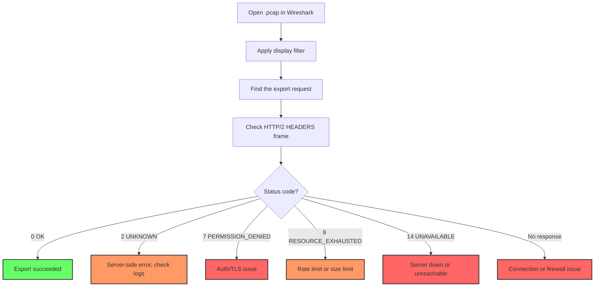

# How to Debug OpenTelemetry with tcpdump and Wireshark

Author: [nawazdhandala](https://www.github.com/nawazdhandala)

Tags: OpenTelemetry, tcpdump, Wireshark, Network Debugging, gRPC, OTLP, Packet Analysis, Troubleshooting

Description: A hands-on guide to using tcpdump and Wireshark to capture and analyze OpenTelemetry OTLP traffic for debugging export failures and network issues.

---

Sometimes the only way to figure out why your OpenTelemetry data is not reaching its destination is to look at the actual network traffic. Log messages might say "export failed" but give you no detail about what went wrong at the protocol level. This is where packet capture tools like tcpdump and Wireshark become invaluable. They let you see exactly what bytes are leaving your application, what the receiver is responding with, and where the communication breaks down.

This guide walks through capturing and analyzing OTLP traffic in both gRPC and HTTP flavors, with practical examples you can use right away.

## When to Reach for Packet Capture

Packet capture should not be your first debugging tool. Start with logs and metrics. But reach for tcpdump when:

- Export errors are vague ("connection refused," "deadline exceeded," "unknown error")
- You suspect a proxy, load balancer, or firewall is interfering with traffic
- TLS handshakes are failing and you need to see the certificate exchange
- You need to confirm that data is actually leaving the application
- The receiver reports errors but the sender thinks everything is fine

## Capturing OTLP gRPC Traffic with tcpdump

OTLP over gRPC uses port 4317 by default. Here is how to capture that traffic:

```bash
# Capture all traffic on port 4317 (gRPC OTLP)
# -i any: listen on all network interfaces
# -w: write raw packets to a file for later analysis
# -s 0: capture full packet contents, not just headers
sudo tcpdump -i any -w /tmp/otel-grpc.pcap -s 0 port 4317

# If you want to see a live summary instead of writing to file
# -n: don't resolve hostnames (faster output)
# -v: verbose output with more protocol details
sudo tcpdump -i any -n -v port 4317
```

For a containerized collector running in Docker or Kubernetes, you need to capture from inside the container's network namespace:

```bash
# Docker: Capture traffic for a specific container
# First, find the container's PID
CONTAINER_ID=$(docker ps -q --filter "name=otel-collector")
CONTAINER_PID=$(docker inspect -f '{{.State.Pid}}' $CONTAINER_ID)

# Enter the container's network namespace and run tcpdump
sudo nsenter -t $CONTAINER_PID -n tcpdump -i any -w /tmp/otel.pcap -s 0 port 4317

# Kubernetes: Use kubectl debug to attach a debugging container
kubectl debug -n monitoring pod/otel-collector-0 \
  --image=nicolaka/netshoot \
  --target=otel-collector \
  -- tcpdump -i any -w /tmp/otel.pcap -s 0 port 4317

# Copy the capture file back to your machine
kubectl cp monitoring/otel-collector-0:/tmp/otel.pcap ./otel.pcap
```

Let the capture run for 30 to 60 seconds while your application is sending telemetry, then stop it with Ctrl+C.

## Capturing OTLP HTTP Traffic

OTLP over HTTP uses port 4318 by default and is easier to inspect because HTTP is a text-based protocol at the header level:

```bash
# Capture HTTP OTLP traffic on port 4318
sudo tcpdump -i any -w /tmp/otel-http.pcap -s 0 port 4318

# For quick inspection without Wireshark, use tcpdump's ASCII output
# -A: print packet payload in ASCII
# This works well for HTTP headers but protobuf bodies will be binary
sudo tcpdump -i any -A -n port 4318
```

The ASCII output from tcpdump will show you HTTP headers clearly, which is often enough to diagnose content-type mismatches and routing issues:

```
# Example tcpdump ASCII output for OTLP HTTP export
# You can see the POST request, Content-Type, and response code
POST /v1/traces HTTP/1.1
Host: collector:4318
Content-Type: application/x-protobuf
Content-Length: 1847
User-Agent: OTel-Go-OTLP-Exporter/1.24.0

HTTP/1.1 200 OK
Content-Type: application/x-protobuf
```

If you see a 415 (Unsupported Media Type) or 400 (Bad Request) response, the problem is likely a content-type or encoding mismatch.

## Analyzing Captures in Wireshark

Wireshark provides a graphical interface for deep protocol analysis. Open your capture file and apply filters to focus on the traffic you care about.

For gRPC traffic:

```
# Wireshark display filter for gRPC on port 4317
tcp.port == 4317

# Filter for gRPC frames specifically
# gRPC uses HTTP/2, so you can filter by protocol
http2

# Show only gRPC requests (not responses)
http2.type == 1 && http2.headers.method == POST

# Filter for a specific gRPC service
http2.header.value contains "opentelemetry.proto.collector"
```

For HTTP OTLP traffic:

```
# Wireshark display filter for HTTP OTLP
tcp.port == 4318

# Filter for POST requests to the traces endpoint
http.request.uri contains "/v1/traces"

# Show only error responses
http.response.code >= 400
```

When looking at a gRPC capture in Wireshark, the protocol dissector will show the HTTP/2 frames. Each OTLP export request is a POST to a path like `/opentelemetry.proto.collector.trace.v1.TraceService/Export`. The response will contain a gRPC status code that tells you exactly what went wrong.



## Decoding Protobuf Payloads

Wireshark can decode protobuf messages if you provide the proto definitions. This lets you inspect the actual span data, not just the binary blob.

First, download the OpenTelemetry proto definitions:

```bash
# Clone the OpenTelemetry proto definitions
git clone https://github.com/open-telemetry/opentelemetry-proto.git /tmp/otel-proto

# The relevant files are:
# /tmp/otel-proto/opentelemetry/proto/collector/trace/v1/trace_service.proto
# /tmp/otel-proto/opentelemetry/proto/collector/metrics/v1/metrics_service.proto
# /tmp/otel-proto/opentelemetry/proto/collector/logs/v1/logs_service.proto
```

Then configure Wireshark to use them:

1. Go to Edit > Preferences > Protocols > Protobuf
2. Add `/tmp/otel-proto` to the Protobuf search paths
3. Go to Protocols > gRPC and ensure "Always decode gRPC as Protobuf" is checked
4. Reload the capture file

Now when you click on a gRPC DATA frame, Wireshark will show the decoded protobuf fields, including resource attributes, span names, trace IDs, and timing data.

Alternatively, you can decode protobuf from the command line without Wireshark:

```bash
# Extract the protobuf payload from a capture and decode it
# First, use tshark to extract the gRPC body
tshark -r /tmp/otel-grpc.pcap \
  -Y "http2.type == 0 && tcp.dstport == 4317" \
  -T fields -e http2.data.data \
  | xxd -r -p > /tmp/payload.bin

# Decode using protoc with the OTel proto definitions
protoc --decode opentelemetry.proto.collector.trace.v1.ExportTraceServiceRequest \
  -I /tmp/otel-proto \
  /tmp/otel-proto/opentelemetry/proto/collector/trace/v1/trace_service.proto \
  < /tmp/payload.bin
```

This will print the decoded trace data in a human-readable format, showing you exactly what spans your application is exporting.

## Debugging TLS Handshake Failures

If your OTLP connection uses TLS (and it should in production), packet capture can reveal handshake failures that cause cryptic export errors.

```bash
# Capture the TLS handshake on port 4317
sudo tcpdump -i any -w /tmp/tls-debug.pcap -s 0 \
  port 4317 -c 100  # Capture first 100 packets

# In Wireshark, filter for TLS handshake messages
# tls.handshake.type == 1 is ClientHello
# tls.handshake.type == 2 is ServerHello
# tls.alert is a TLS alert (error)
```

Common TLS issues visible in packet captures:

- **No ServerHello after ClientHello**: The server does not support the client's TLS version or cipher suites
- **Certificate alert**: The client does not trust the server's certificate
- **Handshake failure alert**: Usually a protocol version mismatch

To work around TLS issues during debugging (not for production), you can temporarily disable TLS:

```yaml
# Collector receiver: Accept plaintext for debugging only
receivers:
  otlp:
    protocols:
      grpc:
        endpoint: 0.0.0.0:4317
        # Remove TLS config to accept plaintext connections
        # WARNING: Only for debugging, never in production

# SDK environment variable to skip TLS verification
# WARNING: Only for debugging
export OTEL_EXPORTER_OTLP_INSECURE=true
```

## Quick Reference: Common tcpdump Recipes

Here is a collection of tcpdump one-liners for common OpenTelemetry debugging scenarios:

```bash
# See if any traffic is reaching the collector at all
sudo tcpdump -i any -c 10 -n port 4317 or port 4318

# Check if connections are being established or refused
# Look for SYN, SYN-ACK, RST flags
sudo tcpdump -i any -n 'port 4317 and (tcp[tcpflags] & (tcp-syn|tcp-rst) != 0)'

# Measure connection latency (time between SYN and SYN-ACK)
sudo tcpdump -i any -n -ttt port 4317

# Capture only the first 200 bytes of each packet (headers only)
# Useful when you don't need payload data and want small files
sudo tcpdump -i any -s 200 -w /tmp/otel-headers.pcap port 4317

# Filter by source IP (your application server)
sudo tcpdump -i any -n src host 10.0.1.50 and dst port 4317

# Watch for TCP retransmissions (indicates network problems)
sudo tcpdump -i any -n 'port 4317 and tcp[tcpflags] & tcp-syn != 0' -v
```

## Putting It Together: A Real Debugging Session

Here is what a typical debugging session looks like. Your application logs say "OTLP export failed" but give no useful detail.

Step 1: Start a capture on the application host.

```bash
sudo tcpdump -i any -w /tmp/debug.pcap -s 0 port 4317
```

Step 2: Wait for a few export cycles (30 seconds is usually enough).

Step 3: Open the capture in Wireshark and look for the TCP handshake. If you see SYN packets but no SYN-ACK, the collector is unreachable. If you see RST (reset) packets, the port is not open.

Step 4: If the handshake succeeds, look at the HTTP/2 frames. Find the gRPC response and check the status code. A code of 14 (UNAVAILABLE) means the collector accepted the connection but could not process the request.

Step 5: If the status code suggests a payload issue, decode the protobuf to verify the data structure.

This methodical approach turns vague "export failed" messages into specific, actionable diagnoses. It takes a few minutes of packet capture to save hours of guesswork.
