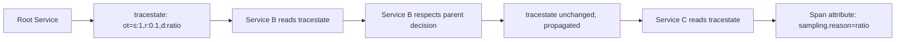

# How to Debug Sampling Decisions with OpenTelemetry Trace State

Author: [nawazdhandala](https://www.github.com/nawazdhandala)

Tags: OpenTelemetry, Sampling, Debugging, TraceState, Tracing, Observability

Description: Use the W3C tracestate header and custom sampling attributes to understand why traces were sampled or dropped across services.

---

You set up sampling. Traces are flowing. But something is off. Some traces are missing spans. Others seem to be dropped entirely. A customer reports an issue, and the trace that would help you debug it is gone. You have no idea why.

Sampling decisions are invisible by default. The sampler says yes or no, and the span either exists or it does not. There is no audit trail. No breadcrumb telling you which sampler made the call, what the input was, or why it decided what it did.

This guide shows you how to make sampling decisions visible using the W3C `tracestate` header and custom span attributes, so you can debug sampling problems the same way you debug application problems.

---

## Understanding TraceState

The W3C Trace Context specification defines two headers: `traceparent` and `tracestate`. Most people know `traceparent`, which carries the trace ID, span ID, and sampled flag. Fewer people use `tracestate`, which is a vendor-neutral key-value store that propagates alongside the trace.

```
traceparent: 00-4bf92f3577b34da6a3ce929d0e0e4736-00f067aa0ba902b7-01
tracestate: ot=s:1;r:0.1;d:error_sampler,company=sampling_debug
```

The `tracestate` header travels with every request in the trace, from the first service to the last. Anything you put in it is available to every downstream service. This makes it the perfect place to record sampling decisions.

---

## What to Record

A useful sampling debug record should answer these questions:

1. **Which sampler made the decision?** Was it the error sampler, the ratio sampler, or the rate limiter?
2. **What was the configured rate?** Was this a 10% sample or a 100% sample?
3. **Why was this trace kept?** Error detected? VIP customer? Random baseline?
4. **At which service was the decision made?** Was it the root or a downstream re-evaluation?



---

## Recording Decisions in TraceState

Modify your sampler to write decision metadata into the `tracestate` field of the `SamplingResult`.

```typescript
// debug-sampler.ts
import {
  Sampler,
  SamplingResult,
  SamplingDecision,
  Context,
  SpanKind,
  Attributes,
  Link,
  createTraceState,
} from '@opentelemetry/api';
import { TraceIdRatioBasedSampler } from '@opentelemetry/sdk-trace-base';

export class DebuggableRatioSampler implements Sampler {
  private inner: TraceIdRatioBasedSampler;
  private ratio: number;
  private samplerName: string;

  constructor(ratio: number, name: string = 'ratio') {
    this.inner = new TraceIdRatioBasedSampler(ratio);
    this.ratio = ratio;
    this.samplerName = name;
  }

  shouldSample(
    context: Context,
    traceId: string,
    spanName: string,
    spanKind: SpanKind,
    attributes: Attributes,
    links: Link[]
  ): SamplingResult {
    const result = this.inner.shouldSample(
      context, traceId, spanName, spanKind, attributes, links
    );

    const sampled = result.decision === SamplingDecision.RECORD_AND_SAMPLE;

    // Encode sampling debug info into tracestate
    // Format: s=<sampled>, r=<ratio>, d=<decision_reason>
    const debugValue = [
      `s:${sampled ? 1 : 0}`,
      `r:${this.ratio}`,
      `d:${this.samplerName}`,
    ].join(';');

    // Create tracestate with our debug info
    const traceState = createTraceState().set('ot', debugValue);

    return {
      decision: result.decision,
      attributes: {
        // Also add as span attributes for easy querying
        'sampling.sampled': sampled,
        'sampling.ratio': this.ratio,
        'sampling.sampler': this.samplerName,
      },
      traceState,
    };
  }

  toString(): string {
    return `DebuggableRatioSampler{ratio=${this.ratio}}`;
  }
}
```

The key design choice here is to store debug info in both `tracestate` (for cross-service propagation) and span attributes (for querying in your backend). The `tracestate` ensures downstream services can see the decision. The attributes ensure you can filter and search for specific sampling reasons.

---

## Composite Sampler with Debug Output

When you have multiple samplers in a chain, each one should record its contribution to the decision.

```typescript
// debug-composite-sampler.ts
import {
  Sampler,
  SamplingResult,
  SamplingDecision,
  Context,
  SpanKind,
  Attributes,
  Link,
  TraceState,
  createTraceState,
} from '@opentelemetry/api';

interface NamedSampler {
  name: string;
  sampler: Sampler;
  priority: number;
}

export class DebugCompositeSampler implements Sampler {
  private samplers: NamedSampler[];

  constructor(samplers: NamedSampler[]) {
    // Sort by priority, highest first
    this.samplers = [...samplers].sort((a, b) => b.priority - a.priority);
  }

  shouldSample(
    context: Context,
    traceId: string,
    spanName: string,
    spanKind: SpanKind,
    attributes: Attributes,
    links: Link[]
  ): SamplingResult {
    // Track which samplers were evaluated
    const evaluationLog: string[] = [];

    for (const { name, sampler } of this.samplers) {
      const result = sampler.shouldSample(
        context, traceId, spanName, spanKind, attributes, links
      );

      if (result.decision === SamplingDecision.RECORD_AND_SAMPLE) {
        evaluationLog.push(`${name}:SAMPLE`);

        // Build tracestate with full evaluation log
        const debugValue = [
          `s:1`,
          `d:${name}`,
          `e:${evaluationLog.join('|')}`,
        ].join(';');

        const traceState = createTraceState().set('ot', debugValue);

        return {
          decision: SamplingDecision.RECORD_AND_SAMPLE,
          attributes: {
            ...result.attributes,
            'sampling.decision_by': name,
            'sampling.evaluation_log': evaluationLog.join(' -> '),
          },
          traceState,
        };
      }

      // This sampler passed, record it
      evaluationLog.push(`${name}:PASS`);
    }

    // No sampler claimed this trace
    const debugValue = [
      `s:0`,
      `d:none`,
      `e:${evaluationLog.join('|')}`,
    ].join(';');

    const traceState = createTraceState().set('ot', debugValue);

    return {
      decision: SamplingDecision.NOT_RECORD,
      attributes: {
        'sampling.evaluation_log': evaluationLog.join(' -> '),
      },
      traceState,
    };
  }

  toString(): string {
    return `DebugCompositeSampler{${this.samplers.map(s => s.name).join(',')}}`;
  }
}
```

Usage:

```typescript
import { TraceIdRatioBasedSampler } from '@opentelemetry/sdk-trace-base';
import { DebugCompositeSampler } from './debug-composite-sampler';
import { ErrorSampler } from './error-sampler';

const sampler = new DebugCompositeSampler([
  {
    name: 'error_sampler',
    sampler: new ErrorSampler(),
    priority: 100,
  },
  {
    name: 'ratio_10pct',
    sampler: new TraceIdRatioBasedSampler(0.1),
    priority: 10,
  },
]);
```

When you look at a sampled trace, the `sampling.evaluation_log` attribute tells you exactly what happened: `error_sampler:PASS -> ratio_10pct:SAMPLE`. This means the error sampler did not match, and the 10% ratio sampler picked it up.

---

## Reading TraceState in Downstream Services

Downstream services can read the tracestate to understand why the trace was sampled, and add their own annotations.

```typescript
// sampling-debug-middleware.ts
import { trace, context, propagation } from '@opentelemetry/api';

function extractSamplingDebug(traceStateValue: string | undefined): Record<string, string> {
  if (!traceStateValue) return {};

  const parts = traceStateValue.split(';');
  const result: Record<string, string> = {};

  for (const part of parts) {
    const [key, value] = part.split(':');
    if (key && value) {
      result[key] = value;
    }
  }

  return result;
}

// Express middleware to log sampling context
export function samplingDebugMiddleware(req: any, res: any, next: any) {
  const activeSpan = trace.getActiveSpan();
  if (!activeSpan) {
    next();
    return;
  }

  const spanContext = activeSpan.spanContext();
  const traceState = spanContext.traceState;

  if (traceState) {
    // Read the 'ot' key from tracestate
    const otValue = traceState.get('ot');
    const debug = extractSamplingDebug(otValue);

    // Log for debugging
    console.log(
      `[sampling] traceId=${spanContext.traceId} ` +
      `sampled=${debug.s} ` +
      `decided_by=${debug.d} ` +
      `evaluation=${debug.e}`
    );

    // Add as span attributes for the current service
    activeSpan.setAttributes({
      'sampling.upstream_decision': debug.d || 'unknown',
      'sampling.upstream_sampled': debug.s || 'unknown',
    });
  }

  next();
}
```

This middleware reads the tracestate from the incoming request context and logs the sampling decision. It also copies the upstream decision into the current span's attributes, making it easy to query in your backend.

---

## Debugging Common Sampling Problems

### Problem: Trace is missing spans from one service

Check the tracestate in the spans you do have. If the `d` (decision) field shows a sampler name, verify that the same sampler is configured in the service with missing spans.

```typescript
// Add this to every service's initialization for visibility
import { diag, DiagConsoleLogger, DiagLogLevel } from '@opentelemetry/api';

// Enable debug logging for the SDK
diag.setLogger(new DiagConsoleLogger(), DiagLogLevel.DEBUG);
```

The SDK debug logs will show every sampling decision with its inputs and outputs.

### Problem: Too many traces being dropped

Look at the `sampling.evaluation_log` attribute on the traces that do survive. If every trace shows `error_sampler:PASS -> ratio_10pct:SAMPLE`, your error sampler is not matching anything. Check the attribute names it looks for against the attributes your instrumentation actually produces.

### Problem: Rate limiter is dropping everything

Check the token bucket metrics. If available tokens are always zero, either your rate limit is too low or your traffic is too high. Also verify that the rate limiter is refilling tokens correctly by checking the `lastRefillTime`.

```typescript
// Diagnostic endpoint to check sampler state
app.get('/debug/sampling', (req, res) => {
  res.json({
    // Expose sampler configuration and state
    sampler: sampler.toString(),
    availableTokens: rateLimiter.getAvailableTokens(),
    droppedCount: rateLimiter.getDroppedCount(),
  });
});
```

---

## Using Span Events for Decision Auditing

For even more detail, record sampling decisions as span events.

```typescript
// audit-sampler.ts
import {
  Sampler,
  SamplingResult,
  SamplingDecision,
  Context,
  SpanKind,
  Attributes,
  Link,
  trace,
} from '@opentelemetry/api';

export class AuditingSampler implements Sampler {
  private inner: Sampler;
  private name: string;

  constructor(inner: Sampler, name: string) {
    this.inner = inner;
    this.name = name;
  }

  shouldSample(
    context: Context,
    traceId: string,
    spanName: string,
    spanKind: SpanKind,
    attributes: Attributes,
    links: Link[]
  ): SamplingResult {
    const result = this.inner.shouldSample(
      context, traceId, spanName, spanKind, attributes, links
    );

    // If sampled, the span will exist and we can add an event to it later
    // For now, record the decision in attributes
    const decisionName = result.decision === SamplingDecision.RECORD_AND_SAMPLE
      ? 'SAMPLE'
      : result.decision === SamplingDecision.RECORD
        ? 'RECORD_ONLY'
        : 'DROP';

    return {
      ...result,
      attributes: {
        ...result.attributes,
        'sampling.audit.sampler': this.name,
        'sampling.audit.decision': decisionName,
        'sampling.audit.trace_id': traceId,
        'sampling.audit.span_name': spanName,
      },
    };
  }

  toString(): string {
    return `Auditing(${this.name}:${this.inner})`;
  }
}
```

Wrap any sampler with `AuditingSampler` to get detailed attributes on every sampled span showing exactly which sampler decided and what it decided.

---

## Querying Sampling Decisions in Your Backend

Once sampling debug attributes are on your spans, you can query them.

Find all traces sampled because of errors:
```
sampling.decision_by = "error_sampler"
```

Find traces where the rate limiter dropped spans:
```
sampling.rate_limited = true
```

Find traces where no specialized sampler matched (fell through to baseline):
```
sampling.decision_by = "ratio_10pct"
```

Find traces with a specific evaluation path:
```
sampling.evaluation_log contains "error_sampler:PASS"
```

These queries let you build dashboards that show the distribution of sampling decisions over time. You can see at a glance whether your error sampler is catching errors, whether your rate limiter is active, and how much traffic falls through to the baseline.

---

## Key Takeaways

1. The W3C `tracestate` header propagates sampling metadata across service boundaries without modifying the trace itself
2. Record the sampler name, configured ratio, and decision reason in both `tracestate` and span attributes
3. Span attributes enable querying and dashboarding in your backend; tracestate enables cross-service propagation
4. Build evaluation logs into composite samplers so you can see the full decision chain
5. Use debug logging (`DiagConsoleLogger`) during development to see every sampling decision the SDK makes
6. Expose diagnostic endpoints to check sampler state (token counts, drop counts) at runtime
7. Query `sampling.decision_by` and `sampling.evaluation_log` attributes to understand your sampling distribution

Making sampling decisions observable is just as important as making application behavior observable. If you cannot explain why a trace was dropped, you cannot trust your sampling configuration.
