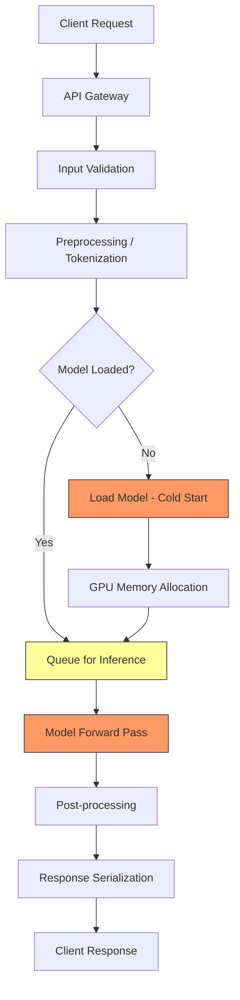

# How to Use OpenTelemetry to Debug Slow AI Inference in Production

Author: [nawazdhandala](https://www.github.com/nawazdhandala)

Tags: OpenTelemetry, AI Inference, Performance Debugging, LLM, Machine Learning, Observability, Production Monitoring, Latency

Description: A hands-on guide to using OpenTelemetry traces and metrics to identify and fix slow AI inference in production environments.

---

Your AI model works fine in development. Latency is under 200ms, responses are snappy, and everything feels right. Then you deploy to production and certain requests take 5 seconds. Or worse, they time out entirely.

Debugging slow AI inference in production is hard because so many things can go wrong: model loading, input preprocessing, batching inefficiencies, GPU contention, network overhead, or just plain bad input that makes the model work harder. OpenTelemetry gives you a structured way to decompose each inference request into measurable stages so you can find exactly where time is being wasted.

---

## Where AI Inference Gets Slow

Before we start instrumenting, let's understand the common bottlenecks in an AI inference pipeline:



The red-highlighted steps are where the big delays usually hide. Cold starts, queue wait times, and the forward pass itself are the usual suspects. Let's instrument all of them.

---

## Core Instrumentation Setup

Set up OpenTelemetry with both tracing and metrics. For AI inference, you'll want histograms that capture latency distributions because averages hide tail latency problems.

```python
# pip install opentelemetry-api opentelemetry-sdk opentelemetry-exporter-otlp

from opentelemetry import trace, metrics
from opentelemetry.sdk.trace import TracerProvider
from opentelemetry.sdk.trace.export import BatchSpanProcessor
from opentelemetry.sdk.metrics import MeterProvider
from opentelemetry.sdk.metrics.export import PeriodicExportingMetricReader
from opentelemetry.exporter.otlp.proto.grpc.trace_exporter import OTLPSpanExporter
from opentelemetry.exporter.otlp.proto.grpc.metric_exporter import OTLPMetricExporter
from opentelemetry.sdk.resources import Resource

# Identify this service in your observability backend
resource = Resource.create({
    "service.name": "ai-inference-service",
    "service.version": "2.1.0",
    "deployment.environment": "production",
    "host.type": "gpu-node"  # Useful for filtering GPU vs CPU nodes
})

# Traces capture per-request details
tracer_provider = TracerProvider(resource=resource)
tracer_provider.add_span_processor(
    BatchSpanProcessor(OTLPSpanExporter(endpoint="https://oneuptime.com/otlp"))
)
trace.set_tracer_provider(tracer_provider)

# Metrics capture aggregate patterns over time
metric_reader = PeriodicExportingMetricReader(
    OTLPMetricExporter(endpoint="https://oneuptime.com/otlp"),
    export_interval_millis=15000  # Export every 15 seconds
)
metrics.set_meter_provider(MeterProvider(
    resource=resource,
    metric_readers=[metric_reader]
))

tracer = trace.get_tracer("ai.inference", "2.1.0")
meter = metrics.get_meter("ai.inference", "2.1.0")

# Define key metrics for inference monitoring
inference_latency = meter.create_histogram(
    "ai.inference.latency", unit="ms",
    description="Total inference request latency"
)
preprocessing_latency = meter.create_histogram(
    "ai.inference.preprocessing.latency", unit="ms",
    description="Input preprocessing latency"
)
model_latency = meter.create_histogram(
    "ai.inference.model.latency", unit="ms",
    description="Model forward pass latency"
)
queue_wait_time = meter.create_histogram(
    "ai.inference.queue.wait_time", unit="ms",
    description="Time spent waiting in the inference queue"
)
```

---

## Tracing the Full Inference Lifecycle

Here's a complete traced inference service. Each stage of the inference pipeline gets its own span so you can see exactly where each millisecond goes.

```python
import time
import torch
from opentelemetry import trace
from opentelemetry.trace import StatusCode

tracer = trace.get_tracer("ai.inference")

class TracedInferenceService:
    def __init__(self, model, tokenizer, device="cuda"):
        self.model = model
        self.tokenizer = tokenizer
        self.device = device
        self.model_loaded = False
        self._request_queue = []

    def predict(self, input_text, request_id=None):
        """Run a full traced inference pipeline."""
        with tracer.start_as_current_span("ai.inference.predict") as root_span:
            # Tag every span with the request ID for correlation
            root_span.set_attribute("ai.request_id", request_id or "unknown")
            root_span.set_attribute("ai.input_length", len(input_text))
            root_span.set_attribute("ai.device", self.device)

            total_start = time.perf_counter()

            # Step 1: Ensure model is loaded
            self._ensure_model_loaded()

            # Step 2: Preprocess and tokenize input
            tokens = self._preprocess(input_text)

            # Step 3: Run the model forward pass
            raw_output = self._forward_pass(tokens)

            # Step 4: Post-process the output
            result = self._postprocess(raw_output)

            total_ms = (time.perf_counter() - total_start) * 1000
            root_span.set_attribute("ai.total_latency_ms", total_ms)
            inference_latency.record(total_ms, {"model": self.model.config.name_or_path})

            return result
```

---

## Catching Cold Starts

Cold starts are the number one cause of latency spikes in AI inference. The model needs to be loaded into GPU memory, which can take seconds. Tracing this step lets you measure how often cold starts happen and how long they take.

```python
    def _ensure_model_loaded(self):
        # Track model loading separately to identify cold start impact
        with tracer.start_as_current_span("ai.inference.model_load") as span:
            span.set_attribute("ai.model.already_loaded", self.model_loaded)

            if self.model_loaded:
                # Model is warm, this span will be nearly zero-duration
                span.set_attribute("ai.model.load_type", "warm")
                return

            # Cold start - loading model into GPU memory
            span.set_attribute("ai.model.load_type", "cold")
            start = time.perf_counter()

            self.model = self.model.to(self.device)
            self.model.eval()  # Set to evaluation mode

            # Record GPU memory after loading
            if torch.cuda.is_available():
                mem_allocated = torch.cuda.memory_allocated() / 1024**3
                mem_reserved = torch.cuda.memory_reserved() / 1024**3
                span.set_attribute("ai.gpu.memory_allocated_gb", round(mem_allocated, 2))
                span.set_attribute("ai.gpu.memory_reserved_gb", round(mem_reserved, 2))

            elapsed_ms = (time.perf_counter() - start) * 1000
            span.set_attribute("ai.model.load_time_ms", elapsed_ms)
            span.add_event("model_loaded", {"device": self.device})

            self.model_loaded = True
```

---

## Tracing Preprocessing

Tokenization seems fast, but it can surprise you with certain inputs. Long texts, unusual unicode characters, or inputs that trigger edge cases in the tokenizer can add significant latency.

```python
    def _preprocess(self, input_text):
        # Trace input preprocessing and tokenization
        with tracer.start_as_current_span("ai.inference.preprocess") as span:
            start = time.perf_counter()

            # Tokenize the input
            tokens = self.tokenizer(
                input_text,
                return_tensors="pt",
                padding=True,
                truncation=True,
                max_length=512
            )

            # Move tokens to the correct device
            tokens = {k: v.to(self.device) for k, v in tokens.items()}

            elapsed_ms = (time.perf_counter() - start) * 1000

            # Record tokenization metrics
            input_ids = tokens.get("input_ids")
            token_count = input_ids.shape[-1] if input_ids is not None else 0

            span.set_attribute("ai.preprocess.token_count", token_count)
            span.set_attribute("ai.preprocess.input_chars", len(input_text))
            span.set_attribute("ai.preprocess.duration_ms", elapsed_ms)
            span.set_attribute("ai.preprocess.was_truncated", token_count >= 512)

            # Flag suspiciously slow tokenization for investigation
            if elapsed_ms > 50:
                span.add_event("slow_tokenization", {
                    "duration_ms": elapsed_ms,
                    "input_length": len(input_text)
                })

            preprocessing_latency.record(elapsed_ms)
            return tokens
```

---

## Tracing the Forward Pass

The model forward pass is where the actual computation happens. For LLMs, this includes attention computation, and the time scales with sequence length.

```python
    def _forward_pass(self, tokens):
        # Trace the model inference / forward pass
        with tracer.start_as_current_span("ai.inference.forward_pass") as span:
            span.set_attribute("ai.model.name", self.model.config.name_or_path)
            span.set_attribute("ai.device", self.device)

            # Record GPU state before inference
            if torch.cuda.is_available():
                span.set_attribute("ai.gpu.utilization_pre",
                                 torch.cuda.utilization())
                span.set_attribute("ai.gpu.memory_free_gb",
                                 round((torch.cuda.mem_get_info()[0]) / 1024**3, 2))

            start = time.perf_counter()

            # Disable gradient computation for inference
            with torch.no_grad():
                # Use automatic mixed precision for faster inference on supported GPUs
                with torch.cuda.amp.autocast(enabled=self.device == "cuda"):
                    output = self.model(**tokens)

            # Force GPU synchronization so we measure actual compute time,
            # not just the time to queue the CUDA kernel
            if torch.cuda.is_available():
                torch.cuda.synchronize()

            elapsed_ms = (time.perf_counter() - start) * 1000

            span.set_attribute("ai.forward_pass.duration_ms", elapsed_ms)
            span.set_attribute("ai.forward_pass.output_shape",
                             str(output.logits.shape) if hasattr(output, 'logits') else "unknown")

            # Record GPU state after inference
            if torch.cuda.is_available():
                span.set_attribute("ai.gpu.utilization_post",
                                 torch.cuda.utilization())
                span.set_attribute("ai.gpu.peak_memory_gb",
                                 round(torch.cuda.max_memory_allocated() / 1024**3, 2))

            model_latency.record(elapsed_ms, {"model": self.model.config.name_or_path})
            return output

    def _postprocess(self, model_output):
        # Trace output post-processing (decoding, formatting)
        with tracer.start_as_current_span("ai.inference.postprocess") as span:
            start = time.perf_counter()

            # Decode the model output back to text
            logits = model_output.logits
            predicted_ids = torch.argmax(logits, dim=-1)
            result = self.tokenizer.decode(predicted_ids[0], skip_special_tokens=True)

            elapsed_ms = (time.perf_counter() - start) * 1000
            span.set_attribute("ai.postprocess.duration_ms", elapsed_ms)
            span.set_attribute("ai.postprocess.output_length", len(result))

            return result
```

---

## Monitoring GPU Resources

GPU contention is a sneaky cause of slow inference. When multiple requests compete for GPU resources, inference times can double or triple. Set up periodic GPU monitoring as observable metrics.

```python
import torch
from opentelemetry import metrics

meter = metrics.get_meter("ai.gpu")

def gpu_utilization_callback(options):
    """Report GPU utilization as an observable gauge."""
    if torch.cuda.is_available():
        for i in range(torch.cuda.device_count()):
            utilization = torch.cuda.utilization(i)
            yield metrics.Observation(utilization, {"gpu.index": i})

def gpu_memory_callback(options):
    """Report GPU memory usage in GB."""
    if torch.cuda.is_available():
        for i in range(torch.cuda.device_count()):
            free, total = torch.cuda.mem_get_info(i)
            used_gb = (total - free) / 1024**3
            yield metrics.Observation(round(used_gb, 2), {"gpu.index": i})

# These gauges update automatically on the metrics export interval
meter.create_observable_gauge(
    "ai.gpu.utilization_percent",
    callbacks=[gpu_utilization_callback],
    description="GPU compute utilization percentage"
)

meter.create_observable_gauge(
    "ai.gpu.memory_used_gb",
    callbacks=[gpu_memory_callback],
    description="GPU memory usage in gigabytes"
)
```

---

## Tracing Batched Inference

If your inference service batches requests, you need to trace both the individual request wait time and the batch processing time. This is where most queue-related latency hides.

```python
import asyncio
from opentelemetry import trace, context

tracer = trace.get_tracer("ai.inference.batcher")

class TracedBatchInference:
    def __init__(self, model, max_batch_size=8, max_wait_ms=50):
        self.model = model
        self.max_batch_size = max_batch_size
        self.max_wait_ms = max_wait_ms
        self.pending = []

    async def predict_single(self, input_data):
        """Submit a single request and wait for the batch result."""
        with tracer.start_as_current_span("ai.inference.batched_predict") as span:
            enqueue_time = time.perf_counter()
            span.set_attribute("ai.batch.max_size", self.max_batch_size)
            span.set_attribute("ai.batch.max_wait_ms", self.max_wait_ms)

            # Create a future that will be resolved when the batch completes
            future = asyncio.get_event_loop().create_future()
            self.pending.append({
                "input": input_data,
                "future": future,
                "enqueue_time": enqueue_time,
                "span_context": trace.get_current_span().get_span_context()
            })

            # Wait for the batch processor to handle this request
            result = await future

            # Calculate how long this request waited in the queue
            wait_ms = (time.perf_counter() - enqueue_time) * 1000
            span.set_attribute("ai.batch.wait_time_ms", wait_ms)
            queue_wait_time.record(wait_ms)

            return result

    async def process_batch(self):
        """Process a batch of pending requests together."""
        if not self.pending:
            return

        batch = self.pending[:self.max_batch_size]
        self.pending = self.pending[self.max_batch_size:]

        with tracer.start_as_current_span("ai.inference.batch_forward") as span:
            span.set_attribute("ai.batch.actual_size", len(batch))

            # Record per-item queue wait times
            wait_times = [
                (time.perf_counter() - item["enqueue_time"]) * 1000
                for item in batch
            ]
            span.set_attribute("ai.batch.max_wait_ms", max(wait_times))
            span.set_attribute("ai.batch.avg_wait_ms",
                             sum(wait_times) / len(wait_times))

            # Collate inputs and run batch inference
            inputs = [item["input"] for item in batch]
            start = time.perf_counter()
            results = self.model.batch_predict(inputs)
            elapsed_ms = (time.perf_counter() - start) * 1000

            span.set_attribute("ai.batch.inference_ms", elapsed_ms)
            span.set_attribute("ai.batch.per_item_ms", elapsed_ms / len(batch))

            # Resolve each individual request's future
            for item, result in zip(batch, results):
                item["future"].set_result(result)
```

---

## Building Debugging Dashboards

With all this telemetry flowing, here's what to put on your dashboard:

**Latency breakdown chart**: Stack the time spent in preprocessing, queue wait, forward pass, and postprocessing. This shows at a glance which stage dominates.

**Cold start frequency**: Track how often `ai.model.load_type == "cold"` appears. If cold starts happen frequently, you may need to keep models warm with periodic health checks.

**GPU utilization over time**: Correlate GPU utilization with inference latency. When utilization stays above 90%, latency tends to spike because requests are competing for compute.

**Token count vs latency scatter plot**: Plot `ai.preprocess.token_count` against `ai.forward_pass.duration_ms`. This reveals whether latency scales linearly with input size or if certain input sizes cause disproportionate slowdowns.

**Batch efficiency**: Monitor `ai.batch.actual_size` over time. If batches are consistently small (1-2 items), you're not getting the throughput benefits of batching and might want to increase `max_wait_ms`.

---

## Quick Wins for Fixing Slow Inference

Based on what the traces reveal, here are common fixes:

1. **Cold starts**: Use model preloading, warm-up requests at startup, or keep-alive endpoints
2. **GPU memory pressure**: Enable gradient checkpointing, use smaller batch sizes, or quantize the model
3. **Long preprocessing**: Cache tokenized inputs for repeated queries, use fast tokenizers
4. **Queue buildup**: Add auto-scaling based on queue depth metrics, or increase batch size
5. **Network overhead**: Co-locate the inference service with its consumers, use gRPC instead of REST

The traces will tell you which of these fixes will have the biggest impact for your specific workload. Don't optimize blindly - let the data guide you.

---

## Wrapping Up

Debugging slow AI inference in production requires visibility into every stage of the pipeline. OpenTelemetry provides the framework to decompose inference requests into measurable spans, capture GPU-level metrics, and track batching efficiency. Once you have this instrumentation in place, performance debugging becomes a matter of looking at the traces rather than guessing. Start with the basic span structure, add GPU metrics, and build dashboards that help you catch regressions before they impact users.
