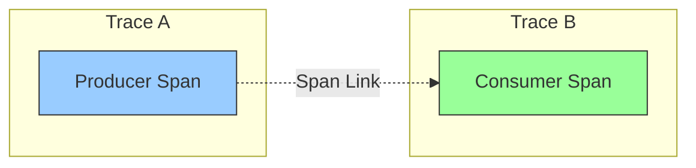

# How to Debug Span Links Not Appearing in Trace Views

Author: [nawazdhandala](https://www.github.com/nawazdhandala)

Tags: OpenTelemetry, Tracing, Span Links, Debugging, Observability, Troubleshooting

Description: A practical guide to diagnosing and fixing span links that fail to appear in trace visualization backends, covering SDK configuration and backend compatibility.

---

Span links are one of the more underused features in OpenTelemetry, and when they do not show up in your trace views, debugging the problem can be surprisingly tricky. Unlike parent-child relationships, which are well supported across every backend, span links have inconsistent support and several subtle ways they can silently fail. This guide walks through the most common reasons span links disappear and how to fix each one.

## What Span Links Are and Why They Matter

Before diving into debugging, it helps to understand what span links actually do. A span link creates a causal relationship between two spans that do not have a direct parent-child relationship. The classic use cases include batch processing (one span processes items that each originated from separate traces), fan-out/fan-in patterns, and asynchronous workflows where a message is produced in one trace and consumed in another.



The link carries the trace ID and span ID of the related span, along with optional attributes. Unlike the parent relationship, a link does not affect the trace hierarchy. It is metadata that says "this span is related to that other span."

## Problem 1: The Backend Does Not Support Span Links

This is by far the most common reason links do not show up. Many tracing backends and their UI frontends simply ignore span links during rendering. The spans get stored correctly, but the visualization layer does not display them.

To verify this is your issue, export a span with a link and inspect the raw data rather than relying on the UI:

```python
from opentelemetry import trace
from opentelemetry.trace import Link, SpanContext, TraceFlags

tracer = trace.get_tracer("link-test")

# Create a fake span context to link to.
# In production, this would come from an actual span.
linked_context = SpanContext(
    trace_id=0x5CE0E9A56015FEC5AADFA328AE398115,
    span_id=0xAB54A98CEB1F0AD2,
    is_remote=True,
    trace_flags=TraceFlags(0x01),
)

# Create a span with a link to the remote context.
# The Link object carries the span context and optional attributes.
link = Link(
    context=linked_context,
    attributes={"link.reason": "batch_origin"},
)

with tracer.start_as_current_span("process-batch", links=[link]) as span:
    print(f"Span ID: {span.get_span_context().span_id}")
    print(f"Link target trace: {linked_context.trace_id}")
```

Then check if the link appears in the exported data by using the debug exporter in your Collector:

```yaml
# Collector config to inspect raw span data including links
receivers:
  otlp:
    protocols:
      grpc:
        endpoint: 0.0.0.0:4317

exporters:
  # Debug exporter prints full span details including links
  debug:
    verbosity: detailed

  otlp:
    endpoint: backend.example.com:4317

service:
  pipelines:
    traces:
      receivers: [otlp]
      processors: []
      exporters: [debug, otlp]
```

In the debug output, look for a `Links` section in the span. If the links appear in the debug output but not in your backend UI, the issue is on the backend side, not in your instrumentation.

## Problem 2: Links Created After Span Start

A subtle but common mistake is trying to add links after the span has already been created. In OpenTelemetry, span links must be provided at span creation time. Unlike attributes or events, you cannot add links to an active span.

This will not work:

```python
from opentelemetry import trace

tracer = trace.get_tracer("link-test")

# This is wrong. You cannot add links after span creation.
# The OpenTelemetry API does not provide an add_link method
# on active spans. Links must be passed during start_as_current_span.
with tracer.start_as_current_span("my-span") as span:
    # There is no span.add_link() method.
    # Any attempt to set links here will fail silently or error.
    pass
```

The correct approach is to collect all the span contexts you need to link to before starting the span:

```python
from opentelemetry import trace
from opentelemetry.trace import Link

tracer = trace.get_tracer("link-test")

# Collect link targets before creating the span.
# These might come from message headers, batch metadata, etc.
link_targets = get_source_span_contexts()  # your function

# Build Link objects from the collected contexts
links = [
    Link(
        context=ctx,
        attributes={"link.source": f"message-{i}"},
    )
    for i, ctx in enumerate(link_targets)
]

# Pass all links at span creation time
with tracer.start_as_current_span("process-batch", links=links) as span:
    for item in batch:
        process(item)
```

In Go, the pattern is similar:

```go
package main

import (
    "context"
    "go.opentelemetry.io/otel"
    "go.opentelemetry.io/otel/trace"
)

func processBatch(ctx context.Context, messages []Message) {
    tracer := otel.Tracer("link-test")

    // Build links from message span contexts before starting the span
    var links []trace.Link
    for _, msg := range messages {
        // Extract the span context from each message's headers
        linkedCtx := extractSpanContext(msg.Headers)
        links = append(links, trace.Link{
            SpanContext: linkedCtx,
            Attributes: []attribute.KeyValue{
                attribute.String("link.message_id", msg.ID),
            },
        })
    }

    // Pass links via WithLinks option at span start
    ctx, span := tracer.Start(ctx, "process-batch",
        trace.WithLinks(links...),
    )
    defer span.End()

    // Process the batch
    for _, msg := range messages {
        processMessage(ctx, msg)
    }
}
```

## Problem 3: Invalid or Empty Span Contexts in Links

Links that reference invalid span contexts are silently dropped by most SDKs. A span context is invalid if the trace ID or span ID is all zeros, or if the context object is nil.

This commonly happens when you try to extract a span context from a message that was produced by a service that was not instrumented, or when the context propagation headers were stripped by a proxy.

```python
from opentelemetry import trace
from opentelemetry.trace import Link, SpanContext, TraceFlags

# This link will be silently dropped because the trace ID is zero.
# An all-zero trace ID means "invalid" in OpenTelemetry.
invalid_context = SpanContext(
    trace_id=0,
    span_id=0,
    is_remote=True,
    trace_flags=TraceFlags(0x01),
)

link = Link(context=invalid_context)

tracer = trace.get_tracer("link-test")

# The span will be created, but the link will not be attached
# because it references an invalid span context.
with tracer.start_as_current_span("my-span", links=[link]) as span:
    pass
```

To guard against this, validate span contexts before creating links:

```python
from opentelemetry import trace
from opentelemetry.trace import Link

def create_valid_links(span_contexts):
    """Filter out invalid span contexts before creating links."""
    valid_links = []
    for ctx in span_contexts:
        # is_valid checks that trace_id and span_id are non-zero
        if ctx.is_valid:
            valid_links.append(Link(context=ctx))
        else:
            # Log the invalid context for debugging
            print(f"Skipping invalid span context: "
                  f"trace_id={ctx.trace_id}, span_id={ctx.span_id}")
    return valid_links
```

## Problem 4: Link Attributes Exceeding Limits

OpenTelemetry SDKs impose limits on span links. By default, most SDKs allow 128 links per span and 128 attributes per link. If you exceed these limits, links are silently dropped.

You can adjust these limits in the SDK configuration:

```python
from opentelemetry.sdk.trace import TracerProvider, SpanLimits

# Increase the link limit if your use case requires many links.
# For example, a batch processor that handles thousands of items
# might need more than the default 128 links.
span_limits = SpanLimits(
    max_links=512,
    max_link_attributes=64,
)

provider = TracerProvider(span_limits=span_limits)
```

In Go:

```go
package main

import (
    "go.opentelemetry.io/otel/sdk/trace"
)

func initTracer() {
    // Configure higher link limits for batch processing spans
    tp := trace.NewTracerProvider(
        trace.WithSpanLimits(trace.SpanLimits{
            // Allow up to 512 links per span
            LinkCountLimit: 512,
            // Allow up to 64 attributes per link
            AttributePerLinkCountLimit: 64,
        }),
    )
}
```

You can also set these via environment variables:

```bash
# Set link limits via environment variables
# These apply to all SDKs that respect the OTel env var spec
export OTEL_SPAN_LINK_COUNT_LIMIT=512
export OTEL_LINK_ATTRIBUTE_COUNT_LIMIT=64
```

If you genuinely need to link to thousands of items, consider a different approach. Instead of one link per item, create a summary attribute on the span and link to a representative sample.

## Problem 5: Context Propagation Not Carrying Link Data

Span links themselves are not propagated through context. They exist only on the span where they are created. If you are expecting a link to "follow" the trace through downstream services, that is not how links work.

However, the information you need to create a link (the span context of the related span) does need to be propagated somehow. In messaging systems, this typically means injecting the span context into message headers:

```python
from opentelemetry import trace, context
from opentelemetry.propagators import inject

tracer = trace.get_tracer("producer")

def produce_message(message):
    """Inject current span context into message headers for linking."""
    with tracer.start_as_current_span("produce") as span:
        headers = {}
        # Inject the current context into message headers.
        # The consumer will extract this and use it to create a link.
        inject(headers)
        message.headers = headers
        message_queue.send(message)
```

```python
from opentelemetry import trace, context
from opentelemetry.propagators import extract
from opentelemetry.trace import Link

tracer = trace.get_tracer("consumer")

def consume_messages(messages):
    """Extract span contexts from message headers and create links."""
    links = []
    for msg in messages:
        # Extract the producer's span context from headers
        ctx = extract(msg.headers)
        span_ctx = trace.get_current_span(ctx).get_span_context()
        if span_ctx.is_valid:
            links.append(Link(
                context=span_ctx,
                attributes={"messaging.message_id": msg.id},
            ))

    # Create a single consumer span linked to all producer spans
    with tracer.start_as_current_span("consume-batch", links=links):
        for msg in messages:
            process(msg)
```

## Problem 6: Collector Processors Stripping Links

Some Collector processors can inadvertently remove link data. The `transform` processor and `attributes` processor generally do not touch links, but custom processors or certain filter configurations might.

To verify the Collector is not stripping links, add a debug exporter at both the beginning and end of your processor chain:

```yaml
# Collector config to check if processors strip links
receivers:
  otlp:
    protocols:
      grpc:
        endpoint: 0.0.0.0:4317

processors:
  batch:
    timeout: 5s

exporters:
  # Debug exporter to see spans before and after processing
  debug:
    verbosity: detailed

  otlp:
    endpoint: backend.example.com:4317

service:
  pipelines:
    # Pipeline with debug to inspect link data
    traces:
      receivers: [otlp]
      processors: [batch]
      exporters: [debug, otlp]
```

Compare the link data in the debug output with what appears in your backend. If links appear in the debug output but not after export, the issue is in the exporter or backend.

## Verifying Links End to End

Here is a complete test you can run to verify that links work through your entire pipeline. This Python script creates two traces and links them:

```python
from opentelemetry import trace
from opentelemetry.sdk.trace import TracerProvider
from opentelemetry.sdk.trace.export import BatchSpanExporter
from opentelemetry.exporter.otlp.proto.grpc.trace_exporter import OTLPSpanExporter
from opentelemetry.trace import Link
import time

# Set up the tracer provider with OTLP export
exporter = OTLPSpanExporter(endpoint="localhost:4317", insecure=True)
provider = TracerProvider()
provider.add_span_processor(BatchSpanExporter(exporter))
trace.set_tracer_provider(provider)

tracer = trace.get_tracer("link-verification")

# Step 1: Create the source span and capture its context
with tracer.start_as_current_span("source-operation") as source_span:
    source_context = source_span.get_span_context()
    source_trace_id = format(source_context.trace_id, '032x')
    source_span_id = format(source_context.span_id, '016x')
    print(f"Source trace ID: {source_trace_id}")
    print(f"Source span ID: {source_span_id}")
    time.sleep(0.1)

# Step 2: Create a span in a different trace that links back to the source
link = Link(
    context=source_context,
    attributes={"link.reason": "verification_test"},
)

with tracer.start_as_current_span("linked-operation", links=[link]) as linked_span:
    linked_context = linked_span.get_span_context()
    linked_trace_id = format(linked_context.trace_id, '032x')
    print(f"Linked trace ID: {linked_trace_id}")
    print(f"Link points to: {source_trace_id}/{source_span_id}")
    time.sleep(0.1)

# Flush to ensure all spans are exported
provider.force_flush()
print("Spans exported. Check your backend for the link.")
```

Run this script and then search for both trace IDs in your backend. The "linked-operation" span should show a link pointing to the "source-operation" span. If it does not, you now know where in the pipeline to focus your debugging.

## Conclusion

Span links are a powerful feature for modeling complex distributed relationships, but they require careful attention at every layer of the pipeline. Start by verifying your backend actually renders links. Then check that you are creating links at span start time with valid span contexts. Watch for limit violations that silently drop links, and make sure your Collector pipeline is not stripping link data. With these checks in place, span links become a reliable way to connect related traces across your system.
