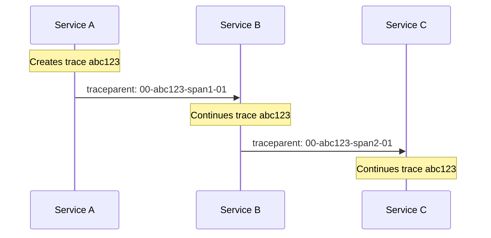

# How to Debug W3C TraceContext Propagation Failures

Author: [nawazdhandala](https://www.github.com/nawazdhandala)

Tags: OpenTelemetry, W3C TraceContext, Propagation, Distributed Tracing, Debugging, Context Propagation

Description: A step-by-step guide to diagnosing and fixing W3C TraceContext propagation failures across services in OpenTelemetry distributed tracing setups.

---

W3C TraceContext is the standard propagation format for distributed tracing. It uses two HTTP headers, `traceparent` and `tracestate`, to carry trace identity and vendor-specific data across service boundaries. When propagation works, every service in a request chain shares the same trace ID and your traces appear as a single connected graph. When it breaks, you get fragmented traces, orphaned spans, and an observability experience that is more confusing than helpful.

This guide walks through how to systematically debug W3C TraceContext propagation failures, from confirming the problem to finding and fixing the root cause.

## How W3C TraceContext Propagation Works

Before debugging failures, let's review what should happen when propagation is working correctly.

When Service A makes an HTTP request to Service B, the OpenTelemetry SDK in Service A injects two headers into the outgoing request:

```
traceparent: 00-4bf92f3577b34da6a3ce929d0e0e4736-00f067aa0ba902b7-01
tracestate: oneuptime=t61rcWVjZw
```

The `traceparent` header has four fields separated by dashes:

- `00` - version
- `4bf92f3577b34da6a3ce929d0e0e4736` - trace ID (32 hex characters)
- `00f067aa0ba902b7` - parent span ID (16 hex characters)
- `01` - trace flags (01 means sampled)

When Service B receives this request, its SDK extracts the trace context from the headers, creates a new span with the extracted trace ID as the parent, and the trace continues seamlessly.



When propagation fails, Service B does not see the `traceparent` header (or sees a malformed one) and starts a brand new trace with a different trace ID.

## Step 1: Confirm That Propagation Is Actually Broken

The first thing to do is confirm that you actually have a propagation failure and not some other issue like a sampling problem or an exporter failure.

Look at your traces in your tracing backend. If you see a request that should produce a single trace but instead shows up as two or more separate traces with different trace IDs, that is a propagation failure.

You can also verify programmatically by logging the trace context on both sides:

```javascript
// Service A: Log the trace context before making an outgoing request
const { trace, context } = require('@opentelemetry/api');

function makeRequest() {
  const currentSpan = trace.getActiveSpan();
  if (currentSpan) {
    const spanContext = currentSpan.spanContext();
    // Log the trace ID that should propagate to Service B
    console.log('Outgoing trace ID:', spanContext.traceId);
    console.log('Outgoing span ID:', spanContext.spanId);
  } else {
    // If there is no active span, no context will be propagated
    console.log('WARNING: No active span found - nothing to propagate');
  }

  // Make the HTTP request to Service B
  // The SDK should automatically inject traceparent into this request
  fetch('http://service-b:3000/api/data');
}
```

```javascript
// Service B: Log the trace context received from incoming requests
const express = require('express');
const { trace } = require('@opentelemetry/api');

const app = express();

app.get('/api/data', (req, res) => {
  // Log the raw traceparent header to see what arrived
  console.log('Received traceparent:', req.headers['traceparent'] || 'MISSING');

  // Log the trace context that the SDK extracted
  const currentSpan = trace.getActiveSpan();
  if (currentSpan) {
    console.log('Active trace ID:', currentSpan.spanContext().traceId);
  }

  res.json({ status: 'ok' });
});
```

Compare the trace IDs from both logs. If they match, propagation is working. If Service B shows a different trace ID or the `traceparent` header is missing, you have confirmed a propagation failure.

## Step 2: Verify the Propagator Configuration

OpenTelemetry supports multiple propagation formats. The SDK needs to be configured with the correct propagator on both sides. If Service A injects W3C TraceContext headers but Service B is configured to extract B3 headers (the Zipkin format), propagation will fail.

```javascript
// Check which propagator is configured
// The default is W3C TraceContext, but it might have been changed
const { propagation } = require('@opentelemetry/api');

// Explicitly set the W3C TraceContext propagator
const { W3CTraceContextPropagator } = require('@opentelemetry/core');

// Configure the global propagator
// Both services in a trace chain must use the same propagator
propagation.setGlobalPropagator(new W3CTraceContextPropagator());
```

If you are in a mixed environment where some services use W3C and others use B3, use a composite propagator:

```javascript
const { CompositePropagator } = require('@opentelemetry/core');
const { W3CTraceContextPropagator } = require('@opentelemetry/core');
const { B3Propagator, B3InjectEncoding } = require('@opentelemetry/propagator-b3');

// Composite propagator that handles both W3C and B3 formats
// It will inject both formats and try to extract from either
const propagator = new CompositePropagator({
  propagators: [
    new W3CTraceContextPropagator(),
    new B3Propagator({ injectEncoding: B3InjectEncoding.MULTI_HEADER }),
  ],
});

propagation.setGlobalPropagator(propagator);
```

You can also configure the propagator via environment variables without changing code:

```bash
# Set the propagator via environment variable
# This must match across all services in the trace chain
export OTEL_PROPAGATORS=tracecontext,baggage

# For mixed environments, include both W3C and B3
export OTEL_PROPAGATORS=tracecontext,baggage,b3multi
```

## Step 3: Check the HTTP Client Instrumentation

Propagation only works if the HTTP client library used to make outgoing requests is properly instrumented. The instrumentation is what calls the propagator's `inject` method to add headers to outgoing requests.

If you are using `fetch`, `axios`, `http.request`, or any other HTTP client, make sure the corresponding instrumentation package is installed and active:

```javascript
// Verify that HTTP instrumentation is registered and active
const { diag, DiagConsoleLogger, DiagLogLevel } = require('@opentelemetry/api');

// Enable debug logging to see if HTTP requests are being instrumented
diag.setLogger(new DiagConsoleLogger(), DiagLogLevel.DEBUG);

// Look for messages like:
// "http instrumentation: outgoing request"
// "inject called with carrier"
// These confirm that the instrumentation is intercepting HTTP calls
```

A common failure mode is when the HTTP client is imported before the instrumentation is set up. In that case, the client's methods are not patched and no headers are injected. See the troubleshooting auto-instrumentation guide for details on initialization ordering.

## Step 4: Inspect Headers at the Network Level

Sometimes the issue is not with OpenTelemetry at all but with an intermediary that strips headers. Proxies, API gateways, load balancers, and CDNs can all remove or modify headers.

Use network-level inspection to see exactly what headers are being sent and received:

```bash
# Use curl with verbose output to see the exact headers sent and received
# Replace the URL with your actual service endpoint
curl -v \
  -H "traceparent: 00-4bf92f3577b34da6a3ce929d0e0e4736-00f067aa0ba902b7-01" \
  -H "tracestate: vendor=value" \
  http://service-b:3000/api/data

# The verbose output shows:
# > traceparent: 00-4bf92f3577b34da6a3ce929d0e0e4736-00f067aa0ba902b7-01
# > tracestate: vendor=value
# These lines confirm the headers are being sent
```

If there is a proxy between your services, test both sides of the proxy separately:


```bash
# Test connectivity directly to Service B, bypassing any proxies
# If this works but going through the proxy does not, the proxy is the problem
curl -v \
  -H "traceparent: 00-4bf92f3577b34da6a3ce929d0e0e4736-00f067aa0ba902b7-01" \
  http://service-b-internal:3000/api/data
```

## Step 5: Validate the traceparent Header Format

If the `traceparent` header is present but malformed, the receiving SDK will reject it and start a new trace. The header must follow a strict format.

```javascript
// Validate a traceparent header value
// Returns true if the format is valid according to W3C spec
function validateTraceparent(value) {
  if (!value) {
    console.log('traceparent is missing or empty');
    return false;
  }

  // The regex matches the W3C traceparent format:
  // version-traceId-parentId-traceFlags
  const pattern = /^([0-9a-f]{2})-([0-9a-f]{32})-([0-9a-f]{16})-([0-9a-f]{2})$/;
  const match = value.match(pattern);

  if (!match) {
    console.log('traceparent does not match expected format:', value);
    return false;
  }

  const [, version, traceId, parentId, flags] = match;

  // Version 00 is the current version
  if (version === 'ff') {
    console.log('Invalid version: ff is reserved');
    return false;
  }

  // All-zero trace ID is invalid
  if (traceId === '00000000000000000000000000000000') {
    console.log('Invalid trace ID: all zeros');
    return false;
  }

  // All-zero parent ID is invalid
  if (parentId === '0000000000000000') {
    console.log('Invalid parent ID: all zeros');
    return false;
  }

  console.log('traceparent is valid');
  console.log('  Version:', version);
  console.log('  Trace ID:', traceId);
  console.log('  Parent ID:', parentId);
  console.log('  Flags:', flags, flags === '01' ? '(sampled)' : '(not sampled)');

  return true;
}

// Test with a sample header
validateTraceparent('00-4bf92f3577b34da6a3ce929d0e0e4736-00f067aa0ba902b7-01');
```

Common format issues include:
- Uppercase hex characters (the spec requires lowercase)
- Missing or extra dashes
- Wrong length for trace ID or span ID fields
- All-zero trace ID or parent ID

## Step 6: Check for Context Loss in Async Code

In JavaScript, trace context is propagated through async operations using `AsyncLocalStorage` (in Node.js) or `Zone.js` (in browsers). If you are using certain patterns that break the async context chain, the trace context can get lost between the point where a request is received and where an outgoing request is made.

```javascript
// Context can be lost when callbacks escape the async context
// This is a common issue with event emitters and certain callback patterns

const { context, trace } = require('@opentelemetry/api');

// BAD: setTimeout without context propagation
// The trace context is lost inside the callback
setTimeout(() => {
  // trace.getActiveSpan() returns undefined here
  makeOutgoingRequest(); // No trace context propagated
}, 100);

// GOOD: Explicitly bind the context before the async operation
const currentContext = context.active();
setTimeout(context.bind(currentContext, () => {
  // trace.getActiveSpan() returns the correct span here
  makeOutgoingRequest(); // Trace context propagated correctly
}), 100);
```

## Wrapping Up

Debugging W3C TraceContext propagation failures is a process of elimination. Start by confirming that the trace IDs actually differ between services, then check propagator configuration, verify HTTP client instrumentation, inspect headers at the network level, validate the header format, and look for async context loss. In most cases, the problem falls into one of these categories: mismatched propagators, missing HTTP instrumentation, an intermediary stripping headers, or async context getting lost. By working through each layer systematically, you can pinpoint exactly where the trace context breaks and apply the right fix.
