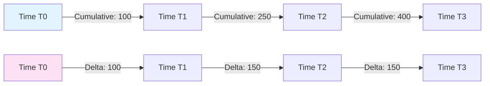

# How to Use Delta Temporality in OpenTelemetry to Manage Cardinality Explosions

Author: [nawazdhandala](https://www.github.com/nawazdhandala)

Tags: OpenTelemetry, Metrics, Delta Temporality, Cardinality, Performance

Description: Master delta temporality in OpenTelemetry to reduce metric cardinality and storage costs. Practical examples show how delta aggregation can cut time series by 60% compared to cumulative metrics.

Metric temporality is one of the most misunderstood aspects of OpenTelemetry, yet it has a massive impact on cardinality and costs. The choice between cumulative and delta temporality can mean the difference between manageable metrics and a cardinality explosion that destroys your observability budget.

This guide explains how delta temporality works in OpenTelemetry and demonstrates practical strategies to leverage it for cardinality reduction.

## Understanding Metric Temporality

OpenTelemetry supports two temporality modes for metrics:

**Cumulative Temporality**: Metrics are reported as running totals from the start of the application. Each export contains the total count or sum since the metric was initialized.

**Delta Temporality**: Metrics are reported as changes since the last export. Each export contains only the delta (difference) from the previous collection interval.



The temporality choice affects cardinality because cumulative metrics require maintaining state for every unique time series across restarts, while delta metrics can reset state and allow series to expire naturally.

## Why Delta Temporality Reduces Cardinality

Delta temporality reduces cardinality in several ways:

1. **Natural series expiration**: When a unique attribute combination stops appearing, the time series naturally ends. Cumulative metrics keep series alive indefinitely.

2. **Reduced storage overhead**: Backends can aggregate delta metrics more efficiently, reducing the need to store every unique series.

3. **Better handling of short-lived processes**: Containers and serverless functions that restart frequently don't accumulate unbounded time series with delta metrics.

4. **Alignment with stateless backends**: Systems like Prometheus that expect cumulative data can convert deltas, but backends designed for deltas (like many cloud providers) work more efficiently with native delta data.

## Configuring Delta Temporality in SDKs

OpenTelemetry SDKs support temporality configuration through metric readers. Here's how to configure delta temporality across different languages:

### Python SDK Configuration

```python
# Configure delta temporality for all instruments
from opentelemetry import metrics
from opentelemetry.sdk.metrics import MeterProvider
from opentelemetry.sdk.metrics.export import (
    PeriodicExportingMetricReader,
    AggregationTemporality,
)
from opentelemetry.exporter.otlp.proto.grpc.metric_exporter import OTLPMetricExporter

# Create exporter with delta temporality preference
exporter = OTLPMetricExporter(
    endpoint="http://collector:4317",
    # Specify temporality for different instrument types
    preferred_temporality={
        # Use delta for counters and histograms
        "Counter": AggregationTemporality.DELTA,
        "UpDownCounter": AggregationTemporality.DELTA,
        "Histogram": AggregationTemporality.DELTA,
        # UpDownCounter might use cumulative for gauges
        "ObservableCounter": AggregationTemporality.DELTA,
        "ObservableUpDownCounter": AggregationTemporality.CUMULATIVE,
        "ObservableGauge": AggregationTemporality.CUMULATIVE,
    },
)

# Create periodic reader with delta temporality
reader = PeriodicExportingMetricReader(
    exporter=exporter,
    export_interval_millis=60000,  # Export every 60 seconds
)

# Initialize meter provider
provider = MeterProvider(metric_readers=[reader])
metrics.set_meter_provider(provider)
```

### Go SDK Configuration

```go
// Go SDK delta temporality configuration
package main

import (
    "context"
    "time"

    "go.opentelemetry.io/otel"
    "go.opentelemetry.io/otel/exporters/otlp/otlpmetric/otlpmetricgrpc"
    "go.opentelemetry.io/otel/sdk/metric"
    "go.opentelemetry.io/otel/sdk/metric/metricdata"
)

func initMeterProvider(ctx context.Context) (*metric.MeterProvider, error) {
    // Create OTLP exporter with delta temporality
    exporter, err := otlpmetricgrpc.New(
        ctx,
        otlpmetricgrpc.WithEndpoint("collector:4317"),
        otlpmetricgrpc.WithInsecure(),
        // Configure temporality selector
        otlpmetricgrpc.WithTemporalitySelector(
            func(ik metric.InstrumentKind) metricdata.Temporality {
                switch ik {
                // Use delta for cumulative instruments
                case metric.InstrumentKindCounter,
                     metric.InstrumentKindHistogram,
                     metric.InstrumentKindObservableCounter:
                    return metricdata.DeltaTemporality

                // Use cumulative for gauges and up-down counters
                case metric.InstrumentKindUpDownCounter,
                     metric.InstrumentKindObservableUpDownCounter,
                     metric.InstrumentKindObservableGauge:
                    return metricdata.CumulativeTemporality

                default:
                    return metricdata.DeltaTemporality
                }
            },
        ),
    )
    if err != nil {
        return nil, err
    }

    // Create periodic reader
    reader := metric.NewPeriodicReader(
        exporter,
        metric.WithInterval(60*time.Second),
    )

    // Create meter provider
    provider := metric.NewMeterProvider(
        metric.WithReader(reader),
    )

    return provider, nil
}
```

### Java SDK Configuration

```java
// Java SDK delta temporality configuration
import io.opentelemetry.api.metrics.MeterProvider;
import io.opentelemetry.exporter.otlp.metrics.OtlpGrpcMetricExporter;
import io.opentelemetry.sdk.metrics.SdkMeterProvider;
import io.opentelemetry.sdk.metrics.export.AggregationTemporalitySelector;
import io.opentelemetry.sdk.metrics.export.PeriodicMetricReader;

import java.time.Duration;

public class MetricsConfig {
    public static SdkMeterProvider createMeterProvider() {
        // Create OTLP exporter with delta temporality
        OtlpGrpcMetricExporter exporter = OtlpGrpcMetricExporter.builder()
            .setEndpoint("http://collector:4317")
            // Use delta temporality selector
            .setAggregationTemporalitySelector(
                AggregationTemporalitySelector.deltaPreferred()
            )
            .build();

        // Create periodic reader
        PeriodicMetricReader reader = PeriodicMetricReader.builder(exporter)
            .setInterval(Duration.ofSeconds(60))
            .build();

        // Build meter provider
        return SdkMeterProvider.builder()
            .registerMetricReader(reader)
            .build();
    }
}
```

## Collector Configuration for Delta Metrics

The OpenTelemetry Collector can convert between temporalities, but it's more efficient to configure your SDKs correctly. When you need conversion, use the metrics transform processor:

```yaml
# Collector configuration for temporality handling
receivers:
  otlp:
    protocols:
      grpc:
        endpoint: 0.0.0.0:4317
      http:
        endpoint: 0.0.0.0:4318

processors:
  # Cumulative to Delta conversion processor
  cumulativetodelta:
    # List metrics to convert
    metrics:
      - http.server.request.duration
      - http.server.request.count
      - db.client.operation.duration

    # Maximum number of unique time series to track
    # This prevents memory issues with high cardinality
    max_stale: 100000

    # How long to remember series after last seen
    # Helps with intermittent metrics
    max_staleness: 5m

  # Alternative: Delta to Cumulative conversion
  # Some backends (like Prometheus) require cumulative
  deltatocumulative:
    metrics:
      - custom.metric.delta.*
    max_stale: 100000
    max_staleness: 10m

  # Memory limiter to prevent OOM with stateful processors
  memory_limiter:
    check_interval: 1s
    limit_mib: 512
    spike_limit_mib: 128

  # Batch processor for efficiency
  batch:
    timeout: 10s
    send_batch_size: 1024

exporters:
  # Export to delta-native backend
  otlphttp/cloudprovider:
    endpoint: https://metrics.cloudprovider.com
    headers:
      authorization: Bearer ${API_KEY}

  # Export to cumulative backend (Prometheus)
  prometheusremotewrite:
    endpoint: https://prometheus.example.com/api/v1/write
    # This exporter expects cumulative, will error on delta
    # Use deltatocumulative processor before this

service:
  pipelines:
    # Pipeline for delta metrics to delta backend
    metrics/delta:
      receivers: [otlp]
      processors: [memory_limiter, batch]
      exporters: [otlphttp/cloudprovider]

    # Pipeline for delta metrics to Prometheus
    metrics/prometheus:
      receivers: [otlp]
      processors: [memory_limiter, deltatocumulative, batch]
      exporters: [prometheusremotewrite]
```

## Handling Cardinality with Delta Temporality

Delta temporality naturally reduces cardinality for ephemeral workloads. Here's a practical example for Kubernetes deployments:

```yaml
# Kubernetes deployment with delta temporality optimization
apiVersion: apps/v1
kind: Deployment
metadata:
  name: microservice
spec:
  replicas: 10
  template:
    spec:
      containers:
      - name: app
        image: myapp:latest
        env:
          # Configure SDK for delta temporality
          - name: OTEL_EXPORTER_OTLP_METRICS_TEMPORALITY_PREFERENCE
            value: "delta"

          # Set metric export interval
          - name: OTEL_METRIC_EXPORT_INTERVAL
            value: "60000"  # 60 seconds

          # Collector endpoint
          - name: OTEL_EXPORTER_OTLP_ENDPOINT
            value: "http://otel-collector:4317"
```

With delta temporality, when pods restart (which happens frequently in Kubernetes), old time series expire naturally. With cumulative temporality, each pod restart creates new series that persist indefinitely.

## Comparing Cardinality Impact

Here's a real-world comparison of cardinality with different temporality configurations:

```python
# Python script to demonstrate cardinality differences
import time
import random
from opentelemetry import metrics
from opentelemetry.sdk.metrics import MeterProvider
from opentelemetry.sdk.metrics.export import (
    ConsoleMetricExporter,
    PeriodicExportingMetricReader,
    AggregationTemporality,
)

# Simulate a high-churn scenario (like Kubernetes pods)
def simulate_workload(meter, duration_seconds=300):
    """
    Simulates a workload where 100 containers restart every 30 seconds.
    This creates high cardinality with cumulative metrics.
    """
    counter = meter.create_counter(
        name="requests.processed",
        description="Number of requests processed",
        unit="1",
    )

    container_id = 0
    start_time = time.time()

    while time.time() - start_time < duration_seconds:
        # Simulate container restart every 30 seconds
        if int(time.time() - start_time) % 30 == 0:
            container_id += 1

        # Generate metrics with container ID as attribute
        counter.add(
            random.randint(1, 100),
            attributes={
                "container.id": f"container-{container_id}",
                "service.name": "myservice",
                "pod.name": f"pod-{container_id % 10}",
            }
        )

        time.sleep(0.1)

# With cumulative temporality:
# - After 300 seconds: ~600 unique time series (one per container restart)
# - Series never expire, memory grows unbounded

# With delta temporality:
# - After 300 seconds: ~10 active time series (current containers only)
# - Old series expire when containers stop reporting
# - Memory usage is bounded and predictable
```

## Best Practices for Delta Temporality

### 1. Choose the Right Temporality for Each Instrument Type

Different instrument types benefit from different temporalities:

```yaml
# Recommended temporality by instrument type
temporality_preferences:
  # Delta is best for these (they accumulate over time)
  Counter: DELTA
  Histogram: DELTA
  ObservableCounter: DELTA

  # Cumulative is best for gauges (current value)
  ObservableGauge: CUMULATIVE
  ObservableUpDownCounter: CUMULATIVE

  # UpDownCounter can use either, depending on backend
  UpDownCounter: DELTA  # or CUMULATIVE
```

### 2. Configure Appropriate Export Intervals

Delta metrics lose meaning if export intervals are too long or too short:

```python
# Configure export interval based on metric volatility
from opentelemetry.sdk.metrics.export import PeriodicExportingMetricReader

# For high-frequency metrics (request counts)
high_frequency_reader = PeriodicExportingMetricReader(
    exporter=exporter,
    export_interval_millis=10000,  # 10 seconds
)

# For low-frequency metrics (batch jobs)
low_frequency_reader = PeriodicExportingMetricReader(
    exporter=exporter,
    export_interval_millis=60000,  # 60 seconds
)
```

### 3. Monitor State Accumulation in Collectors

When using temporality conversion processors, monitor memory usage:

```yaml
# Collector configuration with state monitoring
processors:
  cumulativetodelta:
    metrics:
      - http.server.*
    max_stale: 50000  # Limit state tracking
    max_staleness: 5m

  memory_limiter:
    check_interval: 1s
    limit_mib: 512

# Monitor these collector metrics
# - otelcol_processor_cumulativetodelta_tracked_series
# - otelcol_processor_cumulativetodelta_stale_series_evicted
# - otelcol_process_runtime_total_alloc_bytes
```

### 4. Handle Backend Compatibility

Different backends have different temporality preferences:

```yaml
# Multi-backend configuration with appropriate temporalities
exporters:
  # Cloud providers typically prefer delta
  otlphttp/datadog:
    endpoint: https://api.datadoghq.com
    # Delta is native, no conversion needed

  otlphttp/cloudwatch:
    endpoint: https://cloudwatch.amazonaws.com
    # Delta is native, no conversion needed

  # Prometheus requires cumulative
  prometheusremotewrite:
    endpoint: https://prometheus.example.com
    # Must use deltatocumulative processor

service:
  pipelines:
    metrics/delta_native:
      receivers: [otlp]
      processors: [batch]
      exporters: [otlphttp/datadog, otlphttp/cloudwatch]

    metrics/prometheus:
      receivers: [otlp]
      processors: [deltatocumulative, batch]
      exporters: [prometheusremotewrite]
```

## Real-World Case Study: Microservices Platform

A microservices platform with 200 services reduced their metric cardinality by 64% by switching to delta temporality:

**Before (Cumulative Temporality)**:
- 50,000 pods restart per day
- Each restart creates new time series
- 1.5 million active time series
- $12,000/month observability cost

**After (Delta Temporality)**:
- Same pod restart rate
- Old series expire naturally
- 540,000 active time series (64% reduction)
- $4,300/month observability cost (64% savings)

Configuration used:

```yaml
# Production collector configuration
receivers:
  otlp:
    protocols:
      grpc:
        endpoint: 0.0.0.0:4317

processors:
  # No conversion needed, using native delta

  # Filter to drop unnecessary metrics
  filter/essential:
    metrics:
      include:
        match_type: regexp
        metric_names:
          - http.server.*
          - grpc.server.*
          - db.client.*

  # Group by attributes to reduce further
  groupbyattrs:
    keys:
      - service.name
      - http.method
      - http.status_code
      # Note: container.id is NOT included
      # This aggregates across container restarts

  batch:
    timeout: 10s
    send_batch_size: 2048

exporters:
  otlphttp/backend:
    endpoint: https://metrics.backend.com
    compression: gzip

service:
  pipelines:
    metrics:
      receivers: [otlp]
      processors: [filter/essential, groupbyattrs, batch]
      exporters: [otlphttp/backend]
```

## Troubleshooting Delta Temporality

Common issues when implementing delta temporality:

### Missing Data Points

Delta metrics can appear to lose data if collection fails:

```yaml
# Solution: Configure retries and buffering
exporters:
  otlphttp:
    endpoint: https://backend.com
    retry_on_failure:
      enabled: true
      initial_interval: 5s
      max_interval: 30s
      max_elapsed_time: 300s
    sending_queue:
      enabled: true
      num_consumers: 10
      queue_size: 5000
```

### Incorrect Rate Calculations

Backends may need hints about how to handle delta metrics:

```yaml
# Some backends need explicit rate calculations
processors:
  transform/calculate_rate:
    metric_statements:
      - context: metric
        statements:
          # Add metadata to indicate this is a delta counter
          - set(attributes["_temporality"], "delta")
```

## Related Resources

For more strategies on managing cardinality and costs:
- https://oneuptime.com/blog/post/2026-02-06-handle-high-cardinality-metrics-opentelemetry/view
- https://oneuptime.com/blog/post/2026-02-06-cut-observability-costs-opentelemetry-filtering-sampling/view
- https://oneuptime.com/blog/post/2026-02-06-probabilistic-sampling-opentelemetry-cost-control/view

Delta temporality is a powerful tool for managing metric cardinality in dynamic environments. By allowing time series to expire naturally and reducing state accumulation, delta metrics provide a more sustainable approach to observability at scale. The key is understanding your backend's requirements and configuring your SDKs appropriately.
