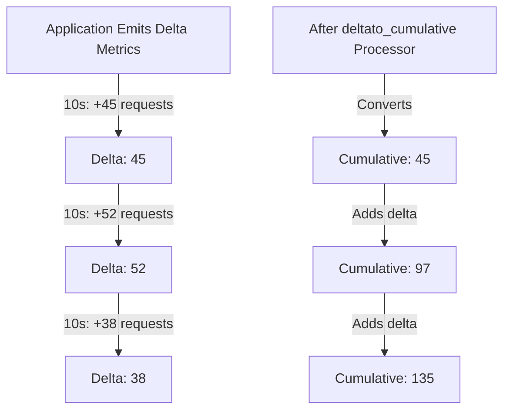
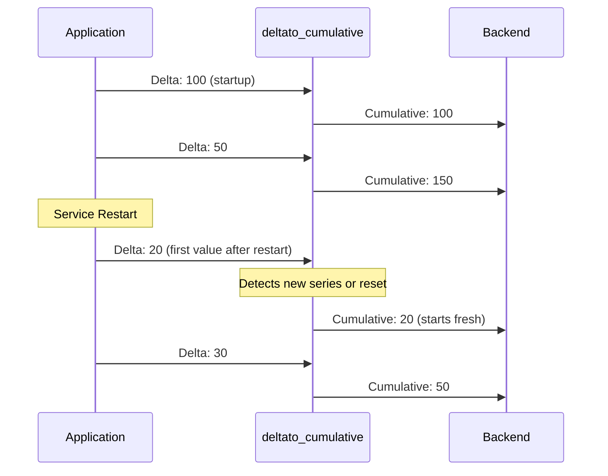

# How to Configure the Delta to Cumulative Processor in the OpenTelemetry Collector

Author: [nawazdhandala](https://www.github.com/nawazdhandala)

Tags: OpenTelemetry, Collector, Processors, Metrics, Delta, Cumulative, Aggregation

Description: Learn how to configure the delta-to-cumulative processor in OpenTelemetry Collector to convert delta metrics into cumulative metrics, handle counter resets, and optimize metric storage for backends that prefer monotonic counters.

---

Metrics come in different aggregation temporalities: delta and cumulative. Delta metrics report the change since the last measurement (like bytes transferred in the last minute), while cumulative metrics report the total since the process started (like total bytes transferred). Different backends and monitoring systems have preferences - some work better with cumulative counters, others with delta.

The delta-to-cumulative processor in the OpenTelemetry Collector converts delta metrics into cumulative ones, making your telemetry compatible with backends that expect monotonic counters. This processor is essential when you have instrumentation emitting delta metrics but need to send cumulative data to your observability platform.

## Understanding Delta vs Cumulative Metrics

Before configuring the processor, understanding the difference is critical.

**Delta metrics** represent the change over a time interval:
- HTTP requests handled in the last 10 seconds: 45
- Next interval: 52
- Next interval: 38

**Cumulative metrics** represent the running total since start:
- Total HTTP requests since process start: 45
- Next reading: 97 (45 + 52)
- Next reading: 135 (97 + 38)



Many Prometheus-compatible backends expect cumulative counters because they can calculate rates and deltas themselves using PromQL. Converting at the collector level ensures compatibility without modifying your instrumentation.

## Why You Need This Processor

The delta-to-cumulative processor solves several real-world problems:

**Backend Compatibility**: Backends like Prometheus, Cortex, and Thanos expect cumulative counters. If your SDKs or instrumentation emit delta metrics, this processor bridges the gap.

**Counter Reset Detection**: When services restart, cumulative counters reset to zero. The processor detects these resets and handles them gracefully, maintaining accurate cumulative values across restarts.

**Unified Metric Format**: In heterogeneous environments where some services emit delta and others emit cumulative metrics, this processor normalizes everything to cumulative, simplifying downstream analysis.

**Storage Optimization**: Cumulative metrics compress better in time-series databases because they form monotonic sequences, enabling efficient delta-of-delta encoding.

## Basic Configuration

The processor configuration is straightforward. At minimum, you specify which metrics to convert.

Here is a basic configuration that converts all delta sum metrics to cumulative:

```yaml
# RECEIVERS: Accept metrics via OTLP
receivers:
  otlp:
    protocols:
      grpc:
        endpoint: 0.0.0.0:4317

# PROCESSORS: Convert delta to cumulative metrics
processors:
  # Convert all delta temporality metrics to cumulative
  deltatocumulative:
    # By default, converts all delta sum and histogram metrics

  # Batch for efficiency
  batch:
    send_batch_max_size: 1024
    timeout: 10s

# EXPORTERS: Send to Prometheus-compatible backend
exporters:
  otlphttp:
    endpoint: https://oneuptime.com/otlp/v1/metrics
    headers:
      x-oneuptime-token: ${ONEUPTIME_TOKEN}

# SERVICE: Define the metrics pipeline
service:
  pipelines:
    metrics:
      receivers: [otlp]
      processors: [deltatocumulative, batch]
      exporters: [otlphttp]
```

This configuration receives metrics via OTLP, converts any delta metrics to cumulative, batches them, and exports to OneUptime. The processor automatically detects delta temporality and converts it.

## Advanced Configuration with Max Staleness

In production, metrics streams can be intermittent. A service might stop emitting a metric, then start again hours later. The processor needs to know when to consider a metric stream "stale" and reset its cumulative state.

The following configuration shows how to handle metric staleness:

```yaml
processors:
  # Advanced delta-to-cumulative with staleness handling
  deltatocumulative:
    # Maximum time to keep tracking a metric stream without updates
    # After this duration, the cumulative state is reset
    max_stale: 5m

    # Maximum number of unique metric streams to track
    # Prevents memory exhaustion from high-cardinality metrics
    max_streams: 10000

  # Memory protection for the collector
  memory_limiter:
    limit_mib: 512
    spike_limit_mib: 128
    check_interval: 1s

  batch:
    send_batch_max_size: 1024
    timeout: 10s

service:
  pipelines:
    metrics:
      receivers: [otlp]
      processors: [memory_limiter, deltatocumulative, batch]
      exporters: [otlphttp]
```

The `max_stale` parameter controls when the processor "forgets" about a metric stream. If a metric stops being reported for longer than this duration, its cumulative state is cleared. When the metric reappears, it starts fresh from the new delta value.

The `max_streams` parameter protects against memory exhaustion from high-cardinality metrics. If you have thousands of unique metric series (different label combinations), this limit prevents unbounded memory growth.

## Handling Service Restarts and Counter Resets

When a service restarts, its delta metrics reset to zero and start counting again. The processor needs to detect this and avoid treating the first post-restart value as a continuation of the pre-restart cumulative total.

Here is how the processor handles resets:



The processor tracks metric identity using the combination of metric name, attributes, and resource labels. When it sees a metric for the first time (or after max_stale expiration), it treats the delta value as the starting cumulative value.

## Selective Conversion with Filtering

You might not want to convert all metrics - only specific ones. Combine the processor with the filter processor to target specific metrics.

This configuration converts only HTTP request metrics to cumulative:

```yaml
processors:
  # Filter to select only HTTP request metrics
  filter/http_only:
    metrics:
      include:
        match_type: regexp
        metric_names:
          - ^http\..*requests.*$

  # Convert the filtered metrics
  deltatocumulative:
    max_stale: 5m
    max_streams: 5000

  # Separate pipeline for other metrics (no conversion)
  batch:
    send_batch_max_size: 1024
    timeout: 10s

exporters:
  otlphttp/cumulative:
    endpoint: https://oneuptime.com/otlp/v1/metrics
    headers:
      x-oneuptime-token: ${ONEUPTIME_TOKEN}

service:
  pipelines:
    # Pipeline for HTTP metrics (converted to cumulative)
    metrics/http:
      receivers: [otlp]
      processors: [filter/http_only, deltatocumulative, batch]
      exporters: [otlphttp/cumulative]
```

This pattern is useful when you have mixed metric types and only need to convert specific subsets for compatibility with particular backends.

## Multi-Backend Routing with Different Temporalities

Some backends prefer delta metrics, others prefer cumulative. The OpenTelemetry Collector can route metrics to different destinations based on their temporality requirements.

Here is a configuration that sends delta metrics to one backend and cumulative to another:

```yaml
receivers:
  otlp:
    protocols:
      grpc:
        endpoint: 0.0.0.0:4317

processors:
  # Clone metrics for dual export
  batch/delta:
    send_batch_max_size: 1024
    timeout: 10s

  # Convert for cumulative backend
  deltatocumulative:
    max_stale: 5m
    max_streams: 10000

  batch/cumulative:
    send_batch_max_size: 1024
    timeout: 10s

exporters:
  # Backend that prefers delta metrics
  otlphttp/delta_backend:
    endpoint: https://delta-metrics.example.com/v1/metrics
    headers:
      authorization: Bearer ${DELTA_TOKEN}

  # Backend that requires cumulative metrics (Prometheus-compatible)
  otlphttp/cumulative_backend:
    endpoint: https://oneuptime.com/otlp/v1/metrics
    headers:
      x-oneuptime-token: ${ONEUPTIME_TOKEN}

service:
  pipelines:
    # Send original delta metrics to delta-compatible backend
    metrics/delta:
      receivers: [otlp]
      processors: [batch/delta]
      exporters: [otlphttp/delta_backend]

    # Convert and send to cumulative-compatible backend
    metrics/cumulative:
      receivers: [otlp]
      processors: [deltatocumulative, batch/cumulative]
      exporters: [otlphttp/cumulative_backend]
```

This configuration receives metrics once but exports them twice: once in their original delta form and once converted to cumulative. This pattern is common during backend migrations or when maintaining multiple monitoring systems.

## Memory Considerations and Performance Tuning

The delta-to-cumulative processor maintains state for every unique metric stream it encounters. In high-cardinality environments (many unique label combinations), this can consume significant memory.

Here is a production configuration with memory protection:

```yaml
processors:
  # Protect collector from memory exhaustion
  memory_limiter:
    limit_mib: 1024          # Hard limit: 1GB
    spike_limit_mib: 256     # Allow temporary spikes
    check_interval: 1s       # Check memory usage every second

  # Convert with cardinality controls
  deltatocumulative:
    max_stale: 3m            # Shorter staleness window
    max_streams: 50000       # Limit tracked streams

  # Reduce cardinality before conversion (optional)
  resource/drop_high_cardinality:
    attributes:
      - key: container_id    # Drop high-cardinality labels
        action: delete
      - key: pod_uid
        action: delete

  batch:
    send_batch_max_size: 2048
    timeout: 5s

service:
  pipelines:
    metrics:
      receivers: [otlp]
      processors:
        - memory_limiter
        - resource/drop_high_cardinality
        - deltatocumulative
        - batch
      exporters: [otlphttp]
```

The memory_limiter processor runs first to protect the entire collector. The resource processor drops high-cardinality labels before conversion, reducing the number of unique streams the delta-to-cumulative processor needs to track.

## Debugging and Validation

To verify the processor is working correctly, enable debug logging and check the collector's internal metrics.

Add this to your configuration to enable detailed logging:

```yaml
service:
  telemetry:
    logs:
      level: debug    # Shows detailed processor operations

  pipelines:
    metrics:
      receivers: [otlp]
      processors: [deltatocumulative, batch]
      exporters: [otlphttp, logging]  # Add logging exporter

exporters:
  logging:
    loglevel: debug   # Print metrics to console for verification
```

The logging exporter prints processed metrics to stdout, allowing you to verify that delta metrics are being converted to cumulative with monotonically increasing values.

## Common Pitfalls and Solutions

**Problem**: Cumulative values seem to reset randomly.

**Solution**: Check your `max_stale` setting. If it's too short, the processor might be clearing state for metrics with irregular reporting intervals. Increase `max_stale` to match your longest expected gap between metric reports.

**Problem**: Collector memory usage keeps growing.

**Solution**: Set `max_streams` to prevent unbounded growth. Also investigate whether you have unexpectedly high cardinality in your metrics (too many unique label combinations). Use the resource or attributes processor to drop or aggregate high-cardinality labels.

**Problem**: Backend shows duplicate data or incorrect values after conversion.

**Solution**: Ensure you're not running multiple instances of the collector that all perform delta-to-cumulative conversion on the same metrics. Each instance maintains its own cumulative state, leading to multiple divergent cumulative series. Either centralize conversion in a single collector instance or ensure metrics are consistently routed to the same instance.

## Integration with OneUptime

OneUptime natively supports both delta and cumulative metrics via OTLP. However, for Prometheus-compatible querying and long-term storage optimization, cumulative metrics are preferred.

Here is a complete configuration for sending converted metrics to OneUptime:

```yaml
receivers:
  otlp:
    protocols:
      grpc:
        endpoint: 0.0.0.0:4317
      http:
        endpoint: 0.0.0.0:4318

processors:
  memory_limiter:
    limit_mib: 512
    spike_limit_mib: 128

  deltatocumulative:
    max_stale: 5m
    max_streams: 10000

  batch:
    send_batch_max_size: 1024
    timeout: 10s

exporters:
  otlphttp:
    endpoint: https://oneuptime.com/otlp/v1/metrics
    headers:
      x-oneuptime-token: ${ONEUPTIME_TOKEN}
    retry_on_failure:
      enabled: true
      initial_interval: 5s
      max_interval: 30s
      max_elapsed_time: 300s

service:
  pipelines:
    metrics:
      receivers: [otlp]
      processors: [memory_limiter, deltatocumulative, batch]
      exporters: [otlphttp]
```

This configuration provides a robust pipeline that converts delta metrics to cumulative format optimized for OneUptime's storage and querying capabilities.

## Related Resources

For more information on OpenTelemetry Collector processors and metrics handling:

- [OpenTelemetry Collector: What It Is, When You Need It, and When You Don't](https://oneuptime.com/blog/post/what-is-opentelemetry-collector-and-why-use-one/view)
- [How to Collect OpenTelemetry Collector Internal Metrics](https://oneuptime.com/blog/post/2025-01-22-how-to-collect-opentelemetry-collector-internal-metrics/view)
- [How to Reduce Noise in OpenTelemetry](https://oneuptime.com/blog/post/2025-08-25-how-to-reduce-noise-in-opentelemetry/view)

## Conclusion

The delta-to-cumulative processor is a specialized but essential tool when working with metrics in OpenTelemetry. It bridges the gap between instrumentation that emits delta metrics and backends that require cumulative counters, handling the complexity of counter resets, staleness, and memory management.

Configure it with appropriate max_stale and max_streams values for your environment, monitor its memory usage, and combine it with other processors like filtering and batching for a production-ready metrics pipeline. With OneUptime as your backend, you get native OTLP support with efficient storage for cumulative metrics, making this processor configuration straightforward and reliable.
