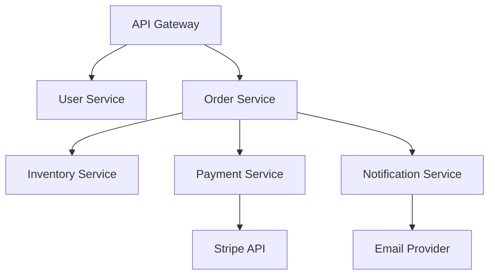
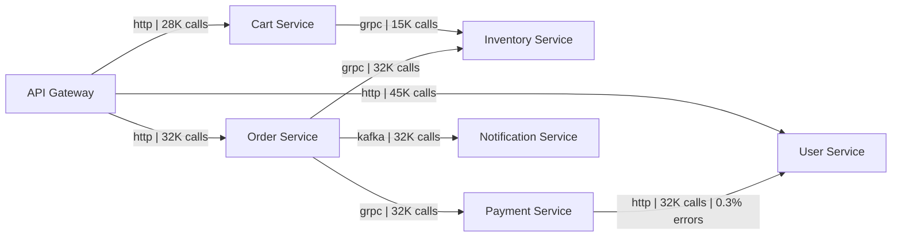

# How to Use OpenTelemetry Data for Dependency Graph Visualization

Author: [nawazdhandala](https://www.github.com/nawazdhandala)

Tags: OpenTelemetry, Dependency Graph, Service Map, Tracing, Visualization, Microservices, Observability

Description: Learn how to build dynamic service dependency graphs from OpenTelemetry trace data, providing real-time visibility into how your microservices communicate and depend on each other.

---

In a microservices architecture, understanding which services talk to which other services is surprisingly difficult. Documentation goes stale within weeks of being written. Architecture diagrams reflect how things were designed, not how they actually work in production.

OpenTelemetry traces contain all the information you need to build accurate, up-to-date dependency graphs. Every trace captures the path of a request through your system, including which services called which other services and how they communicated. By aggregating this information across all your traces, you can generate a dependency graph that always reflects reality.

This guide covers how to extract dependency relationships from OpenTelemetry trace data, how to build a graph data structure from those relationships, and how to visualize the result.

---

## How Traces Reveal Dependencies



Each span in a trace has a parent span. When a span's service name differs from its parent span's service name, that tells you there is a dependency between those two services. By processing all traces over a time window, you build the complete dependency map.

---

## Extracting Dependencies from Trace Data

The first step is processing your trace data to extract service-to-service relationships.

```python
# dependency_extractor.py
from dataclasses import dataclass, field
from collections import defaultdict
from datetime import datetime, timedelta
from typing import Optional

@dataclass
class ServiceEdge:
    """Represents a dependency between two services."""
    source: str           # The calling service
    target: str           # The called service
    protocol: str         # HTTP, gRPC, messaging, etc.
    call_count: int = 0   # Number of calls observed
    error_count: int = 0  # Number of failed calls
    avg_duration_ms: float = 0.0  # Average call duration
    last_seen: Optional[datetime] = None

@dataclass
class DependencyGraph:
    """The complete dependency graph for a system."""
    services: set = field(default_factory=set)
    edges: dict = field(default_factory=dict)  # (source, target) -> ServiceEdge
    generated_at: Optional[datetime] = None

class DependencyExtractor:
    """
    Extracts service dependency information from OpenTelemetry trace data.
    Processes spans to identify caller/callee relationships between services.
    """

    def __init__(self, trace_client):
        self.trace_client = trace_client

    def build_graph(self, lookback_hours: int = 24) -> DependencyGraph:
        """
        Build a dependency graph from traces collected over
        the specified lookback period.
        """
        end_time = datetime.utcnow()
        start_time = end_time - timedelta(hours=lookback_hours)

        graph = DependencyGraph(generated_at=end_time)

        # Fetch all traces from the lookback period
        traces = self.trace_client.query_traces(
            start=start_time,
            end=end_time,
        )

        for trace in traces:
            self._process_trace(trace, graph)

        return graph

    def _process_trace(self, trace_spans: list, graph: DependencyGraph):
        """Process all spans in a single trace to extract dependencies."""
        # Build a span lookup by span_id
        span_map = {span["span_id"]: span for span in trace_spans}

        for span in trace_spans:
            service = span.get("resource", {}).get("service.name", "unknown")
            graph.services.add(service)

            # Check if this span has a parent in a different service
            parent_id = span.get("parent_span_id")
            if parent_id and parent_id in span_map:
                parent = span_map[parent_id]
                parent_service = parent.get("resource", {}).get("service.name", "unknown")

                if parent_service != service:
                    # This is a cross-service call, record the dependency
                    edge_key = (parent_service, service)

                    if edge_key not in graph.edges:
                        graph.edges[edge_key] = ServiceEdge(
                            source=parent_service,
                            target=service,
                            protocol=self._detect_protocol(span),
                        )

                    edge = graph.edges[edge_key]
                    edge.call_count += 1
                    edge.last_seen = datetime.utcnow()

                    # Track errors
                    if span.get("status", {}).get("code") == "ERROR":
                        edge.error_count += 1

                    # Update average duration
                    duration_ms = span.get("duration_ns", 0) / 1_000_000
                    edge.avg_duration_ms = (
                        (edge.avg_duration_ms * (edge.call_count - 1) + duration_ms)
                        / edge.call_count
                    )

    def _detect_protocol(self, span: dict) -> str:
        """Detect the communication protocol from span attributes."""
        attrs = span.get("attributes", {})
        if "rpc.system" in attrs:
            return attrs["rpc.system"]  # e.g., "grpc"
        if "http.method" in attrs:
            return "http"
        if "messaging.system" in attrs:
            return attrs["messaging.system"]  # e.g., "kafka", "rabbitmq"
        if "db.system" in attrs:
            return attrs["db.system"]  # e.g., "postgresql", "redis"
        return "unknown"
```

The extractor processes each trace by looking at parent-child span relationships. When a child span belongs to a different service than its parent, that indicates a cross-service dependency. The protocol detection uses standard OpenTelemetry semantic conventions to classify the type of communication.

---

## Generating Mermaid Diagrams

Once you have the dependency graph data structure, you can render it in various formats. Mermaid is a good choice for embedding in documentation or dashboards.

```python
# graph_renderer.py
def render_mermaid(graph: DependencyGraph) -> str:
    """
    Render the dependency graph as a Mermaid diagram.
    Edge labels show call count and error rate.
    """
    lines = ["flowchart LR"]

    # Add service nodes with sanitized IDs
    node_ids = {}
    for i, service in enumerate(sorted(graph.services)):
        node_id = f"S{i}"
        node_ids[service] = node_id
        lines.append(f'    {node_id}["{service}"]')

    # Add edges with metadata labels
    for (source, target), edge in graph.edges.items():
        source_id = node_ids.get(source, source)
        target_id = node_ids.get(target, target)

        error_rate = (edge.error_count / edge.call_count * 100) if edge.call_count > 0 else 0
        label = f"{edge.protocol} | {edge.call_count} calls"

        if error_rate > 1:
            label += f" | {error_rate:.1f}% errors"

        # Use red styling for edges with high error rates
        if error_rate > 5:
            lines.append(f'    {source_id} -->|"{label}"| {target_id}')
            lines.append(f'    style {target_id} fill:#ffcccc')
        else:
            lines.append(f'    {source_id} -->|"{label}"| {target_id}')

    return "\n".join(lines)
```

This renderer creates Mermaid flowcharts with meaningful edge labels that show traffic volume and error rates. Services with high error rates get highlighted in red, making problems immediately visible.

---

## Tracking Dependency Changes Over Time

Dependencies change as your system evolves. New services get added, old ones get decommissioned, and communication patterns shift. Tracking these changes is valuable for understanding system evolution and catching unexpected new dependencies.

```python
# dependency_tracker.py
from opentelemetry import metrics

meter = metrics.get_meter("dependency.tracking")

# Track the number of unique service dependencies
dependency_count = meter.create_observable_gauge(
    name="service.dependencies.count",
    description="Number of unique service-to-service dependencies",
    unit="edges",
    callbacks=[lambda options: [
        metrics.Observation(len(current_graph.edges))
    ]],
)

# Track new dependencies that were not seen before
new_dependency_counter = meter.create_counter(
    name="service.dependencies.new",
    description="Number of new dependencies detected",
    unit="dependencies",
)

def detect_changes(previous: DependencyGraph, current: DependencyGraph) -> dict:
    """Compare two graph snapshots to find changes."""
    prev_edges = set(previous.edges.keys())
    curr_edges = set(current.edges.keys())

    added = curr_edges - prev_edges
    removed = prev_edges - curr_edges

    # Report new dependencies as metrics
    for edge in added:
        new_dependency_counter.add(1, {
            "source": edge[0],
            "target": edge[1],
        })

    return {
        "added": [
            {"source": s, "target": t, "protocol": current.edges[(s, t)].protocol}
            for s, t in added
        ],
        "removed": [
            {"source": s, "target": t}
            for s, t in removed
        ],
        "total_services": len(current.services),
        "total_edges": len(curr_edges),
    }
```

Running this comparison daily gives you a changelog of your system's architecture. When a new dependency appears that nobody expected, it might indicate a misconfiguration, an unplanned coupling, or a service that started calling another service directly instead of going through the intended API.

---

## Example Output

Here is what a real dependency graph might look like for an e-commerce platform:



---

## Practical Uses

Dependency graphs built from trace data serve several purposes beyond just visualization. They help with impact analysis (if service X goes down, which other services are affected), change management (understanding the blast radius of a deployment), and architecture governance (verifying that services follow the intended communication patterns).

The graphs are always accurate because they reflect what is actually happening in production, not what someone drew on a whiteboard six months ago. And because they are generated automatically from data you are already collecting with OpenTelemetry, they require no additional instrumentation effort.

Start by building the graph from a 24-hour window of traces. As you gain confidence in the data, expand to weekly views for a more complete picture and daily diffs for change tracking.
