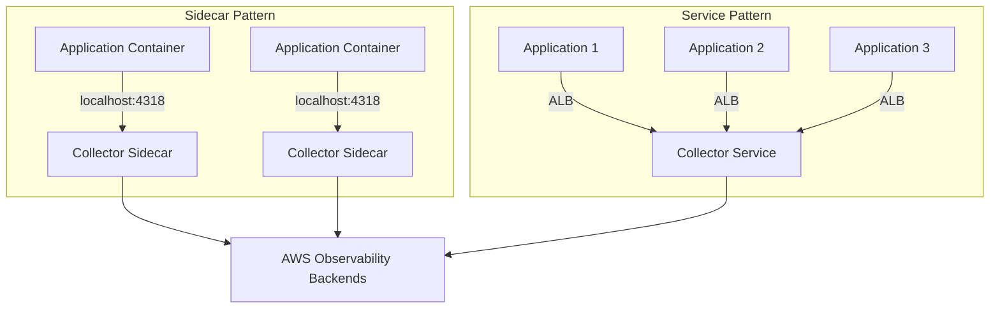

# How to Deploy the OpenTelemetry Collector on AWS ECS Fargate

Author: [nawazdhandala](https://www.github.com/nawazdhandala)

Tags: OpenTelemetry, Collector, AWS, ECS, Fargate, Deployment, Cloud, Observability

Description: Deploy OpenTelemetry Collectors on AWS ECS Fargate with complete task definitions, service configurations, and integration with AWS observability services.

AWS ECS Fargate provides serverless container orchestration, eliminating the need to manage EC2 instances. Deploying OpenTelemetry Collectors on Fargate enables scalable, cost-effective telemetry collection with automatic infrastructure management and seamless integration with AWS services.

## Understanding ECS Fargate Deployment Patterns

ECS Fargate offers two primary deployment patterns for OpenTelemetry Collectors:

**Sidecar Pattern**: Deploy a collector container alongside each application container in the same task. This provides application-level isolation and simplifies networking since containers share localhost. Ideal for per-service telemetry collection with minimal latency.

**Service Pattern**: Deploy collectors as a standalone ECS service with multiple tasks behind an Application Load Balancer (ALB). Applications send telemetry to the collector service endpoint. This centralizes collection and reduces resource overhead per application.



Choose the sidecar pattern when you need application isolation, low latency, and per-task configuration. Choose the service pattern for centralized management, cost optimization, and simplified application configuration.

## Prerequisites and Setup

Before deploying collectors on Fargate, set up the required AWS infrastructure:

```bash
# Create VPC and subnets (if not existing)
aws ec2 create-vpc --cidr-block 10.0.0.0/16 --tag-specifications 'ResourceType=vpc,Tags=[{Key=Name,Value=otel-vpc}]'

# Create ECS cluster
aws ecs create-cluster \
  --cluster-name otel-collector-cluster \
  --capacity-providers FARGATE FARGATE_SPOT \
  --default-capacity-provider-strategy capacityProvider=FARGATE,weight=1

# Create CloudWatch log group for collector logs
aws logs create-log-group --log-group-name /ecs/otel-collector

# Create IAM role for task execution
aws iam create-role \
  --role-name ecsTaskExecutionRole \
  --assume-role-policy-document file://ecs-trust-policy.json

# Attach required policies
aws iam attach-role-policy \
  --role-name ecsTaskExecutionRole \
  --policy-arn arn:aws:iam::aws:policy/service-role/AmazonECSTaskExecutionRolePolicy

# Create IAM role for task (collector runtime permissions)
aws iam create-role \
  --role-name otelCollectorTaskRole \
  --assume-role-policy-document file://ecs-trust-policy.json
```

Create the trust policy document:

```json
# ecs-trust-policy.json
{
  "Version": "2012-10-17",
  "Statement": [
    {
      "Effect": "Allow",
      "Principal": {
        "Service": "ecs-tasks.amazonaws.com"
      },
      "Action": "sts:AssumeRole"
    }
  ]
}
```

Create a policy for collector permissions:

```json
# otel-collector-policy.json
{
  "Version": "2012-10-17",
  "Statement": [
    {
      "Effect": "Allow",
      "Action": [
        "logs:PutLogEvents",
        "logs:CreateLogStream",
        "logs:DescribeLogStreams"
      ],
      "Resource": "arn:aws:logs:*:*:log-group:/ecs/otel-collector:*"
    },
    {
      "Effect": "Allow",
      "Action": [
        "xray:PutTraceSegments",
        "xray:PutTelemetryRecords"
      ],
      "Resource": "*"
    },
    {
      "Effect": "Allow",
      "Action": [
        "cloudwatch:PutMetricData"
      ],
      "Resource": "*"
    },
    {
      "Effect": "Allow",
      "Action": [
        "ecs:DescribeTasks",
        "ecs:ListTasks",
        "ecs:DescribeContainerInstances",
        "ec2:DescribeInstances"
      ],
      "Resource": "*"
    }
  ]
}
```

Attach the policy:

```bash
aws iam put-role-policy \
  --role-name otelCollectorTaskRole \
  --policy-name OtelCollectorPolicy \
  --policy-document file://otel-collector-policy.json
```

## Deploying Collector as a Standalone Service

Create a task definition for the collector service:

```json
{
  "family": "otel-collector-service",
  "networkMode": "awsvpc",
  "requiresCompatibilities": ["FARGATE"],
  "cpu": "1024",
  "memory": "2048",
  "executionRoleArn": "arn:aws:iam::ACCOUNT_ID:role/ecsTaskExecutionRole",
  "taskRoleArn": "arn:aws:iam::ACCOUNT_ID:role/otelCollectorTaskRole",
  "containerDefinitions": [
    {
      "name": "otel-collector",
      "image": "public.ecr.aws/aws-observability/aws-otel-collector:latest",
      "essential": true,
      "command": ["--config=/etc/ecs/config.yaml"],
      "portMappings": [
        {
          "containerPort": 4317,
          "protocol": "tcp",
          "name": "otlp-grpc"
        },
        {
          "containerPort": 4318,
          "protocol": "tcp",
          "name": "otlp-http"
        },
        {
          "containerPort": 8888,
          "protocol": "tcp",
          "name": "metrics"
        }
      ],
      "environment": [
        {
          "name": "AWS_REGION",
          "value": "us-east-1"
        },
        {
          "name": "OTEL_LOG_LEVEL",
          "value": "info"
        }
      ],
      "secrets": [
        {
          "name": "BACKEND_API_KEY",
          "valueFrom": "arn:aws:secretsmanager:us-east-1:ACCOUNT_ID:secret:backend-api-key"
        }
      ],
      "logConfiguration": {
        "logDriver": "awslogs",
        "options": {
          "awslogs-group": "/ecs/otel-collector",
          "awslogs-region": "us-east-1",
          "awslogs-stream-prefix": "collector"
        }
      },
      "healthCheck": {
        "command": ["CMD-SHELL", "wget --spider -q http://localhost:13133 || exit 1"],
        "interval": 30,
        "timeout": 5,
        "retries": 3,
        "startPeriod": 60
      },
      "mountPoints": [
        {
          "sourceVolume": "config",
          "containerPath": "/etc/ecs",
          "readOnly": true
        }
      ]
    }
  ],
  "volumes": [
    {
      "name": "config",
      "configuredAtLaunch": false
    }
  ]
}
```

Note that we're using AWS Distro for OpenTelemetry (ADOT) Collector, which includes AWS-specific exporters. Alternatively, use the standard collector with manual configuration.

Create the collector configuration and store it in AWS Systems Manager Parameter Store:

```yaml
# collector-config.yaml
# Collector configuration for ECS Fargate service

receivers:
  # OTLP receivers for application telemetry
  otlp:
    protocols:
      grpc:
        endpoint: 0.0.0.0:4317
      http:
        endpoint: 0.0.0.0:4318

  # AWS ECS Container Metrics receiver
  awsecscontainermetrics:
    collection_interval: 30s

processors:
  # Memory limiter to prevent OOM
  memory_limiter:
    check_interval: 1s
    limit_mib: 1536
    spike_limit_mib: 512

  # Batch processor for efficiency
  batch:
    timeout: 10s
    send_batch_size: 8192

  # Add resource attributes
  resource:
    attributes:
      - key: deployment.environment
        value: production
        action: insert
      - key: cloud.provider
        value: aws
        action: insert
      - key: cloud.platform
        value: aws_ecs_fargate
        action: insert

  # Detect AWS resource attributes
  resourcedetection:
    detectors: [env, ecs, ec2]
    timeout: 5s
    override: false

exporters:
  # Export traces to AWS X-Ray
  awsxray:
    region: us-east-1
    no_verify_ssl: false

  # Export metrics to CloudWatch
  awscloudwatch:
    region: us-east-1
    namespace: OtelCollector
    log_group_name: /aws/ecs/otel-collector
    metric_declarations:
      - dimensions: [[ServiceName, Operation]]
        metric_name_selectors:
          - "^latency$"
          - "^request_count$"

  # Export logs to CloudWatch Logs
  awscloudwatchlogs:
    region: us-east-1
    log_group_name: /aws/ecs/application-logs
    log_stream_name: "fargate-logs"

  # Export to Prometheus Remote Write (optional)
  prometheusremotewrite:
    endpoint: https://prometheus.example.com/api/v1/write
    headers:
      Authorization: Bearer ${BACKEND_API_KEY}
    retry_on_failure:
      enabled: true

  # Debug logging
  logging:
    verbosity: normal

extensions:
  # Health check extension
  health_check:
    endpoint: 0.0.0.0:13133
    path: /

  # Performance profiler
  pprof:
    endpoint: 0.0.0.0:1777

service:
  extensions: [health_check, pprof]

  pipelines:
    traces:
      receivers: [otlp]
      processors: [memory_limiter, resourcedetection, resource, batch]
      exporters: [awsxray, logging]

    metrics:
      receivers: [otlp, awsecscontainermetrics]
      processors: [memory_limiter, resourcedetection, resource, batch]
      exporters: [awscloudwatch, prometheusremotewrite, logging]

    logs:
      receivers: [otlp]
      processors: [memory_limiter, resourcedetection, resource, batch]
      exporters: [awscloudwatchlogs, logging]

  telemetry:
    logs:
      level: info
    metrics:
      address: 0.0.0.0:8888
```

For simpler configuration management, embed the config in the task definition using environment variables or store in S3:

```bash
# Store configuration in Parameter Store
aws ssm put-parameter \
  --name /otel/collector/config \
  --type String \
  --value file://collector-config.yaml

# Update task definition to fetch from Parameter Store
# Add to containerDefinitions[0].environment:
{
  "name": "AOT_CONFIG_CONTENT",
  "value": "$(aws ssm get-parameter --name /otel/collector/config --query Parameter.Value --output text)"
}
```

Register the task definition:

```bash
aws ecs register-task-definition --cli-input-json file://task-definition.json
```

Create an Application Load Balancer for the collector service:

```bash
# Create security group for ALB
aws ec2 create-security-group \
  --group-name otel-collector-alb-sg \
  --description "Security group for OTEL collector ALB" \
  --vpc-id vpc-xxxxx

# Allow inbound traffic on OTLP ports
aws ec2 authorize-security-group-ingress \
  --group-id sg-xxxxx \
  --protocol tcp \
  --port 4317 \
  --cidr 10.0.0.0/16

aws ec2 authorize-security-group-ingress \
  --group-id sg-xxxxx \
  --protocol tcp \
  --port 4318 \
  --cidr 10.0.0.0/16

# Create ALB
aws elbv2 create-load-balancer \
  --name otel-collector-alb \
  --subnets subnet-xxxxx subnet-yyyyy \
  --security-groups sg-xxxxx \
  --scheme internal \
  --type application

# Create target groups
aws elbv2 create-target-group \
  --name otel-collector-grpc-tg \
  --protocol HTTP \
  --protocol-version GRPC \
  --port 4317 \
  --vpc-id vpc-xxxxx \
  --health-check-protocol HTTP \
  --health-check-path /

aws elbv2 create-target-group \
  --name otel-collector-http-tg \
  --protocol HTTP \
  --port 4318 \
  --vpc-id vpc-xxxxx \
  --health-check-protocol HTTP \
  --health-check-path /

# Create listeners
aws elbv2 create-listener \
  --load-balancer-arn arn:aws:elasticloadbalancing:... \
  --protocol HTTP \
  --port 4317 \
  --default-actions Type=forward,TargetGroupArn=arn:aws:elasticloadbalancing:...

aws elbv2 create-listener \
  --load-balancer-arn arn:aws:elasticloadbalancing:... \
  --protocol HTTP \
  --port 4318 \
  --default-actions Type=forward,TargetGroupArn=arn:aws:elasticloadbalancing:...
```

Create the ECS service:

```bash
# Create security group for collector tasks
aws ec2 create-security-group \
  --group-name otel-collector-task-sg \
  --description "Security group for OTEL collector tasks" \
  --vpc-id vpc-xxxxx

# Allow inbound from ALB
aws ec2 authorize-security-group-ingress \
  --group-id sg-yyyyy \
  --protocol tcp \
  --port 4317 \
  --source-group sg-xxxxx

aws ec2 authorize-security-group-ingress \
  --group-id sg-yyyyy \
  --protocol tcp \
  --port 4318 \
  --source-group sg-xxxxx

# Create ECS service
aws ecs create-service \
  --cluster otel-collector-cluster \
  --service-name otel-collector-service \
  --task-definition otel-collector-service:1 \
  --desired-count 3 \
  --launch-type FARGATE \
  --platform-version LATEST \
  --network-configuration "awsvpcConfiguration={subnets=[subnet-xxxxx,subnet-yyyyy],securityGroups=[sg-yyyyy],assignPublicIp=DISABLED}" \
  --load-balancers "targetGroupArn=arn:aws:elasticloadbalancing:...,containerName=otel-collector,containerPort=4317" \
  --health-check-grace-period-seconds 60
```

Enable service auto-scaling:

```bash
# Register scalable target
aws application-autoscaling register-scalable-target \
  --service-namespace ecs \
  --resource-id service/otel-collector-cluster/otel-collector-service \
  --scalable-dimension ecs:service:DesiredCount \
  --min-capacity 3 \
  --max-capacity 10

# Create scaling policy based on CPU utilization
aws application-autoscaling put-scaling-policy \
  --service-namespace ecs \
  --resource-id service/otel-collector-cluster/otel-collector-service \
  --scalable-dimension ecs:service:DesiredCount \
  --policy-name cpu-scaling \
  --policy-type TargetTrackingScaling \
  --target-tracking-scaling-policy-configuration file://scaling-policy.json
```

Create the scaling policy:

```json
{
  "TargetValue": 70.0,
  "PredefinedMetricSpecification": {
    "PredefinedMetricType": "ECSServiceAverageCPUUtilization"
  },
  "ScaleInCooldown": 300,
  "ScaleOutCooldown": 60
}
```

## Deploying Collector as a Sidecar

Create a task definition with both application and collector containers:

```json
{
  "family": "application-with-sidecar",
  "networkMode": "awsvpc",
  "requiresCompatibilities": ["FARGATE"],
  "cpu": "1024",
  "memory": "2048",
  "executionRoleArn": "arn:aws:iam::ACCOUNT_ID:role/ecsTaskExecutionRole",
  "taskRoleArn": "arn:aws:iam::ACCOUNT_ID:role/otelCollectorTaskRole",
  "containerDefinitions": [
    {
      "name": "application",
      "image": "ACCOUNT_ID.dkr.ecr.us-east-1.amazonaws.com/my-app:latest",
      "essential": true,
      "portMappings": [
        {
          "containerPort": 8080,
          "protocol": "tcp"
        }
      ],
      "environment": [
        {
          "name": "OTEL_EXPORTER_OTLP_ENDPOINT",
          "value": "http://localhost:4318"
        },
        {
          "name": "OTEL_SERVICE_NAME",
          "value": "my-application"
        },
        {
          "name": "OTEL_RESOURCE_ATTRIBUTES",
          "value": "deployment.environment=production,service.version=1.0.0"
        }
      ],
      "logConfiguration": {
        "logDriver": "awslogs",
        "options": {
          "awslogs-group": "/ecs/application",
          "awslogs-region": "us-east-1",
          "awslogs-stream-prefix": "app"
        }
      },
      "dependsOn": [
        {
          "containerName": "otel-collector",
          "condition": "START"
        }
      ]
    },
    {
      "name": "otel-collector",
      "image": "public.ecr.aws/aws-observability/aws-otel-collector:latest",
      "essential": true,
      "command": ["--config=/etc/ecs/sidecar-config.yaml"],
      "cpu": 256,
      "memory": 512,
      "environment": [
        {
          "name": "AWS_REGION",
          "value": "us-east-1"
        },
        {
          "name": "GATEWAY_ENDPOINT",
          "value": "otel-collector-alb-xxxxx.us-east-1.elb.amazonaws.com:4317"
        }
      ],
      "logConfiguration": {
        "logDriver": "awslogs",
        "options": {
          "awslogs-group": "/ecs/otel-collector-sidecar",
          "awslogs-region": "us-east-1",
          "awslogs-stream-prefix": "sidecar"
        }
      },
      "mountPoints": [
        {
          "sourceVolume": "config",
          "containerPath": "/etc/ecs",
          "readOnly": true
        }
      ]
    }
  ],
  "volumes": [
    {
      "name": "config",
      "configuredAtLaunch": false
    }
  ]
}
```

Create sidecar collector configuration:

```yaml
# sidecar-config.yaml
# Lightweight collector for sidecar pattern

receivers:
  otlp:
    protocols:
      http:
        endpoint: localhost:4318

processors:
  memory_limiter:
    limit_mib: 400

  batch:
    timeout: 5s

  resource:
    attributes:
      - key: collector.type
        value: sidecar
        action: insert

  resourcedetection:
    detectors: [env, ecs]

exporters:
  # Forward to gateway collector
  otlp:
    endpoint: ${GATEWAY_ENDPOINT}
    tls:
      insecure: false
    retry_on_failure:
      enabled: true
    sending_queue:
      enabled: true
      queue_size: 1000

service:
  pipelines:
    traces:
      receivers: [otlp]
      processors: [memory_limiter, resourcedetection, resource, batch]
      exporters: [otlp]

    metrics:
      receivers: [otlp]
      processors: [memory_limiter, resourcedetection, resource, batch]
      exporters: [otlp]

    logs:
      receivers: [otlp]
      processors: [memory_limiter, resourcedetection, resource, batch]
      exporters: [otlp]
```

## Using AWS Service Discovery

Enable service discovery for collector service:

```bash
# Create Cloud Map namespace
aws servicediscovery create-private-dns-namespace \
  --name otel.local \
  --vpc vpc-xxxxx

# Create service discovery service
aws servicediscovery create-service \
  --name collector \
  --namespace-id ns-xxxxx \
  --dns-config "NamespaceId=ns-xxxxx,DnsRecords=[{Type=A,TTL=60}]"

# Update ECS service with service registry
aws ecs update-service \
  --cluster otel-collector-cluster \
  --service otel-collector-service \
  --service-registries "registryArn=arn:aws:servicediscovery:..."
```

Applications can now reference the collector using DNS:

```bash
OTEL_EXPORTER_OTLP_ENDPOINT=http://collector.otel.local:4318
```

## Monitoring with CloudWatch

Create CloudWatch dashboards to monitor collector performance:

```bash
# Create CloudWatch dashboard
aws cloudwatch put-dashboard \
  --dashboard-name OtelCollectorDashboard \
  --dashboard-body file://dashboard.json
```

Dashboard configuration:

```json
{
  "widgets": [
    {
      "type": "metric",
      "properties": {
        "metrics": [
          ["AWS/ECS", "CPUUtilization", {"stat": "Average"}],
          [".", "MemoryUtilization", {"stat": "Average"}]
        ],
        "period": 300,
        "stat": "Average",
        "region": "us-east-1",
        "title": "Collector Resource Usage"
      }
    },
    {
      "type": "metric",
      "properties": {
        "metrics": [
          ["OtelCollector", "otelcol_receiver_accepted_spans"],
          [".", "otelcol_receiver_refused_spans"],
          [".", "otelcol_exporter_sent_spans"],
          [".", "otelcol_exporter_send_failed_spans"]
        ],
        "period": 60,
        "stat": "Sum",
        "region": "us-east-1",
        "title": "Collector Telemetry Pipeline"
      }
    }
  ]
}
```

Create CloudWatch alarms:

```bash
# Alarm for high CPU utilization
aws cloudwatch put-metric-alarm \
  --alarm-name otel-collector-high-cpu \
  --alarm-description "Alert when collector CPU is high" \
  --metric-name CPUUtilization \
  --namespace AWS/ECS \
  --statistic Average \
  --period 300 \
  --threshold 80 \
  --comparison-operator GreaterThanThreshold \
  --evaluation-periods 2

# Alarm for failed exports
aws cloudwatch put-metric-alarm \
  --alarm-name otel-collector-export-failures \
  --metric-name otelcol_exporter_send_failed_spans \
  --namespace OtelCollector \
  --statistic Sum \
  --period 300 \
  --threshold 100 \
  --comparison-operator GreaterThanThreshold \
  --evaluation-periods 2
```

## Using Terraform for Infrastructure as Code

Automate deployment with Terraform:

```hcl
# main.tf
# Terraform configuration for OTEL collector on ECS Fargate

terraform {
  required_version = ">= 1.0"
  required_providers {
    aws = {
      source  = "hashicorp/aws"
      version = "~> 5.0"
    }
  }
}

provider "aws" {
  region = var.aws_region
}

# ECS Cluster
resource "aws_ecs_cluster" "otel_collector" {
  name = "otel-collector-cluster"

  setting {
    name  = "containerInsights"
    value = "enabled"
  }
}

# Task Definition
resource "aws_ecs_task_definition" "otel_collector" {
  family                   = "otel-collector-service"
  network_mode             = "awsvpc"
  requires_compatibilities = ["FARGATE"]
  cpu                      = "1024"
  memory                   = "2048"
  execution_role_arn       = aws_iam_role.ecs_execution_role.arn
  task_role_arn            = aws_iam_role.otel_task_role.arn

  container_definitions = jsonencode([
    {
      name      = "otel-collector"
      image     = "public.ecr.aws/aws-observability/aws-otel-collector:latest"
      essential = true
      command   = ["--config=/etc/ecs/config.yaml"]

      portMappings = [
        {
          containerPort = 4317
          protocol      = "tcp"
        },
        {
          containerPort = 4318
          protocol      = "tcp"
        }
      ]

      environment = [
        {
          name  = "AWS_REGION"
          value = var.aws_region
        }
      ]

      logConfiguration = {
        logDriver = "awslogs"
        options = {
          "awslogs-group"         = aws_cloudwatch_log_group.otel_collector.name
          "awslogs-region"        = var.aws_region
          "awslogs-stream-prefix" = "collector"
        }
      }

      healthCheck = {
        command     = ["CMD-SHELL", "wget --spider -q http://localhost:13133 || exit 1"]
        interval    = 30
        timeout     = 5
        retries     = 3
        startPeriod = 60
      }
    }
  ])
}

# ECS Service
resource "aws_ecs_service" "otel_collector" {
  name            = "otel-collector-service"
  cluster         = aws_ecs_cluster.otel_collector.id
  task_definition = aws_ecs_task_definition.otel_collector.arn
  desired_count   = 3
  launch_type     = "FARGATE"

  network_configuration {
    subnets          = var.private_subnet_ids
    security_groups  = [aws_security_group.otel_collector.id]
    assign_public_ip = false
  }

  load_balancer {
    target_group_arn = aws_lb_target_group.otel_grpc.arn
    container_name   = "otel-collector"
    container_port   = 4317
  }

  depends_on = [aws_lb_listener.otel_grpc]
}

# Application Auto Scaling
resource "aws_appautoscaling_target" "otel_collector" {
  max_capacity       = 10
  min_capacity       = 3
  resource_id        = "service/${aws_ecs_cluster.otel_collector.name}/${aws_ecs_service.otel_collector.name}"
  scalable_dimension = "ecs:service:DesiredCount"
  service_namespace  = "ecs"
}

resource "aws_appautoscaling_policy" "otel_collector_cpu" {
  name               = "cpu-scaling"
  policy_type        = "TargetTrackingScaling"
  resource_id        = aws_appautoscaling_target.otel_collector.resource_id
  scalable_dimension = aws_appautoscaling_target.otel_collector.scalable_dimension
  service_namespace  = aws_appautoscaling_target.otel_collector.service_namespace

  target_tracking_scaling_policy_configuration {
    predefined_metric_specification {
      predefined_metric_type = "ECSServiceAverageCPUUtilization"
    }
    target_value = 70.0
  }
}

# CloudWatch Log Group
resource "aws_cloudwatch_log_group" "otel_collector" {
  name              = "/ecs/otel-collector"
  retention_in_days = 7
}

# Security Group
resource "aws_security_group" "otel_collector" {
  name        = "otel-collector-sg"
  description = "Security group for OTEL collector"
  vpc_id      = var.vpc_id

  ingress {
    from_port   = 4317
    to_port     = 4318
    protocol    = "tcp"
    cidr_blocks = [var.vpc_cidr]
  }

  egress {
    from_port   = 0
    to_port     = 0
    protocol    = "-1"
    cidr_blocks = ["0.0.0.0/0"]
  }
}
```

## Cost Optimization Strategies

Optimize Fargate costs for collector deployments:

1. **Use Fargate Spot** for non-critical collectors (up to 70% savings)
2. **Right-size tasks** based on actual CPU and memory usage
3. **Implement efficient batching** to reduce network costs
4. **Use VPC endpoints** for AWS service access to avoid NAT Gateway costs
5. **Enable CloudWatch Logs data retention policies** to reduce storage costs
6. **Consider Reserved Capacity** for predictable workloads

Example Fargate Spot configuration:

```json
{
  "capacityProviderStrategy": [
    {
      "capacityProvider": "FARGATE_SPOT",
      "weight": 4,
      "base": 0
    },
    {
      "capacityProvider": "FARGATE",
      "weight": 1,
      "base": 2
    }
  ]
}
```

## Troubleshooting

Common issues and solutions:

```bash
# View task logs
aws logs tail /ecs/otel-collector --follow

# Describe task to check health
aws ecs describe-tasks \
  --cluster otel-collector-cluster \
  --tasks TASK_ID

# Check service events
aws ecs describe-services \
  --cluster otel-collector-cluster \
  --services otel-collector-service

# Verify IAM permissions
aws iam simulate-principal-policy \
  --policy-source-arn arn:aws:iam::ACCOUNT_ID:role/otelCollectorTaskRole \
  --action-names xray:PutTraceSegments cloudwatch:PutMetricData

# Test connectivity from application task
aws ecs execute-command \
  --cluster otel-collector-cluster \
  --task TASK_ID \
  --container application \
  --interactive \
  --command "/bin/sh"

# Inside container
curl -v http://collector.otel.local:4318/v1/traces
```

## Related Resources

For other deployment options, see:

- [How to Deploy the OpenTelemetry Collector on Docker and Docker Compose](https://oneuptime.com/blog/post/deploy-opentelemetry-collector-docker-compose/view)
- [How to Deploy the OpenTelemetry Collector with the Kubernetes Operator](https://oneuptime.com/blog/post/deploy-opentelemetry-collector-kubernetes-operator/view)
- [How to Set Up a Two-Tier Collector Architecture (Agent + Gateway)](https://oneuptime.com/blog/post/two-tier-collector-architecture-agent-gateway/view)

AWS ECS Fargate provides a serverless, scalable platform for deploying OpenTelemetry Collectors. The combination of managed infrastructure, native AWS integrations, and flexible deployment patterns makes it an excellent choice for cloud-native observability architectures.
