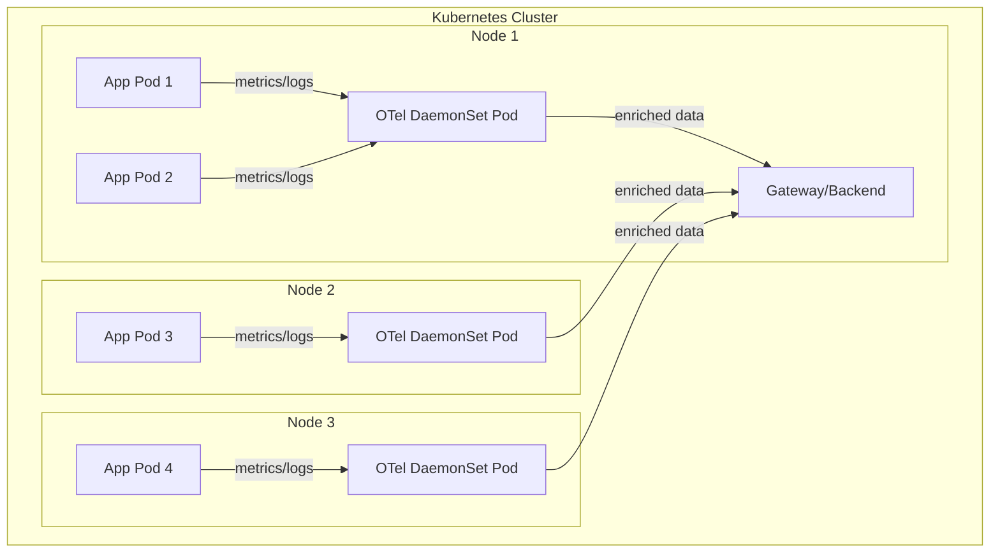

# How to Deploy the OpenTelemetry Collector as a DaemonSet in Kubernetes

Author: [nawazdhandala](https://www.github.com/nawazdhandala)

Tags: OpenTelemetry, Collector, Kubernetes, DaemonSet, Deployment

Description: Complete guide to deploying the OpenTelemetry Collector as a DaemonSet in Kubernetes for node-level telemetry collection and processing.

Deploying the OpenTelemetry Collector as a DaemonSet in Kubernetes is the recommended pattern for collecting node-level telemetry such as host metrics, container logs, and infrastructure data. A DaemonSet ensures that one collector pod runs on every node in your cluster, providing comprehensive coverage for node-specific telemetry collection.

## When to Use DaemonSet Deployment

The DaemonSet deployment pattern is ideal for:

- **Host and container metrics collection**: CPU, memory, disk, network metrics from each node
- **Log collection**: Gathering logs from all pods running on each node
- **Infrastructure monitoring**: Node-level system metrics and events
- **Kubernetes attributes enrichment**: Adding node-specific metadata to telemetry
- **Local collection with minimal network overhead**: Processing data on the same node where it's generated



## Basic DaemonSet Configuration

Here's a complete DaemonSet manifest for deploying the OpenTelemetry Collector:

```yaml
apiVersion: v1
kind: Namespace
metadata:
  name: opentelemetry
---
apiVersion: v1
kind: ServiceAccount
metadata:
  name: otel-collector
  namespace: opentelemetry
---
apiVersion: rbac.authorization.k8s.io/v1
kind: ClusterRole
metadata:
  name: otel-collector
rules:
  # Permissions for Kubernetes API access
  - apiGroups: [""]
    resources:
      - nodes
      - nodes/proxy
      - nodes/stats
      - services
      - endpoints
      - pods
      - events
      - namespaces
    verbs: ["get", "list", "watch"]
  - apiGroups: ["apps"]
    resources:
      - replicasets
      - deployments
      - daemonsets
      - statefulsets
    verbs: ["get", "list", "watch"]
  - apiGroups: ["batch"]
    resources:
      - jobs
      - cronjobs
    verbs: ["get", "list", "watch"]
  - nonResourceURLs:
      - /metrics
      - /stats
    verbs: ["get"]
---
apiVersion: rbac.authorization.k8s.io/v1
kind: ClusterRoleBinding
metadata:
  name: otel-collector
roleRef:
  apiGroup: rbac.authorization.k8s.io
  kind: ClusterRole
  name: otel-collector
subjects:
  - kind: ServiceAccount
    name: otel-collector
    namespace: opentelemetry
---
apiVersion: v1
kind: ConfigMap
metadata:
  name: otel-collector-config
  namespace: opentelemetry
data:
  config.yaml: |
    receivers:
      # Receive telemetry from applications via OTLP
      otlp:
        protocols:
          grpc:
            endpoint: 0.0.0.0:4317

      # Collect host metrics
      hostmetrics:
        collection_interval: 30s
        scrapers:
          cpu:
            metrics:
              system.cpu.utilization:
                enabled: true
          memory:
            metrics:
              system.memory.utilization:
                enabled: true
          disk:
          filesystem:
            metrics:
              system.filesystem.utilization:
                enabled: true
          network:
          load:
          paging:

      # Collect Kubernetes metrics
      kubeletstats:
        collection_interval: 30s
        auth_type: serviceAccount
        endpoint: "https://${env:K8S_NODE_NAME}:10250"
        insecure_skip_verify: true
        metric_groups:
          - node
          - pod
          - container

      # Collect container logs
      filelog:
        include:
          - /var/log/pods/*/*/*.log
        exclude:
          - /var/log/pods/*/otc-container/*.log
        start_at: beginning
        include_file_path: true
        include_file_name: false
        operators:
          # Parse CRI-O / containerd logs
          - type: regex_parser
            id: parser-containerd
            regex: '^(?P<time>[^ ^Z]+Z) (?P<stream>stdout|stderr) (?P<logtag>[^ ]*) ?(?P<log>.*)$'
            timestamp:
              parse_from: attributes.time
              layout: '%Y-%m-%dT%H:%M:%S.%LZ'
          # Extract Kubernetes metadata from file path
          - type: regex_parser
            id: extract-metadata-from-filepath
            regex: '^.*\/(?P<namespace>[^_]+)_(?P<pod_name>[^_]+)_(?P<uid>[a-f0-9\-]+)\/(?P<container_name>[^\._]+)\/(?P<restart_count>\d+)\.log$'
            parse_from: attributes["log.file.path"]
          # Move log content to body
          - type: move
            from: attributes.log
            to: body

    processors:
      # Batch telemetry for efficient export
      batch:
        timeout: 10s
        send_batch_size: 1024

      # Add resource detection for cloud and Kubernetes
      resourcedetection:
        detectors: [env, system, docker, gcp, eks, ec2, azure]
        timeout: 5s

      # Add Kubernetes attributes
      k8sattributes:
        auth_type: serviceAccount
        passthrough: false
        extract:
          metadata:
            - k8s.namespace.name
            - k8s.deployment.name
            - k8s.statefulset.name
            - k8s.daemonset.name
            - k8s.cronjob.name
            - k8s.job.name
            - k8s.node.name
            - k8s.pod.name
            - k8s.pod.uid
            - k8s.pod.start_time
          labels:
            - tag_name: app.label.component
              key: app.kubernetes.io/component
              from: pod
        pod_association:
          - sources:
              - from: resource_attribute
                name: k8s.pod.ip
          - sources:
              - from: resource_attribute
                name: k8s.pod.uid
          - sources:
              - from: connection

      # Memory limiter to prevent OOM
      memory_limiter:
        check_interval: 1s
        limit_percentage: 75
        spike_limit_percentage: 20

    exporters:
      # Export to backend (replace with your backend)
      otlphttp:
        endpoint: http://otel-collector-gateway.opentelemetry.svc.cluster.local:4318
        compression: gzip

      # Debug exporter for testing
      logging:
        verbosity: normal
        sampling_initial: 5
        sampling_thereafter: 200

    service:
      pipelines:
        # Metrics pipeline
        metrics:
          receivers: [otlp, hostmetrics, kubeletstats]
          processors: [memory_limiter, resourcedetection, k8sattributes, batch]
          exporters: [otlphttp]

        # Logs pipeline
        logs:
          receivers: [otlp, filelog]
          processors: [memory_limiter, resourcedetection, k8sattributes, batch]
          exporters: [otlphttp]

      # Enable collector telemetry
      telemetry:
        logs:
          level: info
        metrics:
          address: 0.0.0.0:8888
---
apiVersion: apps/v1
kind: DaemonSet
metadata:
  name: otel-collector
  namespace: opentelemetry
  labels:
    app: otel-collector
spec:
  selector:
    matchLabels:
      app: otel-collector
  template:
    metadata:
      labels:
        app: otel-collector
    spec:
      serviceAccountName: otel-collector
      hostNetwork: true
      dnsPolicy: ClusterFirstWithHostNet
      containers:
      - name: otel-collector
        image: otel/opentelemetry-collector-contrib:0.95.0
        args:
          - --config=/conf/config.yaml
        env:
        - name: K8S_NODE_NAME
          valueFrom:
            fieldRef:
              fieldPath: spec.nodeName
        - name: K8S_POD_NAME
          valueFrom:
            fieldRef:
              fieldPath: metadata.name
        - name: K8S_POD_NAMESPACE
          valueFrom:
            fieldRef:
              fieldPath: metadata.namespace
        - name: K8S_POD_IP
          valueFrom:
            fieldRef:
              fieldPath: status.podIP
        ports:
        - name: otlp-grpc
          containerPort: 4317
          protocol: TCP
        - name: metrics
          containerPort: 8888
          protocol: TCP
        volumeMounts:
        - name: config
          mountPath: /conf
        - name: varlog
          mountPath: /var/log
          readOnly: true
        - name: varlibdockercontainers
          mountPath: /var/lib/docker/containers
          readOnly: true
        resources:
          requests:
            memory: 256Mi
            cpu: 200m
          limits:
            memory: 512Mi
            cpu: 500m
        livenessProbe:
          httpGet:
            path: /
            port: 13133
          initialDelaySeconds: 30
          periodSeconds: 30
        readinessProbe:
          httpGet:
            path: /
            port: 13133
          initialDelaySeconds: 10
          periodSeconds: 10
      volumes:
      - name: config
        configMap:
          name: otel-collector-config
      - name: varlog
        hostPath:
          path: /var/log
      - name: varlibdockercontainers
        hostPath:
          path: /var/lib/docker/containers
      tolerations:
      - key: node-role.kubernetes.io/master
        effect: NoSchedule
      - key: node-role.kubernetes.io/control-plane
        effect: NoSchedule
---
apiVersion: v1
kind: Service
metadata:
  name: otel-collector
  namespace: opentelemetry
  labels:
    app: otel-collector
spec:
  type: ClusterIP
  clusterIP: None
  selector:
    app: otel-collector
  ports:
  - name: otlp-grpc
    port: 4317
    targetPort: 4317
    protocol: TCP
  - name: metrics
    port: 8888
    targetPort: 8888
    protocol: TCP
```

This comprehensive configuration includes RBAC permissions, host filesystem access, and Kubernetes API access needed for full telemetry collection.

## Node-Specific Host Metrics Collection

The DaemonSet deployment excels at collecting host-level metrics from each node. Here's a focused configuration for infrastructure monitoring:

```yaml
receivers:
  # Comprehensive host metrics collection
  hostmetrics:
    collection_interval: 30s
    scrapers:
      # CPU metrics
      cpu:
        metrics:
          system.cpu.utilization:
            enabled: true
          system.cpu.time:
            enabled: true

      # Memory metrics
      memory:
        metrics:
          system.memory.utilization:
            enabled: true
          system.memory.usage:
            enabled: true

      # Disk I/O metrics
      disk:
        metrics:
          system.disk.io:
            enabled: true
          system.disk.operations:
            enabled: true

      # Filesystem metrics
      filesystem:
        metrics:
          system.filesystem.utilization:
            enabled: true
          system.filesystem.usage:
            enabled: true

      # Network metrics
      network:
        metrics:
          system.network.io:
            enabled: true
          system.network.errors:
            enabled: true
          system.network.connections:
            enabled: true

      # System load
      load:
        metrics:
          system.cpu.load_average.1m:
            enabled: true
          system.cpu.load_average.5m:
            enabled: true
          system.cpu.load_average.15m:
            enabled: true

      # Paging/swap metrics
      paging:
        metrics:
          system.paging.usage:
            enabled: true
          system.paging.operations:
            enabled: true

      # Process metrics
      processes:
        metrics:
          system.processes.count:
            enabled: true
          system.processes.created:
            enabled: true

  # Collect kubelet and container metrics
  kubeletstats:
    collection_interval: 30s
    auth_type: serviceAccount
    endpoint: "https://${env:K8S_NODE_NAME}:10250"
    insecure_skip_verify: true
    metric_groups:
      - node
      - pod
      - container
      - volume
    metrics:
      # Node metrics
      k8s.node.cpu.utilization:
        enabled: true
      k8s.node.memory.working_set:
        enabled: true
      # Container metrics
      container.cpu.utilization:
        enabled: true
      container.memory.working_set:
        enabled: true

processors:
  # Enrich with node information
  resource:
    attributes:
      - key: host.name
        from_attribute: host.name
        action: upsert
      - key: k8s.node.name
        value: ${env:K8S_NODE_NAME}
        action: insert

  # Add Kubernetes attributes
  k8sattributes:
    auth_type: serviceAccount
    passthrough: false
    extract:
      metadata:
        - k8s.node.name
        - k8s.pod.name
        - k8s.namespace.name

  batch:
    timeout: 30s

exporters:
  prometheusremotewrite:
    endpoint: http://prometheus.monitoring.svc.cluster.local:9090/api/v1/write

service:
  pipelines:
    metrics:
      receivers: [hostmetrics, kubeletstats]
      processors: [resource, k8sattributes, batch]
      exporters: [prometheusremotewrite]
```

## Log Collection from All Pods

DaemonSets are the standard pattern for collecting logs from all pods on a node. Here's a complete log collection configuration:

```yaml
receivers:
  # Collect logs from all pods
  filelog:
    include:
      - /var/log/pods/*/*/*.log
    exclude:
      # Exclude collector's own logs to prevent loops
      - /var/log/pods/opentelemetry_otel-collector-*/*/*.log
      # Exclude other system pods if needed
      - /var/log/pods/kube-system_*/*/*.log
    start_at: beginning
    include_file_path: true
    include_file_name: false
    operators:
      # Parse container runtime format (CRI-O/containerd)
      - type: regex_parser
        id: parser-crio
        regex: '^(?P<time>[^ ^Z]+Z) (?P<stream>stdout|stderr) (?P<logtag>[^ ]*) ?(?P<log>.*)$'
        timestamp:
          parse_from: attributes.time
          layout: '%Y-%m-%dT%H:%M:%S.%LZ'

      # Extract Kubernetes metadata from file path
      - type: regex_parser
        id: extract-metadata
        regex: '^.*\/(?P<namespace>[^_]+)_(?P<pod_name>[^_]+)_(?P<uid>[a-f0-9\-]+)\/(?P<container_name>[^\._]+)\/(?P<restart_count>\d+)\.log$'
        parse_from: attributes["log.file.path"]
        on_error: send

      # Move extracted metadata to resource attributes
      - type: move
        from: attributes.namespace
        to: resource["k8s.namespace.name"]
      - type: move
        from: attributes.pod_name
        to: resource["k8s.pod.name"]
      - type: move
        from: attributes.container_name
        to: resource["k8s.container.name"]
      - type: move
        from: attributes.uid
        to: resource["k8s.pod.uid"]

      # Parse JSON logs if applicable
      - type: json_parser
        id: parser-json
        parse_from: attributes.log
        on_error: send

      # Move log content to body
      - type: move
        from: attributes.log
        to: body

      # Add severity parsing
      - type: severity_parser
        parse_from: attributes.level
        on_error: send

processors:
  # Add Kubernetes attributes from API
  k8sattributes:
    auth_type: serviceAccount
    passthrough: false
    extract:
      metadata:
        - k8s.namespace.name
        - k8s.deployment.name
        - k8s.statefulset.name
        - k8s.daemonset.name
        - k8s.pod.name
        - k8s.node.name
      labels:
        - tag_name: app
          key: app
          from: pod
        - tag_name: version
          key: version
          from: pod
      annotations:
        - tag_name: log_format
          key: log_format
          from: pod
    pod_association:
      - sources:
          - from: resource_attribute
            name: k8s.pod.uid
      - sources:
          - from: resource_attribute
            name: k8s.pod.name

  # Add node name
  resource:
    attributes:
      - key: k8s.node.name
        value: ${env:K8S_NODE_NAME}
        action: insert

  batch:
    timeout: 10s

exporters:
  loki:
    endpoint: http://loki.monitoring.svc.cluster.local:3100/loki/api/v1/push
    format: json
    labels:
      resource:
        k8s.namespace.name: "namespace"
        k8s.pod.name: "pod"
        k8s.container.name: "container"

service:
  pipelines:
    logs:
      receivers: [filelog]
      processors: [k8sattributes, resource, batch]
      exporters: [loki]
```

## Node Selector and Tolerations

Control which nodes run the collector DaemonSet using node selectors and tolerations:

```yaml
apiVersion: apps/v1
kind: DaemonSet
metadata:
  name: otel-collector
  namespace: opentelemetry
spec:
  selector:
    matchLabels:
      app: otel-collector
  template:
    metadata:
      labels:
        app: otel-collector
    spec:
      serviceAccountName: otel-collector
      # Only run on nodes with this label
      nodeSelector:
        workload-type: application
      # Allow scheduling on tainted nodes
      tolerations:
      # Master/control plane nodes
      - key: node-role.kubernetes.io/master
        effect: NoSchedule
      - key: node-role.kubernetes.io/control-plane
        effect: NoSchedule
      # Custom taints
      - key: dedicated
        operator: Equal
        value: monitoring
        effect: NoSchedule
      # Tolerate all taints (use with caution)
      # - operator: Exists
      containers:
      - name: otel-collector
        image: otel/opentelemetry-collector-contrib:0.95.0
        # ... rest of container spec
```

## Resource Management

Set appropriate resource requests and limits for DaemonSet pods:

```yaml
spec:
  template:
    spec:
      containers:
      - name: otel-collector
        image: otel/opentelemetry-collector-contrib:0.95.0
        resources:
          # Resource requests (guaranteed)
          requests:
            memory: "256Mi"
            cpu: "200m"
          # Resource limits (maximum)
          limits:
            memory: "512Mi"
            cpu: "500m"
        # Configure memory limiter to stay within limits
        args:
          - --config=/conf/config.yaml
```

Match the memory limiter processor configuration to your resource limits:

```yaml
processors:
  memory_limiter:
    check_interval: 1s
    # Set to 75% of memory limit (512Mi = 537Mi, 75% = 403Mi)
    limit_mib: 403
    # Spike limit at 20% above limit
    spike_limit_mib: 80
```

## Update Strategy

Configure how DaemonSet pods are updated:

```yaml
apiVersion: apps/v1
kind: DaemonSet
metadata:
  name: otel-collector
  namespace: opentelemetry
spec:
  updateStrategy:
    type: RollingUpdate
    rollingUpdate:
      # Maximum unavailable pods during update
      maxUnavailable: 1
      # Or use percentage
      # maxUnavailable: 10%
```

## Monitoring DaemonSet Health

Monitor your collector DaemonSet with these techniques:

```yaml
# ServiceMonitor for Prometheus Operator
apiVersion: monitoring.coreos.com/v1
kind: ServiceMonitor
metadata:
  name: otel-collector
  namespace: opentelemetry
spec:
  selector:
    matchLabels:
      app: otel-collector
  endpoints:
  - port: metrics
    interval: 30s
    path: /metrics
```

Query DaemonSet status:

```bash
# Check DaemonSet status
kubectl get daemonset otel-collector -n opentelemetry

# Check pod distribution across nodes
kubectl get pods -n opentelemetry -o wide | grep otel-collector

# View logs from specific node's collector
kubectl logs -n opentelemetry -l app=otel-collector --field-selector spec.nodeName=node-1

# Check collector metrics
kubectl port-forward -n opentelemetry daemonset/otel-collector 8888:8888
curl http://localhost:8888/metrics
```

## Related Resources

For other OpenTelemetry Collector deployment patterns:

- [How to Deploy the OpenTelemetry Collector as a Gateway](https://oneuptime.com/blog/post/2026-02-06-deploy-opentelemetry-collector-gateway/view)
- [How to Deploy the OpenTelemetry Collector as a Sidecar in Kubernetes](https://oneuptime.com/blog/post/2026-02-06-deploy-opentelemetry-collector-sidecar-kubernetes/view)

Deploying the OpenTelemetry Collector as a DaemonSet provides comprehensive node-level telemetry collection across your Kubernetes cluster. This pattern is essential for infrastructure monitoring, log aggregation, and enriching application telemetry with Kubernetes metadata.
