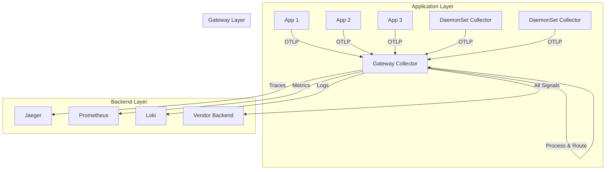
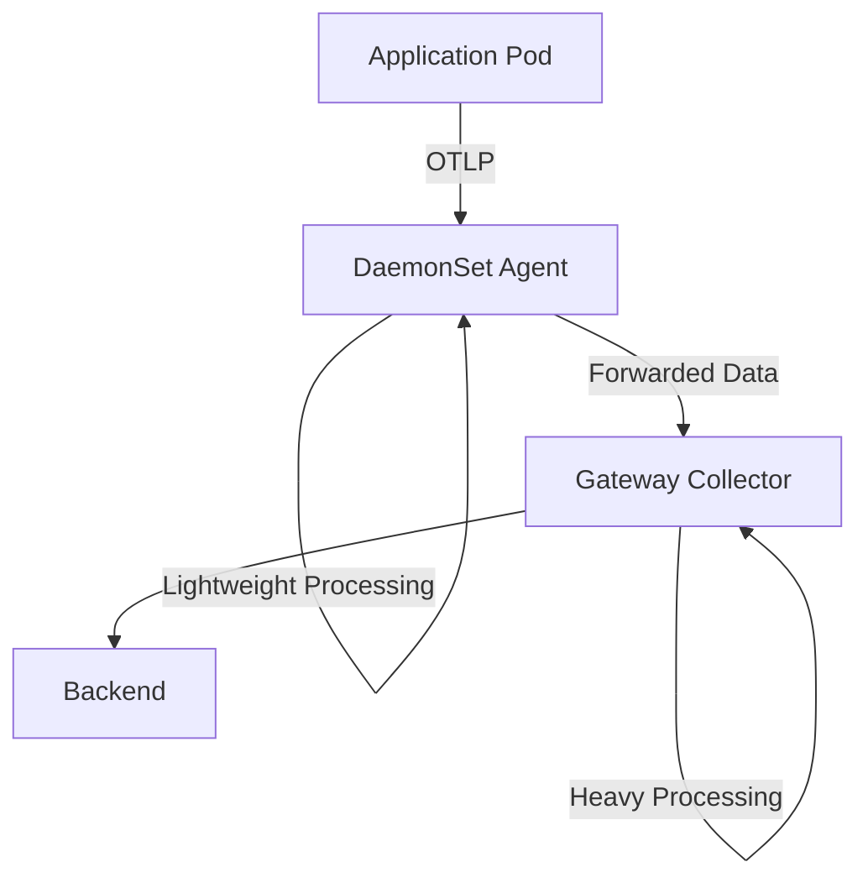

# How to Deploy the OpenTelemetry Collector as a Gateway

Author: [nawazdhandala](https://www.github.com/nawazdhandala)

Tags: OpenTelemetry, Collector, Gateway, Architecture, Deployment

Description: Learn how to deploy the OpenTelemetry Collector as a centralized gateway for scalable telemetry aggregation and processing.

The gateway deployment pattern for the OpenTelemetry Collector creates a centralized aggregation point for telemetry data in your infrastructure. This pattern receives data from multiple sources, performs heavy processing, and forwards it to backend systems. Gateway deployments are essential for building scalable observability architectures.

## Gateway Deployment Architecture

A gateway collector sits between your applications and observability backends, providing a centralized point for data processing, enrichment, and routing:



## When to Use Gateway Deployment

Gateway deployments are ideal for:

- **Centralized processing**: CPU-intensive operations like tail sampling and metrics aggregation
- **Data routing**: Intelligent routing based on attributes or tenant ID
- **Backend abstraction**: Decoupling applications from backend systems
- **Cost optimization**: Sampling and filtering before sending to expensive backends
- **Security**: Single egress point with credential management
- **Multi-tenancy**: Routing different customers to different backends

## Basic Gateway Deployment

Here's a complete Kubernetes deployment for a gateway collector:

```yaml
apiVersion: v1
kind: Namespace
metadata:
  name: opentelemetry
---
apiVersion: v1
kind: ServiceAccount
metadata:
  name: otel-collector-gateway
  namespace: opentelemetry
---
apiVersion: v1
kind: ConfigMap
metadata:
  name: otel-collector-gateway-config
  namespace: opentelemetry
data:
  config.yaml: |
    receivers:
      # Receive OTLP data from agents and applications
      otlp:
        protocols:
          grpc:
            endpoint: 0.0.0.0:4317
          http:
            endpoint: 0.0.0.0:4318

    processors:
      # Batch for efficient export
      batch:
        timeout: 10s
        send_batch_size: 1024

      # Memory limiter
      memory_limiter:
        check_interval: 1s
        limit_mib: 1024
        spike_limit_mib: 256

      # Add gateway identifier
      resource:
        attributes:
          - key: collector.type
            value: gateway
            action: insert

    exporters:
      # Export to observability backend
      otlphttp:
        endpoint: https://observability-backend.example.com:4318
        compression: gzip
        headers:
          X-API-Key: ${BACKEND_API_KEY}

      # Logging for debugging
      logging:
        verbosity: normal
        sampling_initial: 5
        sampling_thereafter: 200

    service:
      pipelines:
        traces:
          receivers: [otlp]
          processors: [memory_limiter, resource, batch]
          exporters: [otlphttp]

        metrics:
          receivers: [otlp]
          processors: [memory_limiter, resource, batch]
          exporters: [otlphttp]

        logs:
          receivers: [otlp]
          processors: [memory_limiter, resource, batch]
          exporters: [otlphttp]

      telemetry:
        logs:
          level: info
        metrics:
          address: 0.0.0.0:8888
---
apiVersion: apps/v1
kind: Deployment
metadata:
  name: otel-collector-gateway
  namespace: opentelemetry
spec:
  replicas: 3
  selector:
    matchLabels:
      app: otel-collector-gateway
  template:
    metadata:
      labels:
        app: otel-collector-gateway
    spec:
      serviceAccountName: otel-collector-gateway
      containers:
      - name: otel-collector
        image: otel/opentelemetry-collector-contrib:0.95.0
        args:
          - --config=/conf/config.yaml
        ports:
        - name: otlp-grpc
          containerPort: 4317
          protocol: TCP
        - name: otlp-http
          containerPort: 4318
          protocol: TCP
        - name: metrics
          containerPort: 8888
          protocol: TCP
        volumeMounts:
        - name: config
          mountPath: /conf
        resources:
          requests:
            memory: 512Mi
            cpu: 500m
          limits:
            memory: 1Gi
            cpu: 1000m
        livenessProbe:
          httpGet:
            path: /
            port: 13133
          initialDelaySeconds: 30
          periodSeconds: 30
        readinessProbe:
          httpGet:
            path: /
            port: 13133
          initialDelaySeconds: 10
          periodSeconds: 10
      volumes:
      - name: config
        configMap:
          name: otel-collector-gateway-config
---
apiVersion: v1
kind: Service
metadata:
  name: otel-collector-gateway
  namespace: opentelemetry
spec:
  type: ClusterIP
  selector:
    app: otel-collector-gateway
  ports:
  - name: otlp-grpc
    port: 4317
    targetPort: 4317
    protocol: TCP
  - name: otlp-http
    port: 4318
    targetPort: 4318
    protocol: TCP
  - name: metrics
    port: 8888
    targetPort: 8888
    protocol: TCP
---
apiVersion: autoscaling/v2
kind: HorizontalPodAutoscaler
metadata:
  name: otel-collector-gateway
  namespace: opentelemetry
spec:
  scaleTargetRef:
    apiVersion: apps/v1
    kind: Deployment
    name: otel-collector-gateway
  minReplicas: 3
  maxReplicas: 10
  metrics:
  - type: Resource
    resource:
      name: cpu
      target:
        type: Utilization
        averageUtilization: 70
  - type: Resource
    resource:
      name: memory
      target:
        type: Utilization
        averageUtilization: 80
```

This configuration includes horizontal pod autoscaling to handle variable telemetry load.

## Advanced Processing Pipeline

Gateways are ideal for CPU-intensive processing. Here's a configuration with advanced processing capabilities:

```yaml
receivers:
  otlp:
    protocols:
      grpc:
        endpoint: 0.0.0.0:4317
        max_recv_msg_size_mib: 32
        max_concurrent_streams: 100

processors:
  # Memory limiter - must be first
  memory_limiter:
    check_interval: 1s
    limit_mib: 2048
    spike_limit_mib: 512

  # Tail sampling - keeps interesting traces
  tail_sampling:
    decision_wait: 30s
    num_traces: 100000
    expected_new_traces_per_sec: 1000
    policies:
      # Always sample errors
      - name: errors
        type: status_code
        status_code:
          status_codes: [ERROR]

      # Always sample slow requests (>1s)
      - name: slow-traces
        type: latency
        latency:
          threshold_ms: 1000

      # Sample specific services at 100%
      - name: critical-services
        type: string_attribute
        string_attribute:
          key: service.name
          values:
            - payment-service
            - auth-service

      # Probabilistic sampling for everything else (10%)
      - name: probabilistic
        type: probabilistic
        probabilistic:
          sampling_percentage: 10

  # Generate span metrics from traces
  spanmetrics:
    metrics_exporter: prometheusremotewrite
    latency_histogram_buckets: [2ms, 4ms, 8ms, 16ms, 32ms, 64ms, 128ms, 256ms, 512ms, 1024ms, 2048ms, 4096ms, 8192ms]
    dimensions:
      - name: http.method
        default: GET
      - name: http.status_code
      - name: service.name
    dimensions_cache_size: 10000

  # Transform and filter metrics
  metricstransform:
    transforms:
      - include: .*
        match_type: regexp
        action: update
        operations:
          # Add deployment environment label
          - action: add_label
            new_label: environment
            new_value: production

  # Filter out unwanted metrics
  filter/metrics:
    metrics:
      exclude:
        match_type: regexp
        metric_names:
          # Exclude high-cardinality metrics
          - .*_bucket
          - system\..*\.io\..*

  # Attributes processor for enrichment
  attributes:
    actions:
      - key: processed_by
        value: gateway-collector
        action: insert
      - key: region
        value: us-east-1
        action: insert

  # Resource processor
  resource:
    attributes:
      - key: collector.version
        value: 0.95.0
        action: insert

  # Batch processor - should be last
  batch:
    timeout: 10s
    send_batch_size: 2048
    send_batch_max_size: 4096

exporters:
  # Jaeger for traces
  otlp/jaeger:
    endpoint: jaeger-collector.observability.svc.cluster.local:4317
    tls:
      insecure: true
    sending_queue:
      enabled: true
      num_consumers: 20
      queue_size: 10000
    retry_on_failure:
      enabled: true
      initial_interval: 5s
      max_interval: 30s
      max_elapsed_time: 300s

  # Prometheus for metrics
  prometheusremotewrite:
    endpoint: http://prometheus.monitoring.svc.cluster.local:9090/api/v1/write
    resource_to_telemetry_conversion:
      enabled: true
    sending_queue:
      enabled: true
      num_consumers: 10
      queue_size: 5000

  # Loki for logs
  loki:
    endpoint: http://loki.monitoring.svc.cluster.local:3100/loki/api/v1/push
    format: json
    labels:
      resource:
        service.name: "service_name"
        service.namespace: "namespace"
      attributes:
        level: "level"

service:
  pipelines:
    # Traces pipeline with tail sampling
    traces:
      receivers: [otlp]
      processors:
        - memory_limiter
        - resource
        - attributes
        - tail_sampling
        - spanmetrics
        - batch
      exporters: [otlp/jaeger]

    # Metrics pipeline with transformation
    metrics:
      receivers: [otlp]
      processors:
        - memory_limiter
        - resource
        - metricstransform
        - filter/metrics
        - batch
      exporters: [prometheusremotewrite]

    # Span metrics pipeline
    metrics/spanmetrics:
      receivers: [spanmetrics]
      processors: [batch]
      exporters: [prometheusremotewrite]

    # Logs pipeline
    logs:
      receivers: [otlp]
      processors:
        - memory_limiter
        - resource
        - attributes
        - batch
      exporters: [loki]

  telemetry:
    logs:
      level: info
    metrics:
      address: 0.0.0.0:8888
```

This configuration demonstrates tail sampling, a stateful operation that requires buffering trace spans to make sampling decisions. This is resource-intensive and should only run in gateway collectors, not in sidecars or DaemonSets.

## Multi-Backend Routing Gateway

A gateway can route telemetry to different backends based on attributes:

```yaml
receivers:
  otlp:
    protocols:
      grpc:
        endpoint: 0.0.0.0:4317

connectors:
  # Routing connector for intelligent routing
  routing:
    default_pipelines: [traces/default]
    error_mode: ignore
    table:
      # Route production traffic to primary backend
      - statement: route() where resource.attributes["deployment.environment"] == "production"
        pipelines: [traces/production]

      # Route staging traffic to staging backend
      - statement: route() where resource.attributes["deployment.environment"] == "staging"
        pipelines: [traces/staging]

      # Route by tenant
      - statement: route() where resource.attributes["tenant.id"] == "tenant-a"
        pipelines: [traces/tenant-a]

processors:
  batch:
    timeout: 10s

  memory_limiter:
    check_interval: 1s
    limit_mib: 2048

exporters:
  # Production backend
  otlp/production:
    endpoint: https://prod-observability.company.com:4317
    tls:
      insecure: false
      cert_file: /etc/certs/prod.pem
    compression: gzip

  # Staging backend
  otlp/staging:
    endpoint: https://staging-observability.company.com:4317
    tls:
      insecure: false
      cert_file: /etc/certs/staging.pem

  # Tenant-specific backend
  otlp/tenant-a:
    endpoint: https://tenant-a.observability.company.com:4317
    headers:
      X-Tenant-ID: tenant-a
      X-API-Key: ${TENANT_A_API_KEY}

  # Default backend
  otlp/default:
    endpoint: https://default-observability.company.com:4317

service:
  pipelines:
    # Ingestion pipeline
    traces/ingest:
      receivers: [otlp]
      exporters: [routing]

    # Routed pipelines
    traces/production:
      receivers: [routing]
      processors: [memory_limiter, batch]
      exporters: [otlp/production]

    traces/staging:
      receivers: [routing]
      processors: [memory_limiter, batch]
      exporters: [otlp/staging]

    traces/tenant-a:
      receivers: [routing]
      processors: [memory_limiter, batch]
      exporters: [otlp/tenant-a]

    traces/default:
      receivers: [routing]
      processors: [memory_limiter, batch]
      exporters: [otlp/default]
```

## Load Balancing Configuration

For high-availability gateway deployments, configure load balancing:

```yaml
apiVersion: v1
kind: Service
metadata:
  name: otel-collector-gateway
  namespace: opentelemetry
  annotations:
    # Enable session affinity for stateful operations
    service.kubernetes.io/topology-aware-hints: auto
spec:
  type: ClusterIP
  # Use session affinity for tail sampling
  sessionAffinity: ClientIP
  sessionAffinityConfig:
    clientIP:
      timeoutSeconds: 3600
  selector:
    app: otel-collector-gateway
  ports:
  - name: otlp-grpc
    port: 4317
    targetPort: 4317
  - name: otlp-http
    port: 4318
    targetPort: 4318
```

For external access, use a LoadBalancer or Ingress:

```yaml
apiVersion: v1
kind: Service
metadata:
  name: otel-collector-gateway-external
  namespace: opentelemetry
spec:
  type: LoadBalancer
  loadBalancerSourceRanges:
    # Restrict to specific IP ranges
    - 10.0.0.0/8
    - 172.16.0.0/12
  selector:
    app: otel-collector-gateway
  ports:
  - name: otlp-grpc
    port: 4317
    targetPort: 4317
  - name: otlp-http
    port: 4318
    targetPort: 4318
```

## High Availability Configuration

Configure pod disruption budgets and anti-affinity for high availability:

```yaml
apiVersion: policy/v1
kind: PodDisruptionBudget
metadata:
  name: otel-collector-gateway
  namespace: opentelemetry
spec:
  minAvailable: 2
  selector:
    matchLabels:
      app: otel-collector-gateway
---
apiVersion: apps/v1
kind: Deployment
metadata:
  name: otel-collector-gateway
  namespace: opentelemetry
spec:
  replicas: 3
  selector:
    matchLabels:
      app: otel-collector-gateway
  template:
    metadata:
      labels:
        app: otel-collector-gateway
    spec:
      # Spread pods across availability zones
      affinity:
        podAntiAffinity:
          preferredDuringSchedulingIgnoredDuringExecution:
          - weight: 100
            podAffinityTerm:
              labelSelector:
                matchLabels:
                  app: otel-collector-gateway
              topologyKey: topology.kubernetes.io/zone
          - weight: 50
            podAffinityTerm:
              labelSelector:
                matchLabels:
                  app: otel-collector-gateway
              topologyKey: kubernetes.io/hostname
      containers:
      - name: otel-collector
        image: otel/opentelemetry-collector-contrib:0.95.0
        # ... rest of container spec
```

## Resource Sizing for Gateways

Gateway collectors need more resources than agent collectors. Here are sizing guidelines:

```yaml
resources:
  requests:
    # Small gateway (1000 spans/sec)
    memory: "512Mi"
    cpu: "500m"

  limits:
    memory: "1Gi"
    cpu: "1000m"

# Medium gateway (10000 spans/sec)
# requests:
#   memory: "2Gi"
#   cpu: "2000m"
# limits:
#   memory: "4Gi"
#   cpu: "4000m"

# Large gateway (100000 spans/sec)
# requests:
#   memory: "8Gi"
#   cpu: "8000m"
# limits:
#   memory: "16Gi"
#   cpu: "16000m"
```

Match your memory limiter configuration to your resource limits:

```yaml
processors:
  memory_limiter:
    check_interval: 1s
    # Set to 75% of memory limit (1Gi = 1024Mi, 75% = 768Mi)
    limit_mib: 768
    spike_limit_mib: 256
```

## Monitoring Gateway Health

Monitor gateway performance with these metrics:

```yaml
# ServiceMonitor for Prometheus Operator
apiVersion: monitoring.coreos.com/v1
kind: ServiceMonitor
metadata:
  name: otel-collector-gateway
  namespace: opentelemetry
spec:
  selector:
    matchLabels:
      app: otel-collector-gateway
  endpoints:
  - port: metrics
    interval: 30s
    path: /metrics
```

Key metrics to monitor:

- `otelcol_receiver_accepted_spans`: Spans received
- `otelcol_receiver_refused_spans`: Spans rejected (back pressure)
- `otelcol_processor_batch_batch_send_size`: Batch sizes
- `otelcol_exporter_sent_spans`: Spans successfully exported
- `otelcol_exporter_send_failed_spans`: Export failures
- `otelcol_processor_tail_sampling_sampling_decision_latency`: Sampling decision time

## Gateway vs Agent Pattern

Combine gateway and agent (DaemonSet) deployments for optimal performance:



Agent collectors (DaemonSets) handle:
- Local collection
- Lightweight processing
- Kubernetes metadata enrichment
- Resource detection

Gateway collectors handle:
- Tail sampling
- Aggregation
- Complex routing
- Backend authentication

## Related Resources

For more OpenTelemetry Collector deployment patterns:

- [How to Deploy the OpenTelemetry Collector as a DaemonSet in Kubernetes](https://oneuptime.com/blog/post/2026-02-06-deploy-opentelemetry-collector-daemonset-kubernetes/view)
- [How to Route Telemetry to Multiple Backends with the Routing Connector](https://oneuptime.com/blog/post/2026-02-06-route-telemetry-multiple-backends-routing-connector/view)
- [How to Build Fan-Out Pipelines in the OpenTelemetry Collector](https://oneuptime.com/blog/post/2026-02-06-fan-out-pipelines-opentelemetry-collector/view)

Gateway deployment is essential for building scalable, maintainable observability architectures. By centralizing heavy processing and routing logic, gateways reduce the complexity of agent collectors and provide a flexible abstraction layer between your applications and observability backends.
