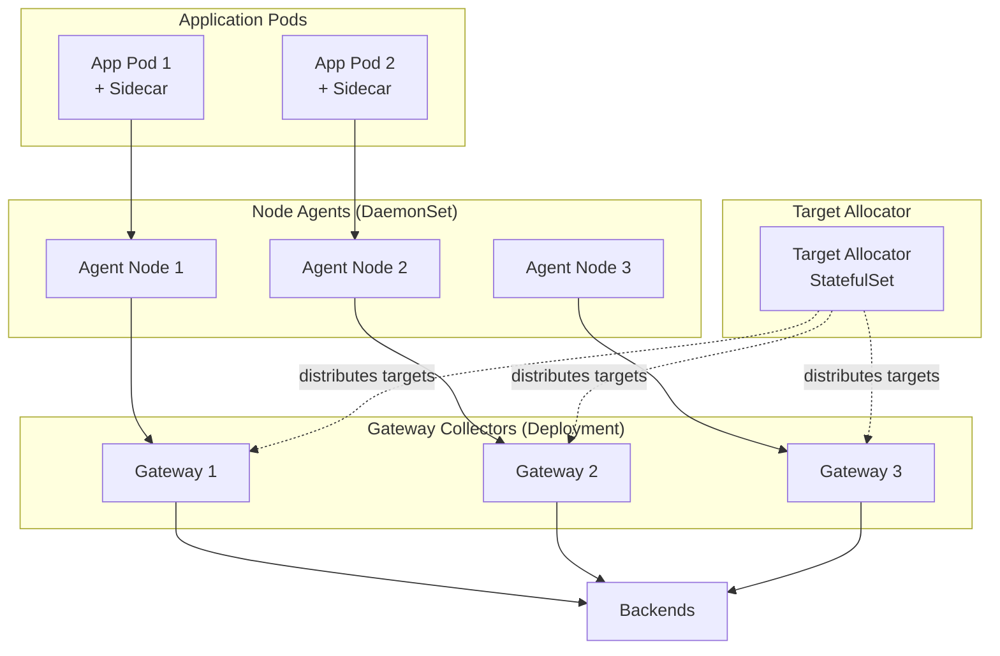

# How to Deploy the OpenTelemetry Collector with the Kubernetes Operator

Author: [nawazdhandala](https://www.github.com/nawazdhandala)

Tags: OpenTelemetry, Collector, Kubernetes, Operator, Deployment, K8s, Automation

Description: Master deploying OpenTelemetry Collectors using the Kubernetes Operator for automated management, configuration updates, and scaling with custom resources.

The OpenTelemetry Operator for Kubernetes simplifies collector deployment by providing native Kubernetes resources and automation. Instead of manually managing Deployments, DaemonSets, and ConfigMaps, the operator handles lifecycle management, auto-scaling, and configuration updates through custom resource definitions (CRDs).

## Why Use the OpenTelemetry Operator

Managing OpenTelemetry Collectors manually in Kubernetes involves creating and maintaining multiple resources: Deployments, Services, ConfigMaps, and RBAC policies. The operator automates this complexity and provides additional capabilities:

- **Declarative Configuration**: Define collectors using Kubernetes-native CRDs
- **Automatic Instrumentation**: Inject auto-instrumentation into pods without code changes
- **Target Allocator**: Automatically distribute Prometheus scrape targets across collector instances
- **ConfigMap Management**: Automatically create and update ConfigMaps from collector specs
- **Mode Flexibility**: Deploy as DaemonSet, Deployment, StatefulSet, or Sidecar with one resource

The operator follows Kubernetes best practices and integrates seamlessly with GitOps workflows, making it ideal for production environments.

## Installing the OpenTelemetry Operator

First, install cert-manager, which the operator requires for webhook certificates:

```bash
# Install cert-manager for managing TLS certificates
kubectl apply -f https://github.com/cert-manager/cert-manager/releases/download/v1.13.0/cert-manager.yaml

# Wait for cert-manager to be ready
kubectl wait --for=condition=Available --timeout=300s \
  deployment/cert-manager -n cert-manager

kubectl wait --for=condition=Available --timeout=300s \
  deployment/cert-manager-webhook -n cert-manager

kubectl wait --for=condition=Available --timeout=300s \
  deployment/cert-manager-cainjector -n cert-manager
```

Now install the OpenTelemetry Operator:

```bash
# Install the operator in the opentelemetry-operator-system namespace
kubectl apply -f https://github.com/open-telemetry/opentelemetry-operator/releases/latest/download/opentelemetry-operator.yaml

# Verify the operator is running
kubectl get pods -n opentelemetry-operator-system

# Check the operator logs
kubectl logs -n opentelemetry-operator-system deployment/opentelemetry-operator-controller-manager
```

The operator creates several CRDs:

- `OpenTelemetryCollector`: Define collector instances
- `Instrumentation`: Configure auto-instrumentation for applications
- `OpAMPBridge`: Connect collectors to OpAMP control planes

## Deploying a Collector as a Deployment

The simplest deployment mode runs collectors as a Kubernetes Deployment, suitable for gateway collectors that aggregate telemetry:

```yaml
# collector-deployment.yaml
# Deploy a gateway collector using the operator
apiVersion: opentelemetry.io/v1alpha1
kind: OpenTelemetryCollector
metadata:
  name: gateway-collector
  namespace: observability
spec:
  # Deployment mode creates a standard Kubernetes Deployment
  mode: deployment

  # Number of collector replicas
  replicas: 3

  # Use the contrib distribution with additional components
  image: otel/opentelemetry-collector-contrib:0.93.0

  # Resource limits for each collector pod
  resources:
    requests:
      memory: 512Mi
      cpu: 500m
    limits:
      memory: 1Gi
      cpu: 1000m

  # Define the collector configuration inline
  config: |
    receivers:
      otlp:
        protocols:
          grpc:
            endpoint: 0.0.0.0:4317
          http:
            endpoint: 0.0.0.0:4318

    processors:
      memory_limiter:
        check_interval: 1s
        limit_mib: 900
        spike_limit_mib: 200

      batch:
        timeout: 10s
        send_batch_size: 1024

      # Add resource attributes
      resource:
        attributes:
          - key: deployment.environment
            value: production
            action: insert
          - key: collector.name
            value: gateway-collector
            action: insert

    exporters:
      # Export to Prometheus Remote Write
      prometheusremotewrite:
        endpoint: https://prometheus.example.com/api/v1/write
        headers:
          Authorization: Bearer ${PROM_TOKEN}

      # Export traces via OTLP
      otlp:
        endpoint: jaeger.example.com:4317
        tls:
          insecure: false

      # Debug exporter for troubleshooting
      logging:
        verbosity: normal

    service:
      pipelines:
        traces:
          receivers: [otlp]
          processors: [memory_limiter, resource, batch]
          exporters: [otlp, logging]

        metrics:
          receivers: [otlp]
          processors: [memory_limiter, resource, batch]
          exporters: [prometheusremotewrite, logging]

  # Environment variables for the collector pods
  env:
    - name: PROM_TOKEN
      valueFrom:
        secretKeyRef:
          name: backend-credentials
          key: prometheus-token

  # Expose the collector via a Service
  # The operator automatically creates a Service
  ports:
    - name: otlp-grpc
      port: 4317
      targetPort: 4317
      protocol: TCP
    - name: otlp-http
      port: 4318
      targetPort: 4318
      protocol: TCP
    - name: metrics
      port: 8888
      targetPort: 8888
      protocol: TCP
```

Apply the resource:

```bash
kubectl apply -f collector-deployment.yaml

# The operator creates these resources automatically:
# - Deployment: gateway-collector-collector
# - Service: gateway-collector-collector
# - ConfigMap: gateway-collector-collector

# Verify the collector is running
kubectl get pods -n observability -l app.kubernetes.io/name=gateway-collector-collector

# Check the auto-generated Service
kubectl get svc -n observability gateway-collector-collector
```

The operator handles all lifecycle management. To update the configuration, simply edit the OpenTelemetryCollector resource and apply it. The operator performs rolling updates automatically.

## Deploying a Collector as a DaemonSet

For agent collectors that run on every node, use DaemonSet mode:

```yaml
# collector-daemonset.yaml
# Deploy an agent collector on every node using DaemonSet mode
apiVersion: opentelemetry.io/v1alpha1
kind: OpenTelemetryCollector
metadata:
  name: agent-collector
  namespace: observability
spec:
  # DaemonSet mode deploys one collector per node
  mode: daemonset

  image: otel/opentelemetry-collector-contrib:0.93.0

  # Configure host networking for receiving telemetry on node IP
  hostNetwork: true

  resources:
    requests:
      memory: 128Mi
      cpu: 100m
    limits:
      memory: 512Mi
      cpu: 500m

  config: |
    receivers:
      # Receive OTLP telemetry from applications
      otlp:
        protocols:
          grpc:
            endpoint: 0.0.0.0:4317
          http:
            endpoint: 0.0.0.0:4318

      # Collect host metrics from the node
      hostmetrics:
        collection_interval: 30s
        scrapers:
          cpu:
          memory:
          disk:
          network:
          filesystem:

      # Collect Kubernetes events
      k8s_events:
        auth_type: serviceAccount
        namespaces: [default, kube-system, observability]

    processors:
      memory_limiter:
        check_interval: 1s
        limit_mib: 450
        spike_limit_mib: 100

      batch:
        timeout: 10s
        send_batch_size: 512

      # Detect Kubernetes resource attributes
      k8sattributes:
        auth_type: serviceAccount
        passthrough: false
        extract:
          metadata:
            - k8s.pod.name
            - k8s.pod.uid
            - k8s.deployment.name
            - k8s.namespace.name
            - k8s.node.name
            - k8s.pod.start_time
          labels:
            - tag_name: app.label.component
              key: app.kubernetes.io/component
              from: pod

      # Detect node resource attributes
      resourcedetection:
        detectors: [env, system]
        timeout: 5s

      # Add agent-specific attributes
      resource:
        attributes:
          - key: collector.tier
            value: agent
            action: insert

    exporters:
      # Forward to gateway collectors
      otlp:
        endpoint: gateway-collector-collector.observability.svc.cluster.local:4317
        tls:
          insecure: false
        retry_on_failure:
          enabled: true
          initial_interval: 5s
          max_interval: 30s
        sending_queue:
          enabled: true
          queue_size: 1000

    service:
      pipelines:
        traces:
          receivers: [otlp]
          processors: [memory_limiter, k8sattributes, resourcedetection, resource, batch]
          exporters: [otlp]

        metrics:
          receivers: [otlp, hostmetrics]
          processors: [memory_limiter, k8sattributes, resourcedetection, resource, batch]
          exporters: [otlp]

        logs:
          receivers: [otlp, k8s_events]
          processors: [memory_limiter, k8sattributes, resourcedetection, resource, batch]
          exporters: [otlp]

  # Volume mounts for accessing host filesystem
  volumeMounts:
    - name: hostfs
      mountPath: /hostfs
      readOnly: true

  volumes:
    - name: hostfs
      hostPath:
        path: /

  # Service account for Kubernetes API access
  serviceAccount: otel-collector-sa

  ports:
    - name: otlp-grpc
      port: 4317
      hostPort: 4317
      protocol: TCP
    - name: otlp-http
      port: 4318
      hostPort: 4318
      protocol: TCP
```

Create the required ServiceAccount and RBAC permissions:

```yaml
# collector-rbac.yaml
# ServiceAccount and permissions for the collector
apiVersion: v1
kind: ServiceAccount
metadata:
  name: otel-collector-sa
  namespace: observability
---
apiVersion: rbac.authorization.k8s.io/v1
kind: ClusterRole
metadata:
  name: otel-collector-role
rules:
  # Read pod metadata for k8sattributes processor
  - apiGroups: [""]
    resources: ["pods", "namespaces", "nodes"]
    verbs: ["get", "watch", "list"]
  # Read events for k8s_events receiver
  - apiGroups: [""]
    resources: ["events"]
    verbs: ["get", "watch", "list"]
---
apiVersion: rbac.authorization.k8s.io/v1
kind: ClusterRoleBinding
metadata:
  name: otel-collector-binding
roleRef:
  apiGroup: rbac.authorization.k8s.io
  kind: ClusterRole
  name: otel-collector-role
subjects:
  - kind: ServiceAccount
    name: otel-collector-sa
    namespace: observability
```

Apply both resources:

```bash
kubectl apply -f collector-rbac.yaml
kubectl apply -f collector-daemonset.yaml

# Verify one collector per node
kubectl get pods -n observability -l app.kubernetes.io/name=agent-collector-collector -o wide
```

## Deploying a Collector as a Sidecar

The operator can automatically inject collectors as sidecars into application pods:

```yaml
# collector-sidecar.yaml
# Define a sidecar collector configuration
apiVersion: opentelemetry.io/v1alpha1
kind: OpenTelemetryCollector
metadata:
  name: sidecar
  namespace: observability
spec:
  # Sidecar mode for automatic injection
  mode: sidecar

  image: otel/opentelemetry-collector-contrib:0.93.0

  resources:
    requests:
      memory: 64Mi
      cpu: 50m
    limits:
      memory: 256Mi
      cpu: 200m

  config: |
    receivers:
      otlp:
        protocols:
          grpc:
            endpoint: localhost:4317
          http:
            endpoint: localhost:4318

    processors:
      memory_limiter:
        check_interval: 1s
        limit_mib: 200

      batch:
        timeout: 5s

    exporters:
      otlp:
        endpoint: gateway-collector-collector.observability.svc.cluster.local:4317

    service:
      pipelines:
        traces:
          receivers: [otlp]
          processors: [memory_limiter, batch]
          exporters: [otlp]
        metrics:
          receivers: [otlp]
          processors: [memory_limiter, batch]
          exporters: [otlp]
```

To inject the sidecar into an application, add an annotation to the pod:

```yaml
# application-with-sidecar.yaml
apiVersion: apps/v1
kind: Deployment
metadata:
  name: my-application
  namespace: default
spec:
  replicas: 2
  selector:
    matchLabels:
      app: my-application
  template:
    metadata:
      labels:
        app: my-application
      annotations:
        # Inject the sidecar collector
        sidecar.opentelemetry.io/inject: "observability/sidecar"
    spec:
      containers:
      - name: app
        image: my-application:v1.0.0
        env:
          # Application sends telemetry to localhost
          - name: OTEL_EXPORTER_OTLP_ENDPOINT
            value: "http://localhost:4318"
```

The operator automatically injects the collector sidecar container with shared volumes and networking.

## Using the Target Allocator for Prometheus Scraping

The Target Allocator enables efficient Prometheus scraping across multiple collector instances:

```yaml
# collector-with-target-allocator.yaml
# Deploy collector with Target Allocator for distributed scraping
apiVersion: opentelemetry.io/v1alpha1
kind: OpenTelemetryCollector
metadata:
  name: prometheus-collector
  namespace: observability
spec:
  mode: statefulset
  replicas: 3

  image: otel/opentelemetry-collector-contrib:0.93.0

  # Enable the Target Allocator
  targetAllocator:
    enabled: true
    serviceAccount: otel-targetallocator-sa
    prometheusCR:
      enabled: true
      serviceMonitorSelector: {}
      podMonitorSelector: {}

  config: |
    receivers:
      # Prometheus receiver gets targets from Target Allocator
      prometheus:
        config:
          scrape_configs:
            - job_name: 'otel-collector'
              scrape_interval: 30s
              static_configs:
                - targets: ['0.0.0.0:8888']

        # Use Target Allocator for distributed scraping
        target_allocator:
          endpoint: http://prometheus-collector-targetallocator:80
          interval: 30s
          collector_id: "${POD_NAME}"

    processors:
      batch:
        timeout: 10s

    exporters:
      prometheusremotewrite:
        endpoint: https://prometheus.example.com/api/v1/write

    service:
      pipelines:
        metrics:
          receivers: [prometheus]
          processors: [batch]
          exporters: [prometheusremotewrite]

  env:
    - name: POD_NAME
      valueFrom:
        fieldRef:
          fieldPath: metadata.name
```

The Target Allocator watches ServiceMonitor and PodMonitor resources, then distributes scrape targets evenly across collector instances. This prevents duplicate scraping and enables horizontal scaling.

## Auto-Instrumentation for Applications

The operator can automatically inject instrumentation libraries into applications without code changes:

```yaml
# instrumentation.yaml
# Configure auto-instrumentation for different languages
apiVersion: opentelemetry.io/v1alpha1
kind: Instrumentation
metadata:
  name: my-instrumentation
  namespace: observability
spec:
  # Exporter configuration for instrumented applications
  exporter:
    endpoint: http://gateway-collector-collector.observability.svc.cluster.local:4318

  # Propagators for trace context
  propagators:
    - tracecontext
    - baggage
    - b3

  # Sampler configuration
  sampler:
    type: parentbased_traceidratio
    argument: "0.25"

  # Python auto-instrumentation
  python:
    image: ghcr.io/open-telemetry/opentelemetry-operator/autoinstrumentation-python:0.43b0

  # Node.js auto-instrumentation
  nodejs:
    image: ghcr.io/open-telemetry/opentelemetry-operator/autoinstrumentation-nodejs:0.45.0

  # Java auto-instrumentation
  java:
    image: ghcr.io/open-telemetry/opentelemetry-operator/autoinstrumentation-java:1.32.0

  # .NET auto-instrumentation
  dotnet:
    image: ghcr.io/open-telemetry/opentelemetry-operator/autoinstrumentation-dotnet:1.2.0

  # Go auto-instrumentation (requires code changes for Go)
  go:
    image: ghcr.io/open-telemetry/opentelemetry-go-instrumentation/autoinstrumentation-go:v0.9.0-alpha
```

To enable auto-instrumentation, annotate your application pods:

```yaml
apiVersion: apps/v1
kind: Deployment
metadata:
  name: python-app
spec:
  template:
    metadata:
      annotations:
        # Enable Python auto-instrumentation
        instrumentation.opentelemetry.io/inject-python: "observability/my-instrumentation"
    spec:
      containers:
      - name: app
        image: python-app:latest
```

Supported annotations:
- `instrumentation.opentelemetry.io/inject-python`: Python apps
- `instrumentation.opentelemetry.io/inject-nodejs`: Node.js apps
- `instrumentation.opentelemetry.io/inject-java`: Java apps
- `instrumentation.opentelemetry.io/inject-dotnet`: .NET apps
- `instrumentation.opentelemetry.io/inject-go`: Go apps

## Managing Collector Configuration with ConfigMaps

For complex configurations, reference external ConfigMaps:

```yaml
apiVersion: v1
kind: ConfigMap
metadata:
  name: advanced-collector-config
  namespace: observability
data:
  collector.yaml: |
    receivers:
      otlp:
        protocols:
          grpc:
            endpoint: 0.0.0.0:4317
    # ... rest of configuration
---
apiVersion: opentelemetry.io/v1alpha1
kind: OpenTelemetryCollector
metadata:
  name: advanced-collector
  namespace: observability
spec:
  mode: deployment
  # Reference the ConfigMap instead of inline config
  configmaps:
    - name: advanced-collector-config
      key: collector.yaml
```

## Monitoring and Troubleshooting

Monitor operator health and collector status:

```bash
# Check operator logs
kubectl logs -n opentelemetry-operator-system \
  deployment/opentelemetry-operator-controller-manager -f

# View collector status
kubectl get opentelemetrycollector -n observability

# Describe collector for events and status
kubectl describe opentelemetrycollector gateway-collector -n observability

# View collector pod logs
kubectl logs -n observability -l app.kubernetes.io/name=gateway-collector-collector -f

# Access collector metrics
kubectl port-forward -n observability \
  svc/gateway-collector-collector 8888:8888

# Then visit http://localhost:8888/metrics
```

Common issues:

- **Collector pods not starting**: Check resource limits and image availability
- **Configuration errors**: Validate YAML syntax and collector config structure
- **Permission errors**: Verify ServiceAccount and RBAC permissions
- **Target Allocator not working**: Ensure ServiceMonitor/PodMonitor CRDs are installed

## Upgrading and Maintenance

The operator supports zero-downtime upgrades through rolling updates:

```bash
# Update the collector image
kubectl patch opentelemetrycollector gateway-collector -n observability \
  --type merge -p '{"spec":{"image":"otel/opentelemetry-collector-contrib:0.94.0"}}'

# Watch the rollout
kubectl rollout status deployment/gateway-collector-collector -n observability

# Update the operator itself
kubectl apply -f https://github.com/open-telemetry/opentelemetry-operator/releases/download/v0.94.0/opentelemetry-operator.yaml
```

## Complete Architecture Example

Here's a complete two-tier architecture using the operator:



## Related Resources

For additional deployment patterns, see:

- [How to Set Up a Two-Tier Collector Architecture (Agent + Gateway)](https://oneuptime.com/blog/post/2026-02-06-two-tier-collector-architecture-agent-gateway/view)
- [How to Deploy the OpenTelemetry Collector as a StatefulSet in Kubernetes](https://oneuptime.com/blog/post/2026-02-06-deploy-opentelemetry-collector-statefulset-kubernetes/view)

The OpenTelemetry Operator simplifies collector management in Kubernetes environments, providing declarative configuration, automatic instrumentation, and advanced features like target allocation. It's the recommended approach for production Kubernetes deployments.
