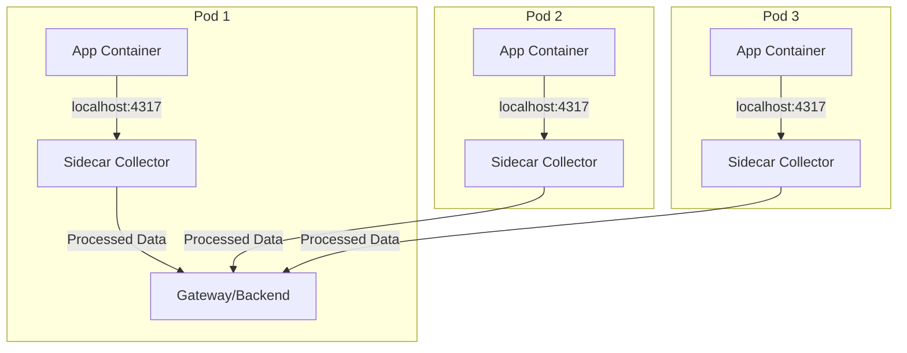

# How to Deploy the OpenTelemetry Collector as a Sidecar in Kubernetes

Author: [nawazdhandala](https://www.github.com/nawazdhandala)

Tags: OpenTelemetry, Collector, Kubernetes, Sidecar, Deployment

Description: Complete guide to deploying the OpenTelemetry Collector as a sidecar container in Kubernetes for application-specific telemetry collection.

The sidecar deployment pattern places an OpenTelemetry Collector container alongside your application container in the same pod. This pattern provides application-specific telemetry collection with dedicated resources and isolation. While not suitable for all scenarios, sidecars offer unique advantages for certain use cases.

## Understanding Sidecar Architecture

In the sidecar pattern, each application pod runs its own collector instance. The application and collector share the same network namespace, allowing communication via localhost:



## When to Use Sidecar Deployment

Sidecar collectors are appropriate for:

- **Application-specific processing**: Custom transformations or filtering per application
- **Security isolation**: Each application gets its own collector with isolated credentials
- **Multi-tenancy**: Different tenants with different backends or configurations
- **Resource allocation**: Guaranteed collector resources per application
- **Legacy applications**: Applications that cannot send telemetry via network to a shared collector
- **Testing and development**: Isolated telemetry during development

**When NOT to use sidecars:**
- High-scale deployments (hundreds of pods) - resource overhead becomes significant
- Simple telemetry forwarding - DaemonSet or Gateway is more efficient
- Stateful operations like tail sampling - requires cross-pod visibility

## Basic Sidecar Configuration

Here's a complete example of deploying an application with an OpenTelemetry Collector sidecar:

```yaml
apiVersion: v1
kind: ConfigMap
metadata:
  name: otel-sidecar-config
  namespace: default
data:
  config.yaml: |
    receivers:
      # Receive from application on localhost
      otlp:
        protocols:
          grpc:
            endpoint: 127.0.0.1:4317
          http:
            endpoint: 127.0.0.1:4318

    processors:
      # Batch for efficiency
      batch:
        timeout: 5s
        send_batch_size: 512

      # Memory limiter sized for sidecar
      memory_limiter:
        check_interval: 1s
        limit_mib: 128
        spike_limit_mib: 32

      # Add application-specific attributes
      resource:
        attributes:
          - key: service.name
            value: my-application
            action: upsert
          - key: deployment.environment
            value: production
            action: insert

    exporters:
      # Forward to gateway collector
      otlp:
        endpoint: otel-collector-gateway.opentelemetry.svc.cluster.local:4317
        tls:
          insecure: true
        sending_queue:
          enabled: true
          num_consumers: 2
          queue_size: 100

    service:
      pipelines:
        traces:
          receivers: [otlp]
          processors: [memory_limiter, resource, batch]
          exporters: [otlp]

        metrics:
          receivers: [otlp]
          processors: [memory_limiter, resource, batch]
          exporters: [otlp]

        logs:
          receivers: [otlp]
          processors: [memory_limiter, resource, batch]
          exporters: [otlp]
---
apiVersion: apps/v1
kind: Deployment
metadata:
  name: my-application
  namespace: default
spec:
  replicas: 3
  selector:
    matchLabels:
      app: my-application
  template:
    metadata:
      labels:
        app: my-application
    spec:
      containers:
      # Application container
      - name: application
        image: my-application:latest
        env:
        - name: OTEL_EXPORTER_OTLP_ENDPOINT
          value: "http://127.0.0.1:4318"
        - name: OTEL_SERVICE_NAME
          value: "my-application"
        - name: OTEL_RESOURCE_ATTRIBUTES
          value: "deployment.environment=production"
        ports:
        - name: http
          containerPort: 8080
        resources:
          requests:
            memory: 256Mi
            cpu: 250m
          limits:
            memory: 512Mi
            cpu: 500m

      # OpenTelemetry Collector sidecar
      - name: otel-collector
        image: otel/opentelemetry-collector-contrib:0.95.0
        args:
          - --config=/conf/config.yaml
        volumeMounts:
        - name: config
          mountPath: /conf
        resources:
          requests:
            memory: 64Mi
            cpu: 50m
          limits:
            memory: 128Mi
            cpu: 100m

      volumes:
      - name: config
        configMap:
          name: otel-sidecar-config
```

The application sends telemetry to `localhost:4318`, which is received by the sidecar collector and forwarded to the gateway collector.

## Application-Specific Processing

Sidecars excel at application-specific transformations. Here's an example with custom filtering and attribute manipulation:

```yaml
apiVersion: v1
kind: ConfigMap
metadata:
  name: payment-service-otel-config
  namespace: default
data:
  config.yaml: |
    receivers:
      otlp:
        protocols:
          grpc:
            endpoint: 127.0.0.1:4317

    processors:
      # Memory limiter
      memory_limiter:
        check_interval: 1s
        limit_mib: 128

      # Filter sensitive spans
      filter/sensitive:
        traces:
          span:
            # Drop spans with PII
            - 'attributes["contains.pii"] == true'
            # Drop internal health checks
            - 'name == "health_check"'

      # Redact sensitive attributes
      attributes/redact:
        actions:
          # Remove credit card numbers
          - key: credit_card
            action: delete
          # Remove customer emails
          - key: customer_email
            action: delete
          # Redact API keys
          - key: api_key
            action: update
            value: "[REDACTED]"

      # Add payment service specific attributes
      resource:
        attributes:
          - key: service.name
            value: payment-service
            action: upsert
          - key: service.version
            from_attribute: app.version
            action: upsert
          - key: business.unit
            value: payments
            action: insert

      # Sample non-error transactions
      probabilistic_sampler:
        sampling_percentage: 20.0

      batch:
        timeout: 5s
        send_batch_size: 256

    exporters:
      # Send to gateway
      otlp:
        endpoint: otel-collector-gateway.opentelemetry.svc.cluster.local:4317
        tls:
          insecure: true

      # Also send to payment-specific backend
      otlphttp/payment:
        endpoint: https://payment-observability.company.com:4318
        headers:
          X-API-Key: ${PAYMENT_OBSERVABILITY_KEY}
        compression: gzip

    service:
      pipelines:
        traces:
          receivers: [otlp]
          processors:
            - memory_limiter
            - filter/sensitive
            - attributes/redact
            - resource
            - probabilistic_sampler
            - batch
          exporters: [otlp, otlphttp/payment]
```

This configuration demonstrates how sidecars can perform application-specific security filtering and routing that would be complex to configure in a shared collector.

## Multi-Tenant Sidecar Pattern

For multi-tenant applications, sidecars can route to tenant-specific backends:

```yaml
apiVersion: v1
kind: ConfigMap
metadata:
  name: tenant-app-otel-config
  namespace: default
data:
  config.yaml: |
    receivers:
      otlp:
        protocols:
          grpc:
            endpoint: 127.0.0.1:4317

    connectors:
      routing:
        default_pipelines: [traces/default]
        error_mode: ignore
        table:
          - statement: route() where resource.attributes["tenant.id"] == "tenant-1"
            pipelines: [traces/tenant-1]
          - statement: route() where resource.attributes["tenant.id"] == "tenant-2"
            pipelines: [traces/tenant-2]

    processors:
      memory_limiter:
        check_interval: 1s
        limit_mib: 256

      batch:
        timeout: 5s

      # Add tenant metadata
      resource/tenant-1:
        attributes:
          - key: tenant.name
            value: "Acme Corp"
            action: insert

      resource/tenant-2:
        attributes:
          - key: tenant.name
            value: "Widget Inc"
            action: insert

    exporters:
      otlphttp/tenant-1:
        endpoint: https://tenant1.observability.company.com:4318
        headers:
          X-Tenant-ID: tenant-1
          X-API-Key: ${TENANT_1_KEY}

      otlphttp/tenant-2:
        endpoint: https://tenant2.observability.company.com:4318
        headers:
          X-Tenant-ID: tenant-2
          X-API-Key: ${TENANT_2_KEY}

      otlp/default:
        endpoint: otel-collector-gateway.opentelemetry.svc.cluster.local:4317

    service:
      pipelines:
        traces/ingest:
          receivers: [otlp]
          exporters: [routing]

        traces/tenant-1:
          receivers: [routing]
          processors: [memory_limiter, resource/tenant-1, batch]
          exporters: [otlphttp/tenant-1]

        traces/tenant-2:
          receivers: [routing]
          processors: [memory_limiter, resource/tenant-2, batch]
          exporters: [otlphttp/tenant-2]

        traces/default:
          receivers: [routing]
          processors: [memory_limiter, batch]
          exporters: [otlp/default]
---
apiVersion: v1
kind: Secret
metadata:
  name: tenant-credentials
  namespace: default
type: Opaque
stringData:
  TENANT_1_KEY: "tenant1-api-key-here"
  TENANT_2_KEY: "tenant2-api-key-here"
---
apiVersion: apps/v1
kind: Deployment
metadata:
  name: multi-tenant-app
  namespace: default
spec:
  replicas: 2
  selector:
    matchLabels:
      app: multi-tenant-app
  template:
    metadata:
      labels:
        app: multi-tenant-app
    spec:
      containers:
      - name: application
        image: multi-tenant-app:latest
        env:
        - name: OTEL_EXPORTER_OTLP_ENDPOINT
          value: "http://127.0.0.1:4317"
        resources:
          requests:
            memory: 512Mi
            cpu: 500m

      - name: otel-collector
        image: otel/opentelemetry-collector-contrib:0.95.0
        args:
          - --config=/conf/config.yaml
        env:
        - name: TENANT_1_KEY
          valueFrom:
            secretKeyRef:
              name: tenant-credentials
              key: TENANT_1_KEY
        - name: TENANT_2_KEY
          valueFrom:
            secretKeyRef:
              name: tenant-credentials
              key: TENANT_2_KEY
        volumeMounts:
        - name: config
          mountPath: /conf
        resources:
          requests:
            memory: 128Mi
            cpu: 100m
          limits:
            memory: 256Mi
            cpu: 200m

      volumes:
      - name: config
        configMap:
          name: tenant-app-otel-config
```

## Sidecar with Init Container Pattern

Use an init container to pre-configure the collector or download configuration:

```yaml
apiVersion: apps/v1
kind: Deployment
metadata:
  name: app-with-dynamic-config
  namespace: default
spec:
  replicas: 1
  selector:
    matchLabels:
      app: app-with-dynamic-config
  template:
    metadata:
      labels:
        app: app-with-dynamic-config
    spec:
      # Init container to fetch configuration
      initContainers:
      - name: config-fetcher
        image: curlimages/curl:latest
        command:
          - sh
          - -c
          - |
            curl -H "Authorization: Bearer ${CONFIG_TOKEN}" \
              https://config-service.company.com/otel-config/${APP_ID} \
              -o /conf/config.yaml
        env:
        - name: CONFIG_TOKEN
          valueFrom:
            secretKeyRef:
              name: config-credentials
              key: token
        - name: APP_ID
          value: "my-app-123"
        volumeMounts:
        - name: config
          mountPath: /conf

      containers:
      - name: application
        image: my-application:latest
        env:
        - name: OTEL_EXPORTER_OTLP_ENDPOINT
          value: "http://127.0.0.1:4318"
        resources:
          requests:
            memory: 256Mi
            cpu: 250m

      - name: otel-collector
        image: otel/opentelemetry-collector-contrib:0.95.0
        args:
          - --config=/conf/config.yaml
        volumeMounts:
        - name: config
          mountPath: /conf
        resources:
          requests:
            memory: 64Mi
            cpu: 50m
          limits:
            memory: 128Mi
            cpu: 100m

      volumes:
      - name: config
        emptyDir: {}
```

## Resource Management for Sidecars

Proper resource allocation is critical for sidecars. Here are sizing recommendations:

```yaml
# Lightweight forwarding sidecar
resources:
  requests:
    memory: "64Mi"
    cpu: "50m"
  limits:
    memory: "128Mi"
    cpu: "100m"

# Standard processing sidecar
# resources:
#   requests:
#     memory: "128Mi"
#     cpu: "100m"
#   limits:
#     memory: "256Mi"
#     cpu: "200m"

# Heavy processing sidecar
# resources:
#   requests:
#     memory: "256Mi"
#     cpu: "200m"
#   limits:
#     memory: "512Mi"
#     cpu: "500m"
```

Configure the memory limiter to match resource limits:

```yaml
processors:
  memory_limiter:
    check_interval: 1s
    # Set to 75% of memory limit (128Mi, 75% = 96Mi)
    limit_mib: 96
    spike_limit_mib: 32
```

## Automatic Sidecar Injection

For larger deployments, automate sidecar injection using admission webhooks or operators. Here's an example using Pod annotations:

```yaml
apiVersion: apps/v1
kind: Deployment
metadata:
  name: my-application
  namespace: default
spec:
  replicas: 2
  selector:
    matchLabels:
      app: my-application
  template:
    metadata:
      labels:
        app: my-application
      annotations:
        # Annotations for automatic injection
        sidecar.opentelemetry.io/inject: "true"
        sidecar.opentelemetry.io/config: "default-sidecar-config"
        sidecar.opentelemetry.io/memory-limit: "128Mi"
        sidecar.opentelemetry.io/cpu-limit: "100m"
    spec:
      containers:
      - name: application
        image: my-application:latest
        env:
        - name: OTEL_EXPORTER_OTLP_ENDPOINT
          value: "http://127.0.0.1:4318"
        ports:
        - containerPort: 8080
```

This requires an admission webhook controller (like the OpenTelemetry Operator) that watches for these annotations and injects the sidecar automatically.

## OpenTelemetry Operator for Sidecars

The OpenTelemetry Operator simplifies sidecar management. First, install the operator:

```bash
kubectl apply -f https://github.com/open-telemetry/opentelemetry-operator/releases/latest/download/opentelemetry-operator.yaml
```

Then define an Instrumentation resource:

```yaml
apiVersion: opentelemetry.io/v1alpha1
kind: Instrumentation
metadata:
  name: my-instrumentation
  namespace: default
spec:
  # Sidecar configuration
  exporter:
    endpoint: http://otel-collector-gateway.opentelemetry.svc.cluster.local:4317

  # Sidecar resource limits
  resource:
    limits:
      memory: 128Mi
      cpu: 100m
    requests:
      memory: 64Mi
      cpu: 50m

  # Auto-instrumentation for different languages
  java:
    image: ghcr.io/open-telemetry/opentelemetry-operator/autoinstrumentation-java:latest
  python:
    image: ghcr.io/open-telemetry/opentelemetry-operator/autoinstrumentation-python:latest
  nodejs:
    image: ghcr.io/open-telemetry/opentelemetry-operator/autoinstrumentation-nodejs:latest
---
apiVersion: apps/v1
kind: Deployment
metadata:
  name: my-java-app
  namespace: default
spec:
  replicas: 2
  selector:
    matchLabels:
      app: my-java-app
  template:
    metadata:
      labels:
        app: my-java-app
      annotations:
        # Enable auto-instrumentation
        instrumentation.opentelemetry.io/inject-java: "true"
    spec:
      containers:
      - name: application
        image: my-java-app:latest
        ports:
        - containerPort: 8080
```

The operator automatically injects the sidecar and auto-instrumentation libraries.

## Monitoring Sidecar Health

Monitor sidecar collectors with health check endpoints:

```yaml
containers:
- name: otel-collector
  image: otel/opentelemetry-collector-contrib:0.95.0
  args:
    - --config=/conf/config.yaml
  ports:
  - name: health
    containerPort: 13133
    protocol: TCP
  livenessProbe:
    httpGet:
      path: /
      port: 13133
    initialDelaySeconds: 30
    periodSeconds: 30
    timeoutSeconds: 5
    failureThreshold: 3
  readinessProbe:
    httpGet:
      path: /
      port: 13133
    initialDelaySeconds: 10
    periodSeconds: 10
    timeoutSeconds: 5
    failureThreshold: 3
```

Enable metrics endpoint to monitor sidecar performance:

```yaml
service:
  telemetry:
    logs:
      level: info
    metrics:
      address: 127.0.0.1:8888
```

## Sidecar vs Other Patterns

Comparison of deployment patterns:

| Feature | Sidecar | DaemonSet | Gateway |
|---------|---------|-----------|---------|
| Resource overhead | High (per pod) | Medium (per node) | Low (shared) |
| Isolation | Per application | Per node | Shared |
| Configuration complexity | High | Medium | Low |
| Scaling | Automatic with app | Automatic with nodes | Manual/HPA |
| Best for | Multi-tenant, app-specific | Host metrics, logs | Aggregation, routing |

## Related Resources

For other OpenTelemetry Collector deployment patterns:

- [How to Deploy the OpenTelemetry Collector as a DaemonSet in Kubernetes](https://oneuptime.com/blog/post/deploy-opentelemetry-collector-daemonset-kubernetes/view)
- [How to Deploy the OpenTelemetry Collector as a Gateway](https://oneuptime.com/blog/post/deploy-opentelemetry-collector-gateway/view)
- [How to Route Telemetry to Multiple Backends with the Routing Connector](https://oneuptime.com/blog/post/route-telemetry-multiple-backends-routing-connector/view)

Sidecar deployment offers application-specific telemetry processing with strong isolation guarantees. While resource-intensive compared to shared collectors, sidecars excel in multi-tenant environments, security-sensitive applications, and scenarios requiring application-specific customization. Consider combining sidecars with gateway collectors for optimal architecture.
