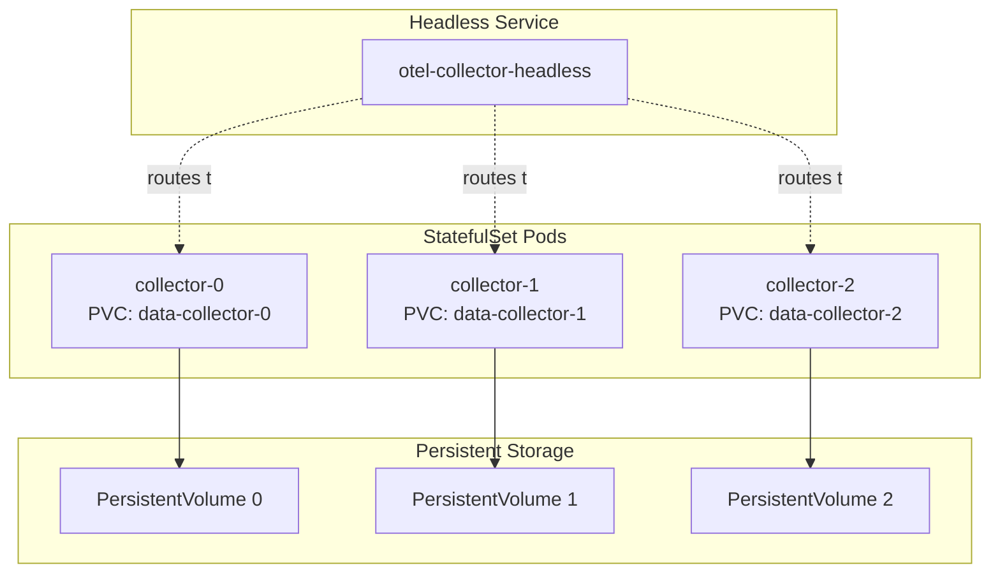

# How to Deploy the OpenTelemetry Collector as a StatefulSet in Kubernetes

Author: [nawazdhandala](https://www.github.com/nawazdhandala)

Tags: OpenTelemetry, Collector, Kubernetes, StatefulSet, Deployment, Persistent Storage, Prometheus

Description: Deploy OpenTelemetry Collectors as StatefulSets for stable network identities, persistent storage, and predictable scaling in Kubernetes environments.

While Deployments work well for stateless collectors, certain use cases require stable network identities and persistent storage. StatefulSets provide these guarantees, making them ideal for collectors performing Prometheus scraping, maintaining local state, or requiring predictable pod names for external references.

## When to Use StatefulSets for Collectors

StatefulSets offer unique characteristics that benefit specific collector deployment patterns:

**Stable Network Identities**: Each pod receives a predictable DNS name (collector-0, collector-1, collector-2) that persists across restarts. This enables external systems to target specific collector instances.

**Persistent Storage**: Collectors can maintain state across restarts using PersistentVolumeClaims (PVCs). This is crucial for Write-Ahead Logs (WAL), local caching, or maintaining scrape position.

**Ordered Deployment and Scaling**: Pods are created and terminated in a predictable order, enabling controlled rollouts and graceful shutdowns.

**Stateful Applications**: When collectors act as Prometheus scrape targets or maintain internal state, StatefulSets prevent data duplication and ensure consistency.

Common scenarios requiring StatefulSets:

- Prometheus-style scraping with persistent WAL storage
- Collectors maintaining local state or caches
- Target allocation across specific collector instances
- Workloads requiring stable pod identities for configuration



## Basic StatefulSet Configuration

Here's a complete StatefulSet deployment for OpenTelemetry Collectors:

```yaml
# collector-statefulset.yaml
# Deploy collectors with stable identities and persistent storage
apiVersion: v1
kind: Namespace
metadata:
  name: observability
---
# ServiceAccount for collector permissions
apiVersion: v1
kind: ServiceAccount
metadata:
  name: otel-collector
  namespace: observability
---
# ClusterRole for accessing Kubernetes API
apiVersion: rbac.authorization.k8s.io/v1
kind: ClusterRole
metadata:
  name: otel-collector
rules:
  # Required for k8sattributes processor
  - apiGroups: [""]
    resources: ["pods", "namespaces", "nodes"]
    verbs: ["get", "watch", "list"]
  # Required for service discovery
  - apiGroups: [""]
    resources: ["services", "endpoints"]
    verbs: ["get", "watch", "list"]
  # Required for scraping metrics
  - apiGroups: [""]
    resources: ["nodes/metrics", "nodes/stats"]
    verbs: ["get"]
---
apiVersion: rbac.authorization.k8s.io/v1
kind: ClusterRoleBinding
metadata:
  name: otel-collector
roleRef:
  apiGroup: rbac.authorization.k8s.io
  kind: ClusterRole
  name: otel-collector
subjects:
  - kind: ServiceAccount
    name: otel-collector
    namespace: observability
---
# ConfigMap with collector configuration
apiVersion: v1
kind: ConfigMap
metadata:
  name: otel-collector-config
  namespace: observability
data:
  collector.yaml: |
    receivers:
      # Receive OTLP telemetry
      otlp:
        protocols:
          grpc:
            endpoint: 0.0.0.0:4317
          http:
            endpoint: 0.0.0.0:4318

      # Prometheus receiver for scraping metrics
      prometheus:
        config:
          scrape_configs:
            # Scrape the collector's own metrics
            - job_name: 'otel-collector'
              scrape_interval: 30s
              static_configs:
                - targets: ['localhost:8888']

            # Scrape Kubernetes pods with annotations
            - job_name: 'kubernetes-pods'
              kubernetes_sd_configs:
                - role: pod
              relabel_configs:
                # Only scrape pods with prometheus.io/scrape annotation
                - source_labels: [__meta_kubernetes_pod_annotation_prometheus_io_scrape]
                  action: keep
                  regex: true
                # Use custom scrape port if specified
                - source_labels: [__meta_kubernetes_pod_annotation_prometheus_io_port]
                  action: replace
                  target_label: __address__
                  regex: (.+)
                  replacement: $1
                # Use custom metrics path if specified
                - source_labels: [__meta_kubernetes_pod_annotation_prometheus_io_path]
                  action: replace
                  target_label: __metrics_path__
                  regex: (.+)

    processors:
      # Limit memory usage
      memory_limiter:
        check_interval: 1s
        limit_mib: 1536
        spike_limit_mib: 512

      # Batch telemetry for efficiency
      batch:
        timeout: 10s
        send_batch_size: 8192

      # Add resource attributes
      resource:
        attributes:
          - key: collector.name
            value: ${POD_NAME}
            action: insert
          - key: collector.namespace
            value: ${POD_NAMESPACE}
            action: insert
          - key: deployment.environment
            value: production
            action: insert

      # Detect Kubernetes attributes
      k8sattributes:
        auth_type: serviceAccount
        passthrough: false
        extract:
          metadata:
            - k8s.pod.name
            - k8s.pod.uid
            - k8s.deployment.name
            - k8s.namespace.name
            - k8s.node.name

    exporters:
      # Export to Prometheus Remote Write
      prometheusremotewrite:
        endpoint: https://prometheus.example.com/api/v1/write
        headers:
          Authorization: Bearer ${PROM_BEARER_TOKEN}
        retry_on_failure:
          enabled: true
          initial_interval: 5s
          max_interval: 30s
          max_elapsed_time: 300s

      # Export traces via OTLP
      otlp:
        endpoint: jaeger.example.com:4317
        tls:
          insecure: false
        retry_on_failure:
          enabled: true

      # Export to file for persistence (uses persistent volume)
      file:
        path: /data/telemetry.json
        rotation:
          max_megabytes: 100
          max_days: 7
          max_backups: 3

      # Debug logging
      logging:
        verbosity: normal

    extensions:
      # Health check endpoint
      health_check:
        endpoint: 0.0.0.0:13133

      # Prometheus metrics endpoint
      pprof:
        endpoint: 0.0.0.0:1777

      # File storage for persistent queue
      file_storage:
        directory: /data/storage
        timeout: 10s

    service:
      extensions: [health_check, pprof, file_storage]

      pipelines:
        traces:
          receivers: [otlp]
          processors: [memory_limiter, k8sattributes, resource, batch]
          exporters: [otlp, logging]

        metrics:
          receivers: [otlp, prometheus]
          processors: [memory_limiter, resource, batch]
          exporters: [prometheusremotewrite, file, logging]

      telemetry:
        logs:
          level: info
        metrics:
          address: 0.0.0.0:8888
---
# Headless Service for stable network identities
apiVersion: v1
kind: Service
metadata:
  name: otel-collector-headless
  namespace: observability
spec:
  clusterIP: None
  selector:
    app: otel-collector
  ports:
    - name: otlp-grpc
      port: 4317
      targetPort: 4317
    - name: otlp-http
      port: 4318
      targetPort: 4318
    - name: metrics
      port: 8888
      targetPort: 8888
---
# Regular Service for load-balanced access
apiVersion: v1
kind: Service
metadata:
  name: otel-collector
  namespace: observability
spec:
  selector:
    app: otel-collector
  ports:
    - name: otlp-grpc
      port: 4317
      targetPort: 4317
    - name: otlp-http
      port: 4318
      targetPort: 4318
    - name: metrics
      port: 8888
      targetPort: 8888
    - name: health
      port: 13133
      targetPort: 13133
  type: ClusterIP
---
# StatefulSet for collector deployment
apiVersion: apps/v1
kind: StatefulSet
metadata:
  name: otel-collector
  namespace: observability
spec:
  serviceName: otel-collector-headless
  replicas: 3

  # Pod Management Policy controls creation/deletion order
  # Parallel: All pods created/deleted simultaneously
  # OrderedReady: Pods created/deleted one at a time in order
  podManagementPolicy: Parallel

  selector:
    matchLabels:
      app: otel-collector

  template:
    metadata:
      labels:
        app: otel-collector
      annotations:
        # Trigger rolling restart on config changes
        checksum/config: "${CONFIG_CHECKSUM}"
    spec:
      serviceAccountName: otel-collector

      # Init container to prepare storage directories
      initContainers:
        - name: init-storage
          image: busybox:1.36
          command:
            - sh
            - -c
            - |
              mkdir -p /data/storage
              chmod -R 777 /data
          volumeMounts:
            - name: data
              mountPath: /data

      containers:
        - name: otel-collector
          image: otel/opentelemetry-collector-contrib:0.93.0
          args:
            - --config=/conf/collector.yaml

          # Environment variables
          env:
            - name: POD_NAME
              valueFrom:
                fieldRef:
                  fieldPath: metadata.name
            - name: POD_NAMESPACE
              valueFrom:
                fieldRef:
                  fieldPath: metadata.namespace
            - name: PROM_BEARER_TOKEN
              valueFrom:
                secretKeyRef:
                  name: backend-credentials
                  key: prometheus-token
            # Use pod name as collector ID
            - name: OTEL_RESOURCE_ATTRIBUTES
              value: "service.instance.id=$(POD_NAME)"

          # Resource limits
          resources:
            requests:
              memory: 512Mi
              cpu: 500m
            limits:
              memory: 2Gi
              cpu: 2000m

          # Ports
          ports:
            - name: otlp-grpc
              containerPort: 4317
              protocol: TCP
            - name: otlp-http
              containerPort: 4318
              protocol: TCP
            - name: metrics
              containerPort: 8888
              protocol: TCP
            - name: health
              containerPort: 13133
              protocol: TCP

          # Volume mounts
          volumeMounts:
            - name: config
              mountPath: /conf
            - name: data
              mountPath: /data

          # Liveness probe
          livenessProbe:
            httpGet:
              path: /
              port: 13133
            initialDelaySeconds: 30
            periodSeconds: 10
            timeoutSeconds: 5
            failureThreshold: 3

          # Readiness probe
          readinessProbe:
            httpGet:
              path: /
              port: 13133
            initialDelaySeconds: 10
            periodSeconds: 5
            timeoutSeconds: 3
            failureThreshold: 3

      # Volumes
      volumes:
        - name: config
          configMap:
            name: otel-collector-config

  # Volume claim templates for persistent storage
  volumeClaimTemplates:
    - metadata:
        name: data
      spec:
        accessModes: ["ReadWriteOnce"]
        storageClassName: standard
        resources:
          requests:
            storage: 10Gi
```

Deploy the StatefulSet:

```bash
# Apply the configuration
kubectl apply -f collector-statefulset.yaml

# Verify StatefulSet creation
kubectl get statefulset -n observability otel-collector

# Check pods are created in order
kubectl get pods -n observability -l app=otel-collector -w

# Verify PVCs are created
kubectl get pvc -n observability

# Check individual pod DNS names
kubectl run -it --rm debug --image=busybox --restart=Never -- \
  nslookup otel-collector-0.otel-collector-headless.observability.svc.cluster.local
```

## Accessing Individual Collector Instances

StatefulSets provide stable DNS names for each pod:

```bash
# Access specific collector instance
# Format: <statefulset-name>-<ordinal>.<service-name>.<namespace>.svc.cluster.local

# Collector 0
otel-collector-0.otel-collector-headless.observability.svc.cluster.local

# Collector 1
otel-collector-1.otel-collector-headless.observability.svc.cluster.local

# Collector 2
otel-collector-2.otel-collector-headless.observability.svc.cluster.local

# Test access to specific instance
kubectl run -it --rm test --image=curlimages/curl --restart=Never -- \
  curl http://otel-collector-0.otel-collector-headless.observability.svc.cluster.local:8888/metrics
```

This enables:
- External systems to target specific collectors
- Load balancers to distribute based on collector identity
- Monitoring systems to track per-instance metrics

## Configuring Persistent Storage

StatefulSets use PersistentVolumeClaims (PVCs) to provide stable storage:

```yaml
# storage-class.yaml
# Define a StorageClass with appropriate performance characteristics
apiVersion: storage.k8s.io/v1
kind: StorageClass
metadata:
  name: fast-ssd
provisioner: kubernetes.io/aws-ebs
parameters:
  type: gp3
  iops: "3000"
  throughput: "125"
  fsType: ext4
allowVolumeExpansion: true
volumeBindingMode: WaitForFirstConsumer
---
# Update StatefulSet to use the StorageClass
apiVersion: apps/v1
kind: StatefulSet
metadata:
  name: otel-collector
  namespace: observability
spec:
  # ... other configuration ...

  volumeClaimTemplates:
    - metadata:
        name: data
      spec:
        accessModes: ["ReadWriteOnce"]
        storageClassName: fast-ssd
        resources:
          requests:
            storage: 20Gi
```

Storage considerations:

- **Performance**: Use SSD-backed storage for write-heavy workloads
- **Size**: Allocate sufficient space for WAL, queues, and file exports
- **Backup**: Implement regular backups for critical data
- **Expansion**: Enable `allowVolumeExpansion` for growing storage needs

## Scaling StatefulSets

Scaling StatefulSets is predictable and controlled:

```bash
# Scale up (creates new pods in order)
kubectl scale statefulset otel-collector -n observability --replicas=5

# Watch pods being created sequentially
kubectl get pods -n observability -l app=otel-collector -w

# Scale down (removes pods in reverse order)
kubectl scale statefulset otel-collector -n observability --replicas=3

# Pods otel-collector-4 and otel-collector-3 are terminated first
```

For automatic scaling based on metrics:

```yaml
# hpa.yaml
# Horizontal Pod Autoscaler for StatefulSet
apiVersion: autoscaling/v2
kind: HorizontalPodAutoscaler
metadata:
  name: otel-collector-hpa
  namespace: observability
spec:
  scaleTargetRef:
    apiVersion: apps/v1
    kind: StatefulSet
    name: otel-collector
  minReplicas: 3
  maxReplicas: 10
  metrics:
    - type: Resource
      resource:
        name: cpu
        target:
          type: Utilization
          averageUtilization: 70
    - type: Resource
      resource:
        name: memory
        target:
          type: Utilization
          averageUtilization: 80
    # Custom metric based on queue size
    - type: Pods
      pods:
        metric:
          name: otelcol_exporter_queue_size
        target:
          type: AverageValue
          averageValue: "1000"
  behavior:
    scaleDown:
      stabilizationWindowSeconds: 300
      policies:
        - type: Percent
          value: 50
          periodSeconds: 60
    scaleUp:
      stabilizationWindowSeconds: 60
      policies:
        - type: Percent
          value: 100
          periodSeconds: 30
```

## Rolling Updates and Version Management

StatefulSets support controlled rolling updates:

```yaml
# Update strategy configuration
apiVersion: apps/v1
kind: StatefulSet
metadata:
  name: otel-collector
  namespace: observability
spec:
  updateStrategy:
    type: RollingUpdate
    rollingUpdate:
      # Update one pod at a time
      partition: 0
      # Maximum unavailable pods during update
      maxUnavailable: 1
```

Perform a rolling update:

```bash
# Update collector image
kubectl set image statefulset/otel-collector \
  otel-collector=otel/opentelemetry-collector-contrib:0.94.0 \
  -n observability

# Watch rollout progress
kubectl rollout status statefulset/otel-collector -n observability

# Check rollout history
kubectl rollout history statefulset/otel-collector -n observability

# Rollback if needed
kubectl rollout undo statefulset/otel-collector -n observability
```

For canary updates using partition:

```bash
# Update only pods >= partition number
kubectl patch statefulset otel-collector -n observability \
  -p '{"spec":{"updateStrategy":{"rollingUpdate":{"partition":2}}}}'

# This updates only otel-collector-2, otel-collector-3, etc.
# otel-collector-0 and otel-collector-1 remain on old version

# Verify canary pods work correctly, then complete rollout
kubectl patch statefulset otel-collector -n observability \
  -p '{"spec":{"updateStrategy":{"rollingUpdate":{"partition":0}}}}'
```

## StatefulSet with Target Allocator

Combine StatefulSets with Target Allocator for efficient Prometheus scraping:

```yaml
# target-allocator.yaml
# Deploy Target Allocator to distribute scrape targets
apiVersion: v1
kind: ConfigMap
metadata:
  name: target-allocator-config
  namespace: observability
data:
  targetallocator.yaml: |
    label_selector:
      app: otel-collector
    config:
      scrape_configs:
        - job_name: 'kubernetes-pods'
          kubernetes_sd_configs:
            - role: pod
---
apiVersion: apps/v1
kind: Deployment
metadata:
  name: target-allocator
  namespace: observability
spec:
  replicas: 1
  selector:
    matchLabels:
      app: target-allocator
  template:
    metadata:
      labels:
        app: target-allocator
    spec:
      serviceAccountName: otel-collector
      containers:
        - name: target-allocator
          image: ghcr.io/open-telemetry/opentelemetry-operator/target-allocator:0.93.0
          args:
            - --config=/conf/targetallocator.yaml
          volumeMounts:
            - name: config
              mountPath: /conf
          ports:
            - name: http
              containerPort: 80
      volumes:
        - name: config
          configMap:
            name: target-allocator-config
---
apiVersion: v1
kind: Service
metadata:
  name: target-allocator
  namespace: observability
spec:
  selector:
    app: target-allocator
  ports:
    - port: 80
      targetPort: 80
```

Update collector configuration to use Target Allocator:

```yaml
receivers:
  prometheus:
    config:
      scrape_configs: []
    target_allocator:
      endpoint: http://target-allocator.observability.svc.cluster.local
      interval: 30s
      collector_id: ${POD_NAME}
```

## Monitoring StatefulSet Health

Monitor StatefulSet-specific metrics:

```bash
# Check StatefulSet status
kubectl describe statefulset otel-collector -n observability

# View pod events
kubectl get events -n observability --field-selector involvedObject.name=otel-collector-0

# Check PVC status
kubectl describe pvc data-otel-collector-0 -n observability

# Monitor persistent volume usage
kubectl exec -n observability otel-collector-0 -- df -h /data

# View collector logs from specific instance
kubectl logs -n observability otel-collector-0 -f

# Access metrics from specific collector
kubectl port-forward -n observability otel-collector-1 8888:8888
curl http://localhost:8888/metrics
```

Key metrics to monitor:

- `kube_statefulset_status_replicas_ready`: Number of ready replicas
- `kube_statefulset_status_replicas_current`: Current number of replicas
- `kube_persistentvolumeclaim_status_phase`: PVC health status
- `kubelet_volume_stats_used_bytes`: Storage usage per volume

## Backup and Disaster Recovery

Implement backup strategies for persistent data:

```yaml
# backup-cronjob.yaml
# Periodic backup of collector data
apiVersion: batch/v1
kind: CronJob
metadata:
  name: otel-collector-backup
  namespace: observability
spec:
  schedule: "0 2 * * *"
  jobTemplate:
    spec:
      template:
        spec:
          containers:
            - name: backup
              image: alpine:3.18
              command:
                - sh
                - -c
                - |
                  apk add --no-cache rsync
                  for i in 0 1 2; do
                    POD="otel-collector-$i"
                    kubectl cp observability/$POD:/data /backup/$POD-$(date +%Y%m%d)
                  done
              volumeMounts:
                - name: backup-storage
                  mountPath: /backup
          restartPolicy: OnFailure
          volumes:
            - name: backup-storage
              persistentVolumeClaim:
                claimName: backup-pvc
```

## When to Choose StatefulSet vs Deployment

Choose StatefulSets when you need:

- Stable, unique network identifiers for each pod
- Persistent storage that survives pod rescheduling
- Ordered, graceful deployment and scaling
- Specific pod identity for external configuration

Choose Deployments when you need:

- Stateless collectors that don't require persistence
- Maximum flexibility in pod scheduling
- Faster rollouts without ordering constraints
- Simple load balancing without instance targeting

## Related Resources

For additional deployment patterns, see:

- [How to Deploy the OpenTelemetry Collector with the Kubernetes Operator](https://oneuptime.com/blog/post/deploy-opentelemetry-collector-kubernetes-operator/view)
- [How to Set Up a Two-Tier Collector Architecture (Agent + Gateway)](https://oneuptime.com/blog/post/two-tier-collector-architecture-agent-gateway/view)

StatefulSets provide essential guarantees for collectors requiring persistent state, stable identities, and ordered scaling. They're the right choice for Prometheus-style scraping, data persistence, and workloads where pod identity matters.
