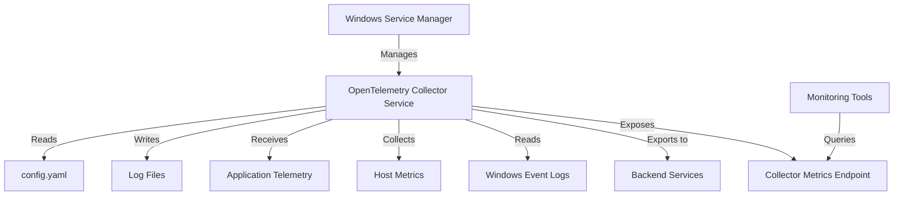

# How to Deploy the OpenTelemetry Collector on Windows as a Service

Author: [nawazdhandala](https://www.github.com/nawazdhandala)

Tags: OpenTelemetry, Collector, Windows, Deployment, Service, Observability, Monitoring

Description: A practical guide to deploying the OpenTelemetry Collector as a Windows service with automatic startup, configuration management, and troubleshooting techniques.

Running the OpenTelemetry Collector as a Windows service ensures your telemetry pipeline starts automatically with the system and runs reliably in production environments. This guide walks through the complete setup process, from installation to service configuration and monitoring.

## Prerequisites

Before deploying the OpenTelemetry Collector as a Windows service, ensure you have:

- Windows Server 2016 or later (or Windows 10/11 for testing)
- Administrative access to the system
- PowerShell 5.1 or later
- Basic understanding of Windows services

## Download and Install the Collector

First, download the OpenTelemetry Collector binary for Windows. The OpenTelemetry project provides pre-built binaries for each release.

```powershell
# Create installation directory
New-Item -ItemType Directory -Path "C:\Program Files\OpenTelemetry Collector" -Force

# Download the latest Collector binary (replace version as needed)
$version = "0.95.0"
$url = "https://github.com/open-telemetry/opentelemetry-collector-releases/releases/download/v$version/otelcol_$version_windows_amd64.tar.gz"
$outputPath = "$env:TEMP\otelcol.tar.gz"

Invoke-WebRequest -Uri $url -OutFile $outputPath

# Extract the binary
tar -xzf $outputPath -C "C:\Program Files\OpenTelemetry Collector"

# Verify installation
& "C:\Program Files\OpenTelemetry Collector\otelcol.exe" --version
```

## Create the Collector Configuration

Create a configuration file that defines how the Collector receives, processes, and exports telemetry data. Place this file in the installation directory.

```yaml
# C:\Program Files\OpenTelemetry Collector\config.yaml

# Receivers define how telemetry data enters the Collector
receivers:
  # OTLP receiver for native OpenTelemetry protocol over gRPC and HTTP
  otlp:
    protocols:
      grpc:
        endpoint: 0.0.0.0:4317
      http:
        endpoint: 0.0.0.0:4318

  # Host metrics receiver to collect system metrics
  hostmetrics:
    collection_interval: 30s
    scrapers:
      cpu:
      memory:
      disk:
      network:
      process:

  # Windows Event Log receiver for system logs
  windowseventlog:
    channel: Application
    max_reads: 100
    start_at: end

# Processors transform and enrich telemetry data
processors:
  # Batch processor groups data before export for efficiency
  batch:
    timeout: 10s
    send_batch_size: 1024
    send_batch_max_size: 2048

  # Memory limiter prevents out-of-memory issues
  memory_limiter:
    check_interval: 1s
    limit_mib: 512
    spike_limit_mib: 128

  # Resource processor adds identifying attributes
  resource:
    attributes:
      - key: service.name
        value: otel-collector-windows
        action: upsert
      - key: host.name
        from_attribute: host.name
        action: upsert

# Exporters send telemetry data to backends
exporters:
  # OTLP exporter sends to OpenTelemetry-compatible backends
  otlp:
    endpoint: your-backend:4317
    tls:
      insecure: false
      cert_file: C:\Program Files\OpenTelemetry Collector\certs\client.crt
      key_file: C:\Program Files\OpenTelemetry Collector\certs\client.key

  # Logging exporter for debugging (disable in production)
  logging:
    loglevel: info

# Service section defines the telemetry pipeline
service:
  # Pipelines connect receivers, processors, and exporters
  pipelines:
    # Traces pipeline
    traces:
      receivers: [otlp]
      processors: [memory_limiter, batch, resource]
      exporters: [otlp, logging]

    # Metrics pipeline
    metrics:
      receivers: [otlp, hostmetrics]
      processors: [memory_limiter, batch, resource]
      exporters: [otlp, logging]

    # Logs pipeline
    logs:
      receivers: [otlp, windowseventlog]
      processors: [memory_limiter, batch, resource]
      exporters: [otlp, logging]

  # Telemetry configuration for the Collector itself
  telemetry:
    logs:
      level: info
      output_paths:
        - C:\Program Files\OpenTelemetry Collector\logs\collector.log
    metrics:
      level: detailed
      address: localhost:8888
```

## Configure the Windows Service

Windows services are managed through the Service Control Manager (SCM). Use the `sc` command or PowerShell to create and configure the service.

### Create the Service Using sc Command

```powershell
# Create the service
sc.exe create OpenTelemetryCollector `
  binPath= "C:\Program Files\OpenTelemetry Collector\otelcol.exe --config=C:\Program Files\OpenTelemetry Collector\config.yaml" `
  DisplayName= "OpenTelemetry Collector" `
  start= auto `
  obj= "NT AUTHORITY\LocalService"

# Set service description
sc.exe description OpenTelemetryCollector "Collects and exports telemetry data for observability"

# Configure service recovery options for automatic restart on failure
sc.exe failure OpenTelemetryCollector reset= 86400 actions= restart/60000/restart/60000/restart/60000
```

### Alternative: Use NSSM (Non-Sucking Service Manager)

NSSM is a service management tool that provides better control over Windows services, including log redirection and easier configuration.

```powershell
# Download and install NSSM
$nssmVersion = "2.24"
$nssmUrl = "https://nssm.cc/release/nssm-$nssmVersion.zip"
$nssmZip = "$env:TEMP\nssm.zip"

Invoke-WebRequest -Uri $nssmUrl -OutFile $nssmZip
Expand-Archive -Path $nssmZip -DestinationPath "$env:TEMP\nssm"

# Copy NSSM to Program Files
Copy-Item "$env:TEMP\nssm\nssm-$nssmVersion\win64\nssm.exe" -Destination "C:\Program Files\OpenTelemetry Collector\"

# Install the service using NSSM
& "C:\Program Files\OpenTelemetry Collector\nssm.exe" install OpenTelemetryCollector "C:\Program Files\OpenTelemetry Collector\otelcol.exe"

# Configure service parameters
& "C:\Program Files\OpenTelemetry Collector\nssm.exe" set OpenTelemetryCollector AppParameters "--config=C:\Program Files\OpenTelemetry Collector\config.yaml"
& "C:\Program Files\OpenTelemetry Collector\nssm.exe" set OpenTelemetryCollector AppDirectory "C:\Program Files\OpenTelemetry Collector"
& "C:\Program Files\OpenTelemetry Collector\nssm.exe" set OpenTelemetryCollector DisplayName "OpenTelemetry Collector"
& "C:\Program Files\OpenTelemetry Collector\nssm.exe" set OpenTelemetryCollector Description "Collects and exports telemetry data for observability"
& "C:\Program Files\OpenTelemetry Collector\nssm.exe" set OpenTelemetryCollector Start SERVICE_AUTO_START

# Configure log redirection
& "C:\Program Files\OpenTelemetry Collector\nssm.exe" set OpenTelemetryCollector AppStdout "C:\Program Files\OpenTelemetry Collector\logs\stdout.log"
& "C:\Program Files\OpenTelemetry Collector\nssm.exe" set OpenTelemetryCollector AppStderr "C:\Program Files\OpenTelemetry Collector\logs\stderr.log"
```

## Set File Permissions

Ensure the service account has appropriate permissions to read the configuration and write logs.

```powershell
# Create logs directory
New-Item -ItemType Directory -Path "C:\Program Files\OpenTelemetry Collector\logs" -Force

# Grant permissions to the service account (LocalService in this example)
$acl = Get-Acl "C:\Program Files\OpenTelemetry Collector"
$accessRule = New-Object System.Security.AccessControl.FileSystemAccessRule("NT AUTHORITY\LocalService", "ReadAndExecute", "ContainerInherit,ObjectInherit", "None", "Allow")
$acl.SetAccessRule($accessRule)
Set-Acl "C:\Program Files\OpenTelemetry Collector" $acl

# Grant write permissions for logs directory
$logAcl = Get-Acl "C:\Program Files\OpenTelemetry Collector\logs"
$logAccessRule = New-Object System.Security.AccessControl.FileSystemAccessRule("NT AUTHORITY\LocalService", "Modify", "ContainerInherit,ObjectInherit", "None", "Allow")
$logAcl.SetAccessRule($logAccessRule)
Set-Acl "C:\Program Files\OpenTelemetry Collector\logs" $logAcl
```

## Start and Manage the Service

Use standard Windows service management commands to control the Collector service.

```powershell
# Start the service
Start-Service -Name OpenTelemetryCollector

# Check service status
Get-Service -Name OpenTelemetryCollector

# Stop the service
Stop-Service -Name OpenTelemetryCollector

# Restart the service
Restart-Service -Name OpenTelemetryCollector

# View service details
Get-Service -Name OpenTelemetryCollector | Select-Object *
```

## Monitor Service Health

Monitor the Collector service to ensure it runs correctly and processes telemetry data.

### Check Windows Event Logs

```powershell
# View recent service events
Get-EventLog -LogName System -Source "Service Control Manager" -Newest 20 | Where-Object { $_.Message -like "*OpenTelemetry*" }
```

### Monitor Collector Metrics

The Collector exposes its own metrics for monitoring. Access them via the metrics endpoint configured in the telemetry section.

```powershell
# Query Collector metrics
Invoke-WebRequest -Uri "http://localhost:8888/metrics"
```

### View Collector Logs

```powershell
# Tail the Collector log file
Get-Content "C:\Program Files\OpenTelemetry Collector\logs\collector.log" -Tail 50 -Wait
```

## Service Architecture Diagram



## Troubleshooting Common Issues

### Service Fails to Start

Check the Windows Event Log for error messages.

```powershell
Get-EventLog -LogName System -Source "Service Control Manager" -Newest 10 | Where-Object { $_.EntryType -eq "Error" -and $_.Message -like "*OpenTelemetry*" }
```

Common causes:
- Invalid configuration file syntax
- Missing or incorrect file paths
- Insufficient permissions
- Port conflicts (check if ports 4317, 4318, or 8888 are already in use)

### Configuration Validation

Test the configuration before deploying to production.

```powershell
# Validate configuration syntax
& "C:\Program Files\OpenTelemetry Collector\otelcol.exe" validate --config="C:\Program Files\OpenTelemetry Collector\config.yaml"
```

### Service Crashes After Starting

Check the Collector logs for errors.

```powershell
Get-Content "C:\Program Files\OpenTelemetry Collector\logs\collector.log" | Select-String -Pattern "error|fatal" -Context 2,2
```

Common causes:
- Memory limits too restrictive
- Backend connection failures
- Invalid receiver configurations

## Updating the Collector

To update the Collector to a new version:

```powershell
# Stop the service
Stop-Service -Name OpenTelemetryCollector

# Backup current installation
Copy-Item "C:\Program Files\OpenTelemetry Collector\otelcol.exe" -Destination "C:\Program Files\OpenTelemetry Collector\otelcol.exe.backup"

# Download and extract new version
$version = "0.96.0"
$url = "https://github.com/open-telemetry/opentelemetry-collector-releases/releases/download/v$version/otelcol_$version_windows_amd64.tar.gz"
Invoke-WebRequest -Uri $url -OutFile "$env:TEMP\otelcol.tar.gz"
tar -xzf "$env:TEMP\otelcol.tar.gz" -C "C:\Program Files\OpenTelemetry Collector"

# Start the service
Start-Service -Name OpenTelemetryCollector

# Verify the new version
& "C:\Program Files\OpenTelemetry Collector\otelcol.exe" --version
```

## Uninstalling the Service

If you need to remove the service:

```powershell
# Stop the service
Stop-Service -Name OpenTelemetryCollector

# Remove the service
sc.exe delete OpenTelemetryCollector

# Or if using NSSM
& "C:\Program Files\OpenTelemetry Collector\nssm.exe" remove OpenTelemetryCollector confirm

# Optionally, remove installation directory
Remove-Item "C:\Program Files\OpenTelemetry Collector" -Recurse -Force
```

## Production Best Practices

When deploying the OpenTelemetry Collector in production Windows environments:

1. **Use a dedicated service account** with minimal required permissions instead of LocalService for better security
2. **Configure log rotation** to prevent disk space issues
3. **Set up monitoring alerts** for service health and Collector metrics
4. **Test configuration changes** in a development environment before production
5. **Document your configuration** including backend endpoints and security settings
6. **Regular updates** to patch security vulnerabilities and gain new features
7. **Backup configurations** before making changes
8. **Use secure credential storage** for API keys and certificates

For more advanced configurations, explore building custom Collector distributions at https://oneuptime.com/blog/post/2026-02-06-build-custom-opentelemetry-collector-distribution-ocb/view.

## Conclusion

Running the OpenTelemetry Collector as a Windows service provides a reliable foundation for your observability pipeline. With automatic startup, recovery mechanisms, and proper monitoring, your telemetry collection infrastructure remains robust and maintainable. The configuration and deployment patterns shown here work across development, staging, and production environments, ensuring consistent telemetry collection across your Windows infrastructure.
