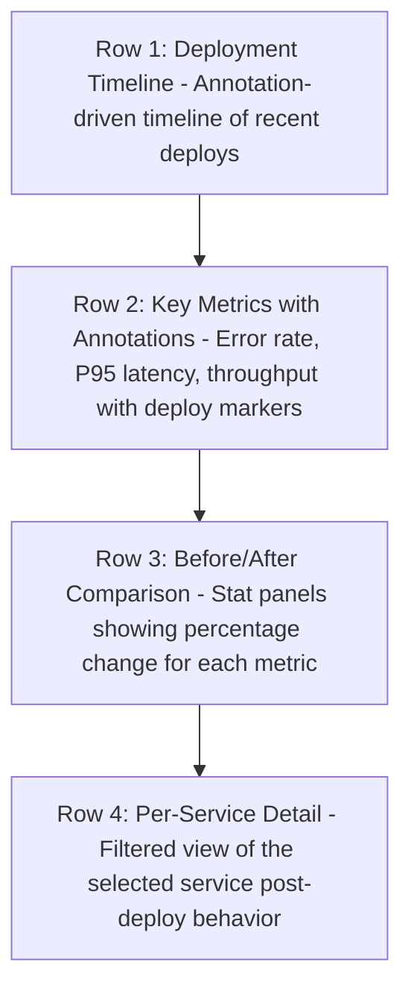

# How to Build a Deployment Impact Dashboard That Overlays Releases on OpenTelemetry Metrics

Author: [nawazdhandala](https://www.github.com/nawazdhandala)

Tags: OpenTelemetry, Deployments, Grafana, Release Tracking

Description: Overlay deployment markers on OpenTelemetry metrics in Grafana to measure the impact of each release on performance.

Every deployment is a potential inflection point. Latency might spike, error rates might climb, or throughput might shift. The challenge is correlating these changes with the exact moment a release happened. Without deployment markers on your dashboards, you are left guessing whether a metric change was caused by a deploy, a traffic pattern, or something else entirely.

This post shows how to record deployment events, annotate your OpenTelemetry metrics dashboards with release markers, and build panels that quantify the before-and-after impact of each deployment.

## Recording Deployment Events

There are two approaches to getting deployment data into your observability stack: push annotations from your CI/CD pipeline, or emit a custom metric at deploy time.

**Approach 1: Grafana Annotations via CI/CD**

The simplest method is to call the Grafana Annotations API from your deployment pipeline.

```yaml
# .github/workflows/deploy.yml (GitHub Actions example)
# This step runs after the deployment succeeds
- name: Annotate Grafana
  run: |
    curl -X POST http://grafana:3000/api/annotations \
      -H "Authorization: Bearer ${{ secrets.GRAFANA_API_KEY }}" \
      -H "Content-Type: application/json" \
      -d '{
        "dashboardUID": "deployment-impact",
        "text": "Deployed ${{ github.repository }}@${{ github.sha }}",
        "tags": [
          "deployment",
          "${{ github.repository }}",
          "${{ github.ref_name }}"
        ]
      }'
```

**Approach 2: Deployment Metric via OpenTelemetry**

Alternatively, emit a custom metric from your deployment tooling. This keeps everything in the OpenTelemetry pipeline.

```python
# deploy_tracker.py
# Run this script as part of your deployment process
from opentelemetry import metrics
from opentelemetry.exporter.otlp.proto.grpc.metric_exporter import OTLPMetricExporter
from opentelemetry.sdk.metrics import MeterProvider
from opentelemetry.sdk.metrics.export import PeriodicExportingMetricReader

# Set up the meter provider with OTLP export
exporter = OTLPMetricExporter(endpoint="otel-collector:4317", insecure=True)
reader = PeriodicExportingMetricReader(exporter, export_interval_millis=5000)
provider = MeterProvider(metric_readers=[reader])
metrics.set_meter_provider(provider)

meter = metrics.get_meter("deployment-tracker")

# Counter that increments once per deployment
deploy_counter = meter.create_counter(
    name="deployments.total",
    description="Number of deployments",
    unit="1",
)

def record_deployment(service_name, version, commit_sha):
    """Call this when a deployment completes."""
    deploy_counter.add(1, {
        "service.name": service_name,
        "service.version": version,
        "commit.sha": commit_sha,
    })
```

## Overlaying Deployment Markers in Grafana

In Grafana, annotations appear as vertical lines on time series panels. If you used the Grafana Annotations API (Approach 1), enable the built-in annotations data source on your dashboard.

If you used the metrics approach (Approach 2), create an annotation query from Prometheus:

```promql
# Use this as an annotation query in Grafana
# It fires whenever the deployment counter increments
increase(deployments_total[1m]) > 0
```

Set the annotation to display the `service_name` and `service_version` labels so you can see which service was deployed.

## Before-and-After Comparison Panels

The real value is in quantifying deployment impact. Use Grafana's time shift feature or PromQL offset to compare metrics before and after a deploy.

**Error Rate Change** - Compare error rate in the 30 minutes after deploy vs 30 minutes before:

```promql
# Error rate in the last 30 minutes (post-deploy)
sum(rate(http_server_request_duration_seconds_count{status_code="STATUS_CODE_ERROR"}[30m]))
/
sum(rate(http_server_request_duration_seconds_count[30m]))

# Error rate 30 minutes before that (pre-deploy) using offset
sum(rate(http_server_request_duration_seconds_count{status_code="STATUS_CODE_ERROR"}[30m] offset 30m))
/
sum(rate(http_server_request_duration_seconds_count[30m] offset 30m))
```

**Latency Shift** - P95 latency comparison:

```promql
# Current P95 latency
histogram_quantile(0.95,
  sum by (le) (rate(http_server_request_duration_seconds_bucket[30m]))
)

# P95 latency 30 minutes ago
histogram_quantile(0.95,
  sum by (le) (rate(http_server_request_duration_seconds_bucket[30m] offset 30m))
)
```

**Throughput Change** - Detect if a deploy caused request volume to drop:

```promql
# Requests per second now vs 30 minutes ago
sum(rate(http_server_request_duration_seconds_count[5m]))
/
sum(rate(http_server_request_duration_seconds_count[5m] offset 30m))
```

A value below 1.0 means throughput decreased; above 1.0 means it increased.

## Dashboard Structure



## Automating Deployment Scoring

You can take this further by computing a deployment health score. Use a Grafana recording rule that evaluates key metrics after each deploy and assigns a score.

```yaml
# recording-rules.yaml
groups:
  - name: deployment_health
    interval: 1m
    rules:
      # 1 if error rate is below threshold, 0 otherwise
      - record: deploy:error_rate:healthy
        expr: >
          (
            sum(rate(http_server_request_duration_seconds_count{status_code="STATUS_CODE_ERROR"}[15m]))
            /
            sum(rate(http_server_request_duration_seconds_count[15m]))
          ) < 0.01

      # 1 if P95 latency is below threshold, 0 otherwise
      - record: deploy:latency_p95:healthy
        expr: >
          histogram_quantile(0.95,
            sum by (le) (rate(http_server_request_duration_seconds_bucket[15m]))
          ) < 0.5
```

With deployment annotations layered on top of OpenTelemetry metrics, your dashboard becomes a deployment review tool. Every release gets an implicit scorecard - you can see its effect on latency, errors, and throughput within minutes of it going live. This feedback loop helps teams catch regressions early and build confidence in their release process.
