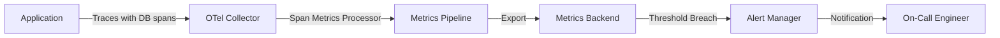
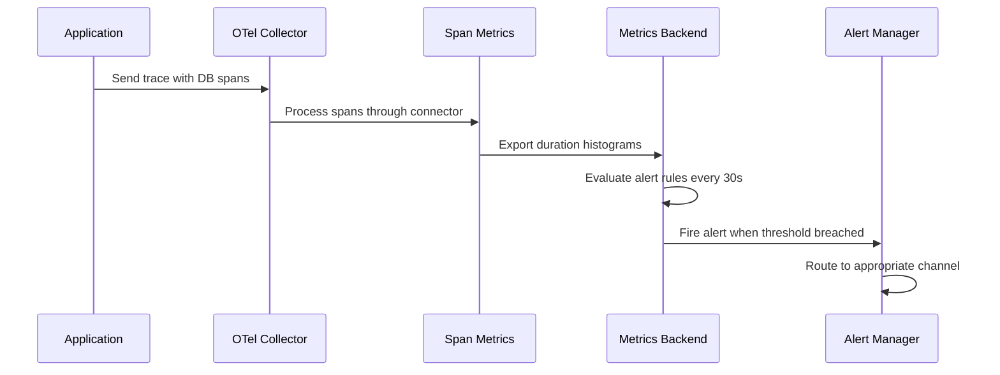

# How to Detect and Alert on Slow SQL Queries Using OpenTelemetry Span Metrics

Author: [nawazdhandala](https://www.github.com/nawazdhandala)

Tags: OpenTelemetry, SQL, Database Monitoring, Span Metrics, Observability, Performance

Description: Learn how to detect slow SQL queries and set up alerts using OpenTelemetry span metrics with practical configuration examples.

---

Slow SQL queries can silently degrade your application's performance. A single unoptimized query running under load can cascade into request timeouts, frustrated users, and on-call pages at 3 AM. The tricky part is catching these problems before they become incidents.

OpenTelemetry gives you the tools to automatically capture database query spans, derive metrics from those spans, and set up alerts that fire when queries start taking too long. In this guide, we will walk through the entire pipeline from instrumentation to alerting.

## How Span Metrics Work

Before diving into configuration, it helps to understand the concept. When your application makes a database call, OpenTelemetry auto-instrumentation creates a span for that operation. Each span carries attributes like the SQL statement, the database system, and most importantly, the duration. The OpenTelemetry Collector can then process these spans and generate histogram metrics from them, giving you percentile-based latency data you can alert on.



## Step 1: Instrument Your Application for Database Spans

Most OpenTelemetry SDKs provide auto-instrumentation libraries for popular database drivers. Here is an example using Python with SQLAlchemy and psycopg2.

First, install the required packages.

```bash
# Install OpenTelemetry SDK and database instrumentation packages
pip install opentelemetry-api \
    opentelemetry-sdk \
    opentelemetry-exporter-otlp \
    opentelemetry-instrumentation-sqlalchemy \
    opentelemetry-instrumentation-psycopg2
```

Now configure auto-instrumentation in your application startup code.

```python
# configure_tracing.py
from opentelemetry import trace
from opentelemetry.sdk.trace import TracerProvider
from opentelemetry.sdk.trace.export import BatchSpanProcessor
from opentelemetry.exporter.otlp.proto.grpc.trace_exporter import OTLPSpanExporter
from opentelemetry.instrumentation.sqlalchemy import SQLAlchemyInstrumentor

# Set up the tracer provider with OTLP export to the collector
provider = TracerProvider()
processor = BatchSpanProcessor(
    OTLPSpanExporter(endpoint="http://otel-collector:4317")
)
provider.add_span_processor(processor)
trace.set_tracer_provider(provider)

# Instrument SQLAlchemy - this will automatically create spans
# for every database query with attributes like db.statement,
# db.system, and db.name
SQLAlchemyInstrumentor().instrument(
    engine=your_engine,
    enable_commenter=True,  # Adds trace context as SQL comments
)
```

With this setup, every query executed through SQLAlchemy will produce a span. The span includes `db.statement` (the SQL text), `db.system` (e.g., "postgresql"), and the duration of the operation.

## Step 2: Configure the Span Metrics Connector in the Collector

The OpenTelemetry Collector has a component called the `spanmetrics` connector that reads spans from the traces pipeline and generates metrics for the metrics pipeline. This is where the magic happens.

Here is a collector configuration that derives latency histograms from database spans.

```yaml
# otel-collector-config.yaml
receivers:
  otlp:
    protocols:
      grpc:
        endpoint: 0.0.0.0:4317
      http:
        endpoint: 0.0.0.0:4318

connectors:
  spanmetrics:
    # Define histogram buckets in milliseconds
    # These buckets are tuned for database queries:
    # fast queries (< 50ms), moderate (50-500ms), slow (500ms-5s), very slow (5s+)
    histogram:
      explicit:
        buckets: [5ms, 10ms, 25ms, 50ms, 100ms, 250ms, 500ms, 1s, 2.5s, 5s, 10s]
    # Include these span attributes as metric dimensions
    # so we can filter and group by database, operation, etc.
    dimensions:
      - name: db.system
      - name: db.name
      - name: db.operation
      - name: db.statement
        default: "unknown"
    # Only process spans that are database client calls
    dimensions_cache_size: 1000
    aggregation_temporality: "AGGREGATION_TEMPORALITY_CUMULATIVE"

processors:
  # Filter to only process database-related spans
  filter/db_spans:
    spans:
      include:
        match_type: strict
        attributes:
          - key: db.system
            # This filter ensures we only generate metrics for DB spans
  batch:
    timeout: 10s
    send_batch_size: 1024

exporters:
  otlp/metrics:
    endpoint: "http://your-metrics-backend:4317"
    tls:
      insecure: true
  otlp/traces:
    endpoint: "http://your-traces-backend:4317"
    tls:
      insecure: true

service:
  pipelines:
    # Traces come in, get processed, exported, AND fed into spanmetrics connector
    traces:
      receivers: [otlp]
      processors: [batch]
      exporters: [otlp/traces, spanmetrics]
    # Spanmetrics connector outputs metrics into this pipeline
    metrics:
      receivers: [spanmetrics]
      processors: [batch]
      exporters: [otlp/metrics]
```

The key piece is the `spanmetrics` connector. It sits at the junction of the traces and metrics pipelines. Traces flow in, and histogram metrics flow out. The `dimensions` list controls which span attributes become metric labels.

## Step 3: Understanding the Generated Metrics

The spanmetrics connector generates several metrics automatically. The most useful ones for slow query detection are:

- `duration_milliseconds_bucket` - A histogram of span durations, broken down by the buckets you defined
- `duration_milliseconds_sum` - The total time spent across all spans
- `duration_milliseconds_count` - The count of spans observed

With these metrics, you can compute percentiles. For example, the p99 latency tells you the worst-case experience for 99% of your queries.

## Step 4: Write Alert Rules for Slow Queries

Now that you have metrics, you can write alerting rules. Here is an example using Prometheus alerting rules (which work with any Prometheus-compatible backend).

```yaml
# alert-rules.yaml
groups:
  - name: slow_sql_alerts
    rules:
      # Alert when the p95 query latency exceeds 500ms over a 5-minute window
      - alert: SlowSQLQueryP95
        expr: |
          histogram_quantile(0.95,
            sum(rate(duration_milliseconds_bucket{
              db_system=~"postgresql|mysql",
              span_kind="SPAN_KIND_CLIENT"
            }[5m])) by (le, db_name, db_operation)
          ) > 500
        for: 5m
        labels:
          severity: warning
        annotations:
          summary: "Slow SQL queries detected on {{ $labels.db_name }}"
          description: >
            The p95 latency for {{ $labels.db_operation }} queries on
            {{ $labels.db_name }} has exceeded 500ms for the last 5 minutes.
            Current value: {{ $value }}ms.

      # Alert when any individual query type exceeds 5 seconds at p99
      - alert: CriticalSlowSQLQuery
        expr: |
          histogram_quantile(0.99,
            sum(rate(duration_milliseconds_bucket{
              db_system=~"postgresql|mysql",
              span_kind="SPAN_KIND_CLIENT"
            }[5m])) by (le, db_name, db_operation, db_statement)
          ) > 5000
        for: 2m
        labels:
          severity: critical
        annotations:
          summary: "Critical slow query on {{ $labels.db_name }}"
          description: >
            A query on {{ $labels.db_name }} is taking over 5 seconds at p99.
            Operation: {{ $labels.db_operation }}
            Statement: {{ $labels.db_statement }}

      # Alert on sudden increase in query volume (possible N+1 query problem)
      - alert: SQLQueryVolumeSpike
        expr: |
          sum(rate(duration_milliseconds_count{
            db_system=~"postgresql|mysql"
          }[5m])) by (db_name, db_operation)
          /
          sum(rate(duration_milliseconds_count{
            db_system=~"postgresql|mysql"
          }[1h])) by (db_name, db_operation)
          > 3
        for: 5m
        labels:
          severity: warning
        annotations:
          summary: "SQL query volume spike on {{ $labels.db_name }}"
          description: >
            The query rate for {{ $labels.db_operation }} on
            {{ $labels.db_name }} has tripled compared to the hourly average.
```

These rules cover three common scenarios. The first catches generally slow queries. The second catches critically slow individual query types. The third detects sudden spikes in query volume, which often indicate N+1 query problems introduced by a recent code change.

## Step 5: Add Contextual Attributes for Better Debugging

When an alert fires, you want enough context to identify the problem quickly. Adding custom attributes to your spans helps with this.

```python
# Adding custom attributes to database spans for richer alerting context
from opentelemetry import trace

def execute_user_query(user_id: str):
    tracer = trace.get_tracer(__name__)
    with tracer.start_as_current_span("fetch_user_profile") as span:
        # Add attributes that help identify the source of slow queries
        span.set_attribute("app.module", "user_service")
        span.set_attribute("app.endpoint", "/api/users/profile")
        span.set_attribute("app.query_purpose", "fetch_user_with_preferences")

        # The actual query execution happens here
        # SQLAlchemy instrumentation will create a child span with db.* attributes
        result = session.query(User).filter_by(id=user_id).first()
        return result
```

These extra attributes flow through the span metrics pipeline and become available as labels in your alert queries.

## Performance Considerations

There are a few things to keep in mind when running this setup in production.

The `db.statement` dimension can create high cardinality if your queries use different literal values. Many instrumentation libraries normalize queries by replacing values with placeholders (e.g., `SELECT * FROM users WHERE id = ?`), but verify this is happening in your setup. High cardinality will increase memory usage in the collector and your metrics backend.

Set the `dimensions_cache_size` in the spanmetrics connector appropriately. Too small and you lose dimensions. Too large and you consume excessive memory.

Consider sampling your traces if you have very high throughput, but be aware that sampling affects the accuracy of your span-derived metrics. For alerting on slow queries specifically, you might want to use tail-based sampling that always keeps slow spans.

```yaml
# Tail-based sampling that preserves slow database spans
processors:
  tail_sampling:
    decision_wait: 10s
    policies:
      # Always keep spans that took longer than 500ms
      - name: slow-queries
        type: latency
        latency:
          threshold_ms: 500
      # Sample 10% of everything else
      - name: baseline
        type: probabilistic
        probabilistic:
          sampling_percentage: 10
```

## Putting It All Together

The workflow from query execution to alert notification looks like this:



With this pipeline in place, you get automatic detection of slow queries without modifying application code beyond the initial instrumentation setup. New queries, new tables, and new services all get monitored automatically as long as they use the instrumented database driver.

The combination of span-derived metrics and trace context gives you the best of both worlds. Metrics tell you something is wrong. Traces tell you exactly where and why.
