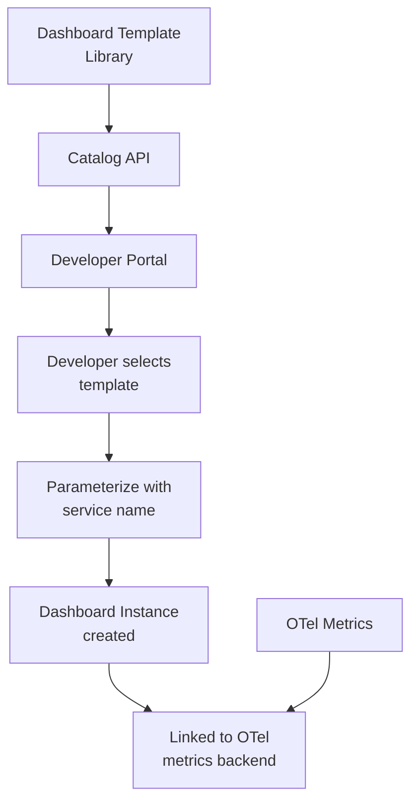

# How to Build a Developer Self-Service Dashboard Catalog Powered by OpenTelemetry

Author: [nawazdhandala](https://www.github.com/nawazdhandala)

Tags: OpenTelemetry, Dashboards, Developer Experience, Self-Service

Description: Build a dashboard catalog that lets developers create, discover, and reuse observability dashboards backed by standardized OpenTelemetry metrics.

Dashboards are one of the most visible outputs of an observability platform, and also one of the biggest sources of waste. Teams build custom dashboards that duplicate each other's work, use inconsistent metric names, and become stale as services evolve. A dashboard catalog fixes this by providing a structured library of templates that teams can instantiate, customize, and share.

When your telemetry is standardized through OpenTelemetry semantic conventions, dashboards become portable. A "HTTP Service Health" template works for any service that emits the standard `http.server.request.duration` metric. This post covers building that catalog system.

## Catalog Architecture



## Defining Dashboard Templates

A template is a dashboard definition with placeholder variables. The most common variable is the service name, but templates can also parameterize environment, team, and SLO thresholds.

```python
# dashboard_templates/models.py
# Data models for dashboard templates and instances.
from dataclasses import dataclass, field
from typing import List, Dict

@dataclass
class PanelDefinition:
    title: str
    panel_type: str  # timeseries, stat, gauge, table
    query_template: str  # Query with ${variable} placeholders
    description: str = ""
    thresholds: List[dict] = None
    unit: str = ""

@dataclass
class DashboardTemplate:
    template_id: str
    name: str
    description: str
    category: str  # "service-health", "infrastructure", "business", "slo"
    required_metrics: List[str]  # OTel metrics this template needs
    variables: List[dict]  # Variables the user must provide
    panels: List[PanelDefinition] = field(default_factory=list)
    tags: List[str] = field(default_factory=list)

@dataclass
class DashboardInstance:
    instance_id: str
    template_id: str
    owner_team: str
    variable_values: Dict[str, str]
    created_by: str
    panels: List[dict] = field(default_factory=list)
```

## Building Core Templates

Here are three essential templates that cover most needs.

The HTTP service health template works for any service using OpenTelemetry HTTP semantic conventions.

```python
# dashboard_templates/http_service_health.py
# Standard HTTP service health dashboard template.
http_service_health = DashboardTemplate(
    template_id="http-service-health-v1",
    name="HTTP Service Health",
    description="Request rate, latency percentiles, error rate, and saturation for HTTP services",
    category="service-health",
    required_metrics=[
        "http.server.request.duration",
        "http.server.active_requests",
    ],
    variables=[
        {"name": "service_name", "label": "Service Name", "required": True},
        {"name": "environment", "label": "Environment", "default": "production"},
    ],
    tags=["http", "golden-signals", "standard"],
    panels=[
        PanelDefinition(
            title="Request Rate",
            panel_type="timeseries",
            query_template=(
                'rate(http_server_request_duration_count'
                '{service_name="${service_name}",'
                'deployment_environment="${environment}"}[5m])'
            ),
            unit="req/s",
            description="HTTP requests per second",
        ),
        PanelDefinition(
            title="Latency P50 / P95 / P99",
            panel_type="timeseries",
            query_template=(
                'histogram_quantile(0.99, rate('
                'http_server_request_duration_bucket'
                '{service_name="${service_name}",'
                'deployment_environment="${environment}"}[5m]))'
            ),
            unit="ms",
            description="Request latency percentiles",
        ),
        PanelDefinition(
            title="Error Rate",
            panel_type="timeseries",
            query_template=(
                'sum(rate(http_server_request_duration_count'
                '{service_name="${service_name}",'
                'http_response_status_code=~"5.."}[5m])) / '
                'sum(rate(http_server_request_duration_count'
                '{service_name="${service_name}"}[5m])) * 100'
            ),
            unit="%",
            description="Percentage of requests returning 5xx",
            thresholds=[
                {"value": 1, "color": "yellow"},
                {"value": 5, "color": "red"},
            ],
        ),
        PanelDefinition(
            title="Active Requests",
            panel_type="gauge",
            query_template=(
                'http_server_active_requests'
                '{service_name="${service_name}",'
                'deployment_environment="${environment}"}'
            ),
            unit="requests",
            description="Currently in-flight requests",
        ),
    ],
)
```

## Catalog API

The catalog API lets developers browse templates, instantiate dashboards, and manage their instances.

```python
# catalog_api.py - Dashboard catalog service
from typing import List, Optional

class DashboardCatalog:
    def __init__(self, template_store, instance_store, dashboard_backend):
        self.templates = template_store
        self.instances = instance_store
        self.backend = dashboard_backend  # Grafana, custom UI, etc.

    def list_templates(self, category: str = None,
                       search: str = None) -> List[DashboardTemplate]:
        """Browse available dashboard templates."""
        templates = self.templates.list_all()

        if category:
            templates = [t for t in templates if t.category == category]

        if search:
            search_lower = search.lower()
            templates = [
                t for t in templates
                if search_lower in t.name.lower()
                or search_lower in t.description.lower()
                or any(search_lower in tag for tag in t.tags)
            ]

        return templates

    def check_readiness(self, template_id: str,
                        service_name: str) -> dict:
        """Check if a service emits the metrics required by a template."""
        template = self.templates.get(template_id)
        results = {}

        for metric in template.required_metrics:
            # Query the backend to see if this metric exists for the service
            exists = self.backend.metric_exists(metric, service_name)
            results[metric] = {
                "exists": exists,
                "status": "ready" if exists else "missing",
            }

        all_ready = all(r["exists"] for r in results.values())
        return {
            "template": template_id,
            "service": service_name,
            "ready": all_ready,
            "metrics": results,
        }

    def create_instance(self, template_id: str, team: str,
                        variables: dict, created_by: str) -> DashboardInstance:
        """Create a dashboard instance from a template."""
        template = self.templates.get(template_id)

        # Validate all required variables are provided
        for var in template.variables:
            if var["required"] and var["name"] not in variables:
                raise ValueError(f"Missing required variable: {var['name']}")

        # Resolve panel queries with variable values
        resolved_panels = []
        for panel in template.panels:
            query = panel.query_template
            for var_name, var_value in variables.items():
                query = query.replace(f"${{{var_name}}}", var_value)

            resolved_panels.append({
                "title": panel.title,
                "type": panel.panel_type,
                "query": query,
                "unit": panel.unit,
                "thresholds": panel.thresholds,
            })

        # Create in the dashboard backend
        dashboard_id = self.backend.create_dashboard(
            title=f"{variables.get('service_name', 'Unknown')} - {template.name}",
            panels=resolved_panels,
            tags=[f"team:{team}", f"template:{template_id}"],
        )

        instance = DashboardInstance(
            instance_id=dashboard_id,
            template_id=template_id,
            owner_team=team,
            variable_values=variables,
            created_by=created_by,
            panels=resolved_panels,
        )

        self.instances.save(instance)
        return instance
```

## Developer CLI for the Catalog

Developers interact with the catalog through a CLI integrated into their workflow.

```bash
# Browse available templates
otel-dashboard list-templates
# Output:
# ID                        | Name                    | Category
# http-service-health-v1    | HTTP Service Health     | service-health
# grpc-service-health-v1    | gRPC Service Health     | service-health
# database-health-v1        | Database Health          | infrastructure
# slo-overview-v1           | SLO Overview            | slo
# kafka-consumer-v1         | Kafka Consumer Health   | infrastructure

# Check if your service is ready for a template
otel-dashboard check-readiness \
  --template http-service-health-v1 \
  --service payment-service
# Output:
# Readiness check for payment-service:
#   http.server.request.duration  -> READY (found)
#   http.server.active_requests   -> MISSING (not found)
#
# 1 of 2 required metrics found. Instrument the missing metrics first.

# Create a dashboard instance
otel-dashboard create \
  --template http-service-health-v1 \
  --team payments \
  --var service_name=payment-service \
  --var environment=production
# Output:
# Dashboard created: https://dashboards.internal/d/abc123
```

## Template Versioning

Templates evolve over time. When you add a new panel or fix a query, existing instances should be upgradeable.

```python
# template_versioning.py - Handle template upgrades
class TemplateUpgrader:
    def __init__(self, catalog: DashboardCatalog):
        self.catalog = catalog

    def find_outdated_instances(self, template_id: str) -> List[DashboardInstance]:
        """Find instances using an older version of a template."""
        current_template = self.catalog.templates.get(template_id)
        all_instances = self.catalog.instances.find_by_template(template_id)

        outdated = []
        for instance in all_instances:
            # Compare panel count and query patterns
            if len(instance.panels) != len(current_template.panels):
                outdated.append(instance)

        return outdated

    def upgrade_instance(self, instance_id: str) -> DashboardInstance:
        """Upgrade an instance to the latest template version."""
        instance = self.catalog.instances.get(instance_id)
        # Re-create using the same variables but the latest template
        return self.catalog.create_instance(
            template_id=instance.template_id,
            team=instance.owner_team,
            variables=instance.variable_values,
            created_by="template-upgrader",
        )
```

## Tracking Dashboard Usage

Instrument the catalog itself with OpenTelemetry to understand which templates are popular and which are unused.

```python
# catalog_metrics.py - Track catalog usage with OTel metrics
from opentelemetry import metrics

meter = metrics.get_meter("dashboard.catalog", version="1.0.0")

template_views = meter.create_counter(
    name="dashboard.catalog.template.views",
    description="Number of times a template was viewed",
    unit="1",
)

dashboard_created = meter.create_counter(
    name="dashboard.catalog.instance.created",
    description="Number of dashboard instances created",
    unit="1",
)

readiness_checks = meter.create_counter(
    name="dashboard.catalog.readiness.checks",
    description="Number of readiness checks performed",
    unit="1",
)
```

## Practical Advice

Start with three to five templates that cover the most common service types in your organization. HTTP services, gRPC services, and queue consumers typically account for the majority of workloads. Resist the urge to build a template for every possible scenario upfront. Let demand drive expansion.

Enforce a rule that every template must have a readiness check. If a developer tries to instantiate a dashboard for a service that does not emit the required metrics, the readiness check tells them exactly what is missing. This prevents the frustrating experience of creating a dashboard full of "no data" panels.

The catalog becomes more valuable as it grows. When one team builds a useful custom dashboard, encourage them to generalize it into a template and contribute it back to the catalog. Over time, the catalog becomes a shared knowledge base of how your organization monitors its systems.
