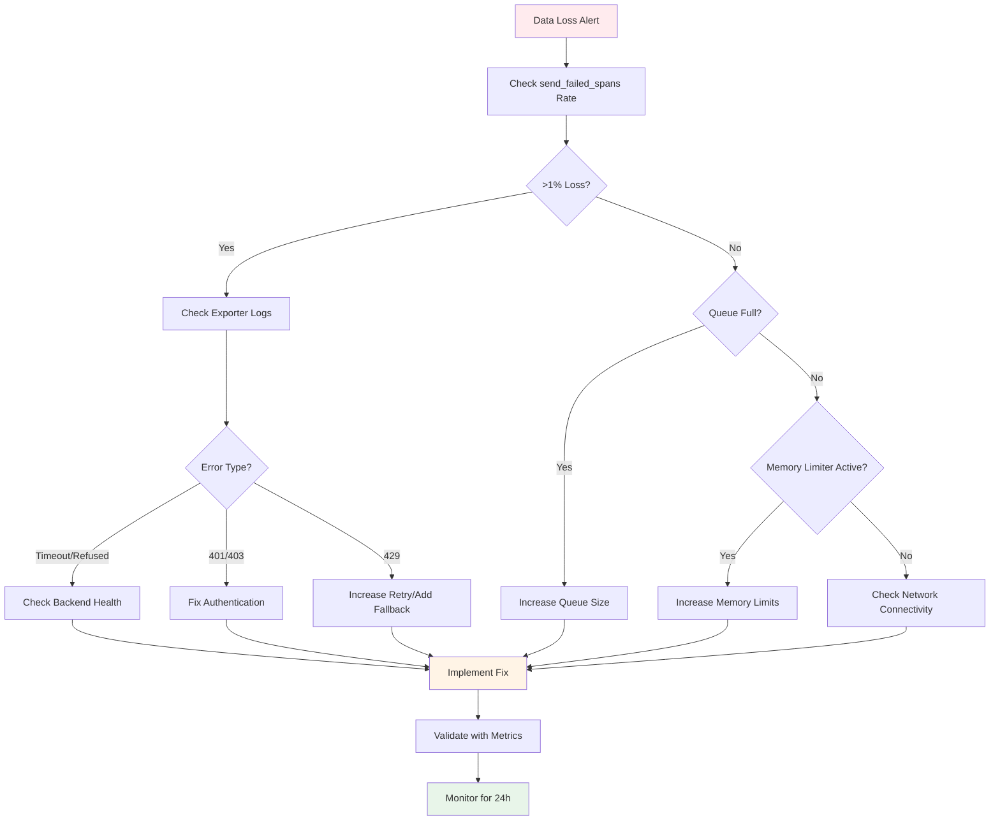

# How to Diagnose Data Loss with otelcol_exporter_send_failed_spans Metrics

Author: [nawazdhandala](https://www.github.com/nawazdhandala)

Tags: OpenTelemetry, Collector, Troubleshooting, Metrics, Data Loss, Observability

Description: Learn how to use otelcol_exporter_send_failed_spans and related metrics to diagnose data loss in OpenTelemetry Collector, identify root causes, and implement fixes to ensure telemetry reliability.

---

Data loss in your observability pipeline is a silent killer. Missing spans mean incomplete traces, which leads to blind spots when troubleshooting production incidents. The OpenTelemetry Collector exposes metrics like `otelcol_exporter_send_failed_spans` that help you detect and diagnose data loss before it impacts your ability to debug issues.

This guide shows you how to interpret these metrics, correlate them with other signals, and systematically identify and fix the root causes of data loss.

---

## Understanding Export Failure Metrics

The Collector exposes several metrics that indicate data loss:

**Primary Metrics:**
- `otelcol_exporter_send_failed_spans` - Spans that failed to export
- `otelcol_exporter_send_failed_metric_points` - Metric points that failed to export
- `otelcol_exporter_send_failed_log_records` - Log records that failed to export

**Supporting Metrics:**
- `otelcol_exporter_enqueue_failed_spans` - Spans rejected due to full queue
- `otelcol_receiver_refused_spans` - Spans refused at receiver (backpressure)
- `otelcol_processor_dropped_spans` - Spans dropped by processors
- `otelcol_exporter_queue_size` - Current queue depth
- `otelcol_exporter_queue_capacity` - Maximum queue capacity

These metrics have labels that help identify the failure point:
- `exporter` - Which exporter failed (e.g., otlphttp, prometheus)
- `service_name` - Which pipeline (traces, metrics, logs)

---

## Enable Internal Metrics Collection

First, ensure you're collecting the Collector's internal metrics:

```yaml
# Configure Collector to export its own metrics
service:
  telemetry:
    # Enable detailed internal metrics
    logs:
      level: info
      # Include initial and sampled debug logs
      development: false
      encoding: json

    metrics:
      # Expose metrics for Prometheus scraping
      address: 0.0.0.0:8888
      level: detailed

      # Also push metrics to your backend
      readers:
        - periodic:
            interval: 60000  # Export every 60 seconds
            exporter:
              otlp:
                protocol: http/protobuf
                endpoint: https://oneuptime.com/otlp
                headers:
                  x-oneuptime-token: ${ONEUPTIME_TOKEN}
                timeout: 30s
```

Verify metrics are exposed:

```bash
# Check metrics endpoint
curl http://localhost:8888/metrics | grep send_failed

# Look for these metrics
# otelcol_exporter_send_failed_spans{exporter="otlphttp",service_name="traces"} 1234
# otelcol_exporter_send_failed_metric_points{exporter="otlphttp",service_name="metrics"} 567
```

---

## Diagnostic Queries

### Calculate Data Loss Percentage

The most important metric is your overall data loss rate:

```promql
# Percentage of spans lost in the last 5 minutes
(
  sum(rate(otelcol_exporter_send_failed_spans[5m]))
  /
  sum(rate(otelcol_receiver_accepted_spans[5m]))
) * 100

# Anything above 0.1% should trigger investigation
# Anything above 1% is critical
```

### Identify Which Exporter Is Failing

```promql
# Show failure rate by exporter
sum by (exporter) (
  rate(otelcol_exporter_send_failed_spans[5m])
)

# Example output:
# {exporter="otlphttp"} 45.2
# {exporter="jaeger"} 0.0
```

### Correlate with Queue Saturation

Often, send failures correlate with queue saturation:

```promql
# Queue utilization percentage by exporter
(
  otelcol_exporter_queue_size
  /
  otelcol_exporter_queue_capacity
) * 100

# If this is near 100% when send_failed increases, queue is the bottleneck
```

### Track Dropped vs Failed

Understand where data is being lost:

```promql
# Data loss by stage
sum by (stage) (
  rate(otelcol_receiver_refused_spans[5m]) or
  rate(otelcol_processor_dropped_spans[5m]) or
  rate(otelcol_exporter_enqueue_failed_spans[5m]) or
  rate(otelcol_exporter_send_failed_spans[5m])
)
```

---

## Common Root Causes

### Cause 1: Backend Unavailable or Slow

When the backend is down, rate-limited, or responding slowly, exports fail.

**Diagnostic Queries:**
```promql
# Export latency (should be <1 second)
histogram_quantile(0.95,
  rate(otelcol_exporter_send_latency_bucket[5m])
) > 1000

# Export timeout rate
rate(otelcol_exporter_send_failed_spans[5m]) > 0
```

**Check Collector Logs:**
```bash
# Look for HTTP errors
kubectl logs -l app=opentelemetry-collector | grep -E "error|failed|timeout"

# Common patterns:
# - "context deadline exceeded" = timeout
# - "connection refused" = backend down
# - "429 Too Many Requests" = rate limiting
# - "401 Unauthorized" = auth failure
```

**Solution - Improve Retry Configuration:**

```yaml
exporters:
  otlphttp:
    endpoint: https://oneuptime.com/otlp
    headers:
      x-oneuptime-token: ${ONEUPTIME_TOKEN}

    # Increase timeout for slow backends
    timeout: 60s

    # Robust retry configuration
    retry_on_failure:
      enabled: true
      # Start with 5 second delay
      initial_interval: 5s
      # Max backoff time
      max_interval: 60s
      # Keep retrying for 10 minutes before giving up
      max_elapsed_time: 600s
      # Exponential backoff multiplier
      multiplier: 2

    # Large queue to buffer during backend issues
    sending_queue:
      enabled: true
      # 100k items = ~200MB memory
      queue_size: 100000
      # More workers for higher throughput
      num_consumers: 20
      # Persist to disk to survive restarts
      storage: file_storage

# Configure persistent storage
extensions:
  file_storage:
    directory: /var/lib/otelcol/queue
    timeout: 10s
    compaction:
      on_start: true
      max_transaction_size: 65536

service:
  extensions: [file_storage]
```

### Cause 2: Queue Overflow

Data arrives faster than it can be exported, queue fills up, new data is rejected.

**Diagnostic Queries:**
```promql
# Enqueue failure rate
rate(otelcol_exporter_enqueue_failed_spans[5m]) > 0

# Queue is full
otelcol_exporter_queue_size >= otelcol_exporter_queue_capacity
```

**Visualize Queue Behavior:**
```promql
# Queue depth over time
otelcol_exporter_queue_size{exporter="otlphttp"}

# If this looks like a sawtooth pattern hitting capacity,
# you need a bigger queue or faster export
```

**Solution - Increase Queue Capacity:**

```yaml
exporters:
  otlphttp:
    endpoint: https://oneuptime.com/otlp
    headers:
      x-oneuptime-token: ${ONEUPTIME_TOKEN}

    sending_queue:
      enabled: true
      # Increase from default 10k to 100k
      # Balance memory usage vs buffering capacity
      queue_size: 100000

      # More consumers = faster export
      # But don't overwhelm the backend
      num_consumers: 30

      # CRITICAL: Use persistent storage
      # Without this, queue is lost on restart
      storage: file_storage

processors:
  # Add batch processor to reduce export frequency
  batch:
    # Larger batches = fewer exports = less queue pressure
    send_batch_size: 16384
    timeout: 10s
    send_batch_max_size: 32768

service:
  pipelines:
    traces:
      receivers: [otlp]
      processors: [batch]  # Batch before export
      exporters: [otlphttp]
```

### Cause 3: Memory Pressure

The memory limiter processor drops data when memory usage is high.

**Diagnostic Queries:**
```promql
# Spans dropped by memory limiter
rate(otelcol_processor_dropped_spans{processor="memory_limiter"}[5m]) > 0

# Memory usage
process_runtime_go_mem_heap_alloc_bytes
```

**Check Collector Logs:**
```bash
# Look for memory limiter messages
kubectl logs -l app=opentelemetry-collector | grep "memory_limiter"

# Output like:
# "Memory limiter activated: dropping data"
```

**Solution - Tune Memory Limiter:**

```yaml
processors:
  memory_limiter:
    # Set to 80% of container memory limit
    # If container has 2GB, set this to 1600MiB
    limit_mib: 1600

    # Allow temporary spikes up to this amount
    # Set to ~20% of limit
    spike_limit_mib: 400

    # Check memory more frequently to prevent overshooting
    check_interval: 1s

    # How much to reduce memory when limit is hit
    # Larger values = more aggressive dropping
    limit_percentage: 80
    spike_limit_percentage: 20

  batch:
    timeout: 5s
    send_batch_size: 8192

service:
  pipelines:
    traces:
      receivers: [otlp]
      # Memory limiter MUST be first processor
      processors: [memory_limiter, batch]
      exporters: [otlphttp]
```

**Increase Container Memory:**

```yaml
apiVersion: apps/v1
kind: Deployment
metadata:
  name: otel-collector
spec:
  template:
    spec:
      containers:
      - name: otel-collector
        resources:
          requests:
            memory: "1Gi"
            cpu: "500m"
          limits:
            # Increase memory allocation
            memory: "4Gi"
            cpu: "2000m"

        env:
        # Tell Go runtime about memory limit
        # Set to 80% of container limit
        - name: GOMEMLIMIT
          value: "3200MiB"
```

### Cause 4: Network Issues

Intermittent network problems cause export failures.

**Diagnostic Pattern:**
```promql
# Sporadic failures (not consistent)
rate(otelcol_exporter_send_failed_spans[1m])

# If this is spiky (not constant), suspect network
```

**Solution - Add Circuit Breaker and Retry:**

```yaml
exporters:
  otlphttp:
    endpoint: https://oneuptime.com/otlp
    headers:
      x-oneuptime-token: ${ONEUPTIME_TOKEN}

    # Long timeout for slow networks
    timeout: 90s

    # Aggressive retry for transient failures
    retry_on_failure:
      enabled: true
      initial_interval: 1s
      max_interval: 30s
      # Retry for longer duration
      max_elapsed_time: 600s

    # Connection pooling for reuse
    max_idle_conns: 100
    max_idle_conns_per_host: 10
    idle_conn_timeout: 90s

    # Keep-alive prevents connection resets
    disable_keep_alives: false

    # TLS settings for stability
    tls:
      insecure: false
      insecure_skip_verify: false

    sending_queue:
      enabled: true
      queue_size: 50000
      num_consumers: 20
      storage: file_storage
```

### Cause 5: Authentication Failures

Invalid or expired credentials cause all exports to fail.

**Diagnostic:**
```bash
# Look for 401 or 403 errors
kubectl logs -l app=opentelemetry-collector | grep -E "401|403|Unauthorized|Forbidden"
```

**Check Metrics:**
```promql
# All exports failing = likely auth issue
rate(otelcol_exporter_send_failed_spans[5m])
/
rate(otelcol_receiver_accepted_spans[5m])
== 1  # 100% failure rate
```

**Solution - Fix Authentication:**

```yaml
exporters:
  otlphttp:
    endpoint: https://oneuptime.com/otlp
    headers:
      # Ensure token is correctly set
      x-oneuptime-token: ${ONEUPTIME_TOKEN}

    # Add additional auth headers if needed
    auth:
      authenticator: bearertokenauth

# Configure bearer token authenticator
extensions:
  bearertokenauth:
    token: ${ONEUPTIME_TOKEN}

service:
  extensions: [bearertokenauth]
```

**Verify in Kubernetes:**
```yaml
apiVersion: v1
kind: Secret
metadata:
  name: oneuptime-credentials
type: Opaque
stringData:
  # Ensure token is valid and not expired
  token: "your-valid-token-here"
---
apiVersion: apps/v1
kind: Deployment
metadata:
  name: otel-collector
spec:
  template:
    spec:
      containers:
      - name: otel-collector
        env:
        - name: ONEUPTIME_TOKEN
          valueFrom:
            secretKeyRef:
              name: oneuptime-credentials
              key: token
```

---

## Monitoring Dashboard

Create a comprehensive dashboard to track data loss:

**Panel 1: Data Loss Rate**
```promql
# Overall data loss percentage
(
  sum(rate(otelcol_exporter_send_failed_spans[5m]))
  /
  sum(rate(otelcol_receiver_accepted_spans[5m]))
) * 100
```

**Panel 2: Loss by Stage**
```promql
# Where is data being lost?
sum by (stage) (
  label_replace(
    rate(otelcol_receiver_refused_spans[5m]),
    "stage", "receiver_refused", "", ""
  )
  or
  label_replace(
    rate(otelcol_processor_dropped_spans[5m]),
    "stage", "processor_dropped", "", ""
  )
  or
  label_replace(
    rate(otelcol_exporter_enqueue_failed_spans[5m]),
    "stage", "exporter_enqueue_failed", "", ""
  )
  or
  label_replace(
    rate(otelcol_exporter_send_failed_spans[5m]),
    "stage", "exporter_send_failed", "", ""
  )
)
```

**Panel 3: Queue Health**
```promql
# Queue utilization
(
  otelcol_exporter_queue_size
  /
  otelcol_exporter_queue_capacity
) * 100
```

**Panel 4: Export Success Rate**
```promql
# Successful exports per second
sum(rate(otelcol_exporter_sent_spans[5m]))
```

---

## Alerting Rules

Set up alerts to catch data loss early:

**Critical Alert: High Data Loss**
```yaml
groups:
- name: opentelemetry_collector_data_loss
  interval: 60s
  rules:
  - alert: CollectorHighDataLoss
    expr: |
      (
        sum(rate(otelcol_exporter_send_failed_spans[5m]))
        /
        sum(rate(otelcol_receiver_accepted_spans[5m]))
      ) * 100 > 1
    for: 5m
    labels:
      severity: critical
    annotations:
      summary: "Collector losing more than 1% of spans"
      description: "{{ $value | humanize }}% of spans are being lost"
```

**Warning Alert: Queue Near Capacity**
```yaml
  - alert: CollectorQueueNearCapacity
    expr: |
      (
        otelcol_exporter_queue_size
        /
        otelcol_exporter_queue_capacity
      ) * 100 > 80
    for: 10m
    labels:
      severity: warning
    annotations:
      summary: "Collector queue is {{ $value | humanize }}% full"
      description: "Queue may overflow soon, causing data loss"
```

**Warning Alert: Export Failures**
```yaml
  - alert: CollectorExportFailing
    expr: |
      rate(otelcol_exporter_send_failed_spans[5m]) > 10
    for: 5m
    labels:
      severity: warning
    annotations:
      summary: "Collector exports failing"
      description: "{{ $value | humanize }} spans/sec failing to export"
```

---

## Investigation Workflow

When you receive a data loss alert, follow this workflow:



---

## Testing Your Fixes

After implementing fixes, validate they work:

**1. Generate Test Load:**
```bash
# Use telemetrygen to generate test spans
docker run --rm \
  ghcr.io/open-telemetry/opentelemetry-collector-contrib/telemetrygen:latest \
  traces \
  --otlp-endpoint otel-collector:4317 \
  --otlp-insecure \
  --rate 1000 \
  --duration 60s
```

**2. Monitor Metrics During Test:**
```promql
# No failures expected
rate(otelcol_exporter_send_failed_spans[1m])

# Queue should not fill up
(otelcol_exporter_queue_size / otelcol_exporter_queue_capacity) * 100
```

**3. Simulate Backend Failure:**
```bash
# Block traffic to backend temporarily
kubectl scale deployment backend --replicas=0

# Queue should absorb load without data loss
# After 5 minutes:
kubectl scale deployment backend --replicas=3

# Queue should drain, no send_failed spikes
```

---

## Complete Resilient Configuration

Here's a production configuration optimized to minimize data loss:

```yaml
extensions:
  health_check:
    endpoint: 0.0.0.0:13133
  file_storage:
    directory: /var/lib/otelcol/queue
    timeout: 10s
    compaction:
      on_start: true
      max_transaction_size: 65536

receivers:
  otlp:
    protocols:
      grpc:
        endpoint: 0.0.0.0:4317
        max_recv_msg_size_mib: 32
        keepalive:
          server_parameters:
            max_connection_idle: 11s
            max_connection_age: 30s
      http:
        endpoint: 0.0.0.0:4318

processors:
  # Memory limiter prevents OOM
  memory_limiter:
    limit_mib: 1600
    spike_limit_mib: 400
    check_interval: 1s

  # Batch reduces export frequency
  batch:
    timeout: 10s
    send_batch_size: 16384
    send_batch_max_size: 32768

  # Add retry to processors
  retry:
    enabled: true
    initial_interval: 100ms
    max_interval: 10s

exporters:
  # Primary exporter with maximum resilience
  otlphttp/primary:
    endpoint: https://oneuptime.com/otlp
    headers:
      x-oneuptime-token: ${ONEUPTIME_TOKEN}
    compression: gzip
    timeout: 90s

    # Very large queue
    sending_queue:
      enabled: true
      queue_size: 100000
      num_consumers: 30
      storage: file_storage

    # Aggressive retry
    retry_on_failure:
      enabled: true
      initial_interval: 1s
      max_interval: 60s
      max_elapsed_time: 600s
      multiplier: 1.5

    # Connection tuning
    max_idle_conns: 100
    idle_conn_timeout: 90s

  # Fallback to file when primary fails
  file/backup:
    path: /var/log/otelcol/backup.jsonl
    rotation:
      max_megabytes: 500
      max_days: 7
      max_backups: 10

service:
  extensions: [health_check, file_storage]

  telemetry:
    logs:
      level: info
    metrics:
      address: 0.0.0.0:8888
      level: detailed
      readers:
        - periodic:
            interval: 60000
            exporter:
              otlp:
                protocol: http/protobuf
                endpoint: https://oneuptime.com/otlp
                headers:
                  x-oneuptime-token: ${ONEUPTIME_TOKEN}

  pipelines:
    traces:
      receivers: [otlp]
      processors: [memory_limiter, retry, batch]
      exporters: [otlphttp/primary, file/backup]
```

---

## Related Resources

- [How to Troubleshoot Collector Pipeline Blocked Errors](https://oneuptime.com/blog/post/troubleshoot-collector-pipeline-blocked-errors/view)
- [How to Fix Collector Connection Refused on OTLP Ports](https://oneuptime.com/blog/post/fix-collector-connection-refused-otlp-ports/view)
- [How to Collect OpenTelemetry Collector Internal Metrics](https://oneuptime.com/blog/post/2025-01-22-how-to-collect-opentelemetry-collector-internal-metrics/view)
- [What is OpenTelemetry Collector and Why Use One?](https://oneuptime.com/blog/post/what-is-opentelemetry-collector-and-why-use-one/view)

---

## Summary

The `otelcol_exporter_send_failed_spans` metric is your primary signal for data loss in OpenTelemetry Collector. Common causes include:

1. Backend unavailable or rate-limiting
2. Queue overflow from insufficient capacity
3. Memory pressure triggering the memory limiter
4. Network connectivity issues
5. Authentication failures

Fix data loss by:
- Increasing queue size with persistent storage
- Improving retry configuration
- Scaling Collector resources
- Adding fallback exporters
- Monitoring metrics and setting up alerts

Any data loss above 0.1% deserves investigation. Production systems should maintain 99.99% export success rate.

[OneUptime](https://oneuptime.com) provides built-in monitoring for your OpenTelemetry Collector with automatic alerting on data loss.
