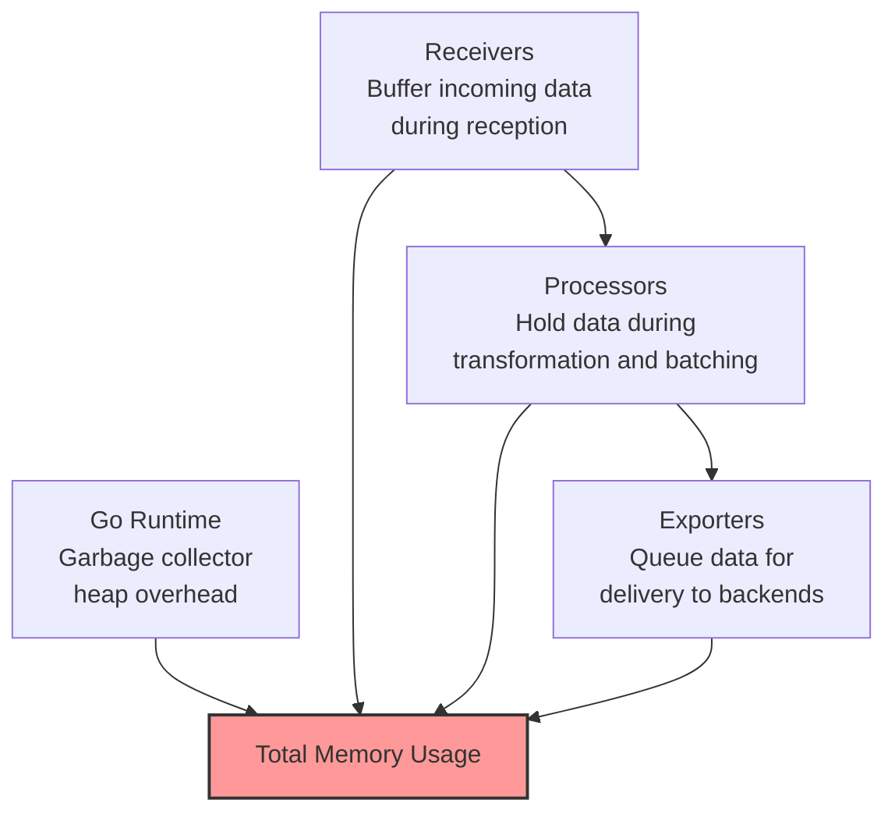

# How to Diagnose High Memory Usage in the OpenTelemetry Collector

Author: [nawazdhandala](https://www.github.com/nawazdhandala)

Tags: OpenTelemetry, Collector, Memory, Performance, Profiling, Troubleshooting

Description: Learn how to identify the root causes of high memory usage in the OpenTelemetry Collector using built-in metrics, pprof profiling, and pipeline analysis techniques.

The OpenTelemetry Collector is running, but its memory usage keeps climbing. Maybe it has not crashed yet, but the trend line is heading in the wrong direction. Or maybe it is hovering at 80% of its limit and you need to understand what is eating all that memory before it becomes an incident.

Diagnosing memory usage in the collector requires a different approach than most applications. The collector is a data pipeline, so memory consumption depends on the volume and shape of incoming data, the processor chain, and the speed of downstream exporters. This guide covers the tools and techniques for finding exactly where memory is going.

## Where Memory Goes in the Collector

The collector allocates memory across several components. Understanding this breakdown is the first step to diagnosing issues:



Each component contributes differently depending on traffic patterns, configuration, and backend health.

## Step 1: Check Collector Internal Metrics

The collector exposes Prometheus-format metrics about its own operations. These are the fastest way to understand what is happening:

```bash
# Fetch collector internal metrics
# Default metrics endpoint is port 8888
curl -s http://localhost:8888/metrics | grep -E "memory|queue|batch|process_runtime"
```

Key metrics to examine:

```bash
# Go runtime memory statistics
# process_runtime_total_alloc_bytes: total bytes allocated (cumulative)
# process_runtime_heap_alloc_bytes: current heap allocation
# process_runtime_heap_sys_bytes: total heap memory obtained from OS
curl -s http://localhost:8888/metrics | grep "process_runtime"
```

These metrics tell you how much memory the Go runtime has allocated and how much is actually in use:

```
# HELP process_runtime_total_alloc_bytes Cumulative bytes allocated for heap objects
process_runtime_total_alloc_bytes 4.523e+10

# HELP process_runtime_heap_alloc_bytes Bytes of allocated heap objects
process_runtime_heap_alloc_bytes 8.912e+08

# HELP process_runtime_heap_sys_bytes Bytes of heap memory obtained from the OS
process_runtime_heap_sys_bytes 1.234e+09
```

If `heap_alloc_bytes` is close to `heap_sys_bytes`, the heap is nearly full. If `total_alloc_bytes` is growing rapidly, the collector is allocating (and discarding) objects at a high rate, which puts pressure on the garbage collector.

## Step 2: Check Exporter Queue Depth

The exporter queue is one of the most common sources of memory growth. When the backend is slow or unreachable, the queue fills up with unsent batches:

```bash
# Check exporter queue metrics
curl -s http://localhost:8888/metrics | grep "exporter_queue"
```

Look for these patterns:

```
# Queue size approaching capacity indicates the exporter cannot keep up
otelcol_exporter_queue_size{exporter="otlp"} 950
otelcol_exporter_queue_capacity{exporter="otlp"} 1000

# High number of failed sends indicates backend issues
otelcol_exporter_send_failed_spans{exporter="otlp"} 45000
```

A full or nearly full queue means the backend is not consuming data fast enough. Every batch sitting in the queue consumes memory. To calculate the memory impact:

```
Queue memory = queue_size * average_batch_size * average_item_size
```

If you have 1000 batches queued, each containing 500 spans averaging 3 KB, that is roughly 1.5 GB of memory just for the queue.

Reduce queue-related memory by lowering the queue size or fixing the backend performance issue:

```yaml
exporters:
  otlp:
    endpoint: backend.example.com:4317
    sending_queue:
      # Reduce queue size to cap memory usage
      # Trade-off: smaller queue means data is dropped sooner during outages
      queue_size: 200
    retry_on_failure:
      enabled: true
      # Reduce max elapsed time to stop retrying sooner
      max_elapsed_time: 60s
```

## Step 3: Profile Memory with pprof

For deeper analysis, the collector supports Go's pprof profiling tool. Enable the pprof extension:

```yaml
# Enable pprof extension for memory profiling
extensions:
  pprof:
    # Endpoint for pprof HTTP server
    endpoint: 0.0.0.0:1777

receivers:
  otlp:
    protocols:
      grpc:
        endpoint: 0.0.0.0:4317

processors:
  batch:
    timeout: 5s

exporters:
  otlp:
    endpoint: backend.example.com:4317

service:
  extensions: [pprof]
  pipelines:
    traces:
      receivers: [otlp]
      processors: [batch]
      exporters: [otlp]
```

Once the collector is running with pprof enabled, capture a heap profile:

```bash
# Download a heap profile snapshot
# This shows current memory allocations by code location
curl -o heap.prof http://localhost:1777/debug/pprof/heap

# Analyze the profile using go tool pprof
go tool pprof -http=:8080 heap.prof

# Or view a text summary without the web UI
go tool pprof -top heap.prof
```

The pprof output shows which functions allocated the most memory:

```
# Example pprof top output
Type: inuse_space
Showing top 10 nodes out of 150
      flat  flat%   sum%        cum   cum%
  512.50MB 35.2%  35.2%   512.50MB 35.2%  go.opentelemetry.io/collector/exporter/exporterqueue
  256.00MB 17.6%  52.8%   256.00MB 17.6%  go.opentelemetry.io/collector/processor/batchprocessor
  128.00MB  8.8%  61.6%   128.00MB  8.8%  go.opentelemetry.io/collector/receiver/otlpreceiver
   96.00MB  6.6%  68.2%    96.00MB  6.6%  runtime.malg
```

This output tells you exactly where memory is being consumed. In this example, the exporter queue holds 35% of memory, the batch processor holds 17.6%, and the OTLP receiver holds 8.8%.

## Step 4: Analyze Data Volume and Cardinality

High memory usage often correlates with data characteristics rather than raw volume. High-cardinality attributes on spans or metrics create more unique series and consume more memory per data point.

Check for attribute cardinality issues:

```yaml
# Use the debug exporter to inspect data attributes
exporters:
  debug:
    # Detailed verbosity shows all attributes on each span
    verbosity: detailed

service:
  pipelines:
    traces:
      receivers: [otlp]
      processors: [batch]
      exporters: [debug, otlp]
```

Look for attributes with high cardinality in the debug output:

```
# High cardinality attributes that waste memory:
# - request.id (unique per request)
# - user.session_id (unique per session)
# - http.url with query parameters (thousands of unique values)
# - timestamp-based attributes

# Example: a span with many high-cardinality attributes
Span #0
    Trace ID:  abc123...
    Span ID:   def456...
    Attributes:
        http.url: /api/users?id=12345&token=abc&ts=1707206400    <- high cardinality
        request.id: 550e8400-e29b-41d4-a716-446655440000          <- unique per request
        user.session: sess_abcdefg12345                            <- unique per session
```

Reduce cardinality with an attributes processor:

```yaml
processors:
  # Remove or truncate high-cardinality attributes
  attributes:
    actions:
      # Delete attributes that add no analytical value
      - key: request.id
        action: delete
      # Hash sensitive or high-cardinality values
      - key: user.session
        action: hash
      # Truncate long URLs to reduce per-span memory
      - key: http.url
        action: truncate
        max_length: 200

  # Transform processor can also extract and simplify attributes
  transform:
    trace_statements:
      - context: span
        statements:
          # Replace full URL with just the path template
          # This collapses thousands of unique URLs into a few patterns
          - replace_pattern(attributes["http.url"], "\\?.*", "")
```

## Step 5: Check for Memory Leaks with Continuous Profiling

If memory grows steadily over time even under constant load, you may have a memory leak. Take multiple heap profiles over time and compare them:

```bash
# Take a baseline profile
curl -o heap_baseline.prof http://localhost:1777/debug/pprof/heap

# Wait 30 minutes
sleep 1800

# Take a second profile
curl -o heap_30min.prof http://localhost:1777/debug/pprof/heap

# Compare the two profiles to see what grew
go tool pprof -base heap_baseline.prof -top heap_30min.prof
```

The diff output shows allocations that grew between the two snapshots:

```
# Example diff output showing a potential leak
Type: inuse_space
Showing top nodes with growth
      flat  flat%
  +128.00MB +100%  go.opentelemetry.io/collector/internal/fanoutconsumer.(*tracesRouter).consume
   +64.00MB  +50%  go.opentelemetry.io/collector/processor/batchprocessor.(*batchProcessor).processItem
```

If you see consistent growth in specific functions, that points to where the leak is occurring. Common causes include:

- Goroutine leaks (check with `curl http://localhost:1777/debug/pprof/goroutine?debug=1`)
- Unreleased data in custom processors
- Growing maps used for deduplication or caching

```bash
# Check goroutine count over time
# Growing goroutine count often accompanies memory leaks
curl -s http://localhost:1777/debug/pprof/goroutine?debug=1 | head -5

# Example output:
# goroutine profile: total 342
# If this number keeps growing, goroutines are leaking
```

## Step 6: Evaluate Processor Memory Impact

Different processors have very different memory footprints. Some are stateless and use minimal memory, while others maintain significant internal state:

```yaml
# Processor memory impact comparison (approximate)
processors:
  # LOW memory: stateless transformation
  # Memory: O(batch_size) - only holds current batch
  attributes:
    actions:
      - key: environment
        value: production
        action: upsert

  # MEDIUM memory: accumulates a batch before sending
  # Memory: O(batch_size * timeout * throughput)
  batch:
    send_batch_size: 256
    timeout: 5s

  # HIGH memory: maintains state across time windows
  # Memory: O(unique_series * window_duration)
  # Tail sampling holds complete traces until a decision is made
  tail_sampling:
    decision_wait: 30s
    num_traces: 100000
    policies:
      - name: error-policy
        type: status_code
        status_code:
          status_codes:
            - ERROR

  # HIGH memory: groups spans into complete traces
  # Memory: O(active_traces * spans_per_trace)
  groupbytrace:
    wait_duration: 10s
    num_traces: 50000
```

Tail sampling and group-by-trace processors are the biggest memory consumers because they must hold complete traces in memory. If memory is a concern, consider these alternatives:

```yaml
# Lower memory alternative to tail sampling:
# Use probabilistic sampling at the head instead
processors:
  probabilistic_sampler:
    # Sample 10% of traces at the head
    # Uses almost no memory compared to tail sampling
    sampling_percentage: 10
```

## Step 7: Right-Size Based on Throughput

Memory requirements scale with data throughput. You can estimate the needed memory based on your traffic:

```
Base memory (Go runtime + collector overhead): ~100 MB
Receiver buffer: ~50-100 MB per 10K spans/sec
Batch processor: batch_size * avg_span_size * num_pipelines
Export queue: queue_size * batch_size * avg_span_size
Tail sampling (if used): num_traces * avg_spans_per_trace * avg_span_size
```

For a collector handling 50,000 spans per second with a batch size of 512, queue size of 500, and average span size of 2 KB:

```
Base:           100 MB
Receivers:      500 MB  (50K spans/sec * buffer time)
Batch proc:      1 MB   (512 * 2 KB)
Export queue:   512 MB   (500 * 512 * 2 KB)
---
Total estimate: ~1.1 GB
```

Add a 50% safety margin and you should set your Kubernetes limit around 1.7 GB. This matches the rule of thumb that the memory limiter's `limit_mib` should be about 80% of the Kubernetes limit.

## Monitoring Memory Over Time

Set up a Grafana dashboard or equivalent to track collector memory metrics:

```yaml
# Key metrics to graph on your dashboard
# 1. process_runtime_heap_alloc_bytes - actual heap usage
# 2. otelcol_exporter_queue_size - queue depth per exporter
# 3. otelcol_processor_batch_batch_size_trigger_send - batch sizes
# 4. otelcol_receiver_accepted_spans - incoming throughput
# 5. otelcol_exporter_sent_spans - outgoing throughput

# Collector telemetry configuration for detailed internal metrics
service:
  telemetry:
    metrics:
      # Detailed level exposes per-component metrics
      level: detailed
      # Expose metrics on port 8888
      address: 0.0.0.0:8888
```

When incoming throughput exceeds outgoing throughput, the difference accumulates as memory. Track this gap to predict memory issues before they become OOM kills.

## Conclusion

High memory usage in the OpenTelemetry Collector is diagnosable and fixable. Start with the built-in metrics on port 8888 to understand the broad picture: is the exporter queue full, is throughput high, or is memory growing over time? Use pprof for targeted analysis when you need to know exactly which component is consuming memory. Then apply the right fix, whether that is tuning the batch processor, shrinking the export queue, reducing attribute cardinality, or replacing a high-memory processor like tail sampling with a lighter alternative. The combination of metrics, profiling, and configuration tuning gives you full control over the collector's memory footprint.
