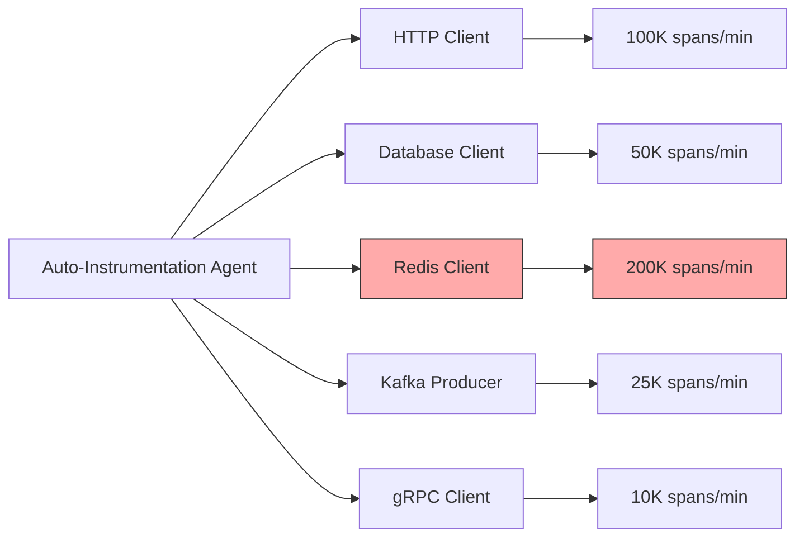

# How to Disable Unnecessary Auto-Instrumentation Libraries to Reduce Noise

Author: [nawazdhandala](https://www.github.com/nawazdhandala)

Tags: OpenTelemetry, Auto-Instrumentation, Performance, Configuration, Observability

Description: Learn how to selectively disable OpenTelemetry auto-instrumentation libraries to reduce telemetry noise and improve performance across different languages and frameworks.

Auto-instrumentation is one of OpenTelemetry's most powerful features, automatically capturing telemetry data from popular libraries and frameworks without code changes. However, excessive instrumentation generates noise, increases costs, and impacts performance. Not every library needs instrumentation in every environment.

This guide shows you how to selectively disable unnecessary auto-instrumentation libraries while maintaining visibility into critical application behavior.

## Understanding Auto-Instrumentation Scope

OpenTelemetry auto-instrumentation agents inject telemetry collection into popular libraries:

- HTTP clients and servers (requests, urllib3, Apache HttpClient)
- Database clients (psycopg2, JDBC, MongoDB)
- Message queues (Kafka, RabbitMQ, Redis)
- RPC frameworks (gRPC, Thrift)
- Cloud SDK clients (AWS SDK, Google Cloud)
- Web frameworks (Flask, Django, Spring Boot, Express)

Each instrumentation library adds overhead and generates spans. In high-traffic applications, this creates thousands or millions of spans per minute.



## Identifying Unnecessary Instrumentation

Before disabling instrumentation, identify which libraries generate the most noise:

Query your observability backend to find high-volume spans:

```sql
-- Find instrumentation libraries by span count
SELECT
    instrumentation_library_name,
    COUNT(*) as span_count,
    AVG(duration_ms) as avg_duration
FROM traces
WHERE timestamp > NOW() - INTERVAL '1 hour'
GROUP BY instrumentation_library_name
ORDER BY span_count DESC
LIMIT 20;
```

Common noise sources include:
- Health check endpoints generating spans every few seconds
- Internal service-to-service calls that don't add debugging value
- High-frequency cache operations (Redis GET/SET)
- Polling mechanisms or background jobs
- Static asset requests in web applications

## Disabling Auto-Instrumentation in Python

Python's OpenTelemetry auto-instrumentation allows selective disabling through environment variables.

Install the auto-instrumentation package:

```bash
pip install opentelemetry-distro opentelemetry-instrumentation
```

Disable specific instrumentation libraries using environment variables:

```bash
# Disable Redis instrumentation
export OTEL_PYTHON_DISABLED_INSTRUMENTATIONS=redis

# Disable multiple libraries (comma-separated)
export OTEL_PYTHON_DISABLED_INSTRUMENTATIONS=redis,requests,urllib3

# Run your application with auto-instrumentation
opentelemetry-instrument python app.py
```

For more granular control, configure instrumentation programmatically:

```python
# app.py
from opentelemetry.instrumentation.flask import FlaskInstrumentor
from opentelemetry.instrumentation.requests import RequestsInstrumentor
from opentelemetry.instrumentation.redis import RedisInstrumentor
from opentelemetry.instrumentation.psycopg2 import Psycopg2Instrumentor
from flask import Flask

app = Flask(__name__)

# Enable only specific instrumentations
# Flask instrumentation for HTTP server spans
FlaskInstrumentor().instrument_app(app)

# Database instrumentation for query visibility
Psycopg2Instrumentor().instrument()

# Requests instrumentation for external API calls
RequestsInstrumentor().instrument()

# SKIP Redis instrumentation to reduce noise from cache operations
# RedisInstrumentor().instrument()  # Commented out intentionally

@app.route('/api/data')
def get_data():
    # This will generate Flask and Psycopg2 spans
    # but NOT Redis spans
    return {'status': 'ok'}
```

Create a configuration file for environment-specific settings:

```yaml
# otel-config.yaml
instrumentation:
  enabled:
    - flask        # Web framework spans
    - psycopg2     # Database query spans
    - requests     # External HTTP calls

  disabled:
    - redis        # High-frequency cache operations
    - urllib3      # Low-level HTTP (covered by requests)

  conditional:
    # Enable only in production
    production:
      - kafka
      - grpc

    # Disable in development
    development:
      - aws-sdk
      - google-cloud
```

## Disabling Auto-Instrumentation in Java

Java's OpenTelemetry agent provides extensive configuration options for controlling instrumentation.

Download the Java agent:

```bash
wget https://github.com/open-telemetry/opentelemetry-java-instrumentation/releases/latest/download/opentelemetry-javaagent.jar
```

Disable instrumentation using system properties:

```bash
# Disable specific instrumentation libraries
java -javaagent:opentelemetry-javaagent.jar \
     -Dotel.instrumentation.common.default-enabled=true \
     -Dotel.instrumentation.redis.enabled=false \
     -Dotel.instrumentation.jdbc.enabled=false \
     -Dotel.instrumentation.kafka.enabled=false \
     -jar application.jar
```

Use a configuration file for complex scenarios:

```properties
# otel-agent.properties

# Disable all instrumentation by default
otel.instrumentation.common.default-enabled=false

# Enable only specific instrumentations
otel.instrumentation.spring-webmvc.enabled=true
otel.instrumentation.spring-boot-autoconfigure.enabled=true
otel.instrumentation.jdbc.enabled=true
otel.instrumentation.httpclient.enabled=true

# Explicitly disable noisy instrumentations
otel.instrumentation.redis.enabled=false
otel.instrumentation.jedis.enabled=false
otel.instrumentation.lettuce.enabled=false
otel.instrumentation.spring-scheduling.enabled=false

# Keep disabled for health checks and metrics endpoints
otel.instrumentation.micrometer.enabled=false
```

Apply the configuration:

```bash
java -javaagent:opentelemetry-javaagent.jar \
     -Dotel.javaagent.configuration-file=otel-agent.properties \
     -jar application.jar
```

For Spring Boot applications, create an application-specific configuration:

```java
// OtelConfiguration.java
package com.example.config;

import io.opentelemetry.api.OpenTelemetry;
import io.opentelemetry.api.trace.Tracer;
import io.opentelemetry.instrumentation.spring.webmvc.SpringWebMvcTelemetry;
import org.springframework.context.annotation.Bean;
import org.springframework.context.annotation.Configuration;
import org.springframework.web.servlet.config.annotation.InterceptorRegistry;
import org.springframework.web.servlet.config.annotation.WebMvcConfigurer;

@Configuration
public class OtelConfiguration implements WebMvcConfigurer {

    private final OpenTelemetry openTelemetry;

    public OtelConfiguration(OpenTelemetry openTelemetry) {
        this.openTelemetry = openTelemetry;
    }

    @Override
    public void addInterceptors(InterceptorRegistry registry) {
        // Add interceptor with custom filter
        SpringWebMvcTelemetry telemetry = SpringWebMvcTelemetry.create(openTelemetry);

        registry.addInterceptor(telemetry.createInterceptor())
                // Exclude health check and metrics endpoints
                .excludePathPatterns("/health", "/metrics", "/actuator/**");
    }
}
```

## Disabling Auto-Instrumentation in Node.js

Node.js applications use require/import hooks for auto-instrumentation.

Install dependencies:

```bash
npm install @opentelemetry/api @opentelemetry/sdk-node @opentelemetry/auto-instrumentations-node
```

Configure selective instrumentation:

```javascript
// tracing.js
const { NodeSDK } = require('@opentelemetry/sdk-node');
const { getNodeAutoInstrumentations } = require('@opentelemetry/auto-instrumentations-node');
const { OTLPTraceExporter } = require('@opentelemetry/exporter-trace-otlp-grpc');

// Initialize SDK with selective instrumentation
const sdk = new NodeSDK({
  traceExporter: new OTLPTraceExporter({
    url: 'http://localhost:4317',
  }),
  instrumentations: [
    getNodeAutoInstrumentations({
      // Disable specific instrumentations
      '@opentelemetry/instrumentation-redis': {
        enabled: false, // High-frequency cache operations
      },
      '@opentelemetry/instrumentation-redis-4': {
        enabled: false,
      },
      '@opentelemetry/instrumentation-ioredis': {
        enabled: false,
      },
      '@opentelemetry/instrumentation-dns': {
        enabled: false, // Low-level DNS lookups
      },
      '@opentelemetry/instrumentation-net': {
        enabled: false, // Low-level network operations
      },
      // Enable important instrumentations
      '@opentelemetry/instrumentation-http': {
        enabled: true,
      },
      '@opentelemetry/instrumentation-express': {
        enabled: true,
        // Ignore specific routes
        ignoreIncomingRequestHook: (req) => {
          // Skip health checks and static assets
          return req.url.match(/^\/(health|metrics|favicon\.ico)/);
        },
      },
      '@opentelemetry/instrumentation-pg': {
        enabled: true, // PostgreSQL queries
      },
      '@opentelemetry/instrumentation-mongodb': {
        enabled: true, // MongoDB operations
      },
    }),
  ],
});

sdk.start();

// Graceful shutdown
process.on('SIGTERM', () => {
  sdk.shutdown()
    .then(() => console.log('Tracing terminated'))
    .catch((error) => console.log('Error terminating tracing', error))
    .finally(() => process.exit(0));
});
```

## Disabling Auto-Instrumentation in Go

Go requires explicit instrumentation, but automatic instrumentation libraries exist for popular frameworks.

Example using the otelgin middleware for Gin framework:

```go
// main.go
package main

import (
    "github.com/gin-gonic/gin"
    "go.opentelemetry.io/contrib/instrumentation/github.com/gin-gonic/gin/otelgin"
    "go.opentelemetry.io/otel"
)

func main() {
    r := gin.Default()

    // Add OpenTelemetry middleware with filter
    r.Use(otelgin.Middleware("my-service",
        otelgin.WithFilter(func(req *http.Request) bool {
            // Return true to skip instrumentation
            // Skip health checks and metrics endpoints
            path := req.URL.Path
            return path == "/health" ||
                   path == "/metrics" ||
                   strings.HasPrefix(path, "/actuator")
        }),
    ))

    // Routes
    r.GET("/health", healthCheck)
    r.GET("/api/data", getData)

    r.Run(":8080")
}
```

For database instrumentation, control which queries are traced:

```go
// database.go
package main

import (
    "database/sql"
    "go.opentelemetry.io/contrib/instrumentation/database/sql/otelsql"
    semconv "go.opentelemetry.io/otel/semconv/v1.17.0"
)

func initDB() *sql.DB {
    // Register instrumentation with options
    driverName, err := otelsql.Register("postgres",
        otelsql.WithAttributes(
            semconv.DBSystemPostgreSQL,
        ),
        // Add filter to skip specific queries
        otelsql.WithSpanOptions(otelsql.SpanOptions{
            // Disable query text capture for high-frequency queries
            OmitConnectorFuncs: []string{
                "Ping", // Skip health checks
            },
        }),
    )

    db, err := sql.Open(driverName, "postgres://localhost/mydb")
    return db
}
```

## Collector-Level Filtering

Even with selective instrumentation, use the OpenTelemetry Collector to filter spans:

```yaml
# collector-config.yaml
receivers:
  otlp:
    protocols:
      grpc:
        endpoint: 0.0.0.0:4317

processors:
  # Filter out unwanted spans at the collector level
  filter:
    spans:
      exclude:
        match_type: regexp
        # Drop health check spans
        attributes:
          - key: http.target
            value: ^/(health|metrics|actuator).*

        # Drop Redis cache operations
        span_names:
          - "redis.*"
          - "GET /cache.*"
          - "SET /cache.*"

        # Drop spans shorter than 1ms (likely noise)
        span_duration:
          min: 1ms

  # Sample remaining spans
  probabilistic_sampler:
    sampling_percentage: 50

  batch:
    timeout: 10s
    send_batch_size: 1024

exporters:
  otlp:
    endpoint: backend:4317

service:
  pipelines:
    traces:
      receivers: [otlp]
      processors: [filter, probabilistic_sampler, batch]
      exporters: [otlp]
```

## Monitoring the Impact

After disabling instrumentation, measure the impact:

```python
# metrics_comparison.py
import json
from datetime import datetime, timedelta

# Compare span volume before and after
def compare_metrics(before_file, after_file):
    with open(before_file) as f:
        before = json.load(f)
    with open(after_file) as f:
        after = json.load(f)

    print("Span Volume Comparison:")
    print(f"Before: {before['total_spans']:,} spans/hour")
    print(f"After:  {after['total_spans']:,} spans/hour")
    reduction = (1 - after['total_spans'] / before['total_spans']) * 100
    print(f"Reduction: {reduction:.1f}%")

    print("\nCost Impact:")
    cost_per_million = 2.00  # Example cost
    before_cost = (before['total_spans'] / 1_000_000) * cost_per_million * 24 * 30
    after_cost = (after['total_spans'] / 1_000_000) * cost_per_million * 24 * 30
    print(f"Monthly cost before: ${before_cost:.2f}")
    print(f"Monthly cost after:  ${after_cost:.2f}")
    print(f"Monthly savings:     ${before_cost - after_cost:.2f}")
```

## Best Practices

Follow these guidelines when disabling auto-instrumentation:

1. **Start with full instrumentation in development** to understand all telemetry sources
2. **Measure before disabling** to quantify the impact
3. **Disable incrementally** and verify observability isn't compromised
4. **Keep critical paths instrumented** (user-facing endpoints, external API calls, database queries)
5. **Document disabled instrumentation** so teams understand coverage gaps
6. **Review periodically** as application behavior changes

For additional optimization strategies, see [How to Implement Rate-Based Sampling for High-Traffic Pipelines](https://oneuptime.com/blog/post/2026-02-06-rate-based-sampling-high-traffic-pipelines/view) and [How to Use the OpenTelemetry Transformation Language to Shape Telemetry Data](https://oneuptime.com/blog/post/2026-02-06-ottl-shape-telemetry-data/view).

Selective auto-instrumentation reduces noise without sacrificing critical visibility, improving both observability quality and system performance.
