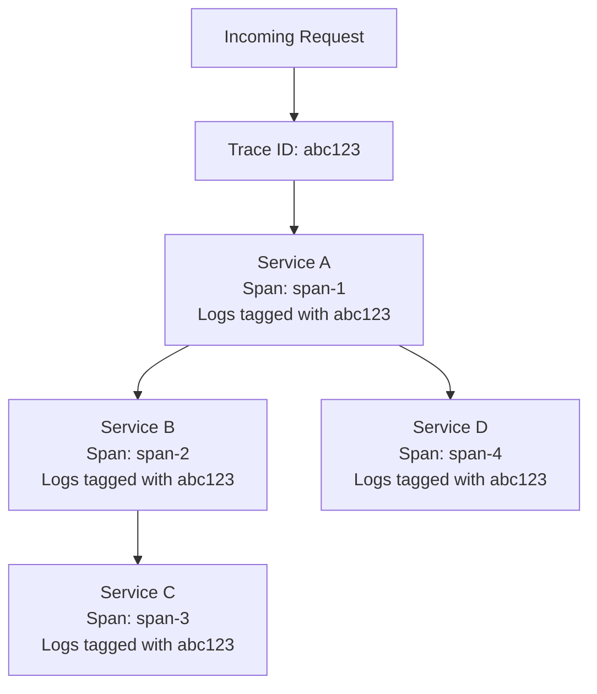
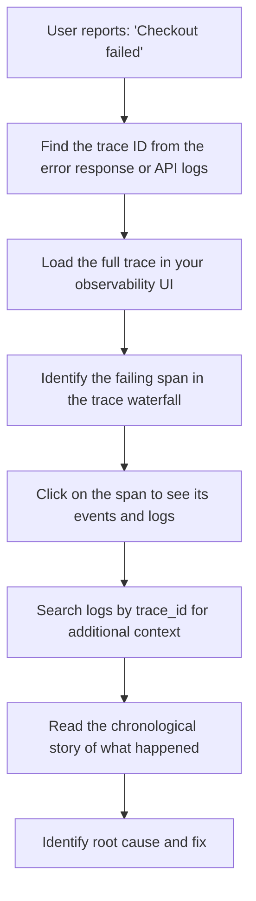

# How to Implement Distributed Debugging with Correlated Traces and Logs

Author: [nawazdhandala](https://www.github.com/nawazdhandala)

Tags: OpenTelemetry, Distributed Debugging, Tracing, Logging, Correlation, Observability, Troubleshooting

Description: Learn how to correlate OpenTelemetry traces with structured logs to enable effective distributed debugging across microservices, turning scattered log lines into coherent investigation threads.

---

Debugging a problem in a distributed system is fundamentally different from debugging a monolith. When a single request touches five different services, the relevant log lines are scattered across five different log streams. Without correlation, you are stuck grep-ing through millions of log lines trying to piece together what happened.

OpenTelemetry solves this by providing a common correlation mechanism: the trace ID. When every log line includes the trace ID and span ID from the active OpenTelemetry context, you can pull up all the logs from all services involved in a single request with one query. This transforms debugging from a scavenger hunt into a focused investigation.

---

## The Correlation Model



Every log line gets tagged with the trace ID and span ID from the current OpenTelemetry context. When you need to debug a request, you search for the trace ID and instantly get all related logs across all services, in chronological order.

---

## Setting Up Log-Trace Correlation in Python

The core setup involves configuring your logging system to automatically inject trace context into every log record.

```python
# correlated_logging.py
import logging
from opentelemetry import trace
from opentelemetry.sdk.trace import TracerProvider
from opentelemetry.sdk.trace.export import BatchSpanProcessor
from opentelemetry.exporter.otlp.proto.http.trace_exporter import OTLPSpanExporter
from opentelemetry.sdk.resources import Resource, SERVICE_NAME

# Set up tracing
resource = Resource.create({SERVICE_NAME: "order-service"})
provider = TracerProvider(resource=resource)
provider.add_span_processor(
    BatchSpanProcessor(
        OTLPSpanExporter(endpoint="https://otel.oneuptime.com/v1/traces")
    )
)
trace.set_tracer_provider(provider)

class TraceContextFilter(logging.Filter):
    """
    A logging filter that injects OpenTelemetry trace context
    into every log record. This enables searching logs by trace ID.
    """

    def filter(self, record):
        span = trace.get_current_span()
        ctx = span.get_span_context()

        if ctx and ctx.is_valid:
            # Format as 32-character hex string matching W3C trace context
            record.trace_id = format(ctx.trace_id, '032x')
            record.span_id = format(ctx.span_id, '016x')
            record.trace_flags = format(ctx.trace_flags, '02x')
        else:
            record.trace_id = "00000000000000000000000000000000"
            record.span_id = "0000000000000000"
            record.trace_flags = "00"

        return True

# Configure the logger with trace context injection
def setup_correlated_logging(service_name: str):
    """Set up logging with automatic trace context injection."""
    logger = logging.getLogger()

    # Add the trace context filter
    trace_filter = TraceContextFilter()
    logger.addFilter(trace_filter)

    # Use a JSON formatter that includes trace context fields
    formatter = logging.Formatter(
        '{"timestamp": "%(asctime)s", '
        '"level": "%(levelname)s", '
        '"service": "' + service_name + '", '
        '"trace_id": "%(trace_id)s", '
        '"span_id": "%(span_id)s", '
        '"message": "%(message)s"}'
    )

    handler = logging.StreamHandler()
    handler.setFormatter(formatter)
    logger.addHandler(handler)
    logger.setLevel(logging.INFO)

    return logger
```

The `TraceContextFilter` is the key component. It runs on every log record and injects the current trace ID and span ID from the OpenTelemetry context. This means any `logger.info()` call within an active span will automatically include the correlation IDs.

---

## Structured Logging with Contextual Attributes

Beyond trace IDs, you want to attach business context to your log lines so they are useful for debugging.

```python
# structured_logger.py
import logging
from opentelemetry import trace

logger = logging.getLogger(__name__)
tracer = trace.get_tracer("debugging")

class ContextualLogger:
    """
    A wrapper around the standard logger that automatically includes
    span attributes and business context in log messages.
    """

    def __init__(self, logger: logging.Logger):
        self.logger = logger

    def info(self, message: str, **context):
        """Log an info message with additional context fields."""
        self._log(logging.INFO, message, context)

    def error(self, message: str, **context):
        """Log an error message with additional context fields."""
        self._log(logging.ERROR, message, context)

    def warning(self, message: str, **context):
        """Log a warning message with additional context fields."""
        self._log(logging.WARNING, message, context)

    def _log(self, level: int, message: str, context: dict):
        """Internal log method that enriches messages with span context."""
        span = trace.get_current_span()

        # Pull attributes from the current span for additional context
        span_attrs = {}
        if span and span.is_recording():
            # Span attributes are available after they have been set
            span_attrs = dict(span.attributes) if span.attributes else {}

        # Merge span attributes with explicit context
        full_context = {**span_attrs, **context}

        # Format context as key=value pairs appended to the message
        context_str = " ".join(f"{k}={v}" for k, v in full_context.items())
        enriched_message = f"{message} | {context_str}" if context_str else message

        self.logger.log(level, enriched_message)

        # Also add the log as a span event for trace correlation
        if span and span.is_recording():
            span.add_event(message, attributes=context)


# Usage in application code
log = ContextualLogger(logger)

def process_order(order_id: str, user_id: str):
    with tracer.start_as_current_span("process_order") as span:
        span.set_attribute("order.id", order_id)
        span.set_attribute("user.id", user_id)

        log.info("Starting order processing", order_id=order_id)

        # Validate inventory
        with tracer.start_as_current_span("validate_inventory"):
            available = check_inventory(order_id)
            if not available:
                log.warning("Insufficient inventory", order_id=order_id, reason="out_of_stock")
                return

        # Process payment
        with tracer.start_as_current_span("process_payment"):
            try:
                charge_customer(order_id, user_id)
                log.info("Payment processed successfully", order_id=order_id)
            except PaymentError as e:
                log.error("Payment failed", order_id=order_id, error=str(e))
                span.record_exception(e)
                raise
```

The `ContextualLogger` does two things: it enriches log messages with context from the current span and from explicit parameters, and it also records each log message as a span event. This means the log line appears both in your log aggregation system and in the trace waterfall view.

---

## Setting Up the Collector for Log-Trace Correlation

Configure your OpenTelemetry Collector to handle both traces and logs, ensuring they share the same resource attributes for correlation.

```yaml
# otel-collector-config.yaml
receivers:
  otlp:
    protocols:
      grpc:
        endpoint: 0.0.0.0:4317
      http:
        endpoint: 0.0.0.0:4318

  # Collect log files and parse JSON format
  filelog:
    include:
      - /var/log/app/*.log
    operators:
      - type: json_parser
        timestamp:
          parse_from: attributes.timestamp
          layout: "%Y-%m-%d %H:%M:%S"
      # Extract trace_id and span_id from parsed JSON
      - type: trace_parser
        trace_id:
          parse_from: attributes.trace_id
        span_id:
          parse_from: attributes.span_id

processors:
  batch:
    send_batch_size: 1000
    timeout: 5s

  # Ensure consistent resource attributes across traces and logs
  resource:
    attributes:
      - key: deployment.environment
        value: production
        action: upsert

exporters:
  otlphttp:
    endpoint: https://otel.oneuptime.com

service:
  pipelines:
    traces:
      receivers: [otlp]
      processors: [resource, batch]
      exporters: [otlphttp]
    logs:
      receivers: [otlp, filelog]
      processors: [resource, batch]
      exporters: [otlphttp]
```

The `filelog` receiver with the `trace_parser` operator extracts trace IDs from your JSON log lines and attaches them as proper trace context on the log records. This means even log files from legacy systems can be correlated with traces.

---

## The Debugging Workflow

Here is the actual workflow for debugging a distributed issue using correlated traces and logs.



1. Start with the trace ID. Get it from the error response, the API gateway logs, or the user's session.
2. Load the trace. The waterfall view shows you exactly which service and operation failed.
3. Examine the failing span. Look at its attributes, events, and linked logs.
4. Search logs by trace ID. This gives you every log line from every service that was involved in this request.
5. Read the story. The chronological log output tells you exactly what happened, step by step, across all services.

---

## Adding Debug-Level Context on Errors

When an error occurs, you want maximum context without overwhelming your logs during normal operation. Use dynamic log level adjustment.

```python
# debug_on_error.py
from opentelemetry import trace
import logging

tracer = trace.get_tracer("debugging")
logger = logging.getLogger(__name__)

def process_with_debug_context(request):
    """
    Process a request with automatic debug context capture on failure.
    During normal operation, logs at INFO level. On error, captures
    additional debug information in the span.
    """
    with tracer.start_as_current_span("process_request") as span:
        debug_context = []  # Collect debug info in memory

        try:
            # Step 1: Validate
            debug_context.append(f"Validating request: {request.id}")
            result = validate(request)
            debug_context.append(f"Validation result: {result}")

            # Step 2: Process
            debug_context.append(f"Processing with params: {request.params}")
            output = execute(request, result)
            debug_context.append(f"Execution output: {output}")

            logger.info("Request processed successfully")
            return output

        except Exception as e:
            # On error, dump all debug context into the span
            for i, ctx_line in enumerate(debug_context):
                span.add_event(f"debug_{i}", {"message": ctx_line})

            span.record_exception(e)
            logger.error(f"Request failed: {e}")
            raise
```

This pattern collects debug information in memory during processing and only writes it to the span if something goes wrong. This keeps your normal log volume low while ensuring you have full context when you need to debug a failure.

---

## Summary

Correlated traces and logs are the foundation of effective distributed debugging. The setup is straightforward: inject trace IDs into every log line, send both traces and logs to the same backend, and use the trace ID as your primary search key when investigating issues. The initial investment in setting up correlation pays for itself the first time you debug a cross-service issue in minutes instead of hours.
