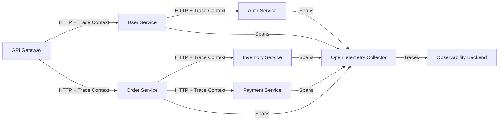
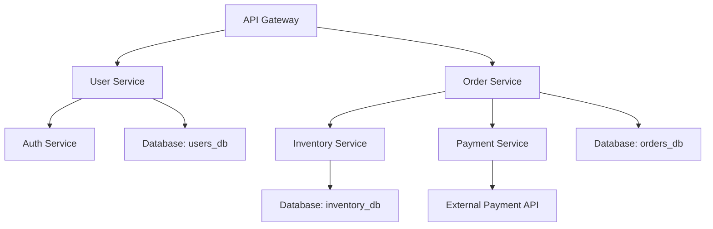

# How to Set Up Distributed Tracing Across Elixir Microservices with OpenTelemetry

Author: [nawazdhandala](https://www.github.com/nawazdhandala)

Tags: OpenTelemetry, Elixir, Distributed Tracing, Microservices, BEAM

Description: Set up end-to-end distributed tracing across your Elixir microservices architecture using OpenTelemetry for complete visibility.

Microservices architectures built with Elixir offer excellent scalability and fault tolerance, but debugging distributed systems remains challenging. When a request spans multiple services, understanding the full execution path requires distributed tracing. OpenTelemetry provides a standardized way to instrument and connect traces across service boundaries.

## Understanding Distributed Tracing Fundamentals

Distributed tracing follows a request's journey through multiple services by linking related spans together using trace context. Each service extracts context from incoming requests, performs work within spans, and propagates context to downstream services. This creates a complete picture of the request flow, including timing, errors, and dependencies.

Without distributed tracing, you only see individual service logs and metrics. When a request fails or performs poorly, identifying the root cause requires manually correlating logs across services using timestamps and request IDs. This approach breaks down quickly as system complexity grows.

OpenTelemetry standardizes context propagation using the W3C Trace Context specification. This ensures compatibility between different services, languages, and observability tools. Your Elixir services can seamlessly trace requests to and from services written in Go, Python, or any other language that supports OpenTelemetry.

## Architecture Overview

Here's how distributed tracing flows through a typical Elixir microservices architecture:



Each service extracts trace context from incoming requests, creates local spans for its work, and injects context into outgoing requests. The OpenTelemetry Collector receives spans from all services and forwards them to your observability backend where they're assembled into complete traces.

## Setting Up the Foundation

Start by adding OpenTelemetry dependencies to all services. Create a shared configuration module to ensure consistency:

```elixir
# In each service's mix.exs
defp deps do
  [
    {:opentelemetry, "~> 1.3"},
    {:opentelemetry_api, "~> 1.2"},
    {:opentelemetry_exporter, "~> 1.6"},
    {:opentelemetry_telemetry, "~> 1.0"},
    {:opentelemetry_phoenix, "~> 1.1"},
    {:opentelemetry_finch, "~> 0.2"}
  ]
end
```

Create a shared tracing configuration module:

```elixir
defmodule SharedConfig.Tracing do
  @moduledoc """
  Common OpenTelemetry configuration for all microservices.
  """

  def setup(service_name, service_version \\ "1.0.0") do
    # Configure resource attributes that identify this service
    :opentelemetry.set_default_tracer({:opentelemetry_tracer, service_name})

    # Set up the OTLP exporter
    configure_exporter(service_name, service_version)

    # Configure sampling based on environment
    configure_sampling()
  end

  defp configure_exporter(service_name, service_version) do
    Application.put_env(:opentelemetry, :resource, [
      service: [
        name: service_name,
        version: service_version,
        namespace: get_namespace()
      ],
      deployment: [
        environment: get_environment()
      ],
      host: [
        name: node_name()
      ]
    ])

    Application.put_env(:opentelemetry_exporter, :otlp_protocol, :http_protobuf)
    Application.put_env(:opentelemetry_exporter, :otlp_endpoint, collector_endpoint())
    Application.put_env(:opentelemetry_exporter, :otlp_headers, auth_headers())
  end

  defp configure_sampling do
    # Use parent-based sampling to honor upstream sampling decisions
    sampler = {:parent_based, %{
      root: {:trace_id_ratio_based, sample_ratio()},
      remote_parent_sampled: :always_on,
      remote_parent_not_sampled: :always_off,
      local_parent_sampled: :always_on,
      local_parent_not_sampled: :always_off
    }}

    Application.put_env(:opentelemetry, :sampler, sampler)
  end

  defp get_namespace, do: System.get_env("SERVICE_NAMESPACE", "default")
  defp get_environment, do: System.get_env("ENVIRONMENT", "development")
  defp node_name, do: Atom.to_string(node())
  defp collector_endpoint, do: System.get_env("OTEL_EXPORTER_OTLP_ENDPOINT", "http://localhost:4318")

  defp auth_headers do
    case System.get_env("OTEL_API_KEY") do
      nil -> []
      key -> [{"x-api-key", key}]
    end
  end

  defp sample_ratio do
    case System.get_env("OTEL_SAMPLE_RATIO") do
      nil -> 1.0
      ratio -> String.to_float(ratio)
    end
  end
end
```

Initialize tracing in each service's application module:

```elixir
defmodule UserService.Application do
  use Application

  def start(_type, _args) do
    # Initialize OpenTelemetry before starting supervision tree
    SharedConfig.Tracing.setup("user-service", "1.2.3")

    children = [
      UserService.Repo,
      {Phoenix.PubSub, name: UserService.PubSub},
      UserServiceWeb.Endpoint
    ]

    opts = [strategy: :one_for_one, name: UserService.Supervisor]
    Supervisor.start_link(children, opts)
  end
end
```

## Instrumenting HTTP Servers with Phoenix

Phoenix applications act as HTTP servers that receive requests from other services. The `opentelemetry_phoenix` library automatically instruments incoming requests:

```elixir
# In your endpoint.ex
defmodule UserServiceWeb.Endpoint do
  use Phoenix.Endpoint, otp_app: :user_service

  # Add OpenTelemetry plug early in the pipeline
  plug OpentelemetryPhoenix

  plug Plug.RequestId
  plug Plug.Telemetry, event_prefix: [:phoenix, :endpoint]
  plug Plug.Parsers,
    parsers: [:urlencoded, :multipart, :json],
    pass: ["*/*"],
    json_decoder: Phoenix.json_library()

  plug Plug.MethodOverride
  plug Plug.Head
  plug UserServiceWeb.Router
end
```

The Phoenix instrumentation automatically extracts trace context from incoming HTTP headers and creates a span for each request. You can add custom attributes in your controllers:

```elixir
defmodule UserServiceWeb.UserController do
  use UserServiceWeb, :controller
  require OpenTelemetry.Tracer, as: Tracer

  def show(conn, %{"id" => user_id}) do
    # Add custom attributes to the current span
    Tracer.set_attributes([
      {"user_id", user_id},
      {"endpoint", "user.show"}
    ])

    case UserService.Users.get_user(user_id) do
      {:ok, user} ->
        # Check authorization using downstream service
        with :ok <- check_permissions(conn, user_id) do
          Tracer.set_status(:ok)
          json(conn, user)
        else
          {:error, :forbidden} ->
            Tracer.set_status(:error, "Permission denied")
            conn
            |> put_status(:forbidden)
            |> json(%{error: "Permission denied"})
        end

      {:error, :not_found} ->
        Tracer.set_status(:error, "User not found")
        conn
        |> put_status(:not_found)
        |> json(%{error: "User not found"})
    end
  end

  defp check_permissions(conn, user_id) do
    # This will automatically propagate trace context to the auth service
    token = get_req_header(conn, "authorization") |> List.first()
    UserService.AuthClient.verify_access(token, user_id)
  end
end
```

## Instrumenting HTTP Clients with Finch

For making HTTP requests to downstream services, use Finch with OpenTelemetry instrumentation:

```elixir
# Configure Finch in your application
defmodule UserService.Application do
  use Application

  def start(_type, _args) do
    SharedConfig.Tracing.setup("user-service")

    children = [
      UserService.Repo,
      {Finch, name: UserService.Finch}
    ]

    opts = [strategy: :one_for_one, name: UserService.Supervisor]
    Supervisor.start_link(children, opts)
  end
end

# Attach Finch telemetry events to OpenTelemetry
defmodule UserService.Telemetry do
  def setup do
    # This creates spans for all Finch requests
    OpentelemetryFinch.setup()
  end
end
```

Create an HTTP client module that automatically propagates trace context:

```elixir
defmodule UserService.AuthClient do
  require OpenTelemetry.Tracer, as: Tracer
  alias OpenTelemetry.Propagator.TextMap

  @auth_service_url "http://auth-service:4000"

  def verify_access(token, user_id) do
    Tracer.with_span "auth_client.verify_access" do
      Tracer.set_attributes([
        {"user_id", user_id},
        {"downstream_service", "auth-service"}
      ])

      # Build the request
      url = "#{@auth_service_url}/api/verify"
      headers = build_headers_with_context(token)
      body = Jason.encode!(%{user_id: user_id})

      # Make the HTTP request (Finch instrumentation handles span creation)
      request = Finch.build(:post, url, headers, body)

      case Finch.request(request, UserService.Finch) do
        {:ok, %{status: 200}} ->
          Tracer.set_status(:ok)
          :ok

        {:ok, %{status: 403}} ->
          Tracer.set_status(:error, "Authorization failed")
          {:error, :forbidden}

        {:ok, %{status: status}} ->
          Tracer.set_status(:error, "Unexpected status: #{status}")
          {:error, :service_error}

        {:error, error} ->
          Tracer.set_status(:error, Exception.message(error))
          Tracer.record_exception(error)
          {:error, :network_error}
      end
    end
  end

  defp build_headers_with_context(token) do
    # Start with basic headers
    headers = [
      {"content-type", "application/json"},
      {"authorization", "Bearer #{token}"}
    ]

    # Inject trace context into headers
    :otel_propagator_text_map.inject(headers)
  end
end
```

The critical part is using `:otel_propagator_text_map.inject/1` to add trace context headers. This injects the trace ID, span ID, and sampling decision into HTTP headers following the W3C Trace Context specification.

## Handling Message Queue Communication

For asynchronous communication using message queues, trace context must be propagated manually:

```elixir
defmodule OrderService.EventPublisher do
  require OpenTelemetry.Tracer, as: Tracer
  alias OpenTelemetry.Ctx

  def publish_order_created(order) do
    Tracer.with_span "event_publisher.order_created" do
      Tracer.set_attributes([
        {"order_id", order.id},
        {"event_type", "order.created"}
      ])

      # Serialize trace context into the message
      context = serialize_trace_context()

      message = %{
        event_type: "order.created",
        payload: order,
        trace_context: context,
        timestamp: DateTime.utc_now()
      }

      case publish_to_queue("orders", message) do
        :ok ->
          Tracer.set_status(:ok)
          :ok

        {:error, reason} ->
          Tracer.set_status(:error, inspect(reason))
          {:error, reason}
      end
    end
  end

  defp serialize_trace_context do
    # Extract current context into a map that can be serialized
    headers = []
    injected_headers = :otel_propagator_text_map.inject(headers)
    Map.new(injected_headers)
  end

  defp publish_to_queue(queue, message) do
    # Your queue publishing logic
    :ok
  end
end
```

On the consumer side, extract and attach the context:

```elixir
defmodule InventoryService.EventConsumer do
  require OpenTelemetry.Tracer, as: Tracer
  alias OpenTelemetry.Ctx

  def handle_message(message) do
    # Extract trace context from the message
    context = extract_trace_context(message)

    # Attach the context before processing
    Ctx.attach(context)

    Tracer.with_span "event_consumer.handle_order_created" do
      Tracer.set_attributes([
        {"event_type", message.event_type},
        {"order_id", message.payload.id}
      ])

      process_order_created(message.payload)
    end
  end

  defp extract_trace_context(message) do
    case message[:trace_context] do
      nil ->
        # No context available, create a new one
        Ctx.new()

      context_map ->
        # Convert map back to headers format and extract
        headers = Map.to_list(context_map)
        :otel_propagator_text_map.extract(headers)
    end
  end

  defp process_order_created(order) do
    Tracer.with_span "event_consumer.reserve_inventory" do
      # Reserve inventory for the order
      :ok
    end
  end
end
```

## Cross-Service Error Propagation

When errors occur in downstream services, propagate them properly with context:

```elixir
defmodule OrderService.PaymentClient do
  require OpenTelemetry.Tracer, as: Tracer

  def process_payment(order_id, amount) do
    Tracer.with_span "payment_client.process" do
      Tracer.set_attributes([
        {"order_id", order_id},
        {"amount", amount},
        {"currency", "USD"}
      ])

      url = "#{payment_service_url()}/api/payments"
      headers = :otel_propagator_text_map.inject([{"content-type", "application/json"}])
      body = Jason.encode!(%{order_id: order_id, amount: amount})

      request = Finch.build(:post, url, headers, body)

      case Finch.request(request, OrderService.Finch, receive_timeout: 10_000) do
        {:ok, %{status: 200, body: body}} ->
          Tracer.set_status(:ok)
          {:ok, Jason.decode!(body)}

        {:ok, %{status: 402, body: body}} ->
          error = Jason.decode!(body)
          Tracer.set_status(:error, "Payment declined: #{error["reason"]}")
          Tracer.add_event("payment_declined", %{reason: error["reason"]})
          {:error, :payment_declined, error["reason"]}

        {:ok, %{status: status, body: body}} ->
          Tracer.set_status(:error, "Unexpected status: #{status}")
          Tracer.add_event("payment_error", %{status: status, body: body})
          {:error, :payment_failed}

        {:error, %{reason: :timeout}} ->
          Tracer.set_status(:error, "Payment service timeout")
          Tracer.add_event("timeout", %{service: "payment", timeout_ms: 10_000})
          {:error, :timeout}

        {:error, error} ->
          Tracer.set_status(:error, Exception.message(error))
          Tracer.record_exception(error)
          {:error, :network_error}
      end
    end
  end

  defp payment_service_url do
    System.get_env("PAYMENT_SERVICE_URL", "http://payment-service:4000")
  end
end
```

## Implementing Circuit Breakers with Tracing

Circuit breakers prevent cascading failures in microservices. Trace their state changes:

```elixir
defmodule OrderService.CircuitBreaker do
  use GenServer
  require OpenTelemetry.Tracer, as: Tracer

  def call(service_name, fun) do
    GenServer.call(__MODULE__, {:call, service_name, fun})
  end

  @impl true
  def handle_call({:call, service_name, fun}, _from, state) do
    Tracer.with_span "circuit_breaker.call" do
      Tracer.set_attributes([
        {"service_name", service_name},
        {"circuit_state", get_state(state, service_name)}
      ])

      case get_state(state, service_name) do
        :closed ->
          execute_with_circuit_breaker(service_name, fun, state)

        :open ->
          Tracer.set_status(:error, "Circuit breaker open")
          Tracer.add_event("circuit_open", %{service: service_name})
          {:reply, {:error, :circuit_open}, state}

        :half_open ->
          Tracer.add_event("circuit_half_open_attempt", %{service: service_name})
          execute_with_circuit_breaker(service_name, fun, state)
      end
    end
  end

  defp execute_with_circuit_breaker(service_name, fun, state) do
    try do
      result = fun.()
      Tracer.add_event("circuit_success", %{service: service_name})
      new_state = record_success(state, service_name)
      {:reply, {:ok, result}, new_state}
    rescue
      error ->
        Tracer.set_status(:error, Exception.message(error))
        Tracer.add_event("circuit_failure", %{service: service_name})
        new_state = record_failure(state, service_name)
        {:reply, {:error, error}, new_state}
    end
  end

  defp get_state(_state, _service_name), do: :closed
  defp record_success(state, _service_name), do: state
  defp record_failure(state, _service_name), do: state
end
```

## Monitoring Service Dependencies

Create a dependency graph from distributed traces:



This graph emerges naturally from your distributed traces. Each span contains information about the service it belongs to and which services it calls. Observability backends can automatically generate dependency maps from this data.

## Best Practices for Distributed Tracing

Follow these guidelines to get the most value from distributed tracing:

**Always Propagate Context**: Never make cross-service calls without propagating trace context. This is the most common mistake in distributed tracing implementations.

**Use Consistent Service Names**: Ensure all instances of a service use the same service name in their resource attributes. Inconsistent naming fragments your traces.

**Add Business Context**: Include business-relevant attributes like customer IDs, order IDs, or feature flags. These make traces searchable and help connect technical issues to business impact.

**Implement Sampling Correctly**: Use parent-based sampling to ensure entire traces are sampled together. Random sampling at each service creates incomplete traces.

**Monitor Trace Quality**: Track what percentage of requests are successfully traced end-to-end. Gaps in your traces indicate instrumentation problems.

**Handle Async Boundaries**: Message queues, background jobs, and any async processing require manual context propagation. Don't forget these critical paths.

## Testing Distributed Tracing

Verify your tracing implementation with integration tests:

```elixir
defmodule OrderServiceTest.Integration.DistributedTracingTest do
  use ExUnit.Case
  require OpenTelemetry.Tracer, as: Tracer
  alias OpenTelemetry.Ctx

  test "creates connected spans across services" do
    # Start a trace in the test
    Tracer.with_span "test.create_order" do
      trace_id = get_current_trace_id()

      # Make request to the order service
      response = OrderServiceWeb.Client.create_order(%{
        user_id: "user123",
        items: [%{sku: "item1", quantity: 2}]
      })

      assert {:ok, order} = response

      # Wait for spans to be exported
      Process.sleep(1000)

      # Query the observability backend for spans with this trace_id
      spans = fetch_spans_by_trace_id(trace_id)

      # Verify we have spans from all expected services
      service_names = Enum.map(spans, & &1.service_name) |> Enum.uniq()
      assert "order-service" in service_names
      assert "inventory-service" in service_names
      assert "payment-service" in service_names

      # Verify span relationships
      assert spans_form_valid_tree(spans)
    end
  end

  defp get_current_trace_id do
    ctx = Ctx.get_current()
    # Extract trace ID from context
    {:ok, trace_id} = :otel_tracer.current_span_ctx(ctx)
    trace_id
  end

  defp fetch_spans_by_trace_id(_trace_id), do: []
  defp spans_form_valid_tree(_spans), do: true
end
```

Distributed tracing transforms how you understand and debug microservices. With OpenTelemetry instrumentation across your Elixir services, you gain complete visibility into request flows, service dependencies, and performance bottlenecks. The initial setup investment pays dividends when troubleshooting complex production issues.
