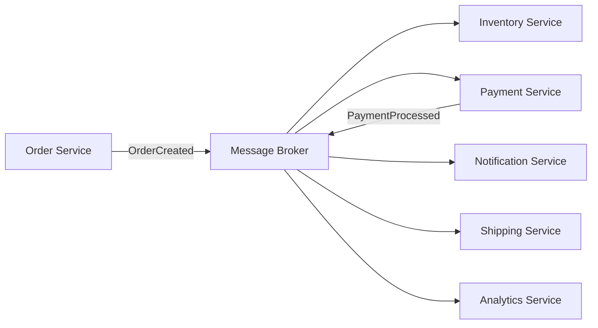
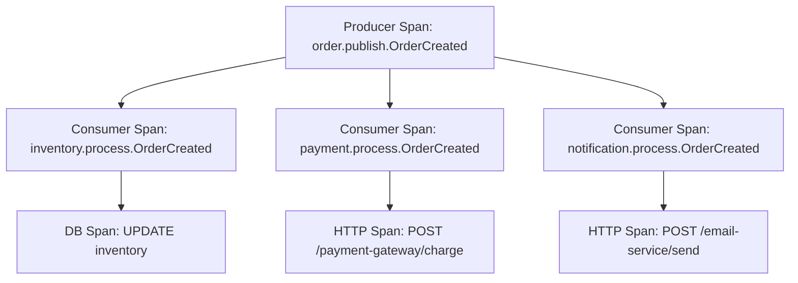

# How to Implement Distributed Tracing for Event-Driven Architectures

Author: [nawazdhandala](https://www.github.com/nawazdhandala)

Tags: OpenTelemetry, Distributed Tracing, Event-Driven Architecture, Kafka, RabbitMQ, Messaging

Description: A comprehensive guide to implementing distributed tracing in event-driven architectures using OpenTelemetry context propagation through message brokers.

---

Event-driven architectures are great for decoupling services. A service publishes an event, and any number of consumers can react to it without the publisher knowing or caring. But this decoupling is exactly what makes observability hard. When a user action triggers a chain of events across five services through a message broker, how do you trace the full journey? How do you know that a failed notification was caused by a malformed order event published 30 seconds earlier?

Distributed tracing solves this, but it requires some thought in event-driven systems. Unlike synchronous HTTP calls where context propagation is straightforward, message brokers introduce asynchronous gaps, fan-out patterns, and delayed processing. This post covers practical strategies for tracing through Kafka, RabbitMQ, and similar message systems using OpenTelemetry.

## Why Event-Driven Tracing Is Different

In synchronous communication, the trace context flows naturally with the request and response. Service A calls Service B, which calls Service C, and the trace context propagates through HTTP headers at each hop. The timing is linear and predictable.

Event-driven architectures break this model in several ways:

- **Temporal decoupling**: The producer and consumer run at different times. An event might sit in a queue for seconds or minutes before being processed.
- **Fan-out**: A single event can trigger multiple consumers, creating a tree of processing branches.
- **Fan-in**: A consumer might aggregate events from multiple producers before acting.
- **Replay**: Events can be replayed from a log, triggering new processing chains long after the original trace ended.



Each arrow in this diagram is a potential break in the trace if you don't handle context propagation properly.

## The Core Concept: Context Propagation Through Messages

OpenTelemetry uses the W3C TraceContext standard to propagate trace information. For HTTP, this means `traceparent` and `tracestate` headers. For messaging, you need to inject the same context into message headers or metadata.

The pattern is always the same:

1. Producer creates a span for "sending the message"
2. Producer injects the current trace context into the message headers
3. Consumer extracts the trace context from the message headers
4. Consumer creates a new span linked to the producer's context

Here's how this looks in practice with a generic message:

```python
# producer.py - Injecting trace context into message headers
from opentelemetry import trace, context
from opentelemetry.propagate import inject

tracer = trace.get_tracer("order-service")

def publish_order_created(order, publisher):
    """Publish an event with trace context embedded in the message headers."""
    with tracer.start_as_current_span("order.publish.OrderCreated") as span:
        # Add event metadata to the span for debugging
        span.set_attribute("messaging.system", "kafka")
        span.set_attribute("messaging.destination", "orders.created")
        span.set_attribute("app.order.id", order["id"])

        # Inject the current trace context into a carrier dict
        # This is the key step - it serializes traceparent/tracestate
        headers = {}
        inject(headers)

        # Publish the message with trace headers attached
        publisher.send(
            topic="orders.created",
            value=order,
            headers=headers,  # Trace context rides along with the message
        )
```

```python
# consumer.py - Extracting trace context from message headers
from opentelemetry import trace, context
from opentelemetry.propagate import extract

tracer = trace.get_tracer("inventory-service")

def handle_order_created(message):
    """Process an event, continuing the trace from the producer."""
    # Extract the trace context from the incoming message headers
    # This creates a context linked to the producer's span
    ctx = extract(carrier=message.headers)

    # Start a new span as a child of the extracted context
    with tracer.start_as_current_span(
        "order.process.OrderCreated",
        context=ctx,
        kind=trace.SpanKind.CONSUMER,
    ) as span:
        span.set_attribute("messaging.system", "kafka")
        span.set_attribute("messaging.source", "orders.created")
        span.set_attribute("messaging.message_id", message.id)

        # Your business logic here
        reserve_inventory(message.value)
```

## Tracing Through Apache Kafka

Kafka has first-class support for message headers, making context propagation straightforward. If you're using the `confluent-kafka-python` or Java Kafka client, you can use the header mechanism directly.

Here's a complete Kafka producer with OpenTelemetry tracing:

```python
# kafka_producer.py
from confluent_kafka import Producer
from opentelemetry import trace
from opentelemetry.propagate import inject
import json

tracer = trace.get_tracer("kafka-producer")

# Configure the Kafka producer
producer = Producer({
    'bootstrap.servers': 'kafka:9092',
    'client.id': 'order-service',
})

def publish_event(topic: str, key: str, event: dict):
    """Publish a Kafka message with OpenTelemetry trace context."""
    with tracer.start_as_current_span(
        f"kafka.produce.{topic}",
        kind=trace.SpanKind.PRODUCER,
    ) as span:
        # Set semantic convention attributes for messaging
        span.set_attribute("messaging.system", "kafka")
        span.set_attribute("messaging.destination.name", topic)
        span.set_attribute("messaging.kafka.message.key", key)

        # Inject trace context into headers
        headers = {}
        inject(headers)

        # Convert header values to bytes as Kafka requires
        kafka_headers = [(k, v.encode('utf-8') if isinstance(v, str) else v)
                         for k, v in headers.items()]

        # Send the message with trace headers
        producer.produce(
            topic=topic,
            key=key.encode('utf-8'),
            value=json.dumps(event).encode('utf-8'),
            headers=kafka_headers,
        )
        producer.flush()
```

And the corresponding consumer:

```python
# kafka_consumer.py
from confluent_kafka import Consumer
from opentelemetry import trace
from opentelemetry.propagate import extract
import json

tracer = trace.get_tracer("kafka-consumer")

consumer = Consumer({
    'bootstrap.servers': 'kafka:9092',
    'group.id': 'inventory-service',
    'auto.offset.reset': 'earliest',
})
consumer.subscribe(['orders.created'])

def process_messages():
    """Poll and process Kafka messages with trace context extraction."""
    while True:
        msg = consumer.poll(1.0)
        if msg is None:
            continue
        if msg.error():
            print(f"Consumer error: {msg.error()}")
            continue

        # Convert Kafka headers back to a dict for context extraction
        headers = {}
        if msg.headers():
            headers = {k: v.decode('utf-8') for k, v in msg.headers()}

        # Extract the trace context propagated by the producer
        ctx = extract(carrier=headers)

        # Create a consumer span linked to the producer's trace
        with tracer.start_as_current_span(
            f"kafka.consume.{msg.topic()}",
            context=ctx,
            kind=trace.SpanKind.CONSUMER,
        ) as span:
            span.set_attribute("messaging.system", "kafka")
            span.set_attribute("messaging.source.name", msg.topic())
            span.set_attribute("messaging.kafka.consumer.group", "inventory-service")
            span.set_attribute("messaging.kafka.partition", msg.partition())
            span.set_attribute("messaging.kafka.offset", msg.offset())

            # Process the event
            event = json.loads(msg.value())
            handle_event(event)
```

## Handling Fan-Out Patterns

When a single event triggers multiple consumers, each consumer creates its own child span from the same parent context. This naturally creates a tree structure in your traces.



This works automatically because all three consumers extract the same parent context from the message. Your tracing backend will display this as a single trace with three parallel branches.

## Using Span Links for Batch Processing

Sometimes a consumer processes a batch of messages together. In this case, the processing span doesn't have a single parent - it relates to many producer spans. OpenTelemetry's span links are perfect for this.

Span links let you reference multiple trace contexts without establishing a parent-child relationship:

```python
# batch_consumer.py
from opentelemetry import trace
from opentelemetry.propagate import extract
from opentelemetry.trace import Link

tracer = trace.get_tracer("batch-processor")

def process_batch(messages):
    """Process a batch of messages, linking to each producer's trace."""
    # Collect trace contexts from all messages in the batch
    links = []
    for msg in messages:
        ctx = extract(carrier=msg.headers)
        # Get the span context from the extracted context
        span_ctx = trace.get_current_span(ctx).get_span_context()
        if span_ctx.is_valid:
            links.append(Link(span_ctx, {"messaging.message_id": msg.id}))

    # Create a single span for the batch, linked to all source traces
    with tracer.start_as_current_span(
        "batch.process.orders",
        links=links,  # Connect this span to all contributing traces
        kind=trace.SpanKind.CONSUMER,
    ) as span:
        span.set_attribute("messaging.batch.message_count", len(messages))
        span.set_attribute("messaging.system", "kafka")

        # Process the entire batch
        for msg in messages:
            handle_message(msg)
```

## Tracing Through RabbitMQ

RabbitMQ also supports message headers, and the pattern is identical. If you're using the `pika` library in Python, here's how to inject and extract context:

```python
# rabbitmq_producer.py
import pika
import json
from opentelemetry import trace
from opentelemetry.propagate import inject

tracer = trace.get_tracer("rabbitmq-producer")

def publish_to_rabbitmq(exchange: str, routing_key: str, event: dict):
    """Publish to RabbitMQ with trace context in AMQP headers."""
    with tracer.start_as_current_span(
        f"rabbitmq.publish.{routing_key}",
        kind=trace.SpanKind.PRODUCER,
    ) as span:
        span.set_attribute("messaging.system", "rabbitmq")
        span.set_attribute("messaging.destination.name", exchange)
        span.set_attribute("messaging.rabbitmq.routing_key", routing_key)

        # Inject trace context into a headers dict
        trace_headers = {}
        inject(trace_headers)

        # Pass trace headers as AMQP message headers
        properties = pika.BasicProperties(
            headers=trace_headers,
            content_type='application/json',
            delivery_mode=2,  # Persistent messages
        )

        connection = pika.BlockingConnection(pika.ConnectionParameters('rabbitmq'))
        channel = connection.channel()
        channel.basic_publish(
            exchange=exchange,
            routing_key=routing_key,
            body=json.dumps(event),
            properties=properties,
        )
        connection.close()
```

## Dealing with Replay and Delayed Processing

Event replay is a powerful pattern, but it creates an interesting tracing question. When you replay events from last week, should the new processing link to the original trace? Usually the answer is yes, but with a caveat. The original trace is long since closed, so you should use span links rather than parent-child relationships.

```python
# replay_processor.py
from opentelemetry import trace
from opentelemetry.propagate import extract
from opentelemetry.trace import Link

tracer = trace.get_tracer("replay-processor")

def process_replayed_event(event, original_headers):
    """Process a replayed event, linking to the original trace."""
    # Extract the original trace context
    original_ctx = extract(carrier=original_headers)
    original_span_ctx = trace.get_current_span(original_ctx).get_span_context()

    links = []
    if original_span_ctx.is_valid:
        # Link to the original trace for correlation
        links.append(Link(original_span_ctx, {"replay": True}))

    # Start a new trace for the replay, linked to the original
    with tracer.start_as_current_span(
        "replay.process.order_event",
        links=links,
        kind=trace.SpanKind.CONSUMER,
    ) as span:
        span.set_attribute("app.replay", True)
        span.set_attribute("app.original_timestamp", event.get("timestamp"))
        process_event(event)
```

## Collector Configuration

Configure the OpenTelemetry Collector to handle traces from all your event-driven services:

```yaml
# otel-collector-config.yaml
receivers:
  otlp:
    protocols:
      grpc:
        endpoint: "0.0.0.0:4317"

processors:
  batch:
    timeout: 5s
    send_batch_size: 512

  # Add messaging-related resource attributes
  resource:
    attributes:
      - key: deployment.environment
        value: production
        action: upsert

exporters:
  otlp:
    endpoint: "https://your-oneuptime-instance.com:4317"

service:
  pipelines:
    traces:
      receivers: [otlp]
      processors: [batch, resource]
      exporters: [otlp]
```

## Best Practices

After instrumenting many event-driven systems, here are the patterns that work well:

1. **Always propagate context through message headers.** Never skip this step, even for "unimportant" events. The one you skip will be the one you need to debug.

2. **Use span links for batch and fan-in.** Parent-child relationships imply causality. Links imply correlation. Choose appropriately.

3. **Record the messaging system attributes.** The OpenTelemetry semantic conventions for messaging define attributes like `messaging.system`, `messaging.destination.name`, and `messaging.message.id`. Use them consistently.

4. **Handle missing context gracefully.** Not every message will have trace context, especially during rollouts. Your consumer should start a new trace when extraction fails rather than crashing.

5. **Set appropriate span kinds.** Use `PRODUCER` for publish operations and `CONSUMER` for message processing. This helps tracing backends render the flow correctly.

Event-driven tracing takes more setup than HTTP tracing, but it's worth the effort. When that 3 AM alert fires and you need to understand why a payment notification never went out, having a connected trace from the initial order event through every downstream consumer will save you hours of log spelunking.
