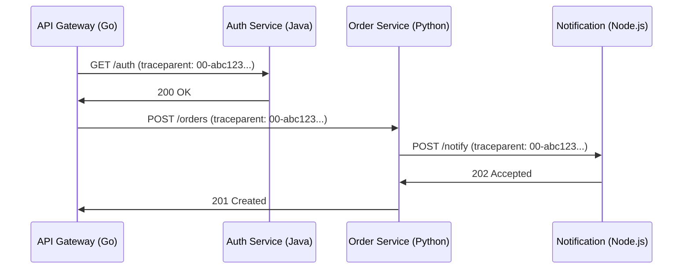

# How to Implement Distributed Tracing for Polyglot Architectures

Author: [nawazdhandala](https://www.github.com/nawazdhandala)

Tags: OpenTelemetry, Distributed Tracing, Polyglot, Microservices, Go, Python, Java, Node.js, Context Propagation

Description: Learn how to implement end-to-end distributed tracing across services written in Go, Python, Java, and Node.js using OpenTelemetry's language-agnostic context propagation.

---

> Most real-world microservice architectures are polyglot. Your API gateway might be in Go, your business logic in Java, your ML pipeline in Python, and your frontend BFF in Node.js. OpenTelemetry's language-agnostic design makes it the only practical way to get unified traces across all of them.

The fundamental challenge with polyglot tracing is not instrumenting individual services. Every language has good tracing libraries. The challenge is stitching traces together across language boundaries so that a single user request produces one continuous trace, regardless of how many languages it crosses.

OpenTelemetry solves this through standardized context propagation and a common data model. This guide shows you how to set it up across four different languages, with all traces flowing into a single backend.

---

## How Cross-Language Tracing Works

When Service A (Go) calls Service B (Python), the trace context needs to travel with the request. OpenTelemetry uses the W3C Trace Context standard to encode trace IDs and span IDs in HTTP headers. Every language SDK knows how to inject and extract these headers.



The `traceparent` header carries the trace ID (`abc123...`) across every service boundary. Each service creates its own spans as children of the incoming span, building a complete trace tree.

---

## Go: API Gateway Instrumentation

Let's start with the Go API gateway. This is typically the entry point for user requests and where the root span is created:

```go
package main

import (
    "context"
    "net/http"

    "go.opentelemetry.io/otel"
    "go.opentelemetry.io/otel/attribute"
    "go.opentelemetry.io/otel/exporters/otlp/otlptrace/otlptracegrpc"
    "go.opentelemetry.io/otel/propagation"
    "go.opentelemetry.io/otel/sdk/resource"
    sdktrace "go.opentelemetry.io/otel/sdk/trace"
    semconv "go.opentelemetry.io/otel/semconv/v1.24.0"
    "go.opentelemetry.io/contrib/instrumentation/net/http/otelhttp"
)

func initTracer() (*sdktrace.TracerProvider, error) {
    ctx := context.Background()

    // Create OTLP exporter pointing to the Collector
    exporter, err := otlptracegrpc.New(ctx,
        otlptracegrpc.WithEndpoint("otel-collector:4317"),
        otlptracegrpc.WithInsecure(),
    )
    if err != nil {
        return nil, err
    }

    // Define this service's identity
    // service.name MUST be consistent and unique per service
    res := resource.NewWithAttributes(
        semconv.SchemaURL,
        semconv.ServiceName("api-gateway"),
        semconv.ServiceVersion("1.5.0"),
        attribute.String("deployment.environment", "production"),
    )

    tp := sdktrace.NewTracerProvider(
        sdktrace.WithBatcher(exporter),
        sdktrace.WithResource(res),
    )

    // Set the global tracer provider and propagator
    // W3C TraceContext propagator ensures cross-language compatibility
    otel.SetTracerProvider(tp)
    otel.SetTextMapPropagator(propagation.TraceContext{})

    return tp, nil
}

func main() {
    tp, _ := initTracer()
    defer tp.Shutdown(context.Background())

    // Wrap the HTTP handler with OpenTelemetry instrumentation
    // This automatically creates spans for incoming requests
    // and propagates context to outgoing requests
    handler := http.HandlerFunc(handleRequest)
    wrappedHandler := otelhttp.NewHandler(handler, "gateway")

    http.ListenAndServe(":8080", wrappedHandler)
}

func handleRequest(w http.ResponseWriter, r *http.Request) {
    ctx := r.Context()
    tracer := otel.Tracer("api-gateway")

    // Create a child span for the auth check
    ctx, authSpan := tracer.Start(ctx, "auth.verify")

    // Use otelhttp.Transport to automatically inject trace context
    // into outgoing HTTP requests to other services
    client := &http.Client{
        Transport: otelhttp.NewTransport(http.DefaultTransport),
    }

    // Call the auth service - trace context is automatically injected
    authReq, _ := http.NewRequestWithContext(ctx, "GET", "http://auth-service:8081/verify", nil)
    authResp, err := client.Do(authReq)
    authSpan.End()

    if err != nil || authResp.StatusCode != 200 {
        http.Error(w, "Unauthorized", 401)
        return
    }

    // Call the order service - same trace, new span
    ctx, orderSpan := tracer.Start(ctx, "orders.create")
    orderReq, _ := http.NewRequestWithContext(ctx, "POST", "http://order-service:8082/orders", r.Body)
    _, err = client.Do(orderReq)
    orderSpan.End()

    if err != nil {
        http.Error(w, "Order failed", 500)
        return
    }

    w.WriteHeader(201)
}
```

The critical piece is `otelhttp.NewTransport`, which automatically injects the `traceparent` header into every outgoing HTTP request. This is how the Go gateway passes trace context to downstream services in any language.

---

## Java: Auth Service Instrumentation

The Java auth service receives the trace context from the Go gateway and continues the same trace:

```java
// AuthApplication.java
// Spring Boot service with OpenTelemetry auto-instrumentation

package com.example.auth;

import io.opentelemetry.api.GlobalOpenTelemetry;
import io.opentelemetry.api.trace.Span;
import io.opentelemetry.api.trace.Tracer;
import io.opentelemetry.context.Scope;
import org.springframework.boot.SpringApplication;
import org.springframework.boot.autoconfigure.SpringBootApplication;
import org.springframework.web.bind.annotation.*;

@SpringBootApplication
@RestController
public class AuthApplication {

    // Get a tracer instance for this service
    // The name helps identify spans from this component in trace views
    private final Tracer tracer = GlobalOpenTelemetry.getTracer("auth-service");

    public static void main(String[] args) {
        SpringApplication.run(AuthApplication.class, args);
    }

    @GetMapping("/verify")
    public String verifyToken(@RequestHeader("Authorization") String token) {
        // The Spring auto-instrumentation already creates a span for this endpoint
        // We create a child span for the specific verification logic
        Span span = tracer.spanBuilder("token.validate")
            .startSpan();

        try (Scope scope = span.makeCurrent()) {
            // Add attributes that help with debugging
            span.setAttribute("auth.token_type", "bearer");

            boolean valid = validateToken(token);
            span.setAttribute("auth.valid", valid);

            if (!valid) {
                span.setAttribute("auth.failure_reason", "expired");
                return "invalid";
            }
            return "valid";
        } finally {
            span.end();
        }
    }

    private boolean validateToken(String token) {
        // Token validation logic
        return token != null && token.startsWith("Bearer ");
    }
}
```

For Java, the easiest approach is using the OpenTelemetry Java agent, which auto-instruments Spring, JDBC, and HTTP clients without code changes:

```bash
# Run the Java service with the OpenTelemetry agent attached
# The agent automatically instruments Spring MVC, RestTemplate, and JDBC
java -javaagent:opentelemetry-javaagent.jar \
  -Dotel.service.name=auth-service \
  -Dotel.exporter.otlp.endpoint=http://otel-collector:4317 \
  -Dotel.propagators=tracecontext \
  -jar auth-service.jar
```

---

## Python: Order Service Instrumentation

The Python order service receives requests from the Go gateway and makes downstream calls to the Node.js notification service:

```python
# order_service.py
# Flask service with OpenTelemetry instrumentation

from flask import Flask, request, jsonify
import requests

from opentelemetry import trace
from opentelemetry.sdk.trace import TracerProvider
from opentelemetry.sdk.trace.export import BatchSpanProcessor
from opentelemetry.exporter.otlp.proto.grpc.trace_exporter import OTLPSpanExporter
from opentelemetry.sdk.resources import Resource
from opentelemetry.instrumentation.flask import FlaskInstrumentor
from opentelemetry.instrumentation.requests import RequestsInstrumentor
from opentelemetry.propagators.textmap import set_global_textmap
from opentelemetry.propagate import set_global_textmap
from opentelemetry.trace.propagation import TraceContextTextMapPropagator

# Configure the tracer provider
resource = Resource.create({
    "service.name": "order-service",
    "service.version": "3.2.0",
    "deployment.environment": "production",
})

provider = TracerProvider(resource=resource)
exporter = OTLPSpanExporter(endpoint="otel-collector:4317", insecure=True)
provider.add_span_processor(BatchSpanProcessor(exporter))
trace.set_tracer_provider(provider)

# Use W3C TraceContext for cross-language compatibility
set_global_textmap(TraceContextTextMapPropagator())

app = Flask(__name__)

# Auto-instrument Flask to create spans for incoming requests
# and extract trace context from the traceparent header
FlaskInstrumentor().instrument_app(app)

# Auto-instrument the requests library to inject trace context
# into outgoing HTTP calls to the notification service
RequestsInstrumentor().instrument()

tracer = trace.get_tracer("order-service")

@app.route("/orders", methods=["POST"])
def create_order():
    # Flask instrumentation already created a span and extracted
    # the trace context from the Go gateway's request

    with tracer.start_as_current_span("order.process") as span:
        order_data = request.get_json()
        span.set_attribute("order.item_count", len(order_data.get("items", [])))

        # Process the order
        order_id = save_order(order_data)
        span.set_attribute("order.id", order_id)

        # Call the Node.js notification service
        # requests instrumentation automatically injects traceparent
        with tracer.start_as_current_span("notification.send"):
            requests.post(
                "http://notification-service:8083/notify",
                json={"order_id": order_id, "type": "confirmation"},
            )

        return jsonify({"order_id": order_id}), 201

def save_order(data):
    with tracer.start_as_current_span("db.insert_order") as span:
        span.set_attribute("db.system", "postgresql")
        span.set_attribute("db.operation", "INSERT")
        # Database insert logic here
        return "ord-12345"

if __name__ == "__main__":
    app.run(port=8082)
```

---

## Node.js: Notification Service Instrumentation

The notification service completes the trace chain:

```javascript
// notification-service.js
// Express service that receives trace context from the Python order service

const { NodeSDK } = require('@opentelemetry/sdk-node');
const { OTLPTraceExporter } = require('@opentelemetry/exporter-trace-otlp-grpc');
const { Resource } = require('@opentelemetry/resources');
const { ATTR_SERVICE_NAME } = require('@opentelemetry/semantic-conventions');
const { HttpInstrumentation } = require('@opentelemetry/instrumentation-http');
const { ExpressInstrumentation } = require('@opentelemetry/instrumentation-express');

// Initialize OpenTelemetry before importing other modules
const sdk = new NodeSDK({
  resource: new Resource({
    [ATTR_SERVICE_NAME]: 'notification-service',
    'service.version': '1.0.0',
    'deployment.environment': 'production',
  }),
  traceExporter: new OTLPTraceExporter({
    url: 'http://otel-collector:4317',
  }),
  instrumentations: [
    new HttpInstrumentation(),
    new ExpressInstrumentation(),
  ],
});

sdk.start();

const express = require('express');
const { trace } = require('@opentelemetry/api');
const app = express();
app.use(express.json());

const tracer = trace.getTracer('notification-service');

app.post('/notify', (req, res) => {
  // Express instrumentation extracts trace context from headers
  // This span is a child of the Python order service's span
  const span = trace.getActiveSpan();
  span.setAttribute('notification.type', req.body.type);
  span.setAttribute('notification.order_id', req.body.order_id);

  // Create a child span for the email sending operation
  const sendSpan = tracer.startSpan('email.send', {
    attributes: {
      'email.recipient': 'customer@example.com',
      'email.template': 'order_confirmation',
    },
  });

  // Simulate sending an email
  setTimeout(() => {
    sendSpan.end();
    res.status(202).json({ status: 'queued' });
  }, 50);
});

app.listen(8083, () => {
  console.log('Notification service running on port 8083');
});
```

---

## The Complete Trace

When a request flows through all four services, the resulting trace looks like this:

```mermaid
gantt
    title Distributed Trace Across 4 Languages
    dateFormat X
    axisFormat %L ms

    section Go (Gateway)
    gateway.handleRequest        :0, 350
    auth.verify                  :10, 80
    orders.create                :90, 250

    section Java (Auth)
    GET /verify                  :20, 50
    token.validate               :25, 40

    section Python (Orders)
    POST /orders                 :100, 230
    order.process                :105, 220
    db.insert_order              :110, 30
    notification.send            :150, 70

    section Node.js (Notify)
    POST /notify                 :160, 55
    email.send                   :165, 50
```



All four services contribute spans to the same trace, linked by the trace ID propagated through `traceparent` headers. Each span carries its own service.name, so your observability backend can color-code and group them.

---

## Common Pitfalls and Solutions

1. **Mismatched propagators**: If one service uses W3C TraceContext and another uses B3 (Zipkin format), traces will break at that boundary. Standardize on `tracecontext` everywhere, or configure the Collector to translate between formats.

2. **Async message queues**: HTTP propagation works automatically, but message queues (Kafka, RabbitMQ) need manual context injection into message headers. Each language has instrumentation libraries for popular queues.

3. **Missing service.name**: Without this attribute, spans from different services appear as "unknown" in your trace viewer. Always set it explicitly.

4. **Clock skew**: Spans from different hosts may have slightly different timestamps due to clock drift. Use NTP on all hosts and keep clocks synchronized within a few milliseconds.

5. **Sampling inconsistencies**: If one service samples at 10% and another at 100%, you get broken traces where some spans are missing. Use head-based sampling at the entry point and propagate the sampling decision downstream.

Polyglot tracing with OpenTelemetry works because the wire protocol (W3C TraceContext) and data model (spans, attributes, events) are standardized across all languages. The SDKs handle the details. You just need to make sure every service is configured to use the same propagator and sends data to the same Collector.
