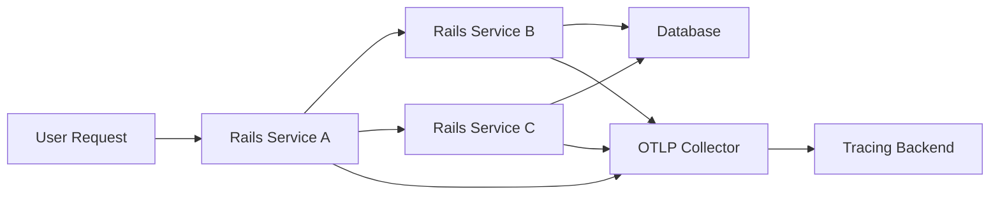

# How to Set Up Distributed Tracing Across Rails Microservices with OpenTelemetry

Author: [nawazdhandala](https://www.github.com/nawazdhandala)

Tags: OpenTelemetry, Ruby, Rails, Distributed Tracing, Microservices

Description: Learn how to implement distributed tracing across multiple Rails microservices using OpenTelemetry to track requests as they flow through your system.

Microservices architectures split monolithic applications into smaller, independent services. When a user request hits your system, it might travel through five different services before completing. Without distributed tracing, debugging issues across this chain becomes a nightmare. You can't see where time is spent, which service is slow, or where errors originate.

OpenTelemetry solves this by connecting traces across service boundaries. Each request gets a unique trace ID that propagates through every service it touches. This creates a complete picture of the request's journey through your system.

## Why Distributed Tracing Matters for Microservices

When you have multiple Rails applications talking to each other, problems compound quickly. A slow database query in Service A might not seem bad until you realize Service B calls Service A three times per request. That 200ms query becomes 600ms of latency.

Traditional logging shows you what happened in each service separately. Distributed tracing shows you the entire story. You see the parent-child relationships between spans, the timing of each operation, and how services depend on each other.

## Setting Up the Infrastructure

Before instrumenting your Rails apps, you need somewhere to send traces. For this guide, we'll assume you have an OpenTelemetry Collector or compatible backend running. The collector should accept OTLP (OpenTelemetry Protocol) over HTTP or gRPC.



## Installing Required Gems

Add these gems to every Rails microservice that should participate in distributed tracing:

```ruby
# Gemfile

# Core OpenTelemetry SDK
gem 'opentelemetry-sdk'

# OTLP exporter for sending traces
gem 'opentelemetry-exporter-otlp'

# Automatic Rails instrumentation
gem 'opentelemetry-instrumentation-rails'

# HTTP client instrumentation (for service-to-service calls)
gem 'opentelemetry-instrumentation-net-http'
gem 'opentelemetry-instrumentation-faraday' # if using Faraday

# Additional instrumentation as needed
gem 'opentelemetry-instrumentation-active_record'
gem 'opentelemetry-instrumentation-redis'
gem 'opentelemetry-instrumentation-sidekiq' # if using Sidekiq
```

Run `bundle install` to install these dependencies.

## Configuring OpenTelemetry in Each Service

Create an initializer that configures OpenTelemetry. This should be identical across all services, though the service name will differ.

```ruby
# config/initializers/opentelemetry.rb

require 'opentelemetry/sdk'
require 'opentelemetry/exporter/otlp'
require 'opentelemetry/instrumentation/all'

OpenTelemetry::SDK.configure do |c|
  # Set the service name - this identifies which service created spans
  c.service_name = ENV['OTEL_SERVICE_NAME'] || 'rails-service-a'

  # Add service version and deployment environment as resource attributes
  c.resource = OpenTelemetry::SDK::Resources::Resource.create(
    'service.version' => ENV['APP_VERSION'] || 'unknown',
    'deployment.environment' => ENV['RAILS_ENV'] || 'development'
  )

  # Configure the OTLP exporter to send traces to your collector
  c.add_span_processor(
    OpenTelemetry::SDK::Trace::Export::BatchSpanProcessor.new(
      OpenTelemetry::Exporter::OTLP::Exporter.new(
        endpoint: ENV['OTEL_EXPORTER_OTLP_ENDPOINT'] || 'http://localhost:4318/v1/traces',
        headers: {
          # Add authentication if required
          'Authorization' => ENV['OTEL_EXPORTER_AUTH_HEADER']
        }.compact
      )
    )
  )

  # Enable automatic instrumentation for Rails and dependencies
  c.use_all({
    'OpenTelemetry::Instrumentation::Rails' => { enable_recognize_route: true },
    'OpenTelemetry::Instrumentation::ActiveRecord' => { enable_sql_obfuscation: true }
  })
end
```

Set environment variables for each service:

```bash
# Service A environment
export OTEL_SERVICE_NAME="user-service"
export OTEL_EXPORTER_OTLP_ENDPOINT="http://collector:4318/v1/traces"
export APP_VERSION="1.2.3"

# Service B environment
export OTEL_SERVICE_NAME="payment-service"
export OTEL_EXPORTER_OTLP_ENDPOINT="http://collector:4318/v1/traces"
export APP_VERSION="2.1.0"
```

## How Context Propagation Works

The magic of distributed tracing happens through context propagation. When Service A calls Service B, it includes trace context in the HTTP headers. Service B extracts this context and continues the trace.

OpenTelemetry uses W3C Trace Context headers by default:
- `traceparent`: Contains trace ID, parent span ID, and sampling decision
- `tracestate`: Optional vendor-specific trace information

The instrumentation libraries handle this automatically. When you make an HTTP request with Net::HTTP or Faraday, the current trace context is injected into headers. When your Rails app receives a request, the context is extracted and used as the parent span.

## Making Service-to-Service Calls

When one Rails service needs to call another, the instrumentation automatically propagates context. Here's what it looks like in practice:

```ruby
# In Service A (user-service)
class UsersController < ApplicationController
  def create
    # Create user in local database
    user = User.create!(user_params)

    # Call payment service to set up billing
    # The net-http instrumentation automatically adds trace context headers
    response = Net::HTTP.post(
      URI("#{ENV['PAYMENT_SERVICE_URL']}/billing"),
      { user_id: user.id, plan: params[:plan] }.to_json,
      'Content-Type' => 'application/json'
    )

    if response.is_a?(Net::HTTPSuccess)
      render json: { user: user, billing: JSON.parse(response.body) }
    else
      # Errors are automatically recorded in spans
      render json: { error: 'Billing setup failed' }, status: :unprocessable_entity
    end
  end

  private

  def user_params
    params.require(:user).permit(:email, :name)
  end
end
```

```ruby
# In Service B (payment-service)
class BillingController < ApplicationController
  def create
    # The Rails instrumentation extracts trace context from incoming headers
    # This span becomes a child of the span from Service A

    user_id = params[:user_id]
    plan = params[:plan]

    # Business logic to create billing record
    billing = Billing.create!(
      user_id: user_id,
      plan: plan,
      status: 'active'
    )

    render json: billing
  end
end
```

## Adding Custom Spans and Attributes

While automatic instrumentation covers HTTP requests and database queries, you often want to trace specific business logic:

```ruby
class OrdersController < ApplicationController
  def process_order
    # Get the current tracer
    tracer = OpenTelemetry.tracer_provider.tracer('orders-service', '1.0')

    # Create a custom span for order validation
    tracer.in_span('validate_order') do |span|
      order = Order.find(params[:id])

      # Add custom attributes to the span
      span.set_attribute('order.id', order.id)
      span.set_attribute('order.total', order.total_amount)
      span.set_attribute('order.items_count', order.items.count)

      unless order.valid_for_processing?
        span.set_attribute('order.validation_failed', true)
        span.add_event('Order validation failed', attributes: {
          'reason' => order.validation_errors.join(', ')
        })

        render json: { error: 'Invalid order' }, status: :unprocessable_entity
        return
      end
    end

    # Process payment (this creates its own spans via service calls)
    tracer.in_span('process_payment') do |span|
      payment_result = charge_payment(order)
      span.set_attribute('payment.success', payment_result[:success])
      span.set_attribute('payment.transaction_id', payment_result[:transaction_id])
    end

    render json: { status: 'processed' }
  end

  private

  def charge_payment(order)
    # Calls to payment service
    response = Net::HTTP.post(
      URI("#{ENV['PAYMENT_SERVICE_URL']}/charge"),
      { amount: order.total_amount, order_id: order.id }.to_json,
      'Content-Type' => 'application/json'
    )

    JSON.parse(response.body, symbolize_names: true)
  end
end
```

## Handling Asynchronous Processing

When you queue background jobs, the trace context needs to propagate to the worker. If you're using Sidekiq, the instrumentation handles this automatically:

```ruby
class OrderProcessingJob
  include Sidekiq::Job

  def perform(order_id)
    # The Sidekiq instrumentation extracts trace context from job metadata
    # This creates a span linked to the original request that enqueued the job

    order = Order.find(order_id)

    tracer = OpenTelemetry.tracer_provider.tracer('worker', '1.0')

    tracer.in_span('fulfill_order') do |span|
      span.set_attribute('order.id', order_id)

      # Call inventory service
      inventory_response = update_inventory(order)
      span.set_attribute('inventory.updated', inventory_response[:success])

      # Call shipping service
      shipping_response = create_shipment(order)
      span.set_attribute('shipment.tracking_number', shipping_response[:tracking])
    end
  end
end
```

## Sampling Strategies for High-Traffic Systems

Recording every single trace can overwhelm your tracing backend and generate massive costs. Sampling reduces the volume while still providing useful data.

```ruby
# config/initializers/opentelemetry.rb

# Configure probabilistic sampling (sample 10% of traces)
OpenTelemetry::SDK.configure do |c|
  c.service_name = ENV['OTEL_SERVICE_NAME']

  # Use parent-based sampler that respects upstream sampling decisions
  c.sampler = OpenTelemetry::SDK::Trace::Samplers::ParentBased.new(
    root: OpenTelemetry::SDK::Trace::Samplers::TraceIdRatioBased.new(0.1)
  )

  # Rest of configuration...
end
```

The parent-based sampler ensures that if a trace is sampled in Service A, all downstream services (B, C, etc.) also record their spans. This prevents incomplete traces where you see the start but not the end.

## Troubleshooting Common Issues

**Traces Don't Connect Between Services**

If you see separate traces instead of one connected trace, context propagation is broken. Check that:
- Both services have HTTP instrumentation enabled
- You're using instrumented HTTP clients (Net::HTTP, Faraday)
- No middleware strips the `traceparent` header
- Services use compatible trace context formats

**High Memory Usage**

The batch span processor queues spans in memory before exporting. For high-throughput services, configure smaller batches:

```ruby
c.add_span_processor(
  OpenTelemetry::SDK::Trace::Export::BatchSpanProcessor.new(
    exporter,
    max_queue_size: 1024,        # Default 2048
    max_export_batch_size: 256,  # Default 512
    schedule_delay: 3000         # Export every 3 seconds
  )
)
```

**Missing Spans in Production**

Check that your exporter can reach the collector. Add timeout configuration to fail fast:

```ruby
OpenTelemetry::Exporter::OTLP::Exporter.new(
  endpoint: ENV['OTEL_EXPORTER_OTLP_ENDPOINT'],
  timeout: 5  # Seconds before giving up
)
```

## Visualizing the Complete Trace

Once everything is configured, a single user request creates a trace that spans multiple services. Your tracing backend will show:

- The root span from the initial Rails controller action
- Child spans for database queries in Service A
- HTTP client span for the call from A to B
- Server span in Service B for receiving the request
- Database query spans in Service B
- Any additional service calls downstream

This complete picture makes it easy to spot slow services, unexpected N+1 queries, or cascading failures. You can see exactly how long each service took and which operations consumed the most time.

Distributed tracing transforms debugging from guesswork into data-driven investigation. When a customer reports a slow page load, you can pull up their exact trace and see every millisecond of processing time across your entire microservices architecture.
