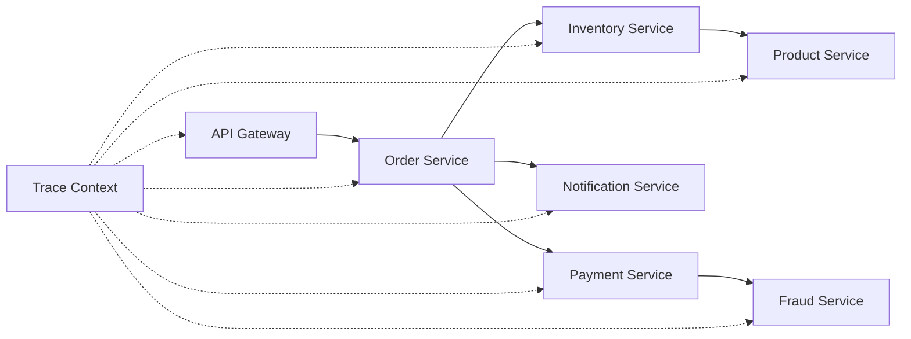

# How to Set Up Distributed Tracing Across Spring Boot Microservices with OpenTelemetry

Author: [nawazdhandala](https://www.github.com/nawazdhandala)

Tags: OpenTelemetry, Distributed Tracing, Spring Boot, Microservices, Context Propagation

Description: Implement end-to-end distributed tracing across Spring Boot microservices using OpenTelemetry for complete visibility into complex service interactions.

Microservices architectures distribute functionality across multiple services, making it challenging to understand request flows. OpenTelemetry's distributed tracing connects spans across service boundaries, providing a unified view of the entire system.

## Understanding Distributed Tracing

Distributed tracing follows a request as it propagates through multiple services:



Each service adds its spans to the same trace, creating a complete picture.

## Architecture Overview

We'll implement tracing for a typical e-commerce microservices architecture:

- **API Gateway**: Routes requests to appropriate services
- **Order Service**: Manages order processing
- **Inventory Service**: Tracks product availability
- **Payment Service**: Handles payment processing
- **Notification Service**: Sends customer notifications

## Common Dependencies for All Services

Each microservice needs these dependencies in `pom.xml`:

```xml
<dependencies>
    <!-- Spring Boot Web -->
    <dependency>
        <groupId>org.springframework.boot</groupId>
        <artifactId>spring-boot-starter-web</artifactId>
    </dependency>

    <!-- OpenTelemetry BOM for version management -->
    <dependency>
        <groupId>io.opentelemetry</groupId>
        <artifactId>opentelemetry-bom</artifactId>
        <version>1.33.0</version>
        <type>pom</type>
        <scope>import</scope>
    </dependency>

    <!-- OpenTelemetry API -->
    <dependency>
        <groupId>io.opentelemetry</groupId>
        <artifactId>opentelemetry-api</artifactId>
    </dependency>

    <!-- OpenTelemetry SDK -->
    <dependency>
        <groupId>io.opentelemetry</groupId>
        <artifactId>opentelemetry-sdk</artifactId>
    </dependency>

    <!-- OTLP Exporter -->
    <dependency>
        <groupId>io.opentelemetry</groupId>
        <artifactId>opentelemetry-exporter-otlp</artifactId>
    </dependency>

    <!-- Spring Boot instrumentation -->
    <dependency>
        <groupId>io.opentelemetry.instrumentation</groupId>
        <artifactId>opentelemetry-spring-boot-starter</artifactId>
        <version>1.33.0-alpha</version>
    </dependency>

    <!-- RestClient instrumentation -->
    <dependency>
        <groupId>io.opentelemetry.instrumentation</groupId>
        <artifactId>opentelemetry-spring-webmvc-6.0</artifactId>
        <version>1.33.0-alpha</version>
    </dependency>
</dependencies>
```

## Shared OpenTelemetry Configuration

Create a base configuration class that each service can extend:

```java
package com.example.config;

import io.opentelemetry.api.OpenTelemetry;
import io.opentelemetry.api.common.Attributes;
import io.opentelemetry.exporter.otlp.http.trace.OtlpHttpSpanExporter;
import io.opentelemetry.sdk.OpenTelemetrySdk;
import io.opentelemetry.sdk.resources.Resource;
import io.opentelemetry.sdk.trace.SdkTracerProvider;
import io.opentelemetry.sdk.trace.export.BatchSpanProcessor;
import io.opentelemetry.semconv.ResourceAttributes;
import org.springframework.beans.factory.annotation.Value;
import org.springframework.context.annotation.Bean;
import org.springframework.context.annotation.Configuration;

/**
 * Base OpenTelemetry configuration for all microservices.
 * Each service should specify its own service name.
 */
@Configuration
public class OpenTelemetryConfig {

    @Value("${spring.application.name}")
    private String serviceName;

    @Value("${otel.exporter.otlp.endpoint:http://localhost:4318}")
    private String otlpEndpoint;

    @Value("${otel.service.version:1.0.0}")
    private String serviceVersion;

    @Value("${otel.deployment.environment:production}")
    private String environment;

    /**
     * Creates the OpenTelemetry SDK instance.
     * This is the entry point for all tracing operations.
     */
    @Bean
    public OpenTelemetry openTelemetry() {
        // Define resource attributes that identify this service
        Resource resource = Resource.getDefault()
            .merge(Resource.create(
                Attributes.builder()
                    .put(ResourceAttributes.SERVICE_NAME, serviceName)
                    .put(ResourceAttributes.SERVICE_VERSION, serviceVersion)
                    .put(ResourceAttributes.DEPLOYMENT_ENVIRONMENT, environment)
                    .put(ResourceAttributes.SERVICE_NAMESPACE, "ecommerce")
                    .build()
            ));

        // Configure OTLP exporter
        OtlpHttpSpanExporter spanExporter = OtlpHttpSpanExporter.builder()
            .setEndpoint(otlpEndpoint + "/v1/traces")
            .build();

        // Build tracer provider with batch processor
        SdkTracerProvider tracerProvider = SdkTracerProvider.builder()
            .addSpanProcessor(
                BatchSpanProcessor.builder(spanExporter)
                    .setMaxQueueSize(2048)
                    .setMaxExportBatchSize(512)
                    .build()
            )
            .setResource(resource)
            .build();

        // Create and return OpenTelemetry SDK
        return OpenTelemetrySdk.builder()
            .setTracerProvider(tracerProvider)
            .buildAndRegisterGlobal();
    }
}
```

## Order Service Implementation

The Order Service orchestrates multiple downstream services:

```java
package com.example.order.controller;

import com.example.order.service.OrderService;
import io.opentelemetry.api.trace.Span;
import org.springframework.http.HttpStatus;
import org.springframework.http.ResponseEntity;
import org.springframework.web.bind.annotation.*;

/**
 * Order API endpoint - entry point for distributed traces.
 */
@RestController
@RequestMapping("/api/orders")
public class OrderController {

    private final OrderService orderService;

    public OrderController(OrderService orderService) {
        this.orderService = orderService;
    }

    /**
     * Creates an order and triggers multiple downstream service calls.
     * This creates the root span for the distributed trace.
     */
    @PostMapping
    public ResponseEntity<OrderResponse> createOrder(
        @RequestBody OrderRequest request
    ) {
        // Add custom attributes to the auto-instrumented span
        Span currentSpan = Span.current();
        currentSpan.setAttribute("order.customer_id", request.getCustomerId());
        currentSpan.setAttribute("order.items_count", request.getItems().size());
        currentSpan.setAttribute("order.total_amount", request.getTotalAmount());

        try {
            OrderResponse response = orderService.processOrder(request);

            currentSpan.setAttribute("order.id", response.getOrderId());
            currentSpan.setAttribute("order.status", response.getStatus());
            currentSpan.addEvent("order_created_successfully");

            return ResponseEntity.status(HttpStatus.CREATED).body(response);

        } catch (Exception e) {
            currentSpan.recordException(e);
            currentSpan.setStatus(
                io.opentelemetry.api.trace.StatusCode.ERROR,
                "Order creation failed"
            );
            throw e;
        }
    }

    @GetMapping("/{orderId}")
    public ResponseEntity<OrderResponse> getOrder(@PathVariable String orderId) {
        Span.current().setAttribute("order.id", orderId);
        return ResponseEntity.ok(orderService.getOrder(orderId));
    }
}
```

The service layer coordinates calls to other microservices:

```java
package com.example.order.service;

import com.example.order.client.*;
import io.opentelemetry.api.OpenTelemetry;
import io.opentelemetry.api.trace.Span;
import io.opentelemetry.api.trace.Tracer;
import io.opentelemetry.context.Scope;
import org.springframework.stereotype.Service;
import org.springframework.transaction.annotation.Transactional;

/**
 * Order Service coordinates multiple microservice calls.
 * Each external call is traced as a child span.
 */
@Service
public class OrderService {

    private final Tracer tracer;
    private final InventoryClient inventoryClient;
    private final PaymentClient paymentClient;
    private final NotificationClient notificationClient;
    private final OrderRepository orderRepository;

    public OrderService(
        OpenTelemetry openTelemetry,
        InventoryClient inventoryClient,
        PaymentClient paymentClient,
        NotificationClient notificationClient,
        OrderRepository orderRepository
    ) {
        this.tracer = openTelemetry.getTracer("order-service", "1.0.0");
        this.inventoryClient = inventoryClient;
        this.paymentClient = paymentClient;
        this.notificationClient = notificationClient;
        this.orderRepository = orderRepository;
    }

    /**
     * Processes order with multiple service interactions.
     * Each step creates spans that are part of the distributed trace.
     */
    @Transactional
    public OrderResponse processOrder(OrderRequest request) {
        Span span = tracer.spanBuilder("OrderService.processOrder")
            .startSpan();

        try (Scope scope = span.makeCurrent()) {
            span.setAttribute("customer.id", request.getCustomerId());
            span.setAttribute("order.amount", request.getTotalAmount());

            // Step 1: Check inventory availability
            span.addEvent("checking_inventory");
            boolean available = checkInventory(request);

            if (!available) {
                span.addEvent("inventory_unavailable");
                throw new InsufficientInventoryException("Items not available");
            }

            // Step 2: Process payment
            span.addEvent("processing_payment");
            PaymentResult paymentResult = processPayment(request);

            if (!paymentResult.isSuccessful()) {
                span.addEvent("payment_failed");
                throw new PaymentFailedException("Payment declined");
            }

            // Step 3: Reserve inventory
            span.addEvent("reserving_inventory");
            reserveInventory(request);

            // Step 4: Create order in database
            span.addEvent("saving_order");
            Order order = saveOrder(request, paymentResult);

            // Step 5: Send notification (async, non-blocking)
            span.addEvent("sending_notification");
            notifyCustomer(order);

            span.setStatus(io.opentelemetry.api.trace.StatusCode.OK);
            span.addEvent("order_completed");

            return new OrderResponse(
                order.getId(),
                "CONFIRMED",
                paymentResult.getTransactionId()
            );

        } catch (Exception e) {
            span.recordException(e);
            span.setStatus(io.opentelemetry.api.trace.StatusCode.ERROR);
            throw e;
        } finally {
            span.end();
        }
    }

    private boolean checkInventory(OrderRequest request) {
        Span span = tracer.spanBuilder("check_inventory")
            .startSpan();

        try (Scope scope = span.makeCurrent()) {
            // Call to Inventory Service - trace context propagates automatically
            return inventoryClient.checkAvailability(
                request.getItems()
            );
        } finally {
            span.end();
        }
    }

    private PaymentResult processPayment(OrderRequest request) {
        Span span = tracer.spanBuilder("process_payment")
            .startSpan();

        try (Scope scope = span.makeCurrent()) {
            span.setAttribute("payment.amount", request.getTotalAmount());

            // Call to Payment Service - trace context propagates
            return paymentClient.processPayment(
                request.getCustomerId(),
                request.getTotalAmount(),
                request.getPaymentMethod()
            );
        } finally {
            span.end();
        }
    }

    private void reserveInventory(OrderRequest request) {
        Span span = tracer.spanBuilder("reserve_inventory")
            .startSpan();

        try (Scope scope = span.makeCurrent()) {
            inventoryClient.reserveItems(request.getItems());
        } finally {
            span.end();
        }
    }

    private Order saveOrder(OrderRequest request, PaymentResult payment) {
        // Database operation - automatically traced
        return orderRepository.save(
            new Order(request, payment.getTransactionId())
        );
    }

    private void notifyCustomer(Order order) {
        // Async notification - trace context is linked
        notificationClient.sendOrderConfirmation(
            order.getCustomerId(),
            order.getId()
        );
    }

    public OrderResponse getOrder(String orderId) {
        return orderRepository.findById(orderId)
            .map(order -> new OrderResponse(
                order.getId(),
                order.getStatus(),
                order.getTransactionId()
            ))
            .orElseThrow(() -> new OrderNotFoundException(orderId));
    }
}
```

## REST Client with Context Propagation

Configure RestTemplate or WebClient to propagate trace context:

```java
package com.example.order.client;

import io.opentelemetry.api.OpenTelemetry;
import io.opentelemetry.instrumentation.spring.webmvc.v6_0.SpringWebMvcTelemetry;
import org.springframework.context.annotation.Bean;
import org.springframework.context.annotation.Configuration;
import org.springframework.web.client.RestClient;

/**
 * Configures REST clients with automatic trace propagation.
 */
@Configuration
public class RestClientConfig {

    private final OpenTelemetry openTelemetry;

    public RestClientConfig(OpenTelemetry openTelemetry) {
        this.openTelemetry = openTelemetry;
    }

    /**
     * Creates a RestClient that automatically propagates trace context.
     * W3C Trace Context headers are automatically added to requests.
     */
    @Bean
    public RestClient restClient() {
        return RestClient.builder()
            .requestInterceptor((request, body, execution) -> {
                // OpenTelemetry automatically injects trace headers here
                // Headers: traceparent, tracestate
                return execution.execute(request, body);
            })
            .build();
    }
}
```

Implement clients for downstream services:

```java
package com.example.order.client;

import io.opentelemetry.api.trace.Span;
import org.springframework.beans.factory.annotation.Value;
import org.springframework.stereotype.Component;
import org.springframework.web.client.RestClient;

import java.util.List;

/**
 * Client for Inventory Service.
 * Trace context is automatically propagated via HTTP headers.
 */
@Component
public class InventoryClient {

    private final RestClient restClient;
    private final String inventoryServiceUrl;

    public InventoryClient(
        RestClient restClient,
        @Value("${services.inventory.url}") String inventoryServiceUrl
    ) {
        this.restClient = restClient;
        this.inventoryServiceUrl = inventoryServiceUrl;
    }

    /**
     * Checks if items are available.
     * Creates a CLIENT span that connects to the SERVER span in Inventory Service.
     */
    public boolean checkAvailability(List<OrderItem> items) {
        Span.current().setAttribute("inventory.items_count", items.size());

        AvailabilityResponse response = restClient.post()
            .uri(inventoryServiceUrl + "/api/inventory/check")
            .body(new AvailabilityRequest(items))
            .retrieve()
            .body(AvailabilityResponse.class);

        Span.current().setAttribute("inventory.available",
            response != null && response.isAvailable());

        return response != null && response.isAvailable();
    }

    public void reserveItems(List<OrderItem> items) {
        Span.current().setAttribute("inventory.reserve_count", items.size());

        restClient.post()
            .uri(inventoryServiceUrl + "/api/inventory/reserve")
            .body(new ReservationRequest(items))
            .retrieve()
            .toBodilessEntity();

        Span.current().addEvent("items_reserved");
    }
}

/**
 * Client for Payment Service.
 */
@Component
public class PaymentClient {

    private final RestClient restClient;
    private final String paymentServiceUrl;

    public PaymentClient(
        RestClient restClient,
        @Value("${services.payment.url}") String paymentServiceUrl
    ) {
        this.restClient = restClient;
        this.paymentServiceUrl = paymentServiceUrl;
    }

    public PaymentResult processPayment(
        String customerId,
        double amount,
        String paymentMethod
    ) {
        Span.current().setAttribute("payment.amount", amount);
        Span.current().setAttribute("payment.method", paymentMethod);

        PaymentResult result = restClient.post()
            .uri(paymentServiceUrl + "/api/payments/process")
            .body(new PaymentRequest(customerId, amount, paymentMethod))
            .retrieve()
            .body(PaymentResult.class);

        if (result != null) {
            Span.current().setAttribute("payment.transaction_id",
                result.getTransactionId());
            Span.current().setAttribute("payment.successful",
                result.isSuccessful());
        }

        return result;
    }
}
```

## Inventory Service Implementation

The Inventory Service receives propagated trace context:

```java
package com.example.inventory.controller;

import com.example.inventory.service.InventoryService;
import io.opentelemetry.api.trace.Span;
import org.springframework.web.bind.annotation.*;

/**
 * Inventory Service endpoint.
 * Receives trace context from Order Service automatically.
 */
@RestController
@RequestMapping("/api/inventory")
public class InventoryController {

    private final InventoryService inventoryService;

    public InventoryController(InventoryService inventoryService) {
        this.inventoryService = inventoryService;
    }

    /**
     * Checks item availability.
     * The incoming trace context is automatically extracted from headers.
     */
    @PostMapping("/check")
    public AvailabilityResponse checkAvailability(
        @RequestBody AvailabilityRequest request
    ) {
        Span currentSpan = Span.current();
        currentSpan.setAttribute("inventory.operation", "check");
        currentSpan.setAttribute("inventory.items_count",
            request.getItems().size());

        boolean available = inventoryService.checkAvailability(
            request.getItems()
        );

        currentSpan.setAttribute("inventory.result", available);

        return new AvailabilityResponse(available);
    }

    @PostMapping("/reserve")
    public void reserveItems(@RequestBody ReservationRequest request) {
        Span.current().setAttribute("inventory.operation", "reserve");
        inventoryService.reserveItems(request.getItems());
    }
}
```

## Payment Service with External API Calls

Payment Service may call external services (fraud detection, payment gateways):

```java
package com.example.payment.service;

import io.opentelemetry.api.OpenTelemetry;
import io.opentelemetry.api.trace.Span;
import io.opentelemetry.api.trace.Tracer;
import io.opentelemetry.context.Scope;
import org.springframework.stereotype.Service;

/**
 * Payment Service that includes fraud detection.
 */
@Service
public class PaymentService {

    private final Tracer tracer;
    private final FraudDetectionClient fraudClient;
    private final PaymentGatewayClient gatewayClient;

    public PaymentService(
        OpenTelemetry openTelemetry,
        FraudDetectionClient fraudClient,
        PaymentGatewayClient gatewayClient
    ) {
        this.tracer = openTelemetry.getTracer("payment-service", "1.0.0");
        this.fraudClient = fraudClient;
        this.gatewayClient = gatewayClient;
    }

    public PaymentResult processPayment(PaymentRequest request) {
        Span span = tracer.spanBuilder("PaymentService.processPayment")
            .startSpan();

        try (Scope scope = span.makeCurrent()) {
            span.setAttribute("payment.amount", request.getAmount());
            span.setAttribute("customer.id", request.getCustomerId());

            // Check for fraud - trace extends to external service
            span.addEvent("fraud_check_started");
            FraudCheckResult fraudCheck = fraudClient.checkFraud(request);

            if (fraudCheck.isFraudulent()) {
                span.addEvent("fraud_detected");
                span.setAttribute("fraud.score", fraudCheck.getScore());
                return PaymentResult.declined("Fraud detected");
            }

            // Process with payment gateway - external API call traced
            span.addEvent("payment_processing");
            GatewayResponse gatewayResponse = gatewayClient.charge(
                request.getAmount(),
                request.getPaymentMethod()
            );

            span.setAttribute("payment.gateway_response",
                gatewayResponse.getStatus());
            span.setAttribute("payment.transaction_id",
                gatewayResponse.getTransactionId());

            return new PaymentResult(
                gatewayResponse.isSuccessful(),
                gatewayResponse.getTransactionId()
            );

        } catch (Exception e) {
            span.recordException(e);
            span.setStatus(io.opentelemetry.api.trace.StatusCode.ERROR);
            throw e;
        } finally {
            span.end();
        }
    }
}
```

## Configuration for Each Service

Each service needs its own `application.yml`:

```yaml
# Order Service (port 8080)
spring:
  application:
    name: order-service
server:
  port: 8080

services:
  inventory:
    url: http://localhost:8081
  payment:
    url: http://localhost:8082
  notification:
    url: http://localhost:8083

otel:
  exporter:
    otlp:
      endpoint: http://localhost:4318
  service:
    version: 1.0.0
  deployment:
    environment: production
```

```yaml
# Inventory Service (port 8081)
spring:
  application:
    name: inventory-service
server:
  port: 8081

# Similar OTEL configuration...
```

## Viewing Distributed Traces

When you make a request to create an order, the trace will show:

1. **order-service**: Root span for order creation
2. **order-service**: Child span for inventory check
3. **inventory-service**: Server span receiving the check request
4. **inventory-service**: Database query spans
5. **order-service**: Child span for payment processing
6. **payment-service**: Server span receiving payment request
7. **payment-service**: Fraud check external API call
8. **payment-service**: Payment gateway API call
9. **order-service**: Database save operation
10. **order-service**: Notification trigger

All these spans share the same trace ID, creating a complete picture of the request flow.

## Best Practices for Distributed Tracing

**Service Naming:** Use consistent, descriptive service names that clearly identify each component's purpose.

**Span Attributes:** Add business context (customer IDs, order amounts, item counts) to make traces searchable and meaningful.

**Error Handling:** Always record exceptions and set error status on spans to identify failure points.

**Async Operations:** For fire-and-forget operations, use span links to connect related but non-blocking work.

**Sampling:** In high-traffic production systems, implement sampling to reduce trace volume while maintaining visibility.

**Resource Attributes:** Include deployment environment, version, and namespace to differentiate between deployments.

Distributed tracing with OpenTelemetry transforms opaque microservice interactions into transparent, debuggable flows that dramatically reduce mean time to resolution for production issues.
