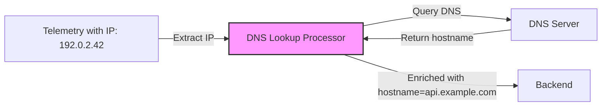

# How to Configure the DNS Lookup Processor in the OpenTelemetry Collector

Author: [nawazdhandala](https://www.github.com/nawazdhandala)

Tags: OpenTelemetry, Collector, Processors, DNS, Hostname Resolution, Observability, Network

Description: Learn how to configure the DNS Lookup Processor in OpenTelemetry Collector to resolve IP addresses to hostnames and enrich telemetry with human-readable network context.

IP addresses in your telemetry are precise but not human-readable. The DNS Lookup Processor solves this by performing reverse DNS lookups on IP addresses and adding corresponding hostnames to your telemetry data. This makes troubleshooting easier, improves correlation across systems, and provides better context for network-related issues.

## What Is the DNS Lookup Processor?

The DNS Lookup Processor performs DNS lookups (forward and reverse) on IP addresses found in telemetry data. It queries DNS servers to resolve IPs to hostnames or hostnames to IPs, then adds the resolved values as new attributes. This enrichment happens in real-time as telemetry flows through the Collector pipeline.

This is useful when:

- You need human-readable hostnames for debugging network issues
- Your monitoring dashboards should display service names instead of IPs
- You want to correlate telemetry from services that reference each other by IP
- You need to identify which services are communicating based on DNS patterns
- Compliance requires logging full network context including hostnames

## Architecture Overview

The DNS Lookup Processor queries DNS servers to enrich telemetry with hostname data:



The processor reads IP addresses from configured attributes, performs DNS lookups against configured resolvers, and adds hostname attributes to the telemetry data.

## Basic Configuration

Here's a minimal DNS Lookup Processor configuration that resolves IP addresses to hostnames:

```yaml
# Configure receivers to accept telemetry
receivers:
  otlp:
    protocols:
      grpc:
        endpoint: 0.0.0.0:4317
      http:
        endpoint: 0.0.0.0:4318

# Define the DNS Lookup Processor
processors:
  # The dns processor resolves IP addresses to hostnames
  dns:
    # Specify which attribute contains the IP address to resolve
    # This should be an attribute containing a valid IPv4 or IPv6 address
    source:
      attribute: server.address

    # Define where to store the resolved hostname
    # This creates a new attribute with the DNS lookup result
    destination:
      attribute: server.hostname

    # Configure DNS resolution settings
    resolver:
      # Use system DNS resolver (default)
      # Queries the DNS servers configured in /etc/resolv.conf
      type: system

      # Timeout for DNS queries (default: 5s)
      # If DNS doesn't respond within this time, lookup fails
      timeout: 5s

  # Batch processor for efficient export
  batch:
    timeout: 10s
    send_batch_size: 1024

# Configure export destination
exporters:
  otlphttp:
    endpoint: https://oneuptime.com/otlp
    headers:
      x-oneuptime-token: ${ONEUPTIME_TOKEN}

# Wire everything together in pipelines
service:
  pipelines:
    # Traces pipeline with DNS enrichment
    traces:
      receivers: [otlp]
      processors: [dns, batch]
      exporters: [otlphttp]

    # Logs pipeline with DNS enrichment
    logs:
      receivers: [otlp]
      processors: [dns, batch]
      exporters: [otlphttp]
```

## Understanding DNS Lookup Modes

The DNS Lookup Processor supports different lookup modes:

### Reverse DNS Lookup (PTR Records)

Resolve IP addresses to hostnames:

```yaml
processors:
  dns/reverse:
    # Resolve IP to hostname
    source:
      attribute: client.address

    destination:
      attribute: client.hostname

    # Lookup type: reverse (IP → hostname)
    lookup_type: reverse

    resolver:
      type: system
      timeout: 5s
```

### Forward DNS Lookup (A/AAAA Records)

Resolve hostnames to IP addresses:

```yaml
processors:
  dns/forward:
    # Resolve hostname to IP
    source:
      attribute: server.hostname

    destination:
      attribute: server.resolved_ip

    # Lookup type: forward (hostname → IP)
    lookup_type: forward

    resolver:
      type: system
      timeout: 5s
```

### Both Forward and Reverse

Perform bidirectional lookups:

```yaml
processors:
  dns/bidirectional:
    # Try to resolve in both directions
    source:
      attribute: network.peer

    destination:
      attribute: network.peer.resolved

    # Lookup type: both (auto-detect if source is IP or hostname)
    lookup_type: auto

    resolver:
      type: system
      timeout: 5s
```

## Advanced Configuration

### Custom DNS Resolvers

Use specific DNS servers instead of system defaults:

```yaml
processors:
  dns:
    source:
      attribute: server.address

    destination:
      attribute: server.hostname

    # Configure custom DNS servers
    resolver:
      # Use custom DNS servers
      type: custom

      # List of DNS servers to query (in order)
      # Processor will try each server until one succeeds
      servers:
        - 8.8.8.8:53       # Google DNS
        - 8.8.4.4:53       # Google DNS (secondary)
        - 1.1.1.1:53       # Cloudflare DNS

      # Timeout for each DNS query
      timeout: 3s

      # Number of retry attempts per server
      retries: 2

      # Protocol to use: udp or tcp
      protocol: udp
```

### Multiple DNS Lookups

Resolve different attributes using different configurations:

```yaml
processors:
  # Resolve client IPs to hostnames
  dns/client:
    source:
      attribute: client.address

    destination:
      attribute: client.hostname

    lookup_type: reverse

    resolver:
      type: system
      timeout: 5s

    # Only perform lookup if client.address exists
    require_source: true

  # Resolve server IPs to hostnames
  dns/server:
    source:
      attribute: server.address

    destination:
      attribute: server.hostname

    lookup_type: reverse

    resolver:
      type: system
      timeout: 5s

    require_source: true

  # Resolve database host
  dns/database:
    source:
      attribute: db.connection_string

    destination:
      attribute: db.host.resolved

    lookup_type: auto

    resolver:
      type: custom
      servers:
        - 10.0.0.10:53  # Internal DNS server

    # Extract hostname from connection string first
    extract_pattern: "^[^@]*@([^:/]+)"
```

## Production Configuration Example

Here's a complete production-ready configuration with DNS resolution, caching, and error handling:

```yaml
receivers:
  otlp:
    protocols:
      grpc:
        endpoint: 0.0.0.0:4317
      http:
        endpoint: 0.0.0.0:4318

processors:
  # Memory limiter prevents OOM issues
  memory_limiter:
    check_interval: 1s
    limit_mib: 1024
    spike_limit_mib: 256

  # Extract IP addresses from various sources
  attributes/extract_ips:
    actions:
      # Extract client IP from X-Forwarded-For
      - key: client.ip
        from_attribute: http.request.header.x-forwarded-for
        action: insert

      # Extract client IP from socket peer address
      - key: client.ip
        from_attribute: net.sock.peer.addr
        action: insert

      # Extract server IP from various attributes
      - key: server.ip
        from_attribute: net.peer.ip
        action: insert

  # Resolve client IPs to hostnames
  dns/client:
    source:
      attribute: client.ip

    destination:
      attribute: client.hostname

    lookup_type: reverse

    resolver:
      # Use fast public DNS for client lookups
      type: custom
      servers:
        - 8.8.8.8:53
        - 1.1.1.1:53
      timeout: 2s
      retries: 1
      protocol: udp

    # Cache DNS lookups to improve performance
    cache:
      enabled: true
      # Cache size: number of entries to keep
      max_size: 10000
      # TTL for cached entries
      ttl: 30m
      # Respect DNS TTL from response
      respect_dns_ttl: true

    # Skip lookup if IP is private/internal
    skip_private: true

    # Don't fail processing if DNS lookup fails
    on_error: continue

  # Resolve server IPs to hostnames
  dns/server:
    source:
      attribute: server.ip

    destination:
      attribute: server.hostname

    lookup_type: reverse

    resolver:
      # Use internal DNS for server lookups
      type: custom
      servers:
        - 10.0.0.10:53   # Primary internal DNS
        - 10.0.0.11:53   # Secondary internal DNS
      timeout: 3s
      retries: 2
      protocol: udp

    cache:
      enabled: true
      max_size: 5000
      ttl: 1h
      respect_dns_ttl: true

    # Always perform lookup for server IPs
    skip_private: false

    on_error: continue

  # Resolve database hosts
  dns/database:
    source:
      attribute: db.system

    destination:
      attribute: db.host.resolved

    lookup_type: forward

    resolver:
      type: custom
      servers:
        - 10.0.0.10:53
      timeout: 5s

    cache:
      enabled: true
      max_size: 1000
      ttl: 2h

    on_error: continue

  # Add metadata about DNS resolution
  attributes/dns_metadata:
    actions:
      # Mark telemetry as DNS-enriched
      - key: dns.enriched
        value: "true"
        action: insert

      # Add timestamp of DNS resolution
      - key: dns.resolved_at
        value: "${timestamp}"
        action: insert

  # Resource processor adds deployment context
  resource:
    attributes:
      - key: collector.dns.resolver
        value: "custom"
        action: upsert

  # Batch processor for efficient export
  batch:
    timeout: 10s
    send_batch_size: 1024
    send_batch_max_size: 2048

exporters:
  # Primary backend
  otlphttp/primary:
    endpoint: https://oneuptime.com/otlp
    headers:
      x-oneuptime-token: ${ONEUPTIME_TOKEN}
    compression: gzip
    retry_on_failure:
      enabled: true
      initial_interval: 5s
      max_interval: 30s
      max_elapsed_time: 300s

  # Debug logging
  logging:
    loglevel: info
    sampling_initial: 5
    sampling_thereafter: 50

service:
  extensions: [health_check, pprof]

  pipelines:
    traces:
      receivers: [otlp]
      processors:
        - memory_limiter
        - attributes/extract_ips
        - dns/client
        - dns/server
        - dns/database
        - attributes/dns_metadata
        - resource
        - batch
      exporters: [otlphttp/primary]

    logs:
      receivers: [otlp]
      processors:
        - memory_limiter
        - attributes/extract_ips
        - dns/client
        - dns/server
        - attributes/dns_metadata
        - resource
        - batch
      exporters: [otlphttp/primary]

    metrics:
      receivers: [otlp]
      processors:
        - memory_limiter
        - batch
      exporters: [otlphttp/primary]

extensions:
  health_check:
    endpoint: 0.0.0.0:13133
  pprof:
    endpoint: 0.0.0.0:1777
```

## Deployment in Kubernetes

Deploy the DNS Lookup Processor in Kubernetes with proper DNS configuration:

```yaml
apiVersion: v1
kind: ConfigMap
metadata:
  name: otel-collector-config
  namespace: observability
data:
  collector.yaml: |
    receivers:
      otlp:
        protocols:
          grpc:
            endpoint: 0.0.0.0:4317
          http:
            endpoint: 0.0.0.0:4318

    processors:
      memory_limiter:
        check_interval: 1s
        limit_mib: 1024

      attributes/extract_ips:
        actions:
          - key: client.ip
            from_attribute: http.request.header.x-forwarded-for
            action: insert
          - key: client.ip
            from_attribute: net.sock.peer.addr
            action: insert

      dns/client:
        source:
          attribute: client.ip
        destination:
          attribute: client.hostname
        lookup_type: reverse
        resolver:
          type: custom
          servers:
            - 8.8.8.8:53
            - 1.1.1.1:53
          timeout: 2s
        cache:
          enabled: true
          max_size: 10000
          ttl: 30m
        skip_private: true
        on_error: continue

      dns/server:
        source:
          attribute: server.address
        destination:
          attribute: server.hostname
        lookup_type: reverse
        resolver:
          type: system
          timeout: 3s
        cache:
          enabled: true
          max_size: 5000
          ttl: 1h
        on_error: continue

      batch:
        timeout: 10s
        send_batch_size: 1024

    exporters:
      otlphttp:
        endpoint: https://oneuptime.com/otlp
        headers:
          x-oneuptime-token: ${ONEUPTIME_TOKEN}

    service:
      pipelines:
        traces:
          receivers: [otlp]
          processors: [memory_limiter, attributes/extract_ips, dns/client, dns/server, batch]
          exporters: [otlphttp]
---
apiVersion: apps/v1
kind: Deployment
metadata:
  name: otel-collector
  namespace: observability
spec:
  replicas: 3
  selector:
    matchLabels:
      app: otel-collector
  template:
    metadata:
      labels:
        app: otel-collector
    spec:
      # Use host DNS for better resolution
      dnsPolicy: ClusterFirstWithHostNet
      hostNetwork: false

      containers:
      - name: otel-collector
        image: otel/opentelemetry-collector-contrib:0.93.0
        args:
          - "--config=/conf/collector.yaml"
        env:
        - name: ONEUPTIME_TOKEN
          valueFrom:
            secretKeyRef:
              name: oneuptime-credentials
              key: token
        volumeMounts:
        - name: config
          mountPath: /conf
        ports:
        - containerPort: 4317
          name: otlp-grpc
        - containerPort: 4318
          name: otlp-http
        resources:
          requests:
            memory: "1Gi"
            cpu: "500m"
          limits:
            memory: "2Gi"
            cpu: "1000m"
        livenessProbe:
          httpGet:
            path: /
            port: 13133
          initialDelaySeconds: 30
          periodSeconds: 10
        readinessProbe:
          httpGet:
            path: /
            port: 13133
          initialDelaySeconds: 10
          periodSeconds: 5
      volumes:
      - name: config
        configMap:
          name: otel-collector-config
---
apiVersion: v1
kind: Service
metadata:
  name: otel-collector
  namespace: observability
spec:
  type: ClusterIP
  selector:
    app: otel-collector
  ports:
  - name: otlp-grpc
    port: 4317
    targetPort: 4317
  - name: otlp-http
    port: 4318
    targetPort: 4318
```

## Use Cases and Queries

### Network Troubleshooting

Query telemetry by hostname for easier debugging:

```
# Find slow requests to specific hosts
span.duration > 1s
WHERE server.hostname LIKE "%.database.local"
GROUP BY server.hostname
ORDER BY p95(duration) DESC

# Identify communication patterns
SELECT source.hostname, destination.hostname, COUNT(*)
FROM spans
WHERE span.kind = "client"
GROUP BY source.hostname, destination.hostname
ORDER BY count DESC
```

### Service Discovery Validation

Verify that services are resolving expected hostnames:

```
# Check if services are hitting the right backends
SELECT db.host.resolved, COUNT(*)
FROM spans
WHERE db.system = "postgresql"
GROUP BY db.host.resolved

# Detect unexpected hostname patterns
SELECT client.hostname
FROM spans
WHERE client.hostname NOT LIKE "%.expected-domain.com"
AND client.hostname IS NOT NULL
```

### Network Policy Enforcement

Alert on connections to unauthorized hosts:

```yaml
# Alert configuration example
alerts:
  - name: unauthorized_network_connection
    query: |
      COUNT(spans)
      WHERE server.hostname NOT IN (
        "api.internal.corp",
        "db.internal.corp",
        "cache.internal.corp"
      )
      AND span.kind = "client"
    threshold: 5
    window: 5m
    severity: high
```

## Validating DNS Resolution

To verify that the DNS Lookup Processor is working correctly:

```yaml
exporters:
  # Add logging exporter to see resolved hostnames
  logging:
    loglevel: debug
    sampling_initial: 10
    sampling_thereafter: 100

service:
  pipelines:
    traces:
      receivers: [otlp]
      processors: [attributes/extract_ips, dns/client, dns/server, batch]
      # Include logging exporter for validation
      exporters: [otlphttp, logging]
```

Check the Collector logs to verify DNS resolution:

```bash
# View Collector logs
kubectl logs -n observability deployment/otel-collector -f | grep -E "dns|hostname"

# Expected output showing resolved hostnames:
# client.ip=203.0.113.42
# client.hostname=client-42.example.com
# server.address=10.0.1.50
# server.hostname=api-server-01.internal.corp
```

## Performance Optimization

DNS lookups can add latency to telemetry processing. Optimize with these techniques:

### Aggressive Caching

Cache DNS lookups to minimize query overhead:

```yaml
processors:
  dns:
    source:
      attribute: client.ip
    destination:
      attribute: client.hostname

    cache:
      enabled: true
      # Large cache for high-traffic scenarios
      max_size: 50000
      # Longer TTL for stable hostnames
      ttl: 2h
      # Respect DNS TTL but cap at 2 hours
      respect_dns_ttl: true
      # Negative caching: cache failed lookups
      cache_negatives: true
      negative_ttl: 10m
```

### Parallel DNS Queries

Configure multiple DNS servers for faster resolution:

```yaml
processors:
  dns:
    source:
      attribute: client.ip
    destination:
      attribute: client.hostname

    resolver:
      type: custom
      # Query multiple servers in parallel
      servers:
        - 8.8.8.8:53
        - 8.8.4.4:53
        - 1.1.1.1:53
      # Short timeout with parallel queries
      timeout: 1s
      # Use UDP for speed
      protocol: udp
      # Query servers in parallel instead of sequentially
      parallel: true
```

### Selective Resolution

Only resolve IPs that need hostname context:

```yaml
processors:
  # Filter to only include external traffic
  filter/external_only:
    traces:
      span:
        - 'attributes["span.kind"] == "client"'
        - 'attributes["http.url"] != nil'

  dns:
    source:
      attribute: server.address
    destination:
      attribute: server.hostname

    # Skip resolution for known internal IPs
    skip_patterns:
      - "^10\\."
      - "^172\\.(1[6-9]|2[0-9]|3[0-1])\\."
      - "^192\\.168\\."

service:
  pipelines:
    traces:
      receivers: [otlp]
      processors: [filter/external_only, dns, batch]
      exporters: [otlphttp]
```

## Monitoring DNS Processor

Track DNS Processor metrics to ensure resolution is working efficiently:

```yaml
service:
  telemetry:
    logs:
      level: info
    metrics:
      level: detailed
      address: 0.0.0.0:8888

# Monitor these metrics:
# - otelcol_processor_dns_lookups_total
# - otelcol_processor_dns_lookup_errors_total
# - otelcol_processor_dns_cache_hits_total
# - otelcol_processor_dns_cache_misses_total
# - otelcol_processor_dns_lookup_duration_seconds
```

Create alerts for:

- DNS lookup error rate exceeding threshold
- Cache hit rate dropping below expected values
- DNS resolution latency increasing
- Specific DNS servers becoming unresponsive

## Troubleshooting

### DNS Timeouts

If DNS queries frequently timeout:

```yaml
processors:
  dns:
    source:
      attribute: client.ip
    destination:
      attribute: client.hostname

    resolver:
      # Increase timeout
      timeout: 10s
      # Add more retry attempts
      retries: 3
      # Try TCP if UDP fails
      fallback_protocol: tcp

    # Don't block processing on DNS failures
    on_error: continue
```

### Wrong DNS Servers

If hostnames resolve incorrectly:

```yaml
processors:
  dns:
    resolver:
      type: custom
      # Explicitly specify correct DNS servers
      servers:
        - 10.0.0.10:53  # Verify these are correct
        - 10.0.0.11:53

    # Enable debug logging
    debug:
      enabled: true
      log_queries: true
```

Check which DNS servers are being queried:

```bash
# View DNS query logs
kubectl logs -n observability deployment/otel-collector | grep "dns query"

# Expected output:
# DNS query: 203.0.113.42 -> api.example.com (server: 8.8.8.8:53, duration: 15ms)
```

### Private IP Resolution

If private IPs aren't resolving:

```yaml
processors:
  dns:
    source:
      attribute: server.address
    destination:
      attribute: server.hostname

    # Don't skip private IPs if you want internal DNS resolution
    skip_private: false

    resolver:
      # Use internal DNS servers that know private hostnames
      type: custom
      servers:
        - 10.0.0.10:53
```

## Security Considerations

When using the DNS Lookup Processor, consider security implications:

1. **DNS hijacking**: Validate that DNS servers are trusted and authenticated
2. **Data exfiltration**: DNS queries can leak information about your infrastructure
3. **Cache poisoning**: Use DNSSEC where possible to prevent cache poisoning
4. **Privacy**: Hostname resolution may reveal internal architecture details

Example security-focused configuration:

```yaml
processors:
  dns:
    source:
      attribute: client.ip
    destination:
      attribute: client.hostname

    resolver:
      # Use trusted internal DNS only
      type: custom
      servers:
        - 10.0.0.10:53

      # Enable DNSSEC validation
      dnssec: true

      # Use DNS over TLS for encrypted queries
      tls:
        enabled: true
        insecure_skip_verify: false
        ca_file: /etc/ssl/certs/ca-bundle.crt

    # Don't cache sensitive lookups
    cache:
      enabled: false

    # Log failed lookups for security monitoring
    on_error: log
```

## Best Practices

1. **Enable caching aggressively**: DNS lookups are slow; cache as much as possible
2. **Use appropriate DNS servers**: Public DNS for external IPs, internal DNS for private IPs
3. **Set reasonable timeouts**: Balance between accuracy and performance (2-5s is typical)
4. **Handle errors gracefully**: Use `on_error: continue` to prevent DNS issues from blocking telemetry
5. **Monitor cache hit rates**: Track cache effectiveness and tune size/TTL accordingly

## Related Resources

- [What is OpenTelemetry Collector and Why Use One](https://oneuptime.com/blog/post/2025-09-18-what-is-opentelemetry-collector-and-why-use-one/view)
- [How to Reduce Noise in OpenTelemetry](https://oneuptime.com/blog/post/2025-08-25-how-to-reduce-noise-in-opentelemetry/view)
- [How to Configure the GeoIP Processor in OpenTelemetry Collector](https://oneuptime.com/blog/post/geoip-processor-opentelemetry-collector/view)

## Final Thoughts

The DNS Lookup Processor transforms raw IP addresses into human-readable hostnames, making telemetry data more intuitive and easier to troubleshoot. By resolving IPs to hostnames, you enable better correlation, simpler queries, and more effective incident response.

Start with basic reverse DNS lookups, enable aggressive caching for performance, and use custom DNS servers appropriate for your environment. With the DNS Lookup Processor, you gain network context that makes your observability data more actionable and your troubleshooting more efficient.
