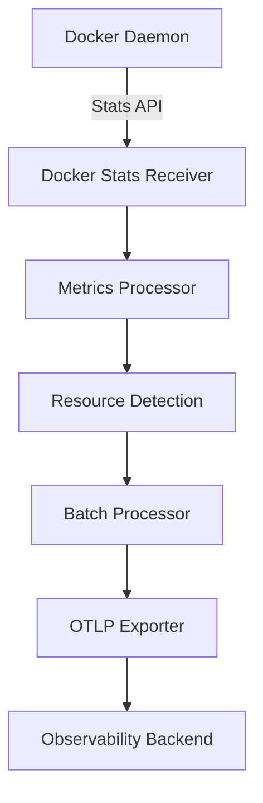

# How to Configure the Docker Stats Receiver in the OpenTelemetry Collector

Author: [nawazdhandala](https://www.github.com/nawazdhandala)

Tags: OpenTelemetry, Collector, Docker, Container Monitoring, Metrics, Observability

Description: Complete guide to configuring the Docker Stats receiver in OpenTelemetry Collector to monitor container metrics with practical YAML examples and best practices.

The Docker Stats receiver enables the OpenTelemetry Collector to collect resource usage metrics directly from the Docker daemon. This receiver provides container-level insights into CPU, memory, network, and disk I/O usage, making it essential for monitoring containerized applications and infrastructure.

## Why Monitor Docker Containers

Container metrics provide visibility into resource consumption patterns, performance bottlenecks, and capacity planning needs. Unlike application-level metrics, container metrics show you how your workloads interact with the underlying infrastructure, helping you optimize resource allocation and identify problematic containers before they impact your services.

The Docker Stats receiver collects metrics by communicating with the Docker Engine API, similar to how `docker stats` command works but with the advantage of continuous collection and integration with your observability pipeline.



## Basic Configuration

The simplest configuration requires just the receiver declaration. By default, it connects to the Docker daemon via the Unix socket:

```yaml
receivers:
  # Docker Stats receiver with default settings
  docker_stats:
    # Docker daemon endpoint (default: unix:///var/run/docker.sock)
    endpoint: unix:///var/run/docker.sock

    # Collection interval (default: 10s)
    collection_interval: 10s

    # Timeout for Docker API calls (default: 5s)
    timeout: 5s

processors:
  # Batch metrics for efficiency
  batch:
    timeout: 10s
    send_batch_size: 100

exporters:
  # Export to stdout for testing
  logging:
    loglevel: info

service:
  pipelines:
    metrics:
      receivers: [docker_stats]
      processors: [batch]
      exporters: [logging]
```

When you run this configuration, the collector will start gathering metrics from all running containers on the host. The metrics are collected at the specified interval and include CPU usage, memory consumption, network I/O, and block I/O statistics.

## Understanding Collected Metrics

The Docker Stats receiver collects a comprehensive set of metrics for each container. Here are the key metric categories:

### CPU Metrics

- `container.cpu.usage.total`: Total CPU time consumed
- `container.cpu.usage.system`: CPU time in system mode
- `container.cpu.usage.percpu`: Per-CPU core usage
- `container.cpu.throttling.periods`: Number of throttling periods
- `container.cpu.throttling.throttled_periods`: Number of throttled periods

### Memory Metrics

- `container.memory.usage.limit`: Memory limit set for the container
- `container.memory.usage.total`: Total memory used
- `container.memory.percent`: Percentage of memory limit used
- `container.memory.active_anon`: Active anonymous memory
- `container.memory.inactive_file`: Inactive file cache memory

### Network Metrics

- `container.network.io.usage.rx_bytes`: Bytes received
- `container.network.io.usage.tx_bytes`: Bytes transmitted
- `container.network.io.usage.rx_packets`: Packets received
- `container.network.io.usage.tx_packets`: Packets transmitted
- `container.network.io.usage.rx_dropped`: Received packets dropped
- `container.network.io.usage.tx_dropped`: Transmitted packets dropped

### Block I/O Metrics

- `container.blockio.io_service_bytes_recursive`: Total I/O service bytes
- `container.blockio.io_serviced_recursive`: Number of I/O operations

## Advanced Configuration

For production environments, you'll want more control over which containers to monitor and how to enrich the metrics with additional context.

### Container Filtering

You can filter which containers to monitor using include and exclude patterns:

```yaml
receivers:
  docker_stats:
    endpoint: unix:///var/run/docker.sock
    collection_interval: 10s

    # Include only specific containers
    container_labels_to_metric_labels:
      # Map container labels to metric attributes
      env: environment
      app: application
      version: app.version

    # Exclude containers by name pattern
    excluded_images:
      - ".*-sidecar:.*"
      - "pause:.*"

    # Only monitor containers with specific labels
    # This is done through the filter processor
```

### Resource Detection

Add resource detection to automatically enrich metrics with host and environment information:

```yaml
processors:
  # Detect and add resource attributes
  resourcedetection:
    detectors: [env, system, docker]
    timeout: 5s
    override: false
    system:
      hostname_sources: ["os", "dns"]
      resource_attributes:
        host.name:
          enabled: true
        host.id:
          enabled: true
        os.type:
          enabled: true

  # Add custom resource attributes
  resource:
    attributes:
      - key: deployment.environment
        value: production
        action: insert
      - key: service.namespace
        value: container-monitoring
        action: insert

  # Filter out unwanted metrics
  filter/docker:
    metrics:
      exclude:
        match_type: regexp
        metric_names:
          - "container.cpu.usage.percpu.*"
```

## Docker API Configuration

When running Docker with TLS or on a remote host, you'll need additional configuration:

```yaml
receivers:
  docker_stats:
    # TCP endpoint for remote Docker daemon
    endpoint: tcp://docker-host.example.com:2376

    # TLS configuration for secure connection
    tls:
      # Use system CA pool
      insecure_skip_verify: false

      # Custom CA certificate
      ca_file: /etc/otel/docker-ca.pem

      # Client certificate for mutual TLS
      cert_file: /etc/otel/docker-cert.pem
      key_file: /etc/otel/docker-key.pem

    # API version to use (optional, auto-detected by default)
    api_version: 1.41

    # Timeout for API calls
    timeout: 10s

    # Collection interval
    collection_interval: 15s
```

This configuration is useful when monitoring Docker hosts from a centralized collector instance or when Docker requires TLS authentication.

## Container Label Mapping

Container labels can provide valuable context for your metrics. Map Docker labels to metric attributes:

```yaml
receivers:
  docker_stats:
    endpoint: unix:///var/run/docker.sock
    collection_interval: 10s

    # Map container labels to metric labels
    container_labels_to_metric_labels:
      # Docker Compose labels
      com.docker.compose.service: compose.service
      com.docker.compose.project: compose.project

      # Custom application labels
      app.name: application
      app.version: version
      app.environment: environment
      app.team: team

      # Kubernetes labels (if using Docker with Kubernetes)
      io.kubernetes.pod.name: k8s.pod.name
      io.kubernetes.pod.namespace: k8s.namespace

    # Provide all environment variables as metric attributes
    # WARNING: Be careful with sensitive data
    env_vars_to_metric_labels:
      APP_ENV: app.environment
      SERVICE_NAME: service.name
```

## Running in Docker

When running the OpenTelemetry Collector itself as a container, you need to mount the Docker socket:

```yaml
# docker-compose.yml
version: '3.8'

services:
  otel-collector:
    image: otel/opentelemetry-collector-contrib:latest
    container_name: otel-collector
    command: ["--config=/etc/otel-collector-config.yaml"]

    # Mount the Docker socket
    volumes:
      - /var/run/docker.sock:/var/run/docker.sock:ro
      - ./otel-collector-config.yaml:/etc/otel-collector-config.yaml:ro

    # Network configuration
    ports:
      - "8888:8888"   # Prometheus metrics
      - "4317:4317"   # OTLP gRPC receiver
      - "4318:4318"   # OTLP HTTP receiver

    # Required for Docker socket access
    user: root

    # Resource limits
    deploy:
      resources:
        limits:
          memory: 512M
        reservations:
          memory: 256M
```

## Production Configuration

Here's a complete production-ready configuration with all best practices:

```yaml
receivers:
  docker_stats:
    endpoint: unix:///var/run/docker.sock
    collection_interval: 30s
    timeout: 10s

    # Map important labels
    container_labels_to_metric_labels:
      com.docker.compose.service: service.name
      env: deployment.environment
      version: service.version

processors:
  # Memory limiter to prevent OOM
  memory_limiter:
    check_interval: 1s
    limit_mib: 512
    spike_limit_mib: 128

  # Detect resource attributes
  resourcedetection:
    detectors: [env, system, docker]
    timeout: 5s

  # Add custom attributes
  resource:
    attributes:
      - key: collector.type
        value: docker-stats
        action: insert
      - key: host.role
        value: container-host
        action: insert

  # Filter out noisy metrics
  filter/exclude_percpu:
    metrics:
      exclude:
        match_type: regexp
        metric_names:
          - "container.cpu.usage.percpu.*"

  # Transform metric names if needed
  metricstransform:
    transforms:
      - include: container.memory.usage.total
        action: update
        new_name: container.memory.working_set_bytes

  # Aggregate metrics for dashboards
  groupbyattrs:
    keys:
      - service.name
      - deployment.environment

  # Batch for efficiency
  batch:
    timeout: 30s
    send_batch_size: 1000

exporters:
  # Export to observability backend
  otlp:
    endpoint: https://observability.example.com:4317
    headers:
      api-key: "${env:OBSERVABILITY_API_KEY}"
    compression: gzip
    sending_queue:
      enabled: true
      num_consumers: 10
      queue_size: 1000
    retry_on_failure:
      enabled: true
      initial_interval: 5s
      max_interval: 30s
      max_elapsed_time: 300s

  # Prometheus endpoint for local scraping
  prometheus:
    endpoint: "0.0.0.0:8889"
    namespace: docker
    const_labels:
      environment: production

service:
  pipelines:
    metrics:
      receivers: [docker_stats]
      processors:
        - memory_limiter
        - resourcedetection
        - resource
        - filter/exclude_percpu
        - metricstransform
        - groupbyattrs
        - batch
      exporters: [otlp, prometheus]

  # Enable collector telemetry
  telemetry:
    logs:
      level: info
    metrics:
      address: :8888
      level: detailed
```

## Monitoring Multiple Docker Hosts

To monitor containers across multiple Docker hosts, deploy a collector instance on each host and configure them to send metrics to a central collector:

```yaml
# Configuration for collector on each Docker host
receivers:
  docker_stats:
    endpoint: unix:///var/run/docker.sock
    collection_interval: 30s

processors:
  resource:
    attributes:
      # Add host identifier
      - key: host.name
        value: "${env:HOSTNAME}"
        action: insert
      - key: datacenter
        value: "${env:DATACENTER}"
        action: insert

  batch:
    timeout: 30s

exporters:
  # Send to central collector
  otlp:
    endpoint: central-collector.example.com:4317
    headers:
      authorization: "Bearer ${env:COLLECTOR_TOKEN}"

service:
  pipelines:
    metrics:
      receivers: [docker_stats]
      processors: [resource, batch]
      exporters: [otlp]
```

## Alerting on Container Metrics

Use the collected metrics to set up alerts for container health issues. Here are some common alerting scenarios:

### High Memory Usage

Alert when a container uses more than 90% of its memory limit:

```yaml
# Example Prometheus alert rule
- alert: ContainerHighMemoryUsage
  expr: container.memory.percent > 90
  for: 5m
  labels:
    severity: warning
  annotations:
    summary: "Container {{ $labels.container_name }} high memory usage"
    description: "Memory usage is {{ $value }}%"
```

### CPU Throttling

Alert when containers are frequently throttled:

```yaml
- alert: ContainerCPUThrottling
  expr: |
    rate(container.cpu.throttling.throttled_periods[5m]) /
    rate(container.cpu.throttling.periods[5m]) > 0.3
  for: 10m
  labels:
    severity: warning
  annotations:
    summary: "Container {{ $labels.container_name }} experiencing CPU throttling"
```

### Network Errors

Alert on high network error rates:

```yaml
- alert: ContainerHighNetworkErrors
  expr: |
    rate(container.network.io.usage.rx_dropped[5m]) +
    rate(container.network.io.usage.tx_dropped[5m]) > 100
  for: 5m
  labels:
    severity: warning
```

## Troubleshooting

### Permission Denied

If the collector cannot access the Docker socket:

```bash
# Add the collector user to the docker group
sudo usermod -aG docker otel-collector

# Or run collector as root (not recommended)
# Better: adjust socket permissions in daemon.json
```

### Missing Metrics

If some metrics are missing:

1. Verify the Docker API version supports the metrics
2. Check if cgroup v2 is in use (some metrics differ)
3. Ensure containers are running when collection occurs
4. Review filter processor configuration

### High CPU Usage

If the collector consumes too much CPU:

1. Increase `collection_interval` to reduce frequency
2. Filter out unnecessary metrics
3. Use `excluded_images` to skip monitoring test containers
4. Reduce the number of containers on the host

## Integration with OneUptime

Configure the collector to send Docker metrics to OneUptime:

```yaml
exporters:
  otlp:
    endpoint: https://opentelemetry-collector.oneuptime.com:4317
    headers:
      x-oneuptime-token: "${env:ONEUPTIME_API_KEY}"
    compression: gzip

service:
  pipelines:
    metrics:
      receivers: [docker_stats]
      processors: [batch]
      exporters: [otlp]
```

OneUptime will automatically create dashboards and alerts for your Docker container metrics. For more information on monitoring databases alongside containers, see our guides on [PostgreSQL receiver](https://oneuptime.com/blog/post/2026-02-06-postgresql-receiver-opentelemetry-collector/view) and [Redis receiver](https://oneuptime.com/blog/post/2026-02-06-redis-receiver-opentelemetry-collector/view).

## Conclusion

The Docker Stats receiver provides comprehensive container monitoring capabilities through the OpenTelemetry Collector. By collecting CPU, memory, network, and I/O metrics, you gain deep visibility into container resource usage and performance characteristics.

Start with basic configuration to understand your container workloads, then add filtering, resource detection, and custom attributes as your monitoring needs evolve. Use the collected metrics to optimize resource allocation, detect anomalies, and ensure efficient container operations.

For monitoring containerized databases, explore our guides on the [MySQL receiver](https://oneuptime.com/blog/post/2026-02-06-mysql-receiver-opentelemetry-collector/view) and [MongoDB receiver](https://oneuptime.com/blog/post/2026-02-06-mongodb-receiver-opentelemetry-collector/view).
