# How to Set Up DocumentLoadInstrumentation for React Page Load Performance

Author: [nawazdhandala](https://www.github.com/nawazdhandala)

Tags: OpenTelemetry, React, DocumentLoad, Page Load, Performance, RUM

Description: Master DocumentLoadInstrumentation in React to track page load metrics, measure real user performance, and optimize initial render times.

Page load performance directly impacts user experience and business metrics. Studies show that even a 100ms delay in page load can significantly reduce conversion rates. OpenTelemetry's DocumentLoadInstrumentation captures detailed timing data about how quickly your React application loads and becomes interactive, giving you the insights needed to optimize performance.

## Understanding Document Load Timing

Document load timing measures the complete lifecycle from initial navigation to full page load. The browser provides detailed timing information through the Navigation Timing API, which DocumentLoadInstrumentation automatically captures and exports as OpenTelemetry spans.

```mermaid
graph LR
    A[Navigation Start] --> B[DNS Lookup]
    B --> C[TCP Connection]
    C --> D[Request Sent]
    D --> E[Response Start]
    E --> F[Response End]
    F --> G[DOM Loading]
    G --> H[DOM Interactive]
    H --> I[DOM Complete]
    I --> J[Load Event]

    style A fill:#e1f5ff
    style J fill:#e1f5ff
    style H fill:#fff4e1
```



Each phase provides critical information about where time is spent during page load, from network latency to parsing and script execution.

## Installing Required Packages

Start by installing the OpenTelemetry packages needed for document load instrumentation.

```bash
npm install @opentelemetry/api \
  @opentelemetry/sdk-trace-web \
  @opentelemetry/instrumentation-document-load \
  @opentelemetry/exporter-trace-otlp-http \
  @opentelemetry/resources \
  @opentelemetry/semantic-conventions
```

These packages provide the core tracing functionality and the specialized instrumentation for document load events.

## Basic Configuration

Set up DocumentLoadInstrumentation with a basic configuration that captures all standard timing metrics.

```javascript
// src/instrumentation/documentLoad.js

import { WebTracerProvider } from '@opentelemetry/sdk-trace-web';
import { Resource } from '@opentelemetry/resources';
import { SemanticResourceAttributes } from '@opentelemetry/semantic-conventions';
import { registerInstrumentations } from '@opentelemetry/instrumentation';
import { DocumentLoadInstrumentation } from '@opentelemetry/instrumentation-document-load';
import { OTLPTraceExporter } from '@opentelemetry/exporter-trace-otlp-http';
import { BatchSpanProcessor } from '@opentelemetry/sdk-trace-web';

// Define resource attributes to identify your application
const resource = new Resource({
  [SemanticResourceAttributes.SERVICE_NAME]: 'react-app-frontend',
  [SemanticResourceAttributes.SERVICE_VERSION]: '1.0.0',
  [SemanticResourceAttributes.DEPLOYMENT_ENVIRONMENT]: process.env.NODE_ENV,
});

// Initialize the tracer provider
const provider = new WebTracerProvider({
  resource: resource,
});

// Configure exporter to send traces to your observability backend
const exporter = new OTLPTraceExporter({
  url: 'https://your-collector.com/v1/traces',
  headers: {
    'Authorization': `Bearer ${process.env.REACT_APP_OTEL_TOKEN}`,
  },
});

// Add span processor to batch and send traces
provider.addSpanProcessor(new BatchSpanProcessor(exporter));
provider.register();

// Register document load instrumentation
// This captures timing data from the Navigation Timing API
registerInstrumentations({
  instrumentations: [
    new DocumentLoadInstrumentation(),
  ],
});

export default provider;
```

## Enhanced Configuration with Custom Attributes

Extend the basic configuration to capture additional context about page loads, helping you segment performance data by page type, user segment, or other dimensions.

```javascript
// src/instrumentation/enhancedDocumentLoad.js

import { DocumentLoadInstrumentation } from '@opentelemetry/instrumentation-document-load';
import { registerInstrumentations } from '@opentelemetry/instrumentation';

registerInstrumentations({
  instrumentations: [
    new DocumentLoadInstrumentation({
      // Add custom attributes to every document load span
      applyCustomAttributesOnSpan: (span) => {
        // Capture page-specific information
        span.setAttribute('page.url', window.location.href);
        span.setAttribute('page.pathname', window.location.pathname);
        span.setAttribute('page.title', document.title);

        // Capture browser information
        span.setAttribute('browser.userAgent', navigator.userAgent);
        span.setAttribute('browser.language', navigator.language);

        // Capture viewport information
        span.setAttribute('viewport.width', window.innerWidth);
        span.setAttribute('viewport.height', window.innerHeight);

        // Capture connection information if available
        if (navigator.connection) {
          span.setAttribute('connection.effectiveType',
            navigator.connection.effectiveType);
          span.setAttribute('connection.downlink',
            navigator.connection.downlink);
          span.setAttribute('connection.rtt',
            navigator.connection.rtt);
        }

        // Capture performance memory if available (Chrome only)
        if (performance.memory) {
          span.setAttribute('memory.usedJSHeapSize',
            performance.memory.usedJSHeapSize);
          span.setAttribute('memory.jsHeapSizeLimit',
            performance.memory.jsHeapSizeLimit);
        }

        // Add custom application attributes
        const userId = localStorage.getItem('userId');
        if (userId) {
          span.setAttribute('user.id', userId);
        }

        // Determine if this is the first visit
        const isFirstVisit = !sessionStorage.getItem('visited');
        span.setAttribute('session.isFirstVisit', isFirstVisit);
        if (isFirstVisit) {
          sessionStorage.setItem('visited', 'true');
        }
      },
    }),
  ],
});
```

## Integrating with React Application

Import and initialize the instrumentation before React renders to ensure timing starts correctly.

```javascript
// src/index.js

import React from 'react';
import ReactDOM from 'react-dom/client';
import './instrumentation/documentLoad';
import App from './App';
import './index.css';

// The instrumentation must be imported before React renders
// This ensures the timing starts from the actual page load
const root = ReactDOM.createRoot(document.getElementById('root'));

root.render(
  <React.StrictMode>
    <App />
  </React.StrictMode>
);
```

## Understanding Captured Metrics

DocumentLoadInstrumentation captures numerous timing metrics from the Navigation Timing API. Understanding these metrics helps you identify performance bottlenecks.

```javascript
// Key metrics captured by DocumentLoadInstrumentation:

// DNS Lookup Time: How long DNS resolution took
// domainLookupEnd - domainLookupStart

// TCP Connection Time: Time to establish TCP connection
// connectEnd - connectStart

// TLS Negotiation Time: Time for SSL/TLS handshake
// connectEnd - secureConnectionStart

// Request Time: Time to send request
// responseStart - requestStart

// Response Time: Time to receive response
// responseEnd - responseStart

// DOM Processing Time: Time to parse and build DOM
// domContentLoadedEventStart - domLoading

// Resource Loading Time: Time to load all resources
// loadEventEnd - domContentLoadedEventEnd

// Total Page Load Time: Complete page load time
// loadEventEnd - fetchStart
```

## Creating a Performance Monitoring Component

Build a React component that displays real-time performance metrics during development.

```javascript
// src/components/PerformanceMonitor.jsx

import { useEffect, useState } from 'react';

function PerformanceMonitor() {
  const [metrics, setMetrics] = useState(null);

  useEffect(() => {
    // Wait for page load to complete
    window.addEventListener('load', () => {
      // Give the browser time to finalize all timing entries
      setTimeout(() => {
        const navigation = performance.getEntriesByType('navigation')[0];

        if (navigation) {
          setMetrics({
            // DNS and Connection
            dnsTime: navigation.domainLookupEnd - navigation.domainLookupStart,
            tcpTime: navigation.connectEnd - navigation.connectStart,

            // Request and Response
            requestTime: navigation.responseStart - navigation.requestStart,
            responseTime: navigation.responseEnd - navigation.responseStart,

            // DOM Processing
            domInteractive: navigation.domInteractive - navigation.fetchStart,
            domComplete: navigation.domComplete - navigation.fetchStart,

            // Load Events
            domContentLoaded: navigation.domContentLoadedEventEnd - navigation.fetchStart,
            totalLoadTime: navigation.loadEventEnd - navigation.fetchStart,
          });
        }
      }, 0);
    });
  }, []);

  // Only show in development
  if (process.env.NODE_ENV !== 'development' || !metrics) {
    return null;
  }

  return (
    <div style={{
      position: 'fixed',
      bottom: 0,
      right: 0,
      background: 'rgba(0,0,0,0.8)',
      color: 'white',
      padding: '10px',
      fontSize: '12px',
      fontFamily: 'monospace',
      zIndex: 9999,
      maxWidth: '300px',
    }}>
      <div><strong>Performance Metrics</strong></div>
      <div>DNS: {metrics.dnsTime.toFixed(2)}ms</div>
      <div>TCP: {metrics.tcpTime.toFixed(2)}ms</div>
      <div>Request: {metrics.requestTime.toFixed(2)}ms</div>
      <div>Response: {metrics.responseTime.toFixed(2)}ms</div>
      <div>DOM Interactive: {metrics.domInteractive.toFixed(2)}ms</div>
      <div>DOM Complete: {metrics.domComplete.toFixed(2)}ms</div>
      <div>DOMContentLoaded: {metrics.domContentLoaded.toFixed(2)}ms</div>
      <div><strong>Total: {metrics.totalLoadTime.toFixed(2)}ms</strong></div>
    </div>
  );
}

export default PerformanceMonitor;
```

## Tracking Resource Loading Performance

Document load timing includes initial HTML load, but you often want to track individual resource loading as well.

```javascript
// src/instrumentation/resourceTiming.js

import { trace } from '@opentelemetry/api';

const tracer = trace.getTracer('react-app');

export function captureResourceMetrics() {
  // Wait for page load to complete
  window.addEventListener('load', () => {
    setTimeout(() => {
      const resources = performance.getEntriesByType('resource');

      // Create a span for resource loading summary
      const span = tracer.startSpan('page.resources.summary');

      // Categorize resources
      const categories = {
        script: [],
        stylesheet: [],
        image: [],
        fetch: [],
        other: [],
      };

      resources.forEach(resource => {
        if (resource.name.includes('.js')) {
          categories.script.push(resource);
        } else if (resource.name.includes('.css')) {
          categories.stylesheet.push(resource);
        } else if (resource.name.match(/\.(png|jpg|jpeg|gif|svg|webp)/)) {
          categories.image.push(resource);
        } else if (resource.initiatorType === 'fetch' || resource.initiatorType === 'xmlhttprequest') {
          categories.fetch.push(resource);
        } else {
          categories.other.push(resource);
        }
      });

      // Add aggregate metrics for each category
      Object.entries(categories).forEach(([category, items]) => {
        const totalDuration = items.reduce((sum, item) => sum + item.duration, 0);
        const totalSize = items.reduce((sum, item) => sum + (item.transferSize || 0), 0);

        span.setAttribute(`resources.${category}.count`, items.length);
        span.setAttribute(`resources.${category}.duration`, totalDuration);
        span.setAttribute(`resources.${category}.size`, totalSize);
      });

      // Add overall statistics
      span.setAttribute('resources.total.count', resources.length);
      span.setAttribute('resources.total.duration',
        resources.reduce((sum, r) => sum + r.duration, 0));
      span.setAttribute('resources.total.size',
        resources.reduce((sum, r) => sum + (r.transferSize || 0), 0));

      span.end();
    }, 0);
  });
}
```

Initialize resource timing capture:

```javascript
// src/index.js

import './instrumentation/documentLoad';
import { captureResourceMetrics } from './instrumentation/resourceTiming';

// Capture resource metrics after document load instrumentation
captureResourceMetrics();
```

## Measuring React-Specific Metrics

Beyond standard document load timing, track React-specific metrics like time to interactive and first meaningful paint.

```javascript
// src/instrumentation/reactMetrics.js

import { trace } from '@opentelemetry/api';

const tracer = trace.getTracer('react-app');

export function trackReactMetrics() {
  // Track when React hydration completes
  const hydrationSpan = tracer.startSpan('react.hydration');

  // Use React's profiler or a simple timer
  requestIdleCallback(() => {
    hydrationSpan.end();
  });

  // Track First Contentful Paint
  const paintEntries = performance.getEntriesByType('paint');
  paintEntries.forEach(entry => {
    const paintSpan = tracer.startSpan(`paint.${entry.name}`, {
      startTime: entry.startTime,
    });
    paintSpan.setAttribute('paint.type', entry.name);
    paintSpan.end(entry.startTime);
  });

  // Track Largest Contentful Paint
  if ('PerformanceObserver' in window) {
    const observer = new PerformanceObserver((list) => {
      const entries = list.getEntries();
      const lastEntry = entries[entries.length - 1];

      const lcpSpan = tracer.startSpan('paint.largest-contentful-paint', {
        startTime: lastEntry.startTime,
      });
      lcpSpan.setAttribute('lcp.size', lastEntry.size);
      lcpSpan.setAttribute('lcp.element', lastEntry.element?.tagName || 'unknown');
      lcpSpan.end(lastEntry.startTime + lastEntry.renderTime);
    });

    observer.observe({ entryTypes: ['largest-contentful-paint'] });
  }

  // Track First Input Delay
  if ('PerformanceObserver' in window) {
    const observer = new PerformanceObserver((list) => {
      const entries = list.getEntries();
      entries.forEach(entry => {
        const fidSpan = tracer.startSpan('interaction.first-input-delay', {
          startTime: entry.startTime,
        });
        fidSpan.setAttribute('fid.delay', entry.processingStart - entry.startTime);
        fidSpan.setAttribute('fid.eventType', entry.name);
        fidSpan.end(entry.startTime + entry.duration);
      });
    });

    observer.observe({ entryTypes: ['first-input'] });
  }
}
```

## Creating a Custom Hook for Performance Tracking

Encapsulate performance tracking in a reusable React hook.

```javascript
// src/hooks/usePageLoadPerformance.js

import { useEffect, useState } from 'react';
import { trace } from '@opentelemetry/api';

const tracer = trace.getTracer('react-app');

export function usePageLoadPerformance(pageName) {
  const [performanceData, setPerformanceData] = useState(null);

  useEffect(() => {
    // Create a span for this specific page load
    const span = tracer.startSpan(`page.load.${pageName}`);

    const captureMetrics = () => {
      const navigation = performance.getEntriesByType('navigation')[0];

      if (navigation) {
        const data = {
          pageName,
          dnsTime: navigation.domainLookupEnd - navigation.domainLookupStart,
          connectionTime: navigation.connectEnd - navigation.connectStart,
          requestTime: navigation.responseStart - navigation.requestStart,
          responseTime: navigation.responseEnd - navigation.responseStart,
          domProcessingTime: navigation.domComplete - navigation.domLoading,
          totalTime: navigation.loadEventEnd - navigation.fetchStart,
        };

        // Add metrics to span
        Object.entries(data).forEach(([key, value]) => {
          if (typeof value === 'number') {
            span.setAttribute(`performance.${key}`, value);
          }
        });

        span.end();
        setPerformanceData(data);
      }
    };

    // Wait for load event
    if (document.readyState === 'complete') {
      setTimeout(captureMetrics, 0);
    } else {
      window.addEventListener('load', () => {
        setTimeout(captureMetrics, 0);
      });
    }

    return () => {
      span.end();
    };
  }, [pageName]);

  return performanceData;
}
```

Use the hook in your pages:

```javascript
// src/pages/HomePage.jsx

import { usePageLoadPerformance } from '../hooks/usePageLoadPerformance';

function HomePage() {
  const performance = usePageLoadPerformance('home');

  return (
    <div>
      <h1>Home Page</h1>
      {performance && process.env.NODE_ENV === 'development' && (
        <div>Total load time: {performance.totalTime.toFixed(2)}ms</div>
      )}
    </div>
  );
}

export default HomePage;
```

## Comparing Performance Across Routes

In single-page applications, track performance for route transitions separately from initial page load.

```javascript
// src/instrumentation/routePerformance.js

import { trace } from '@opentelemetry/api';
import { useEffect } from 'react';
import { useLocation } from 'react-router-dom';

const tracer = trace.getTracer('react-app');

export function useRoutePerformance() {
  const location = useLocation();

  useEffect(() => {
    const span = tracer.startSpan('route.transition', {
      attributes: {
        'route.path': location.pathname,
        'route.timestamp': Date.now(),
      },
    });

    const startTime = performance.now();

    // End span after component tree stabilizes
    requestIdleCallback(() => {
      const duration = performance.now() - startTime;
      span.setAttribute('route.renderTime', duration);
      span.end();
    });

    return () => span.end();
  }, [location.pathname]);
}
```

## Alerting on Performance Degradation

Set up monitoring to alert when page load performance degrades beyond acceptable thresholds.

```javascript
// src/instrumentation/performanceAlerts.js

import { trace } from '@opentelemetry/api';

const tracer = trace.getTracer('react-app');

const THRESHOLDS = {
  totalLoadTime: 3000, // 3 seconds
  domInteractive: 1500, // 1.5 seconds
  firstContentfulPaint: 1000, // 1 second
};

export function checkPerformanceThresholds() {
  window.addEventListener('load', () => {
    setTimeout(() => {
      const navigation = performance.getEntriesByType('navigation')[0];
      const span = tracer.startSpan('performance.threshold-check');

      const violations = [];

      const totalTime = navigation.loadEventEnd - navigation.fetchStart;
      if (totalTime > THRESHOLDS.totalLoadTime) {
        violations.push(`Total load time ${totalTime.toFixed(0)}ms exceeds ${THRESHOLDS.totalLoadTime}ms`);
      }

      const domInteractive = navigation.domInteractive - navigation.fetchStart;
      if (domInteractive > THRESHOLDS.domInteractive) {
        violations.push(`DOM interactive ${domInteractive.toFixed(0)}ms exceeds ${THRESHOLDS.domInteractive}ms`);
      }

      if (violations.length > 0) {
        span.setAttribute('performance.violations', violations.join('; '));
        span.setAttribute('performance.violated', true);

        // Send to monitoring service
        console.warn('Performance thresholds violated:', violations);
      }

      span.end();
    }, 0);
  });
}
```

DocumentLoadInstrumentation provides comprehensive insights into page load performance, enabling you to identify bottlenecks and optimize the user experience. By combining automatic instrumentation with custom tracking for React-specific metrics, you build a complete picture of how quickly your application loads and becomes interactive for real users.

